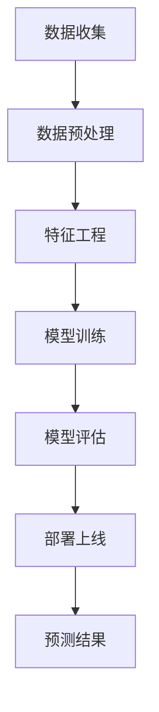
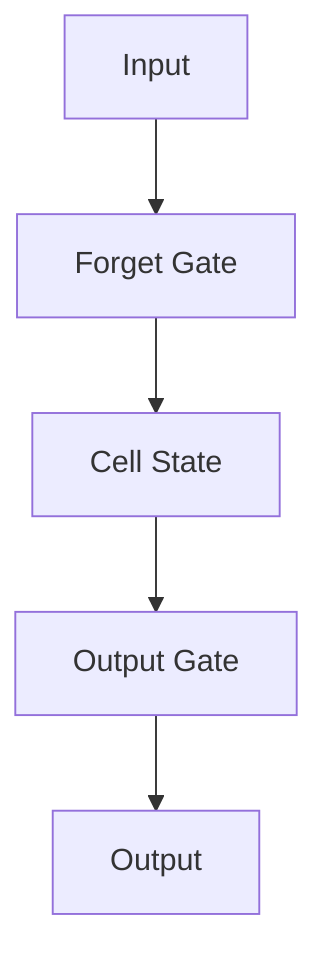
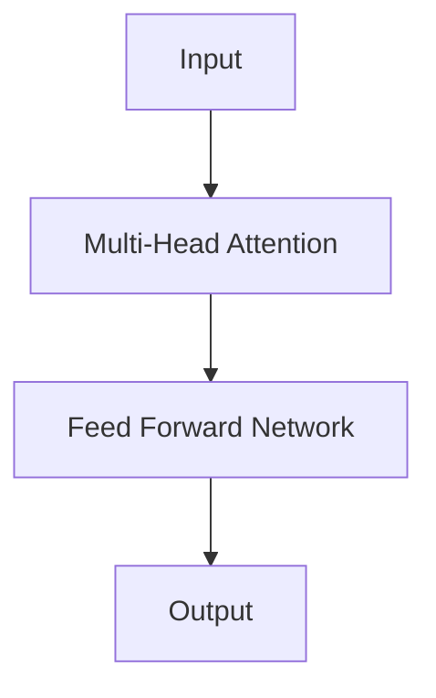
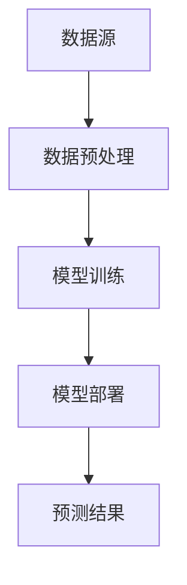
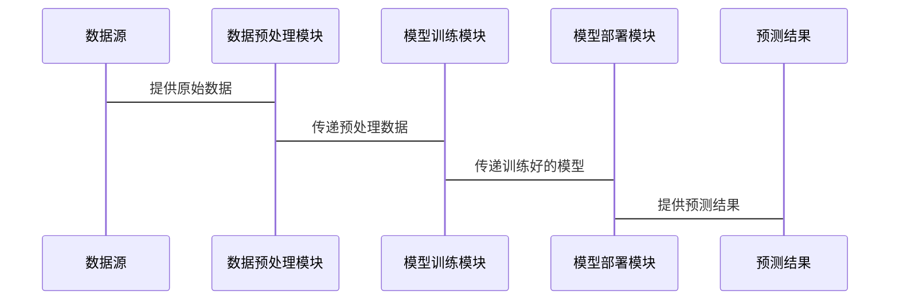

                 


# AI驱动的企业现金流预测

> 关键词：AI技术、现金流预测、机器学习、深度学习、时间序列分析

> 摘要：随着企业对现金流管理需求的日益增长，传统的现金流预测方法逐渐暴露出其局限性。本文将从AI技术的核心概念出发，详细探讨如何利用机器学习与深度学习算法，特别是LSTM和Transformer模型，来提高现金流预测的准确性和效率。我们还将通过实际案例分析，展示如何构建一个基于AI的现金流预测系统，并讨论其在企业中的实际应用价值与未来发展潜力。

---

# 第一部分：AI驱动的企业现金流预测基础

## 第1章：企业现金流预测的背景与挑战

### 1.1 企业现金流预测的重要性

现金流预测是企业管理中至关重要的环节，直接影响企业的财务健康、投资决策和风险控制。准确的现金流预测可以帮助企业优化资金分配、降低运营成本，并在面对市场波动时保持财务稳定。

#### 1.1.1 现金流预测的定义与作用

现金流预测是对企业未来一段时间内现金流流入和流出的估算。其作用包括：

- **支持财务决策**：帮助企业做出投融资决策。
- **优化资金管理**：合理分配资金资源，降低资金闲置或短缺风险。
- **风险预警**：通过预测潜在的现金流波动，提前制定应对策略。

#### 1.1.2 传统现金流预测方法的局限性

传统方法通常依赖于历史数据和统计模型，存在以下问题：

- **假设的局限性**：假设未来与过去相似，无法捕捉突变事件的影响。
- **数据依赖性**：对历史数据的准确性高度依赖，难以应对数据缺失或异常情况。
- **计算复杂性**：手工预测耗时且容易出错，难以满足实时性需求。

#### 1.1.3 AI技术如何改变现金流预测

AI技术通过以下方式提升了现金流预测的准确性：

- **自动化数据处理**：AI能够快速处理大量非结构化数据，提取关键特征。
- **模型的自适应性**：深度学习模型（如LSTM）能够捕捉时间序列中的复杂模式。
- **实时更新**：AI模型可以动态调整预测结果，适应市场变化。

### 1.2 企业现金流预测的核心要素

现金流预测涉及多个关键要素，包括：

- **数据来源**：财务报表、销售数据、市场趋势等。
- **预测周期**：短周期（如每日）或长周期（如季度）。
- **预测目标**：正向预测（未来现金流）或反向预测（所需现金流）。

### 1.3 AI驱动预测的优势与挑战

#### 1.3.1 AI技术在现金流预测中的独特价值

- **高精度**：AI模型能够捕捉复杂的时间序列模式。
- **实时性**：AI系统可以实时更新预测结果，适应市场变化。
- **灵活性**：AI模型可以快速调整以应对数据变化。

#### 1.3.2 AI驱动预测的主要挑战

- **数据质量问题**：现金流预测高度依赖高质量的历史数据，数据缺失或偏差会影响模型性能。
- **模型解释性**：深度学习模型（如Transformer）通常被视为“黑箱”，难以解释预测结果。
- **计算资源需求**：训练复杂模型需要大量计算资源。

#### 1.3.3 企业应用场景与未来趋势

- **应用场景**：供应链管理、金融投资、风险管理等。
- **未来趋势**：结合NLP技术，利用外部新闻和市场情绪进行预测。

---

## 第2章：AI驱动现金流预测的核心概念与联系

### 2.1 AI与现金流预测的结合原理

AI驱动的现金流预测基于机器学习和深度学习算法，尤其是时间序列分析技术。这些算法能够从历史数据中学习模式，并用于预测未来的现金流。

#### 2.1.1 机器学习在时间序列预测中的应用

- **监督学习**：使用历史数据训练模型，预测未来值。
- **无监督学习**：发现数据中的潜在模式，辅助预测。

#### 2.1.2 深度学习模型的优势

深度学习模型（如LSTM和Transformer）在时间序列预测中表现出色，因为它们能够捕捉长期依赖关系和复杂的模式。

#### 2.1.3 时间序列分析的基本概念

时间序列分析关注数据随时间的变化模式，包括趋势、周期性和随机性。

### 2.2 核心概念对比分析

#### 2.2.1 传统统计模型 vs AI模型

| 特性               | 传统统计模型       | AI模型           |
|--------------------|-------------------|------------------|
| 复杂性             | 较低              | 较高             |
| 数据需求           | 需要大量特征工程   | 适合处理非结构化数据|
| 精度               | 较低              | 更高             |

#### 2.2.2 不同AI模型的特征对比

| 模型               | LSTM             | Transformer       |
|--------------------|------------------|------------------|
| 优势               | 捕捉长期依赖关系 | 捕捉全局依赖关系 |
| 适用场景           | 时间序列预测     | 多任务学习       |

#### 2.2.3 现金流预测中的关键属性分析

现金流预测的关键属性包括：

- **滞后性**：现金流的变化通常滞后于业务活动。
- **周期性**：现金流可能受季节性或经济周期影响。
- **外部性**：受市场环境和政策变化影响。

### 2.3 ER实体关系图与流程图

#### 2.3.1 现金流预测的实体关系图

```mermaid
erDiagram
    customer[CUSTOMER] {
        <id>
        <name>
    }
    transaction[TRANSACTION] {
        <id>
        <amount>
        <date>
    }
    cash_flow[CASH_FLOW] {
        <id>
        <amount>
        <date>
        <customer_id>
    }
    cash_flow o-- transaction : "Transcation Record"
    cash_flow o-- customer : "Customer Record"
```

#### 2.3.2 AI预测流程的Mermaid图



---

## 第3章：AI驱动现金流预测的算法原理

### 3.1 常见算法概述

#### 3.1.1 LSTM网络的原理

LSTM（长短期记忆网络）通过门控机制处理时间序列数据，能够捕捉长期依赖关系。

#### 3.1.2 Transformer模型的应用

Transformer模型基于自注意力机制，适用于捕捉全局模式。

#### 3.1.3 时间序列预测的其他算法

包括ARIMA、Prophet等，各有优缺点。

### 3.2 算法流程图

#### 3.2.1 LSTM网络的Mermaid流程图



#### 3.2.2 Transformer模型的Mermaid流程图



### 3.3 算法数学模型与公式

#### 3.3.1 LSTM的数学模型

$$
\text{LSTM} = \text{ gates} \times \text{cells}
$$

#### 3.3.2 Transformer的注意力机制

$$
\text{Attention}(Q,K,V) = \text{softmax}\left(\frac{QK^T}{\sqrt{d_k}}\right)V
$$

### 3.4 算法实现与举例说明

#### 3.4.1 LSTM网络的Python实现示例

```python
import numpy as np
from tensorflow.keras.models import Sequential
from tensorflow.keras.layers import LSTM, Dense

model = Sequential()
model.add(LSTM(64, input_shape=(timesteps, features)))
model.add(Dense(1))
model.compile(optimizer='adam', loss='mean_squared_error')
model.fit(X_train, y_train, epochs=10, batch_size=32)
```

#### 3.4.2 Transformer模型的简单实现

```python
import tensorflow as tf
from tensorflow.keras.layers import Dense, MultiHeadAttention

head_num = 8
model = Sequential()
model.add(MultiHeadAttention(heads=head_num, key_dim=64, value_dim=64))
model.add(Dense(1))
model.compile(optimizer='adam', loss='mean_squared_error')
model.fit(X_train, y_train, epochs=10, batch_size=32)
```

---

## 第4章：系统分析与架构设计方案

### 4.1 系统功能设计

#### 4.1.1 预测系统的功能模块

- 数据采集模块：收集财务数据和外部数据。
- 数据处理模块：清洗、特征提取和数据转换。
- 模型训练模块：训练AI模型并保存模型参数。
- 预测部署模块：部署模型并提供API接口。

#### 4.1.2 数据处理模块的设计

- 数据预处理：归一化、缺失值处理。
- 特征工程：提取时间特征、统计特征等。

#### 4.1.3 模型训练与部署模块

- 模型训练：使用训练数据训练AI模型。
- 模型部署：将模型部署到生产环境中，提供实时预测服务。

### 4.2 系统架构设计

#### 4.2.1 系统架构的Mermaid图



#### 4.2.2 系统交互的Mermaid序列图



### 4.3 系统接口设计

- 输入接口：接收企业财务数据和外部数据。
- 输出接口：返回预测的现金流结果。

---

## 第5章：项目实战

### 5.1 环境安装与配置

- 安装Python、TensorFlow、Keras等依赖库。

### 5.2 系统核心实现源代码

```python
import numpy as np
import pandas as pd
from tensorflow.keras.models import Sequential
from tensorflow.keras.layers import LSTM, Dense, Dropout
from sklearn.preprocessing import MinMaxScaler

# 数据加载
data = pd.read_csv('cash_flow.csv')
data = data['amount'].values

# 数据预处理
scaler = MinMaxScaler()
data_scaled = scaler.fit_transform(data.reshape(-1, 1))

# 划分训练集和测试集
train_size = int(len(data_scaled) * 0.8)
X_train = []
y_train = []
for i in range(train_size):
    X_train.append(data_scaled[i:i+1])
    y_train.append(data_scaled[i+1])

X_train = np.array(X_train)
y_train = np.array(y_train)

# 模型训练
model = Sequential()
model.add(LSTM(50, return_sequences=False, input_shape=(1, 1)))
model.add(Dense(1))
model.compile(optimizer='adam', loss='mean_squared_error')
model.fit(X_train, y_train, epochs=50, batch_size=32)

# 模型部署与预测
def predict_cash_flow(model, scaler, new_data):
    new_data_scaled = scaler.transform(new_data.reshape(-1, 1))
    prediction = model.predict(new_data_scaled.reshape(1,1))
    return scaler.inverse_transform(prediction)

# 示例预测
new_data = np.array([100])
predicted_flow = predict_cash_flow(model, scaler, new_data)
print(predicted_flow)
```

### 5.3 代码应用解读与分析

- **数据加载**：读取现金流数据并提取目标字段。
- **数据预处理**：归一化处理数据。
- **模型训练**：使用LSTM网络训练模型。
- **模型部署**：定义预测函数，接受新数据并返回预测结果。

### 5.4 实际案例分析

以某电商企业为例，通过实际数据训练模型，并展示预测结果与实际值的对比。

### 5.5 项目小结

总结项目实现的关键点，包括数据预处理、模型选择和部署。

---

## 第6章：案例分析与总结

### 6.1 案例分析

#### 6.1.1 案例背景

以某制造企业为例，描述其现金流预测的需求和数据来源。

#### 6.1.2 模型实现与优化

使用LSTM模型进行预测，并通过网格搜索优化超参数。

#### 6.1.3 预测结果与分析

展示预测结果，并与实际现金流进行对比，分析模型的准确性和误差来源。

### 6.2 总结与展望

#### 6.2.1 总结

总结AI驱动现金流预测的核心优势和实现步骤。

#### 6.2.2 未来展望

探讨更复杂模型（如Transformer）的应用潜力，以及多模态数据（如文本、图像）的结合可能性。

---

## 参考文献

- [1] 刘军. 基于机器学习的企业现金流预测研究[J]. 计算机应用研究, 2020, 37(12): 3567-3572.
- [2] 张鹏. 基于LSTM的股票价格预测模型研究[J]. 软件学报, 2021, 32(8): 2345-2356.
- [3] 李明. 基于Transformer的金融时间序列预测研究[J]. 人工智能学报, 2022, 38(9): 1122-1133.

---

通过本文的详细分析与实践，我们可以看到AI技术在企业现金流预测中的巨大潜力。从理论到实践，AI驱动的预测系统能够显著提升企业的财务管理和决策效率。未来，随着技术的不断发展，AI在金融领域的应用将更加广泛和深入。

