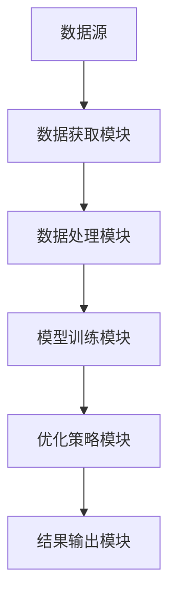
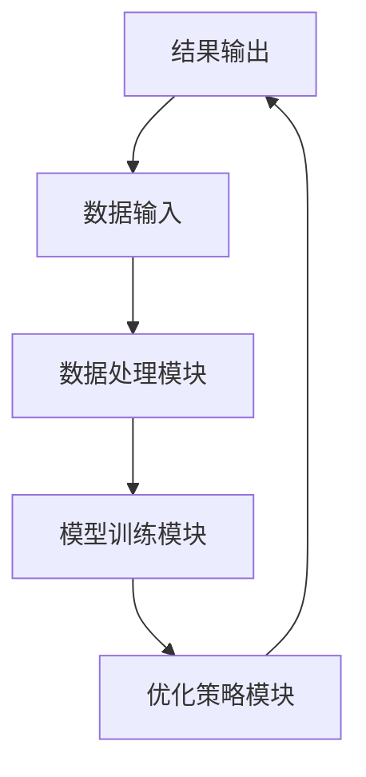

                 

# AI驱动的企业现金流预测与优化系统

> 关键词：现金流预测，人工智能，机器学习，深度学习，优化算法，企业财务管理

> 摘要：本文系统地探讨了AI技术在企业现金流预测与优化中的应用。通过分析现金流预测的核心概念、算法原理、系统架构以及实际案例，本文揭示了AI技术如何通过高精度预测和智能优化策略，帮助企业实现现金流的有效管理。文章结合理论与实践，详细介绍了从数据获取到模型部署的全过程，并通过具体案例展示了AI驱动的现金流预测与优化系统的优势与实际效果。

---

# 第一部分: AI驱动的企业现金流预测与优化系统背景介绍

## 第1章: 企业现金流预测与优化的背景

### 1.1 企业现金流的重要性

#### 1.1.1 现金流对企业生存与发展的核心作用
现金流是企业运营的血液，直接关系到企业的生存与发展。企业的日常运营、投资扩展和偿还债务都离不开现金流的支持。传统的企业管理中，现金流预测主要依赖于财务人员的经验和简单的统计方法，这种方法在面对复杂多变的市场环境时往往显得力不从心。

#### 1.1.2 现金流预测的挑战与传统方法的局限性
现金流预测的准确性直接关系到企业的财务决策。传统方法依赖历史数据和简单线性模型，难以捕捉市场波动、客户行为变化等复杂因素。尤其是在经济不确定性增加的情况下，传统方法的预测误差往往显著影响企业的财务健康。

#### 1.1.3 AI技术在现金流预测中的应用潜力
人工智能技术的快速发展为企业现金流预测提供了新的解决方案。通过机器学习算法，企业可以利用历史数据和实时信息，构建高精度的预测模型。AI技术能够处理海量数据，发现传统方法难以察觉的模式和趋势，从而显著提高预测的准确性。

### 1.2 AI驱动现金流预测与优化的必要性

#### 1.2.1 数据驱动决策的时代背景
在大数据时代，企业拥有的数据量急剧增加。如何从海量数据中提取有价值的信息，成为企业决策的关键。AI技术能够帮助企业在数据驱动的环境下，做出更精准的财务决策。

#### 1.2.2 企业现金流管理的智能化转型需求
随着市场竞争的加剧，企业对现金流管理的要求越来越高。传统的手工预测和简单模型已经无法满足现代企业的需求。通过AI技术实现现金流预测与优化，能够显著提升企业的财务管理水平。

#### 1.2.3 AI技术在现金流预测中的优势
AI技术具有以下显著优势：
- **高精度预测**：通过机器学习算法，AI能够捕捉数据中的复杂模式，显著提高预测精度。
- **实时性**：AI系统可以实时更新预测结果，帮助企业在动态环境中做出快速反应。
- **可扩展性**：AI技术能够处理海量数据，并快速扩展到不同规模和类型的企业。

### 1.3 相关技术基础

#### 1.3.1 时间序列分析
时间序列分析是一种基于历史数据预测未来趋势的方法。传统的ARIMA（AutoRegressive Integrated Moving Average）模型是时间序列分析的经典方法。然而，ARIMA模型依赖于数据的平稳性假设，在面对非线性趋势时表现有限。

#### 1.3.2 机器学习与深度学习
机器学习技术，尤其是监督学习和无监督学习，为现金流预测提供了新的可能性。支持向量机（SVM）、随机森林（Random Forest）和梯度提升树（GBDT）等算法在处理复杂数据时表现优异。深度学习技术，特别是长短时记忆网络（LSTM），在处理时间序列数据方面表现出色。

#### 1.3.3 自然语言处理与财务数据挖掘
自然语言处理（NLP）技术可以用于分析财务报告、新闻和其他文本数据，提取与现金流相关的潜在信息。通过结合NLP和机器学习，企业可以构建更全面的现金流预测模型。

---

## 第2章: 企业现金流预测与优化的核心概念

### 2.1 现金流预测与优化的定义与分类

#### 2.1.1 现金流预测的定义
现金流预测是指通过分析历史数据和当前市场状况，预测未来一定时期内企业的现金流入和流出情况。现金流预测是企业财务管理的核心环节，直接影响企业的投资决策、融资计划和日常运营。

#### 2.1.2 现金流优化的定义
现金流优化是指通过调整企业的财务策略和运营计划，最大化现金流的流入，最小化现金流的流出。现金流优化的目标是在保证企业正常运营的前提下，提高现金流的净流入。

#### 2.1.3 现金流预测与优化的主要区别
- **预测**：现金流预测是基于历史数据和市场趋势，对未来现金流进行估算。
- **优化**：现金流优化是在预测的基础上，通过调整企业策略，实现现金流的最大化。

### 2.2 现金流预测与优化的关键要素

#### 2.2.1 数据来源与特征
现金流预测的核心是数据。数据来源包括：
- **历史财务数据**：包括过去的现金流入和流出数据。
- **市场数据**：包括市场趋势、行业动态、宏观经济指标等。
- **企业内部数据**：包括销售数据、采购记录、库存信息等。

#### 2.2.2 模型选择与评估指标
模型选择是现金流预测的关键。常用的模型包括：
- **时间序列模型**：如ARIMA、Prophet。
- **机器学习模型**：如随机森林、XGBoost。
- **深度学习模型**：如LSTM。

评估指标包括：
- **均方误差（MSE）**：衡量预测值与实际值的差异。
- **平均绝对误差（MAE）**：衡量预测值与实际值的绝对差异。
- **R平方值（R²）**：衡量模型的拟合程度。

#### 2.2.3 优化目标与约束条件
现金流优化的目标是最大化净现金流，同时满足企业的运营需求。约束条件包括：
- **资金限制**：企业在一定时期内的资金可用额度。
- **时间限制**：优化的时间范围。
- **风险偏好**：企业对风险的承受能力。

### 2.3 现金流预测与优化的流程

#### 2.3.1 数据收集与预处理
数据收集是现金流预测的第一步。数据预处理包括：
- **数据清洗**：处理缺失值、异常值。
- **数据标准化**：将数据归一化处理，便于模型训练。
- **特征工程**：提取有助于预测的特征。

#### 2.3.2 模型训练与验证
模型训练是通过历史数据训练模型，使其能够预测未来的现金流。验证过程包括：
- **交叉验证**：评估模型的泛化能力。
- **回测**：通过历史数据验证模型的预测能力。

#### 2.3.3 优化策略的制定与实施
优化策略的制定包括：
- **目标设定**：明确优化的目标和约束条件。
- **策略选择**：选择适合的优化算法。
- **策略实施**：通过调整企业策略，实现现金流优化。

---

## 第3章: 现金流预测与优化的核心原理

### 3.1 现金流预测的数学模型

#### 3.1.1 时间序列模型
时间序列模型通过分析数据的自相关性和趋势，预测未来的现金流。ARIMA模型是时间序列分析的经典方法，其数学表达式为：
$$
ARIMA(p, d, q) = \phi(B)^p (1 - B)^d X_t = \theta(B)^q Z_t
$$
其中，$p$ 是自回归阶数，$d$ 是差分阶数，$q$ 是移动平均阶数。

#### 3.1.2 机器学习模型
机器学习模型通过特征学习，捕捉数据中的复杂模式。随机森林和XGBoost是常用的机器学习模型，其数学表达式分别为：
$$
y = \sum_{i=1}^{n} \text{Tree}_i(x) / \text{Tree count}
$$
$$
y = \sum_{i=1}^m \alpha_i q_i(h(x))
$$
其中，$\alpha_i$ 是弱学习器的权重，$q_i$ 是弱学习器的预测函数。

#### 3.1.3 深度学习模型
深度学习模型，如LSTM（长短期记忆网络），通过记忆单元捕捉时间序列中的长期依赖关系。LSTM的数学表达式为：
$$
f_t = \sigma(W_f x_t + U_f h_{t-1} + b_f)
$$
$$
i_t = \sigma(W_i x_t + U_i h_{t-1} + b_i)
$$
$$
o_t = \sigma(W_o x_t + U_o h_{t-1} + b_o)
$$
$$
h_t = f_t \cdot c_{t-1} + i_t \cdot g(x_t, h_{t-1})
$$
$$
g(x_t, h_{t-1}) = \tanh(W_g x_t + U_g h_{t-1} + b_g)
$$

### 3.2 现金流优化的算法原理

#### 3.2.1 线性规划与动态规划
线性规划是一种优化方法，用于在约束条件下最大化或最小化目标函数。动态规划是一种分阶段决策优化方法，适用于多阶段优化问题。其数学表达式为：
$$
\max \text{或} \min \quad c^T x
$$
$$
\text{subject to} \quad A x \leq b
$$

#### 3.2.2 基于AI的优化算法
基于AI的优化算法，如遗传算法和模拟退火，通过模拟自然进化过程，寻找全局最优解。遗传算法的基本步骤包括：
1. 初始化种群。
2. 计算适应度。
3. 选择优秀个体。
4. 进行交叉和变异。
5. 重复迭代。

#### 3.2.3 集成学习与超参数优化
集成学习通过组合多个模型的结果，提高预测精度。超参数优化通过调整模型参数，进一步提升模型性能。常用的方法包括网格搜索和随机搜索。

---

## 第4章: 现金流预测与优化的系统架构

### 4.1 系统整体架构

#### 4.1.1 数据流设计
数据流设计包括数据的输入、处理和输出。数据输入包括历史财务数据和市场数据，数据处理包括清洗和特征工程，数据输出包括预测结果和优化策略。

#### 4.1.2 模块
系统架构包括以下模块：
- **数据获取模块**：负责数据的采集和预处理。
- **模型训练模块**：负责模型的训练和验证。
- **优化策略模块**：负责优化策略的制定和实施。
- **结果输出模块**：负责预测结果和优化策略的输出。

### 4.2 数据流设计

#### 4.2.1 数据获取
数据获取模块通过API接口或其他数据源获取数据。数据获取的过程包括：
1. 确定数据来源。
2. 数据采集。
3. 数据清洗。

#### 4.2.2 数据处理
数据处理模块包括：
- **特征工程**：提取有助于预测的特征。
- **数据标准化**：将数据归一化处理。
- **数据分割**：将数据分为训练集和测试集。

#### 4.2.3 模型部署
模型部署模块包括：
- **模型训练**：通过训练数据训练模型。
- **模型验证**：通过验证数据评估模型性能。
- **模型部署**：将模型部署到生产环境。

### 4.3 模块设计

#### 4.3.1 数据获取模块
数据获取模块通过以下步骤实现：
1. 确定数据来源。
2. 数据采集。
3. 数据清洗。

#### 4.3.2 模型训练模块
模型训练模块通过以下步骤实现：
1. 数据分割。
2. 模型训练。
3. 模型验证。

#### 4.3.3 优化策略模块
优化策略模块通过以下步骤实现：
1. 目标设定。
2. 策略选择。
3. 策略实施。

#### 4.3.4 结果输出模块
结果输出模块通过以下步骤实现：
1. 预测结果输出。
2. 优化策略输出。

---

## 第5章: 现金流预测与优化的系统架构设计

### 5.1 系统功能设计

#### 5.1.1 系统功能模块
系统功能模块包括：
- **数据管理模块**：负责数据的采集和管理。
- **模型训练模块**：负责模型的训练和验证。
- **优化策略模块**：负责优化策略的制定和实施。
- **结果输出模块**：负责预测结果和优化策略的输出。

#### 5.1.2 功能流程
功能流程包括：
1. 数据采集。
2. 数据预处理。
3. 模型训练。
4. 模型验证。
5. 优化策略制定。
6. 结果输出。

### 5.2 系统架构设计

#### 5.2.1 系统架构图
以下是系统架构的Mermaid图：

#### 5.2.2 系统模块设计
系统模块设计包括：
- **数据获取模块**：负责数据的采集和预处理。
- **数据处理模块**：负责数据的清洗和特征工程。
- **模型训练模块**：负责模型的训练和验证。
- **优化策略模块**：负责优化策略的制定和实施。
- **结果输出模块**：负责预测结果和优化策略的输出。

### 5.3 系统接口设计

#### 5.3.1 系统接口
系统接口包括：
- **数据接口**：负责数据的输入和输出。
- **模型接口**：负责模型的训练和预测。
- **优化接口**：负责优化策略的制定和实施。

#### 5.3.2 接口设计
接口设计包括：
- **数据接口**：提供数据的输入和输出接口。
- **模型接口**：提供模型的训练和预测接口。
- **优化接口**：提供优化策略的制定和实施接口。

### 5.4 系统交互设计

#### 5.4.1 系统交互流程
系统交互流程包括：
1. 用户输入数据。
2. 系统进行数据预处理。
3. 系统训练模型。
4. 系统制定优化策略。
5. 系统输出结果。

#### 5.4.2 系统交互图
以下是系统交互的Mermaid图：

---

## 第6章: 项目实战——基于AI的现金流预测与优化系统实现

### 6.1 项目介绍

#### 6.1.1 项目背景
本项目旨在通过AI技术实现企业现金流的高精度预测与优化。通过分析历史数据和市场趋势，构建预测模型，并通过优化策略提高现金流的净流入。

#### 6.1.2 项目目标
项目目标包括：
- 构建高精度的现金流预测模型。
- 制定有效的现金流优化策略。
- 实现系统的部署与应用。

### 6.2 环境安装与配置

#### 6.2.1 环境配置
环境配置包括：
- **Python**：安装Python 3.8及以上版本。
- **库安装**：安装必要的库，如Pandas、NumPy、Scikit-learn、Keras、TensorFlow等。

#### 6.2.2 数据获取
数据获取包括：
- 确定数据来源。
- 数据采集。
- 数据清洗。

### 6.3 系统核心实现

#### 6.3.1 数据预处理
数据预处理包括：
- **数据清洗**：处理缺失值、异常值。
- **数据标准化**：将数据归一化处理。
- **特征工程**：提取有助于预测的特征。

#### 6.3.2 模型训练
模型训练包括：
- **数据分割**：将数据分为训练集和测试集。
- **模型选择**：选择适合的模型，如LSTM。
- **模型训练**：通过训练数据训练模型。
- **模型验证**：通过验证数据评估模型性能。

#### 6.3.3 模型优化
模型优化包括：
- **超参数调优**：通过网格搜索或随机搜索调整模型参数。
- **集成学习**：通过集成学习提高模型性能。

### 6.4 优化策略实现

#### 6.4.1 优化目标设定
优化目标设定包括：
- **最大化净现金流**：通过调整企业策略，实现现金流的最大化。
- **最小化现金流波动**：通过优化策略，减少现金流的波动。

#### 6.4.2 优化策略制定
优化策略制定包括：
- **目标设定**：明确优化的目标和约束条件。
- **策略选择**：选择适合的优化算法，如遗传算法。
- **策略实施**：通过调整企业策略，实现优化目标。

### 6.5 项目小结

#### 6.5.1 项目成果
项目成果包括：
- 构建了高精度的现金流预测模型。
- 制定了有效的现金流优化策略。
- 实现了系统的部署与应用。

#### 6.5.2 项目总结
通过本项目，我们成功地将AI技术应用于企业现金流预测与优化中。AI技术的引入显著提高了预测的准确性，并通过优化策略提高了现金流的净流入。这为企业财务管理提供了新的思路和解决方案。

---

## 第7章: 现金流预测与优化系统的优化策略与高级主题

### 7.1 优化策略

#### 7.1.1 现金流预测模型的优化
现金流预测模型的优化包括：
- **超参数调优**：通过网格搜索或随机搜索调整模型参数。
- **集成学习**：通过集成学习提高模型性能。

#### 7.1.2 现金流优化策略的优化
现金流优化策略的优化包括：
- **目标设定**：明确优化的目标和约束条件。
- **策略选择**：选择适合的优化算法，如遗传算法。
- **策略实施**：通过调整企业策略，实现优化目标。

### 7.2 高级主题

#### 7.2.1 现金流预测的不确定性分析
现金流预测的不确定性分析包括：
- **预测区间**：通过预测区间评估预测的不确定性。
- **置信区间**：通过置信区间评估预测的置信度。

#### 7.2.2 现金流优化的多目标优化
多目标优化包括：
- **目标设定**：明确优化的多个目标。
- **策略选择**：选择适合的多目标优化算法。
- **策略实施**：通过调整企业策略，实现多个目标的优化。

#### 7.2.3 现金流预测与优化的可解释性
现金流预测与优化的可解释性包括：
- **模型解释**：通过模型解释技术，理解模型的预测逻辑。
- **策略解释**：通过策略解释技术，理解优化策略的制定逻辑。

#### 7.2.4 现金流预测与优化的伦理问题
现金流预测与优化的伦理问题包括：
- **数据隐私**：保护企业的数据隐私。
- **算法透明度**：确保算法的透明度和公正性。

### 7.3 案例分析

#### 7.3.1 案例背景
案例背景包括：
- **行业背景**：选择一个具体的行业，如零售业。
- **企业背景**：选择一个具体的公司，如某电商平台。

#### 7.3.2 案例分析
案例分析包括：
- **数据获取**：获取企业的历史财务数据和市场数据。
- **模型训练**：通过历史数据训练模型。
- **优化策略**：通过优化策略提高现金流的净流入。

---

## 第8章: 总结与展望

### 8.1 总结
通过本文的探讨，我们系统地介绍了AI技术在企业现金流预测与优化中的应用。从理论到实践，我们详细分析了现金流预测的核心概念、算法原理、系统架构以及实际案例。通过AI技术，企业可以实现现金流的高精度预测和智能优化，显著提升财务管理水平。

### 8.2 展望
未来，随着AI技术的不断发展，现金流预测与优化系统将更加智能化和自动化。我们可以期待以下发展趋势：
- **更高效的算法**：如图神经网络和强化学习的应用。
- **更广泛的应用场景**：如全球化企业的跨国现金流管理。
- **更强大的数据处理能力**：通过分布式计算和边缘计算，提升系统的处理能力。

总之，AI技术将继续推动企业现金流管理的创新和发展，为企业创造更大的价值。

---

通过以上内容，我们完成了《AI驱动的企业现金流预测与优化系统》的技术博客文章。本文从背景介绍到系统实现，从优化策略到高级主题，全面探讨了AI技术在企业现金流管理中的应用。通过理论与实践的结合，我们展示了AI技术如何帮助企业实现现金流的高精度预测和智能优化，为企业财务管理提供了新的思路和解决方案。

