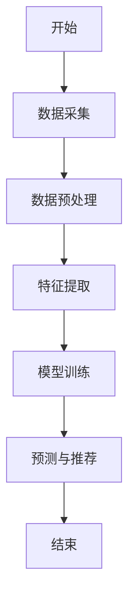
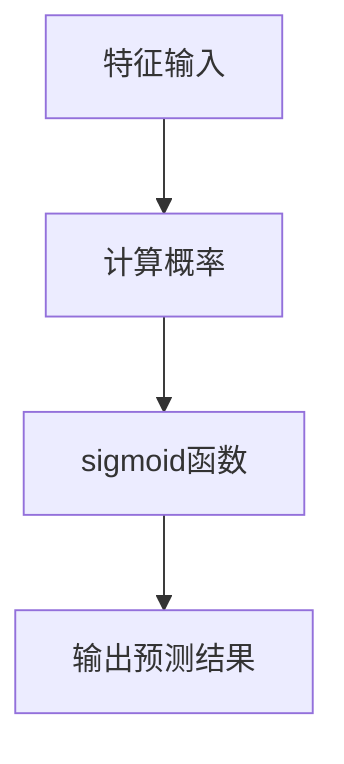
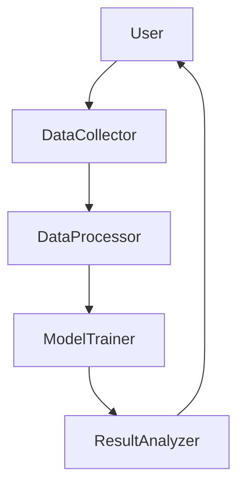

                 


# AI驱动的企业破产重组可行性分析

> 关键词：企业破产重组、人工智能、机器学习、数据分析、可行性分析

> 摘要：本文探讨了人工智能技术在企业破产重组中的应用，分析了如何通过AI技术提高重组的可行性和成功率。文章详细介绍了AI在破产重组中的核心概念、算法原理、系统架构以及实际案例，展示了AI如何帮助企业做出更明智的重组决策。

---

## 第1章: 企业破产重组的背景与问题

### 1.1 企业破产重组的定义与特征

#### 1.1.1 企业破产重组的定义
企业破产重组是指企业在无法偿还债务或持续经营的情况下，通过法律程序对资产和债务进行重新调整，以实现企业的复兴和持续经营的过程。它旨在通过优化资源配置、降低债务负担和改善管理，使企业重新走上健康发展的道路。

#### 1.1.2 企业破产重组的核心特征
- **法律程序性**：破产重组需要遵循相关法律法规，确保债权人和股东的权益。
- **资产与债务调整**：通过对资产的重新分配和债务的重新协商，降低企业的财务负担。
- **管理优化**：重组过程中通常伴随着企业内部管理的调整和优化，以提升竞争力。

#### 1.1.3 破产重组与企业可持续发展的关系
破产重组不仅是企业走出困境的手段，更是企业实现可持续发展的机会。通过重组，企业可以优化资产结构、提升运营效率，并为未来的增长奠定基础。

### 1.2 AI技术在企业破产重组中的应用背景

#### 1.2.1 AI技术的发展与企业分析的结合
随着AI技术的快速发展，特别是在数据分析、预测建模和自动化决策领域的应用，为企业破产重组提供了新的工具和方法。AI能够处理大量复杂的数据，发现传统方法难以察觉的模式和趋势。

#### 1.2.2 企业破产重组中的数据驱动需求
破产重组的成功与否很大程度上取决于对企业的全面分析，包括财务数据、市场表现、法律因素等。AI技术能够从多源数据中提取关键信息，为决策提供支持。

#### 1.2.3 AI技术对企业破产重组的潜在价值
AI可以通过预测模型评估企业的破产风险，优化重组方案，并预测重组后的经营效果。此外，AI还可以辅助制定债务重组计划，优化资产分配，提高重组效率。

### 1.3 问题背景与问题描述

#### 1.3.1 传统企业破产重组的痛点
- 数据分析复杂：传统方法依赖人工分析，效率低且容易出错。
- 预测准确性不足：缺乏系统的预测模型，难以准确判断企业的破产风险。
- 优化方案有限：传统方法难以全面考虑各种可能的重组方案。

#### 1.3.2 数据驱动决策的必要性
通过数据驱动的方法，可以更准确地评估企业的财务状况，预测破产风险，并制定科学的重组方案。

#### 1.3.3 AI技术在破产重组中的应用边界
AI技术的应用主要集中在数据分析、预测建模和决策支持方面，但最终的决策仍需结合法律和企业管理者的判断。

### 1.4 核心概念与问题解决

#### 1.4.1 破产重组可行性分析的核心要素
- 财务状况：包括资产负债表、现金流、利润表等。
- 市场表现：市场需求、竞争状况、企业声誉等。
- 法律因素：债务结构、债权人权益、法律法规等。

#### 1.4.2 AI驱动的破产重组问题解决路径
1. 数据采集与预处理：收集企业的财务、市场等数据，进行清洗和标准化。
2. 数据分析与建模：使用机器学习算法构建破产预测模型。
3. 方案优化与推荐：基于模型结果，优化重组方案并推荐最佳策略。

#### 1.4.3 破产重组与AI技术的结合模型
通过AI技术构建一个综合分析模型，整合多源数据，评估企业破产风险，并提供重组建议。模型包括数据预处理、特征提取、模型训练和结果分析四个阶段。

---

## 第2章: AI驱动破产重组的核心概念与联系

### 2.1 数据驱动的破产重组分析

#### 2.1.1 数据特征提取与企业健康度评估
通过分析企业的财务指标（如流动比率、速动比率）和市场指标（如市场份额、品牌价值），评估企业的健康状况。

#### 2.1.2 数据预处理与清洗方法
数据清洗是确保模型准确性的关键步骤，包括处理缺失值、异常值和重复数据。

#### 2.1.3 数据分析对企业破产重组的启示
数据分析可以帮助识别企业的潜在风险，预测破产可能性，并提供针对性的解决方案。

### 2.2 AI算法在破产重组中的应用原理

#### 2.2.1 机器学习在破产预测中的应用
使用逻辑回归、随机森林等算法，基于历史数据训练模型，预测企业的破产概率。

#### 2.2.2 深度学习在企业风险评估中的优势
深度学习模型（如神经网络）能够捕捉复杂的非线性关系，提高预测的准确性。

#### 2.2.3 算法选择与优化策略
根据数据特征和业务需求选择合适的算法，并通过交叉验证和网格搜索进行优化。

### 2.3 核心概念属性对比分析

#### 2.3.1 传统破产重组分析方法与AI方法的对比
| 方法                | 传统方法                     | AI方法                      |
|---------------------|------------------------------|-----------------------------|
| 数据处理            | 手动分析，效率低             | 自动化处理，高效准确         |
| 预测准确性          | 受主观因素影响较大           | 基于数据驱动，准确性高       |
| 可扩展性            | 有限                        | 高，适用于大规模数据         |

#### 2.3.2 数据特征与算法性能的关联性分析
数据特征的选取直接影响模型的性能，如选择具有高区分度的特征可以提高模型的准确性。

#### 2.3.3 AI驱动的破产重组分析的创新点
通过AI技术实现对企业破产风险的早期预警，并提供个性化的重组方案。

### 2.4 实体关系图与流程图

#### 2.4.1 破产重组分析的ER实体关系

```mermaid
erDiagram
    customer[CUSTOMER] {
        id : integer
        name : string
        industry : string
    }
    financial_data[FINANCIAL_DATA] {
        id : integer
        revenue : float
        profit : float
        debt : float
        year : integer
    }
    bankruptcy_prediction[PREDICTION] {
        id : integer
        probability : float
        recommendation : string
    }
    customer --> financial_data : has
    financial_data --> bankruptcy_prediction : predicts
```

#### 2.4.2 破产重组分析的流程图



---

## 第3章: 算法原理讲解

### 3.1 机器学习算法在破产预测中的应用

#### 3.1.1 逻辑回归模型



逻辑回归模型的数学公式为：
$$ P(y=1) = \frac{e^{\beta_0 + \beta_1x_1 + \beta_2x_2 + \dots}}{1 + e^{\beta_0 + \beta_1x_1 + \beta_2x_2 + \dots}} $$

#### 3.1.2 代码实现

```python
from sklearn.linear_model import LogisticRegression

# 数据预处理
X = data.drop('bankruptcy', axis=1)
y = data['bankruptcy']

# 训练模型
model = LogisticRegression()
model.fit(X, y)

# 预测
y_pred = model.predict(X)
```

### 3.2 深度学习算法的优势

#### 3.2.1 神经网络模型

神经网络模型的结构如下：


数学模型如下：
$$ y = f(W_2 \cdot f(W_1 \cdot x + b_1) + b_2) $$

#### 3.2.2 代码实现

```python
import tensorflow as tf

model = tf.keras.Sequential([
    tf.keras.layers.Dense(64, activation='relu'),
    tf.keras.layers.Dense(1, activation='sigmoid')
])
model.compile(optimizer='adam', loss='binary_crossentropy', metrics=['accuracy'])
model.fit(X_train, y_train, epochs=10, batch_size=32)
```

---

## 第4章: 系统分析与架构设计

### 4.1 破产重组分析系统的架构设计

#### 4.1.1 系统功能模块
- 数据采集模块：收集企业的财务、市场数据。
- 数据处理模块：清洗和预处理数据。
- 模型训练模块：训练机器学习模型。
- 结果分析模块：输出预测结果和重组建议。

#### 4.1.2 系统架构图



---

## 第5章: 项目实战

### 5.1 环境安装与数据准备

#### 5.1.1 安装必要的库
```bash
pip install numpy pandas scikit-learn tensorflow
```

#### 5.1.2 数据准备
```python
import pandas as pd

data = pd.read_csv('enterprise_data.csv')
```

### 5.2 核心代码实现

#### 5.2.1 数据预处理
```python
from sklearn.preprocessing import StandardScaler

scaler = StandardScaler()
X_scaled = scaler.fit_transform(X)
```

#### 5.2.2 训练模型
```python
from sklearn.ensemble import RandomForestClassifier

model = RandomForestClassifier(n_estimators=100)
model.fit(X_scaled, y)
```

### 5.3 实际案例分析

#### 5.3.1 案例背景
分析一家制造企业的破产风险，数据包括过去5年的财务指标和市场表现。

#### 5.3.2 模型预测
```python
y_pred = model.predict(X_test)
print("预测结果:", y_pred)
```

#### 5.3.3 结果分析
根据预测结果，模型给出企业破产概率为70%，并推荐优化债务结构和提升产品竞争力。

---

## 第6章: 结论与建议

### 6.1 最佳实践

#### 6.1.1 数据质量的重要性
确保数据的完整性和准确性，避免偏差。

#### 6.1.2 模型选择与优化
根据业务需求选择合适的算法，并通过交叉验证优化模型性能。

### 6.2 小结

AI技术在企业破产重组中的应用显著提高了分析的效率和准确性，为企业提供了科学的决策支持。

### 6.3 注意事项

- 数据隐私和合规性：确保数据的合法使用和隐私保护。
- 模型解释性：选择具有可解释性的模型，便于决策者理解。

### 6.4 拓展阅读

- 《机器学习实战》
- 《企业风险管理》
- 《深度学习》

---

以上是《AI驱动的企业破产重组可行性分析》的详细目录和内容框架，涵盖了从背景介绍到实际应用的各个方面，结合了理论与实践，为读者提供了全面的指导和深入的分析。

