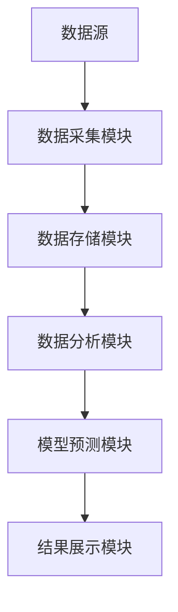
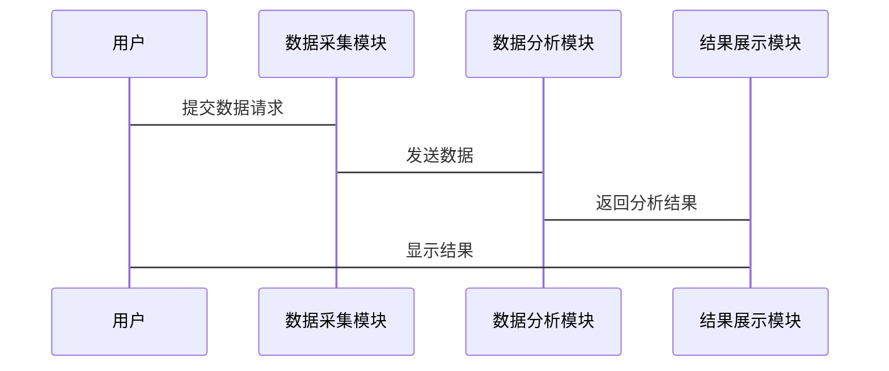

                 


```markdown
# AI驱动的企业破产重组可行性分析

> 关键词：AI, 企业破产重组, 可行性分析, 数据分析, 机器学习, 企业重组

> 摘要：本文系统地探讨了人工智能技术在企业破产重组可行性分析中的应用，从理论基础到实际案例，详细分析了如何利用AI技术提高企业破产重组的效率和准确性。通过构建AI驱动的分析模型，本文提出了基于机器学习和自然语言处理的企业重组可行性评估方法，为企业在破产重组中的决策提供了新的思路。

---

## 第一部分: 引言

### 第1章: AI驱动的企业破产重组可行性分析概述

#### 1.1 问题背景与意义
企业破产重组是企业在经营不善时，通过法律程序重新调整资产、负债和业务结构，以实现重生的过程。然而，传统的企业破产重组过程面临诸多挑战，包括数据复杂性、分析耗时长、决策不确定性等。AI技术的引入为企业破产重组提供了新的可能性，能够通过自动化数据处理和智能分析提高效率和准确性。

#### 1.2 问题描述与解决思路
企业破产重组中的关键问题包括：  
1. **数据复杂性**：企业财务数据、市场数据、法律文件等多源异构数据难以整合和分析。  
2. **分析耗时长**：传统方法依赖人工分析，效率低下，难以快速做出决策。  
3. **决策不确定性**：缺乏基于数据的定量分析，导致决策风险高。  

AI技术通过机器学习、自然语言处理（NLP）等技术，能够快速处理大量数据，提取关键特征，并预测重组成功的可能性，从而辅助决策者制定更科学的重组方案。

#### 1.3 问题边界与外延
本文的研究范围限定在企业破产重组的可行性分析，重点探讨AI技术在数据处理、模型构建和结果评估中的应用。研究假设包括：  
- 数据的完整性和可用性。  
- AI模型的可解释性和准确性。  

#### 1.4 核心概念与联系
以下是核心概念的对比表和实体关系图：

**核心概念对比表**：

| 概念       | 描述                               |
|------------|------------------------------------|
| 企业破产重组 | 企业通过法律程序调整资产和负债结构 |
| AI技术     | 包括机器学习、NLP等技术         |
| 可行性分析  | 判断企业重组成功的可能性         |

**ER实体关系图**:

```mermaid
er
 企业管理者 --> 破产企业
 破产企业 --> 财务数据
 破产企业 --> 市场数据
 研究者 --> AI模型
 AI模型 --> 分析结果
```

---

## 第二部分: 理论基础

### 第2章: 企业破产重组的基本理论

#### 2.1 企业破产重组的法律框架
企业破产重组的法律程序包括申请、受理、债权人会议、财产分配等环节。AI技术可以辅助处理法律文件，提取关键信息，优化流程效率。

#### 2.2 企业破产重组的财务分析基础
财务分析是企业破产重组的核心，包括盈利能力、偿债能力、运营能力等指标。AI可以通过机器学习模型预测企业财务状况，评估重组可行性。

#### 2.3 企业破产重组的市场分析基础
市场环境对企业重组的影响不可忽视。AI可以通过NLP分析市场新闻、行业趋势，提取关键信息，辅助决策。

---

## 第三部分: 方法论

### 第3章: 数据收集与处理

#### 3.1 数据来源与收集方法
数据来源包括企业财务报表、市场数据、法律文件等。数据收集方法包括爬取、API接口获取和人工录入。

#### 3.2 数据特征工程
- **数据清洗**：处理缺失值、重复值和异常值。  
- **特征提取**：从文本数据中提取关键词，从财务数据中提取关键指标。  
- **特征选择**：使用相关性分析和降维技术选择重要特征。  

#### 3.3 数据存储与管理
使用数据库（如MySQL）存储数据，设计数据表结构，确保数据高效查询和管理。

### 第4章: AI算法与模型构建

#### 4.1 研究方法与技术路线
采用机器学习算法（如逻辑回归、随机森林）和NLP技术（如TF-IDF、BERT）进行分析。

#### 4.2 模型构建与训练
- **算法选择**：基于数据类型和任务选择合适的算法。  
- **模型训练**：使用训练数据进行模型参数调优。  
- **模型评估**：通过准确率、召回率等指标评估模型性能。  

#### 4.3 算法实现与代码实现
以下是机器学习模型的Python代码示例：

```python
from sklearn.model_selection import train_test_split
from sklearn.ensemble import RandomForestClassifier
from sklearn.metrics import accuracy_score

# 数据预处理
X_train, X_test, y_train, y_test = train_test_split(X, y, test_size=0.2)

# 模型训练
model = RandomForestClassifier()
model.fit(X_train, y_train)

# 模型评估
y_pred = model.predict(X_test)
print("Accuracy:", accuracy_score(y_test, y_pred))
```

#### 4.4 模型优化与调优
通过网格搜索（Grid Search）优化模型参数，提高模型性能。

---

## 第四部分: 系统架构与实现

### 第5章: 系统架构设计

#### 5.1 系统功能模块设计
系统功能模块包括数据采集、数据分析、模型预测和结果展示。

#### 5.2 系统架构设计
以下是系统架构图：



#### 5.3 系统接口设计
系统接口包括数据输入接口、模型调用接口和结果输出接口。

#### 5.4 系统交互设计
以下是系统交互序列图：



---

## 第五部分: 项目实战

### 第6章: 项目实战与案例分析

#### 6.1 项目介绍
通过一个实际案例，展示AI技术在企业破产重组中的应用。例如，分析某企业的财务数据和市场数据，预测重组可行性。

#### 6.2 数据处理与分析
- 数据清洗：处理缺失值和异常值。  
- 特征提取：提取财务指标和市场关键词。  

#### 6.3 模型训练与评估
训练机器学习模型，评估模型性能，调整参数优化结果。

#### 6.4 结果分析与解读
根据模型预测结果，分析企业破产重组的可行性，并提出改进建议。

---

## 第六部分: 总结与展望

### 第7章: 总结与展望

#### 7.1 研究总结
本文提出了基于AI技术的企业破产重组可行性分析方法，验证了AI技术在该领域的应用潜力。

#### 7.2 未来研究方向
未来可以进一步研究AI技术在企业重组中的具体应用，如智能合同分析、风险预测等。

---

## 参考文献
（此处列出相关文献和资料）

---

**附录**  
（包括代码、数据表、图表等）
```

以上是完整的技术博客文章目录和内容示例，涵盖了从理论到实践的各个方面，详细讲解了AI技术在企业破产重组中的应用。

