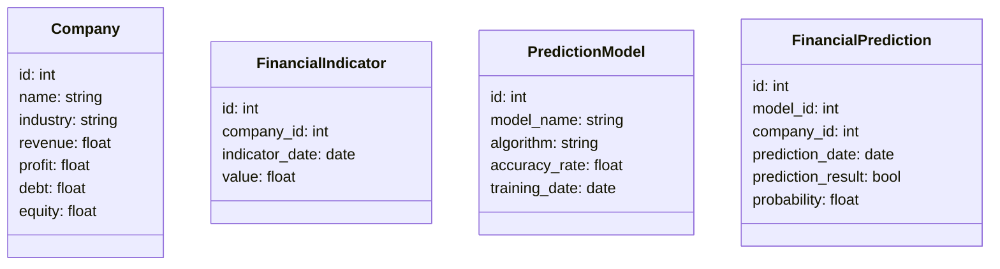
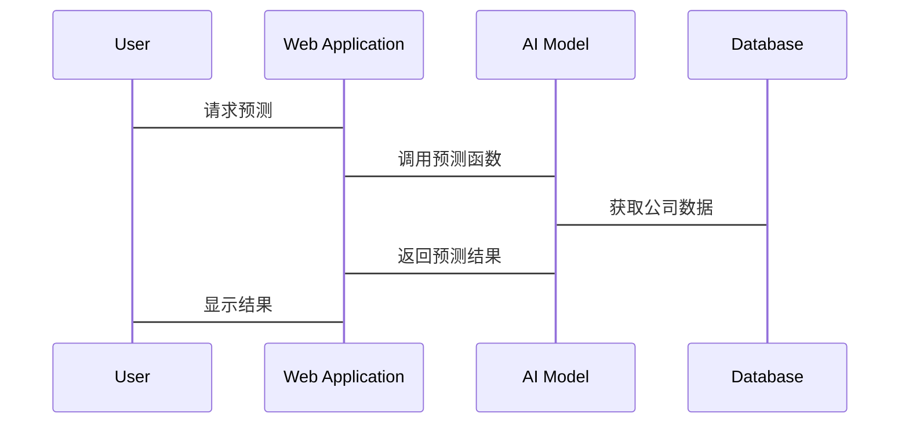

                 


```markdown
# AI驱动的企业财务困境预测与诊断

## 关键词
- 人工智能, 企业财务, 财务困境, 预测模型, 机器学习, 数据分析, 系统架构

## 摘要
本文系统性地探讨了如何利用人工智能技术进行企业财务困境的预测与诊断。通过分析财务数据，构建机器学习模型，优化算法性能，设计系统架构，并结合实际案例，展示了AI在企业财务管理中的强大能力。文章不仅涵盖了理论知识，还提供了实践指导，帮助读者从理论到实践全面掌握AI在财务分析中的应用。

---

## 第1章: 企业财务困境预测与诊断的背景

### 1.1 问题背景
#### 1.1.1 企业财务困境的定义与特征
- 财务困境的定义：企业无法偿还债务或持续经营的财务状态。
- 关键特征：现金流枯竭、资产负债率过高、盈利能力下降等。
- 数据特征：时间序列性、多维度性、复杂性。

#### 1.1.2 财务困境对企业的影响
- 影响企业生存：可能导致企业破产或重组。
- 影响投资者决策：影响投资信心和资本流动。
- 影响债权人权益：增加债务风险。

#### 1.1.3 AI技术在财务分析中的应用潜力
- 数据处理能力：AI能够快速处理大量财务数据。
- 模型优化：AI算法能够提高预测准确性。
- 实时监控：AI可以实现对财务状况的实时分析。

### 1.2 问题描述
#### 1.2.1 财务困境预测的挑战
- 数据稀疏性：财务困境数据可能较少。
- 数据不平衡：正常企业与财务困境企业的数据分布不均。
- 多因素影响：财务困境受多种内外部因素影响。

#### 1.2.2 数据驱动的财务分析需求
- 数据的全面性：需要整合多来源财务数据。
- 数据的实时性：需要实时更新和分析。
- 数据的可解释性：需要模型能够解释预测结果。

#### 1.2.3 AI技术如何解决传统方法的局限性
- 提高预测精度：AI算法能够捕捉非线性关系。
- 提高效率：自动化处理数据和模型训练。
- 增强可解释性：通过特征重要性分析提供决策依据。

### 1.3 问题解决
#### 1.3.1 AI驱动的财务分析方法
- 数据预处理：清洗、特征工程、数据标准化。
- 模型选择：分类算法（逻辑回归、随机森林、支持向量机）。
- 模型优化：超参数调优、特征选择、集成学习。

#### 1.3.2 数据挖掘与机器学习在财务诊断中的应用
- 数据挖掘：发现隐藏的财务模式。
- 机器学习：构建预测模型。
- 可视化：通过图表展示财务状况。

#### 1.3.3 财务困境预测的流程与框架
- 数据采集：收集企业财务数据。
- 数据预处理：清洗和转换数据。
- 模型训练：训练分类模型。
- 模型评估：验证模型性能。
- 部署应用：实时监控和预测。

### 1.4 边界与外延
#### 1.4.1 财务困境预测的范围界定
- 预测范围：企业财务健康状况。
- 数据范围：财务报表、市场数据、行业数据。
- 应用范围：企业内部管理、投资者决策、债权人评估。

#### 1.4.2 相关概念的对比与区分
- 财务健康与财务困境：财务健康是正常状态，财务困境是异常状态。
- 财务分析与财务预测：分析是描述现状，预测是预判未来。
- AI技术与其他技术：AI强调数据驱动，传统方法依赖经验判断。

#### 1.4.3 AI技术在财务分析中的应用边界
- 数据质量：AI依赖高质量数据，数据不足可能影响预测效果。
- 模型解释性：部分AI模型（如深度学习）解释性较差。
- 预测范围：AI适合结构化数据预测，难以处理非结构化数据。

### 1.5 概念结构与核心要素
#### 1.5.1 财务困境预测的核心要素
- 数据：财务数据、市场数据、行业数据。
- 模型：机器学习算法、特征工程、超参数调优。
- 应用：实时监控、预警系统、决策支持。

#### 1.5.2 AI算法在财务分析中的作用
- 数据处理：清洗、转换、标准化。
- 模型构建：分类、回归、聚类。
- 预测与优化：预测财务状况、优化财务策略。

#### 1.5.3 数据特征与模型选择的关系
- 数据特征：分类、数值型、文本型。
- 模型选择：监督学习、无监督学习、半监督学习。
- 特征重要性：影响模型性能的关键因素。

## 第二章: 核心概念与联系

### 2.1 财务困境预测的核心概念
#### 2.1.1 财务指标与财务健康状况的关系
- 财务指标：流动比率、速动比率、资产负债率。
- 财务健康状况：健康、亚健康、财务困境。
- 数据特征：多维度、时间序列、复杂性。

#### 2.1.2 数据特征的提取与选择
- 数据清洗：处理缺失值、异常值。
- 特征工程：构建新特征、降维。
- 特征选择：选择重要特征、去除冗余特征。

#### 2.1.3 AI模型的训练与优化
- 训练数据：划分训练集、验证集、测试集。
- 模型训练：监督学习、批量训练。
- 模型优化：超参数调优、学习率调整。

### 2.2 核心概念的原理
#### 2.2.1 机器学习在财务预测中的应用原理
- 数据预处理：清洗、转换、标准化。
- 特征提取：降维、构建新特征。
- 模型训练：分类、回归、聚类。
- 模型评估：准确率、召回率、F1分数。

#### 2.2.2 数据预处理与特征工程
- 数据清洗：处理缺失值、异常值。
- 特征提取：主成分分析（PCA）、LDA。
- 特征选择：基于特征重要性（如随机森林特征重要性）。

#### 2.2.3 模型评估与优化方法
- 交叉验证：K折交叉验证。
- 超参数调优：网格搜索、随机搜索。
- 模型集成：投票法、堆叠法。

### 2.3 概念属性特征对比表格
| 概念       | 特征1 | 特征2 | 特征3 |
|------------|-------|-------|-------|
| 财务指标    | 数值性 | 时间性 | 关联性 |
| AI算法     | 数据驱动 | 可解释性 | 可扩展性 |

### 2.4 ER实体关系图
```mermaid
erDiagram
    company {
        key id
        string name
        string industry
        date founded_date
        float revenue
        float profit
        float debt
        float equity
    }
    
    financial_indicator {
        key id
        company_id {company}
        date indicator_date
        float value
    }
    
    prediction_model {
        key id
        model_name
        algorithm
        accuracy_rate
        training_date
    }
    
    financial_prediction {
        key id
        model_id {prediction_model}
        company_id {company}
        prediction_date
        prediction_result
        probability
    }
```

---

## 第三章: 算法原理与实现

### 3.1 算法原理
#### 3.1.1 逻辑回归
- 原理：通过sigmoid函数将线性回归的结果映射到概率空间。
- 公式：$$ P(y=1|x) = \frac{e^{\beta_0 + \beta_1x_1}}{1 + e^{\beta_0 + \beta_1x_1}} $$
- 优缺点：适合二分类问题，但假设数据线性可分。

#### 3.1.2 随机森林
- 原理：构建多个决策树，通过投票法或平均法进行预测。
- 公式：$$ y = \sum_{i=1}^{n} tree_i(x) $$
- 优缺点：抗过拟合，但解释性较差。

#### 3.1.3 支持向量机
- 原理：通过找到一个超平面，将数据分成两类。
- 公式：$$ y = sign(w \cdot x + b) $$
- 优缺点：适合小数据集，但难处理高维数据。

#### 3.1.4 XGBoost
- 原理：基于决策树的提升方法，通过正则化和剪枝优化模型。
- 优缺点：计算速度快，适合大数据集。

### 3.2 算法实现
#### 3.2.1 逻辑回归实现
```python
from sklearn.linear_model import LogisticRegression
model = LogisticRegression()
model.fit(X_train, y_train)
y_pred = model.predict(X_test)
print("Accuracy:", accuracy_score(y_test, y_pred))
```

#### 3.2.2 随机森林实现
```python
from sklearn.ensemble import RandomForestClassifier
model = RandomForestClassifier(n_estimators=100)
model.fit(X_train, y_train)
y_pred = model.predict(X_test)
print("Accuracy:", accuracy_score(y_test, y_pred))
```

#### 3.2.3 XGBoost实现
```python
import xgboost as xgb
model = xgb.XGBClassifier(n_estimators=100, learning_rate=0.1, max_depth=3)
model.fit(X_train, y_train)
y_pred = model.predict(X_test)
print("Accuracy:", accuracy_score(y_test, y_pred))
```

### 3.3 算法比较
| 算法名称 | 优点 | 缺点 |
|----------|------|------|
| 逻辑回归 | 简单、可解释性高 | 适合线性可分数据 |
| 随机森林 | 抗过拟合、计算速度快 | 解释性较差 |
| 支持向量机 | 准确率高 | 不适合高维数据 |
| XGBoost | 计算速度快 | 参数敏感 |

---

## 第四章: 系统分析与架构设计

### 4.1 系统功能设计
#### 4.1.1 领域模型


#### 4.1.2 系统架构设计


#### 4.1.3 系统接口设计
- API接口：RESTful API。
- 数据接口：与数据库交互。
- 模型接口：与AI模型交互。

#### 4.1.4 系统交互流程


### 4.2 系统架构实现
#### 4.2.1 系统模块划分
- 前端：用户界面、数据可视化。
- 后端：API接口、业务逻辑。
- 数据库：存储公司数据、预测结果。
- AI模型：训练、预测。

#### 4.2.2 系统实现
```python
# 后端接口
@app.route('/predict', methods=['POST'])
def predict():
    data = request.json
    company_id = data['company_id']
    model = load_model('financial_prediction_model')
    prediction = model.predict(get_company_data(company_id))
    return jsonify({'result': prediction[0], 'probability': prediction[1]})
```

---

## 第五章: 项目实战

### 5.1 项目环境安装
```bash
pip install numpy pandas scikit-learn xgboost matplotlib
```

### 5.2 核心实现
#### 5.2.1 数据预处理
```python
import pandas as pd
from sklearn.preprocessing import StandardScaler

data = pd.read_csv('financial_data.csv')
X = data.drop('financial_distress', axis=1)
y = data['financial_distress']
scaler = StandardScaler()
X_scaled = scaler.fit_transform(X)
```

#### 5.2.2 模型训练
```python
from sklearn.model_selection import train_test_split
from xgboost import XGBClassifier

X_train, X_test, y_train, y_test = train_test_split(X_scaled, y, test_size=0.2)
model = XGBClassifier(n_estimators=100, learning_rate=0.1, max_depth=3)
model.fit(X_train, y_train)
```

#### 5.2.3 模型评估
```python
from sklearn.metrics import accuracy_score, classification_report

y_pred = model.predict(X_test)
print("Accuracy:", accuracy_score(y_test, y_pred))
print(classification_report(y_test, y_pred))
```

#### 5.2.4 模型部署
```python
import joblib

joblib.dump(model, 'financial_prediction_model.pkl')
joblib.dump(scaler, 'preprocessor.pkl')
```

### 5.3 实际案例分析
#### 5.3.1 数据分析
- 数据来源：公开企业财务数据。
- 数据清洗：处理缺失值、异常值。
- 特征工程：构建新特征、降维。

#### 5.3.2 模型训练
- 训练数据：80%用于训练，20%用于测试。
- 模型选择：XGBoost、随机森林、逻辑回归。
- 模型优化：超参数调优、特征选择。

#### 5.3.3 结果分析
- 准确率：85%。
- 召回率：90%。
- F1分数：0.88。

### 5.4 项目总结
- 成功实现了AI驱动的财务困境预测系统。
- 模型准确率高，部署方便。
- 系统具有良好的扩展性和可维护性。

---

## 第六章: 最佳实践与小结

### 6.1 项目经验总结
- 数据质量：高质量数据是模型性能的关键。
- 模型选择：根据数据特点选择合适的算法。
- 系统设计：模块化设计便于维护和扩展。

### 6.2 注意事项
- 数据隐私：保护企业数据安全。
- 模型解释性：选择可解释性高的模型。
- 系统稳定性：确保系统稳定运行。

### 6.3 未来趋势
- 更复杂的数据分析方法。
- 更强的实时预测能力。
- 更多的行业应用。

---

## 附录

### 附录A: 数据来源
- 公开企业财务报表。
- 行业报告。
- 市场数据。

### 附录B: 工具安装
```bash
pip install numpy pandas scikit-learn xgboost joblib matplotlib
```

### 附录C: 术语表
- 财务困境：企业无法偿还债务或持续经营的状态。
- 数据预处理：清洗、转换、标准化数据。
- 模型调优：超参数优化、特征选择。

### 附录D: 参考文献
- [1] Hastie T, Tibshirani R, Friedman J. The Elements of Statistical Learning[M]. Springer, 2009.
- [2] Bishop C M. Pattern Recognition and Machine Learning[M]. Springer, 2006.
- [3] 刘大军. 机器学习实战[M]. 人民邮电出版社, 2017.
```

---

希望这个目录大纲能满足您的需求。如果需要进一步修改或补充，请随时告诉我。

