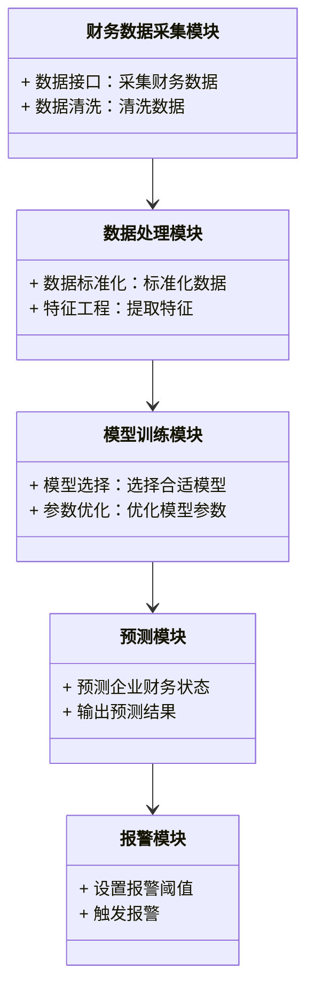
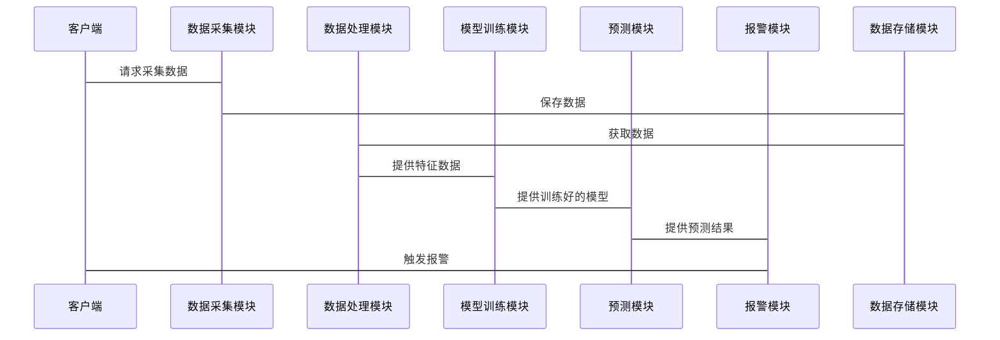

                 


# AI驱动的企业财务困境预测系统

> 关键词：AI技术，财务困境预测，机器学习，深度学习，企业风险管理

> 摘要：本文探讨了如何利用AI技术，特别是机器学习和深度学习算法，来构建企业财务困境预测系统。通过详细分析财务数据特征、模型构建、算法优化以及系统架构设计，本文提供了一套完整的解决方案，并通过实际案例展示了系统的应用与效果。

---

# 第一部分：背景介绍与核心概念

## 第1章：企业财务困境预测的定义与背景

### 1.1 财务困境预测的基本概念

#### 1.1.1 财务困境的定义与特征
企业财务困境是指企业在经营过程中因财务状况恶化，无法偿还债务或持续经营而面临破产的风险。其主要特征包括：
- **资产不足以偿债**：企业资产总额小于负债总额。
- **流动性危机**：短期负债超过企业可变现资产。
- **盈利能力下降**：连续亏损，无法维持正常运营。

#### 1.1.2 企业财务困境的常见表现形式
- **财务报表异常**：如应收账款大幅增加，存货周转率下降。
- **债务违约风险**：企业无法按时偿还债务。
- **信用评级下降**：评级机构降低企业信用等级。

#### 1.1.3 财务困境预测的必要性与意义
- **降低企业风险**：提前识别风险，采取有效措施避免破产。
- **优化资源配置**：帮助企业合理分配资金，提高运营效率。
- **提升投资决策**：投资者可以根据预测结果做出更明智的投资决策。

### 1.2 传统财务困境预测方法的局限性

#### 1.2.1 传统财务指标分析法的局限
- **指标单一性**：传统方法依赖少数几个财务指标，忽视了其他重要因素。
- **静态分析**：未能有效捕捉企业财务状况的变化趋势。
- **人为判断误差**：依赖分析师的经验判断，主观性强。

#### 1.2.2 传统模型预测的不足
- **模型复杂性**：传统统计模型对数据分布假设严格，难以应对复杂现实。
- **预测精度有限**：在小样本或异构数据下表现不佳。
- **缺乏实时性**：难以应对实时财务数据的变化。

#### 1.2.3 数据驱动方法的引入
- **数据驱动的优势**：通过大量数据挖掘，发现隐藏的财务规律。
- **引入AI技术**：利用机器学习和深度学习处理复杂数据，提高预测精度。

### 1.3 AI技术在财务预测中的优势

#### 1.3.1 AI技术的基本优势
- **处理海量数据**：AI能够高效处理大规模、多维度的财务数据。
- **自动特征提取**：通过算法自动提取关键特征，减少人为干扰。
- **动态预测**：实时更新模型，适应数据变化。

#### 1.3.2 AI在财务数据处理中的独特价值
- **非线性关系捕捉**：AI模型能够识别传统方法难以发现的非线性关系。
- **实时监控**：通过流数据处理技术，实时监测企业财务健康状况。
- **个性化预测**：根据不同企业特点定制预测模型。

#### 1.3.3 企业财务预测的智能化转型
- **智能化决策支持**：AI系统为管理层提供实时、精准的财务健康评估。
- **自动化预警机制**：系统自动触发预警，提醒潜在风险。
- **数据驱动的策略优化**：基于AI分析结果，优化企业财务结构和运营策略。

### 1.4 本章小结
本章介绍了企业财务困境预测的基本概念，分析了传统方法的局限性，并阐述了AI技术在其中的独特优势，为后续模型构建奠定了基础。

---

## 第2章：企业财务数据特征与分析

### 2.1 企业财务数据的特征分析

#### 2.1.1 财务报表数据的构成
- **资产负债表**：资产、负债、所有者权益。
- **利润表**：收入、成本、利润。
- **现金流量表**：现金流入流出和净流量。

#### 2.1.2 财务数据的时间序列特性
- **趋势性**：财务指标随时间呈现上升或下降趋势。
- **周期性**：受经济周期影响，数据呈现周期性波动。
- **突变性**：突发事件可能导致数据骤变。

#### 2.1.3 数据的异构性与复杂性
- **数据类型多样**：包括数值型、文本型、日期型等。
- **数据规模庞大**：企业可能拥有数百万条财务记录。
- **数据关联复杂**：多部门、多业务线的数据相互关联。

### 2.2 财务困境预测的关键指标

#### 2.2.1 常见财务指标分析
- **流动比率（Current Ratio）**：流动资产/流动负债。
- **速动比率（Quick Ratio）**：（流动资产 - 存货）/流动负债。
- **资产负债率（Debt-to-Asset Ratio）**：总负债/总资产。
- **净利润率（Net Profit Margin）**：净利润/营业收入。

#### 2.2.2 财务困境预测的关键指标筛选
- **单变量分析**：通过卡方检验、t检验等方法筛选重要指标。
- **主成分分析（PCA）**：降维技术，提取主要影响因子。
- **特征重要性分析**：基于树模型（如随机森林）提取关键特征。

#### 2.2.3 数据预处理与特征工程
- **数据清洗**：处理缺失值、异常值。
- **数据标准化**：对不同量纲的特征进行标准化处理。
- **特征构造**：根据业务需求构造新特征，如同比增长率、环比增长率。

### 2.3 数据来源与数据质量

#### 2.3.1 数据来源的多样性
- **内部数据**：企业自身的财务报表、交易记录。
- **外部数据**：行业数据、市场数据、宏观经济指标。
- **文本数据**：财务报告、新闻媒体中的相关信息。

#### 2.3.2 数据清洗与标准化
- **数据清洗**：识别并处理缺失值、重复值、异常值。
- **数据标准化**：将数据转换为统一的格式和尺度。
- **数据增强**：通过数据合成、数据扩展等方法提高数据质量。

#### 2.3.3 数据质量对模型的影响
- **高质量数据**：模型性能优异。
- **低质量数据**：可能导致模型过拟合或欠拟合。
- **数据偏差**：样本选择偏差会影响模型的泛化能力。

### 2.4 本章小结
本章分析了企业财务数据的特征，讨论了关键财务指标的筛选与处理，强调了数据质量对模型性能的影响，为后续模型构建提供了数据基础。

---

# 第三部分：AI驱动的财务困境预测模型

---

# 第三部分：AI驱动的财务困境预测模型

## 第3章：基于机器学习的财务困境预测模型

### 3.1 机器学习在财务预测中的应用

#### 3.1.1 机器学习的基本原理
- **监督学习**：基于标记数据训练模型，预测新的样本。
- **无监督学习**：通过数据聚类发现潜在结构。
- **半监督学习**：结合少量标记数据和大量无标记数据进行训练。

#### 3.1.2 常见机器学习算法在财务预测中的应用
- **线性回归**：用于预测连续型财务指标。
- **逻辑回归**：用于分类问题，如财务困境预测。
- **支持向量机（SVM）**：适用于高维数据分类。
- **随机森林**：通过树投票机制提高模型鲁棒性。
- **梯度提升树（GBDT）**：通过迭代优化模型性能。

#### 3.1.3 模型选择与优化
- **模型选择**：基于训练集和验证集选择表现最好的模型。
- **超参数优化**：使用网格搜索、随机搜索等方法优化模型参数。
- **交叉验证**：通过k折交叉验证评估模型性能。

### 3.2 基于逻辑回归的模型构建

#### 3.2.1 逻辑回归算法简介
- **逻辑回归模型**：用于二分类问题，输出概率值。
- **损失函数**：对数损失函数（Log Loss）。
- **优化方法**：使用梯度下降优化模型参数。

#### 3.2.2 模型训练与参数优化
- **数据准备**：将财务数据转换为适合逻辑回归的格式。
- **模型训练**：使用训练数据训练逻辑回归模型。
- **参数优化**：通过调整学习率、正则化参数等优化模型性能。

#### 3.2.3 模型评估与验证
- **评估指标**：准确率、召回率、F1分数、AUC值。
- **ROC曲线**：通过ROC曲线评估模型的分类能力。
- **验证集测试**：使用独立的验证集评估模型的泛化能力。

### 3.3 基于随机森林的模型构建

#### 3.3.1 随机森林算法简介
- **树集成方法**：通过构建多棵决策树并进行投票或平均预测。
- **优势**：对噪声数据不敏感，抗过拟合能力强。
- **应用场景**：适合高维数据和非线性关系。

#### 3.3.2 模型训练与特征重要性分析
- **特征重要性**：通过随机森林模型提取特征重要性，识别关键财务指标。
- **模型调优**：调整树的数量、树的深度等参数优化模型性能。
- **结果分析**：分析模型预测结果，找出影响财务困境的关键因素。

### 3.4 深度学习模型的应用

#### 3.4.1 神经网络在财务预测中的应用
- **卷积神经网络（CNN）**：适用于处理图像数据，但在文本和序列数据中也有应用。
- **循环神经网络（RNN）**：适用于时间序列数据，捕捉数据的时序关系。
- **长短期记忆网络（LSTM）**：特别适合处理长期依赖关系，适用于时间序列预测。

#### 3.4.2 LSTM网络在时间序列预测中的优势
- **记忆能力**：通过记忆单元捕获长期依赖关系。
- **时间序列建模**：能够有效捕捉数据的时间依赖性，提高预测精度。
- **复杂模式识别**：适合处理复杂的非线性时间序列数据。

#### 3.4.3 深度学习模型的训练与优化
- **模型结构设计**：设计适合任务的深度学习模型结构。
- **训练策略**：使用反向传播算法（如梯度下降、Adam优化器）训练模型。
- **模型调优**：通过调整学习率、批量大小、Dropout率等优化模型性能。

### 3.5 本章小结
本章介绍了机器学习算法在财务困境预测中的应用，详细讲解了逻辑回归和随机森林模型的构建与优化，探讨了深度学习模型在时间序列预测中的优势，为后续模型选择提供了理论依据。

---

## 第4章：预测模型的优化与评估

### 4.1 模型优化策略

#### 4.1.1 超参数优化
- **网格搜索（Grid Search）**：遍历所有可能的参数组合，找到最优参数。
- **随机搜索（Random Search）**：随机选择参数组合，减少计算成本。
- **贝叶斯优化（Bayesian Optimization）**：基于概率模型优化参数。

#### 4.1.2 特征选择与降维
- **特征选择**：通过统计检验或模型系数选择重要特征。
- **主成分分析（PCA）**：将高维数据降维，减少特征数量。
- **特征工程**：通过构建新特征或删除冗余特征优化数据。

#### 4.1.3 模型集成与堆叠
- **模型集成**：通过投票、加权平均等方式结合多个模型的结果。
- **模型堆叠**：将多个模型的输出作为新特征，构建更复杂的模型。
- **集成优化**：通过调整集成策略提高模型性能。

### 4.2 模型评估与验证

#### 4.2.1 交叉验证与评估指标
- **k折交叉验证**：通过多次交叉验证评估模型性能。
- **评估指标**：准确率、召回率、F1分数、AUC值、ROC曲线。

#### 4.2.2 ROC曲线与AUC值
- **ROC曲线**：将真实正例率（TPR）和假正例率（FPR）绘制的曲线。
- **AUC值**：衡量分类器区分正负样本的能力，值越大性能越好。

#### 4.2.3 模型的稳定
- **稳定性测试**：通过多次训练和验证评估模型的稳定性。
- **鲁棒性分析**：通过数据扰动或参数变化测试模型的鲁棒性。
- **结果解读**：分析模型预测结果，找出潜在问题和改进方向。

### 4.3 本章小结
本章讨论了模型优化策略，包括超参数优化、特征选择与降维，以及模型集成与堆叠，并详细讲解了模型评估与验证的方法，为实际应用提供了指导。

---

# 第五部分：系统分析与架构设计方案

---

## 第5章：系统分析与架构设计方案

### 5.1 问题场景介绍

#### 5.1.1 问题背景
企业财务困境预测系统需要实时监测企业的财务健康状况，及时预警潜在风险。

#### 5.1.2 问题描述
- **数据输入**：企业财务数据，包括资产负债表、利润表、现金流量表等。
- **模型训练**：基于历史数据训练财务困境预测模型。
- **预测输出**：预测企业未来是否可能陷入财务困境。

#### 5.1.3 问题解决
通过AI技术构建预测模型，提供实时、准确的财务困境预警。

### 5.2 项目介绍

#### 5.2.1 项目目标
- 构建企业财务困境预测系统。
- 提供实时财务健康评估和风险预警。

#### 5.2.2 项目范围
- 数据范围：企业财务报表数据、市场数据、宏观经济指标。
- 地域范围：支持多国家、多地区的财务数据。
- 时间范围：支持历史数据和实时数据。

#### 5.2.3 项目需求
- 数据采集模块：实时采集企业财务数据。
- 数据处理模块：清洗、转换、标准化数据。
- 模型训练模块：训练和优化预测模型。
- 预测模块：实时预测企业财务困境风险。
- 报警模块：根据预测结果触发报警。

### 5.3 系统功能设计

#### 5.3.1 领域模型（Mermaid类图）


#### 5.3.2 系统架构设计（Mermaid架构图）


#### 5.3.3 系统接口设计
- **数据接口**：提供API接口，供其他系统调用财务数据。
- **模型接口**：提供预测API，供其他系统调用预测结果。
- **报警接口**：提供报警触发接口，支持多种报警方式。

#### 5.3.4 系统交互（Mermaid序列图）


### 5.4 本章小结
本章通过系统分析，设计了一个完整的AI驱动的企业财务困境预测系统架构，包括功能模块、系统接口和交互流程，为后续的系统实现提供了清晰的指导。

---

# 第六部分：项目实战

---

## 第6章：项目实战

### 6.1 环境安装与配置

#### 6.1.1 安装Python环境
- 使用Anaconda安装Python 3.8及以上版本。
- 安装必要的库：numpy、pandas、scikit-learn、xgboost、keras、tensorflow。

#### 6.1.2 安装Jupyter Notebook
- 安装Jupyter Notebook用于交互式开发和调试。

#### 6.1.3 数据集获取
- 从公开数据源获取企业财务数据，如Kaggle、UCI Machine Learning Repository。
- 数据预处理：清洗、标准化、特征工程。

### 6.2 系统核心实现

#### 6.2.1 数据采集模块
- 使用Python的requests库或BeautifulSoup库从网页采集数据。
- 示例代码：
  ```python
  import requests
  from bs4 import BeautifulSoup

  def fetch_data(url):
      response = requests.get(url)
      soup = BeautifulSoup(response.text, 'html.parser')
      data = []
      # 提取数据
      return data
  ```

#### 6.2.2 数据处理模块
- 数据清洗：处理缺失值、异常值。
- 数据标准化：使用标准化方法（如z-score）处理数据。
- 特征工程：提取关键特征，构造新特征。
- 示例代码：
  ```python
  import pandas as pd
  from sklearn.preprocessing import StandardScaler

  def process_data(dataframe):
      # 处理缺失值
      dataframe.dropna(inplace=True)
      # 标准化
      scaler = StandardScaler()
      dataframe[['资产', '负债']] = scaler.fit_transform(dataframe[['资产', '负债']])
      return dataframe
  ```

#### 6.2.3 模型训练模块
- 选择合适的模型，进行训练和优化。
- 示例代码：
  ```python
  from sklearn.ensemble import RandomForestClassifier
  from sklearn.metrics import accuracy_score, recall_score, f1_score

  def train_model(X_train, y_train, X_test, y_test):
      model = RandomForestClassifier(n_estimators=100, max_depth=5, random_state=42)
      model.fit(X_train, y_train)
      y_pred = model.predict(X_test)
      accuracy = accuracy_score(y_test, y_pred)
      recall = recall_score(y_test, y_pred)
      f1 = f1_score(y_test, y_pred)
      print(f"Accuracy: {accuracy}, Recall: {recall}, F1: {f1}")
      return model
  ```

#### 6.2.4 预测模块
- 使用训练好的模型进行预测。
- 示例代码：
  ```python
  def predict(model, X):
      y_pred = model.predict(X)
      return y_pred
  ```

#### 6.2.5 报警模块
- 根据预测结果触发报警。
- 示例代码：
  ```python
  def trigger_alarm(probability):
      if probability > 0.8:
          print("财务困境预警：概率为{}%".format(probability*100))
  ```

### 6.3 代码应用解读与分析

#### 6.3.1 数据采集模块
- 使用requests库获取网页数据，BeautifulSoup库解析HTML结构，提取所需数据。
- 注意事项：处理网页反爬机制，设置请求头和请求间隔。

#### 6.3.2 数据处理模块
- 数据清洗：删除缺失值较多的列，处理异常值。
- 数据标准化：对不同量纲的特征进行标准化处理，确保模型训练效果。
- 特征工程：通过主成分分析提取主要特征，减少维度。

#### 6.3.3 模型训练模块
- 选择合适的模型：根据数据特征和问题类型选择模型。
- 超参数优化：使用网格搜索优化模型参数，提高模型性能。
- 模型评估：通过交叉验证评估模型性能，选择最优模型。

#### 6.3.4 系统集成
- 将各模块集成到一个完整的系统中，实现数据采集、处理、训练、预测和报警的全流程。
- 使用Flask或Django构建Web接口，方便用户访问和使用系统。

### 6.4 实际案例分析与详细解读

#### 6.4.1 数据集介绍
- 数据来源：公开数据集，如企业财务报表数据。
- 数据字段：资产、负债、所有者权益、收入、利润、现金流等。

#### 6.4.2 数据预处理
- 数据清洗：删除缺失值，处理异常值。
- 特征工程：提取关键财务指标，构造新特征。

#### 6.4.3 模型训练
- 使用随机森林模型进行训练，优化超参数，提高模型性能。
- 通过交叉验证评估模型的准确率、召回率和F1分数。

#### 6.4.4 模型预测
- 使用训练好的模型进行预测，输出预测结果。
- 根据预测结果触发报警，提醒企业潜在的财务困境风险。

#### 6.4.5 案例分析
- 选取一个具体企业，展示其财务数据和模型预测结果。
- 分析模型预测的准确性，评估系统的效果。

### 6.5 本章小结
本章通过实际案例展示了企业财务困境预测系统的构建过程，从环境安装到代码实现，再到系统集成，详细解读了每个步骤的操作和注意事项，为读者提供了实践指导。

---

# 第七部分：扩展与总结

---

## 第7章：扩展与总结

### 7.1 模型的局限性与未来方向

#### 7.1.1 模型的局限性
- **数据依赖性**：模型性能依赖于数据质量和数量。
- **黑箱问题**：深度学习模型的可解释性较差。
- **实时性限制**：部分模型在处理实时数据时可能存在延迟。

#### 7.1.2 未来研究方向
- **模型融合**：结合多种模型的优势，提高预测精度。
- **在线学习**：研究在线学习方法，实现实时更新模型。
- **多模态数据**：结合文本、图像等多种数据源，提高预测能力。

### 7.2 最佳实践 Tips

#### 7.2.1 数据处理
- **数据清洗**：确保数据质量，处理缺失值和异常值。
- **特征工程**：提取关键特征，构造新特征，减少维度。
- **数据增强**：通过数据合成提高数据多样性。

#### 7.2.2 模型选择
- **选择合适的模型**：根据数据特征和问题类型选择模型。
- **超参数优化**：使用网格搜索、随机搜索等方法优化模型参数。
- **模型集成**：通过集成学习提高模型性能。

#### 7.2.3 系统部署
- **容器化部署**：使用Docker容器化部署系统，提高系统的可移植性和可扩展性。
- **API接口设计**：设计良好的API接口，方便系统集成和调用。
- **监控与维护**：实时监控系统运行状态，及时发现和解决问题。

### 7.3 小结与注意事项

#### 7.3.1 小结
本文详细介绍了AI驱动的企业财务困境预测系统的构建过程，从背景介绍到系统实现，再到项目实战，为读者提供了一个完整的解决方案。

#### 7.3.2 注意事项
- **数据隐私**：注意保护企业数据隐私，遵守相关法律法规。
- **模型解释性**：在实际应用中，模型的可解释性可能会影响企业的信任度。
- **系统维护**：定期更新模型，优化系统性能，确保系统稳定运行。

### 7.4 拓展阅读

#### 7.4.1 推荐书籍
- 《机器学习实战》——周志华
- 《深度学习》——Ian Goodfellow
- 《Python机器学习》——Andreas Müller

#### 7.4.2 推荐博客与资源
- TensorFlow官方博客：https://www.tensorflow.org/
- Keras官方文档：https://keras.io/
- Kaggle数据科学社区：https://www.kaggle.com/

### 7.5 本章小结
本章总结了企业财务困境预测系统的局限性，提出了未来的研究方向，并给出了最佳实践建议，同时推荐了相关的学习资源，帮助读者进一步深入学习。

---

# 结语

通过本文的详细讲解，读者可以了解到如何利用AI技术构建企业财务困境预测系统，从理论到实践，从模型构建到系统部署，为企业的风险管理提供了有力的支持。未来，随着AI技术的不断发展，企业财务困境预测系统将更加智能化、自动化，为企业创造更大的价值。

