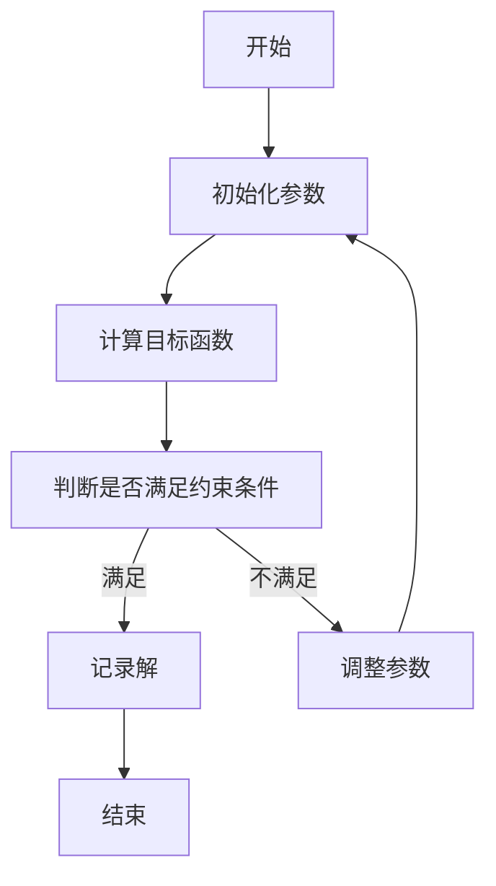
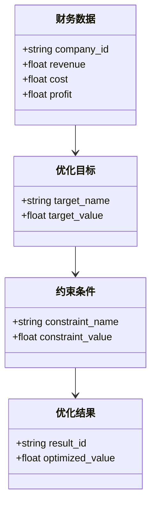
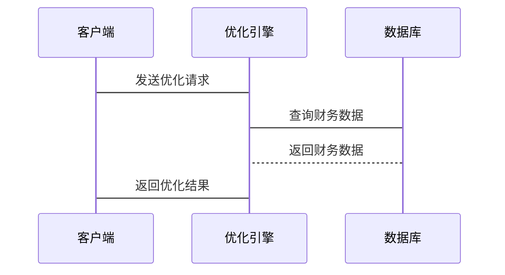

                 


```markdown
# AI驱动的企业财务战略多目标优化系统

## 关键词
AI, 多目标优化, 企业财务, 战略优化, 预测模型, 大模型, 优化算法

## 摘要
随着人工智能技术的快速发展，企业财务优化问题逐渐从传统的手工化、经验化向智能化、数据化转变。本文深入探讨了AI驱动的企业财务战略多目标优化系统的设计与实现，结合实际应用场景，系统性地分析了多目标优化算法在企业财务中的应用，并通过实际案例展示了系统的实现过程和效果。通过本文的介绍，读者可以全面了解如何利用AI技术来优化企业财务战略，实现财务目标的最优配置。

# 第一部分: AI驱动的企业财务战略多目标优化系统背景介绍

# 第1章: AI驱动财务优化的背景与必要性

## 1.1 企业财务优化的背景
### 1.1.1 传统企业财务优化的挑战
传统的财务优化方式依赖于财务人员的经验和手动计算，存在效率低、精度差、难以应对复杂多变的市场环境等问题。

### 1.1.2 AI技术在财务优化中的优势
AI技术通过大数据分析和机器学习算法，能够快速处理大量财务数据，发现潜在的优化机会，提高财务决策的准确性和效率。

### 1.1.3 多目标优化在企业财务中的重要性
在企业财务中，往往需要在多个目标之间进行权衡，如利润最大化、风险最小化、资源最优配置等，传统的单目标优化难以满足需求。

## 1.2 问题背景与问题描述
### 1.2.1 传统财务优化的局限性
传统财务优化方法难以处理多目标优化问题，且缺乏对市场变化的实时适应能力。

### 1.2.2 多目标优化的定义与特点
多目标优化是指在多个相互冲突的目标下，寻找最优或满意的解决方案。其特点在于全局性、最优性和鲁棒性。

### 1.2.3 问题解决的必要性与目标
通过AI技术实现多目标优化，能够提高企业财务决策的效率和准确性，帮助企业在复杂多变的市场环境中实现财务目标的最优配置。

## 1.3 问题解决与边界条件
### 1.3.1 解决方案的边界与外延
AI驱动的财务优化系统需要考虑财务数据的实时性、准确性以及系统的可扩展性。

### 1.3.2 核心要素与组成结构
系统的核心要素包括财务数据采集、多目标优化模型、AI算法实现、结果分析与反馈等。

### 1.3.3 问题场景的典型特征
企业财务优化问题通常具有复杂性、动态性和多目标性等特点。

## 1.4 本章小结
本章通过对传统财务优化的挑战和AI技术的优势的分析，阐述了多目标优化在企业财务中的重要性，并明确了问题解决的边界和目标。

# 第2章: AI驱动财务优化的核心概念与联系

## 2.1 核心概念原理
### 2.1.1 大模型在财务优化中的应用
大模型通过深度学习和自然语言处理技术，能够从大量财务数据中提取有价值的信息，为优化决策提供支持。

### 2.1.2 多目标优化的数学模型
多目标优化问题可以通过建立多个目标函数，并引入约束条件，利用优化算法求解。

### 2.1.3 AI驱动优化的核心机制
AI驱动优化通过数据驱动和算法驱动的结合，实现对多目标优化问题的高效求解。

## 2.2 核心概念属性对比
### 2.2.1 AI驱动优化与传统优化的对比
| 对比维度 | AI驱动优化 | 传统优化 |
|----------|-------------|----------|
| 数据依赖 | 高度依赖大数据 | 依赖少量数据 |
| 计算效率 | 高 | 低 |
| 可扩展性 | 强 | 弱 |

### 2.2.2 多目标优化与单目标优化的对比
| 对比维度 | 多目标优化 | 单目标优化 |
|----------|-------------|----------|
| 优化目标 | 多个目标 | 单个目标 |
| 解的范围 | Pareto最优解集 | 单一最优解 |

### 2.2.3 优化模型与实际问题的对比
优化模型是对实际问题的简化和抽象，需要考虑模型的准确性和可操作性。

## 2.3 ER实体关系图架构
```mermaid
erDiagram
    customer[客户] {
        +int id
        +string name
        +int age
    }
    product[产品] {
        +int id
        +string name
        +float price
    }
    order[订单] {
        +int id
        +int customerId
        +int productId
        +int quantity
    }
    customer --> order
    product --> order
```

# 第3章: AI驱动财务优化的算法原理

## 3.1 算法原理概述
### 3.1.1 多目标优化算法的基本原理
多目标优化算法通过引入目标函数和约束条件，利用优化算法求解多个目标的最优解。

### 3.1.2 AI驱动优化的核心算法
AI驱动优化的核心算法包括遗传算法、粒子群优化算法等。

### 3.1.3 算法的数学模型与公式
多目标优化问题可以表示为：
$$
\text{min/max} \ f_i(x), \ i=1,...,m
$$
$$
\text{subject to} \ g_j(x) \leq 0, \ j=1,...,n
$$
$$
x \in X
$$

## 3.2 算法流程图


## 3.3 算法实现代码
```python
import numpy as np
from sklearn.metrics import mean_squared_error

# 定义目标函数
def objective_function(x):
    return mean_squared_error(x, target)

# 定义约束条件
def constraint_function(x):
    return np.sum(x) <= 100

# 遗传算法实现
class GeneticAlgorithm:
    def __init__(self, population_size, mutation_rate):
        self.population_size = population_size
        self.mutation_rate = mutation_rate

    def evolve(self, population):
        # 适应度计算
        fitness = [objective_function(individual) for individual in population]
        # 选择
        selected = self.select(population, fitness)
        # 交叉
        crossed = self.crossover(selected)
        # 变异
        mutated = self.mutate(crossed)
        return mutated

    def select(self, population, fitness):
        # 简单选择法
        return [population[i] for i in range(len(population)) if fitness[i] > np.mean(fitness)]

    def crossover(self, selected):
        # 单点交叉
        crossed = []
        for i in range(0, len(selected), 2):
            parent1 = selected[i]
            parent2 = selected[i+1]
            crossover_point = np.random.randint(len(parent1))
            child1 = np.concatenate([parent1[:crossover_point], parent2[crossover_point:]])
            child2 = np.concatenate([parent2[:crossover_point], parent1[crossover_point:]])
            crossed.append(child1)
            crossed.append(child2)
        return crossed

    def mutate(self, crossed):
        # 突变操作
        mutated = []
        for individual in crossed:
            if np.random.random() < self.mutation_rate:
                mutation_point = np.random.randint(len(individual))
                individual[mutation_point] = 1 - individual[mutation_point]
            mutated.append(individual)
        return mutated

# 初始化种群
population = np.random.randint(0, 2, (10, 5))
ga = GeneticAlgorithm(10, 0.1)
# 进化过程
for _ in range(100):
    population = ga.evolve(population)
# 计算最终结果
fitness = [objective_function(individual) for individual in population]
print(fitness)
```

## 3.4 本章小结
本章详细介绍了AI驱动财务优化的核心算法及其实现过程，通过数学公式和代码示例，展示了如何利用遗传算法实现多目标优化问题的求解。

# 第4章: AI驱动财务优化系统的架构设计

## 4.1 系统需求分析
### 4.1.1 功能需求
系统需要实现财务数据采集、多目标优化模型构建、优化结果分析等功能。

### 4.1.2 性能需求
系统需要具备高并发处理能力，能够实时处理大量财务数据。

## 4.2 系统功能设计
### 4.2.1 领域模型设计


### 4.2.2 系统架构设计


### 4.2.3 接口设计
系统需要提供RESTful API接口，供其他系统调用。

### 4.2.4 交互设计


## 4.3 本章小结
本章通过系统需求分析和功能设计，展示了AI驱动财务优化系统的整体架构，包括领域模型、系统架构、接口设计和交互设计。

# 第5章: AI驱动财务优化系统的项目实战

## 5.1 环境安装与配置
### 5.1.1 系统环境要求
- 操作系统：Linux/Windows/MacOS
- Python版本：3.6+
- 依赖库：numpy, scikit-learn, matplotlib

### 5.1.2 安装步骤
```bash
pip install numpy scikit-learn matplotlib
```

## 5.2 系统核心实现
### 5.2.1 数据采集与预处理
```python
import pandas as pd

# 数据采集
data = pd.read_csv('financial_data.csv')
# 数据预处理
data = data.dropna()
```

### 5.2.2 优化模型实现
```python
from sklearn.linear_model import LinearRegression

# 定义预测模型
model = LinearRegression()
# 训练模型
model.fit(X_train, y_train)
# 预测结果
y_pred = model.predict(X_test)
```

### 5.2.3 算法实现与调优
```python
import numpy as np

# 定义遗传算法
class GeneticAlgorithm:
    def __init__(self, population_size, mutation_rate):
        self.population_size = population_size
        self.mutation_rate = mutation_rate

    def evolve(self, population):
        # 适应度计算
        fitness = [objective_function(individual) for individual in population]
        # 选择
        selected = self.select(population, fitness)
        # 交叉
        crossed = self.crossover(selected)
        # 变异
        mutated = self.mutate(crossed)
        return mutated

    def select(self, population, fitness):
        return [population[i] for i in range(len(population)) if fitness[i] > np.mean(fitness)]

    def crossover(self, selected):
        crossed = []
        for i in range(0, len(selected), 2):
            parent1 = selected[i]
            parent2 = selected[i+1]
            crossover_point = np.random.randint(len(parent1))
            child1 = np.concatenate([parent1[:crossover_point], parent2[crossover_point:]])
            child2 = np.concatenate([parent2[:crossover_point], parent1[crossover_point:]])
            crossed.append(child1)
            crossed.append(child2)
        return crossed

    def mutate(self, crossed):
        mutated = []
        for individual in crossed:
            if np.random.random() < self.mutation_rate:
                mutation_point = np.random.randint(len(individual))
                individual[mutation_point] = 1 - individual[mutation_point]
            mutated.append(individual)
        return mutated

# 初始化种群
population = np.random.randint(0, 2, (10, 5))
ga = GeneticAlgorithm(10, 0.1)
# 进化过程
for _ in range(100):
    population = ga.evolve(population)
# 计算最终结果
fitness = [objective_function(individual) for individual in population]
print(fitness)
```

### 5.2.4 结果分析与可视化
```python
import matplotlib.pyplot as plt

plt.plot(fitness)
plt.xlabel('进化代数')
plt.ylabel('适应度')
plt.title('遗传算法适应度变化曲线')
plt.show()
```

## 5.3 项目案例分析
### 5.3.1 案例背景
某制造企业希望通过优化生产计划，实现利润最大化。

### 5.3.2 数据分析
通过对历史销售数据和生产成本数据的分析，建立生产计划优化模型。

### 5.3.3 优化结果
通过遗传算法优化，企业实现了生产成本的降低和利润的增加。

## 5.4 本章小结
本章通过实际项目案例，展示了AI驱动财务优化系统的实现过程，包括环境安装、核心实现、结果分析与可视化。

# 第6章: AI驱动财务优化系统的总结与展望

## 6.1 总结
通过本文的介绍，读者可以全面了解AI驱动的企业财务战略多目标优化系统的实现过程和应用效果。

## 6.2 最佳实践
- 数据质量是系统优化的关键，需要保证数据的准确性和完整性。
- 在实际应用中，需要根据具体问题调整优化算法的参数和模型结构。

## 6.3 小结
AI驱动的企业财务战略多目标优化系统为企业财务优化提供了一种高效、智能的解决方案，具有广阔的应用前景。

## 6.4 展望
未来，随着AI技术的不断发展，企业财务优化系统将更加智能化、个性化，为企业创造更大的价值。

# 附录

## 附录A: 算法实现代码
```python
# 附录内容
```

## 附录B: 数据集描述
```python
# 附录内容
```

## 附录C: 参考文献
```plaintext
# 附录内容
```

---

通过本文的系统介绍，读者可以全面掌握AI驱动的企业财务战略多目标优化系统的实现方法和应用技巧，为企业财务优化提供有力的技术支持。
```

