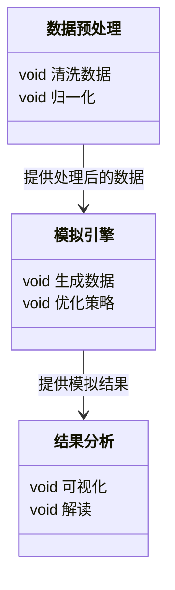
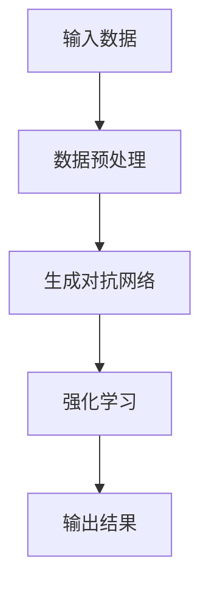
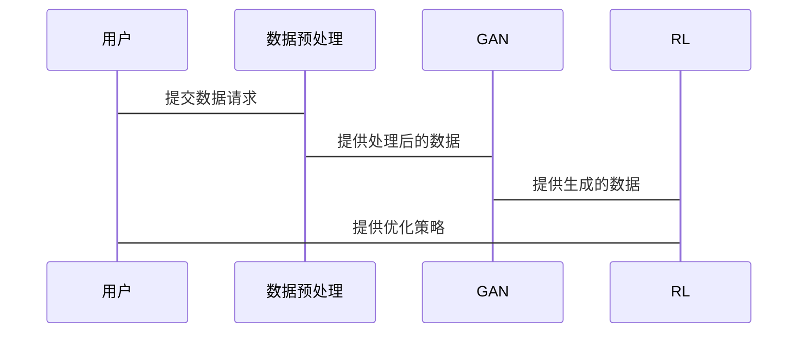

                 


# AI驱动的企业财务战略情景模拟系统

> 关键词：AI驱动，财务战略，情景模拟，企业架构，生成对抗网络，强化学习，系统架构

> 摘要：本文详细探讨了AI驱动的企业财务战略情景模拟系统的构建与应用。通过分析财务战略模拟的核心问题，提出了基于生成对抗网络和强化学习的解决方案，展示了系统的架构设计和实现方法。本文还提供了实际案例，帮助读者理解如何将AI技术应用于企业财务决策中，以提高战略规划的科学性和有效性。

---

# 第1章: 背景介绍

## 1.1 问题背景

### 1.1.1 企业财务战略的重要性  
企业的财务战略是企业经营的核心之一，涉及资金分配、投资决策、风险管理等多个方面。有效的财务战略能够帮助企业实现利润最大化、风险最小化，并在复杂多变的市场环境中保持竞争优势。

### 1.1.2 当前财务战略面临的挑战  
1. **数据复杂性**：财务数据种类繁多，包括财务报表、市场数据、行业趋势等，传统的手工分析效率低下。  
2. **决策不确定性**：财务决策往往涉及多个变量，且受到外部环境的不确定性影响，难以通过简单的模型预测。  
3. **实时性要求**：现代企业需要快速响应市场变化，传统的静态财务模型难以满足实时性需求。  

### 1.1.3 AI技术在财务领域的应用潜力  
AI技术能够处理海量数据、构建复杂模型，并实时更新分析结果，为财务战略的制定提供了新的可能性。通过AI技术，企业可以模拟多种财务战略方案，评估其潜在风险和收益，从而做出更科学的决策。

## 1.2 问题描述

### 1.2.1 财务战略模拟的核心问题  
财务战略模拟的核心问题是如何在复杂多变的市场环境中，找到最优的财务策略组合，以实现企业目标的最大化。这需要考虑多种变量，包括市场波动、政策变化、行业趋势等。

### 1.2.2 AI驱动模拟的必要性  
传统的财务模拟方法依赖于静态模型和假设条件，难以应对实际中的不确定性。通过AI技术，可以动态调整模型参数，实时更新模拟结果，提高模拟的准确性和实用性。

### 1.2.3 系统的目标与范围  
本系统的目的是通过AI技术构建一个财务战略情景模拟系统，帮助企业在多种假设条件下评估财务策略的可行性，并优化资源配置。系统的范围包括数据收集、模型构建、模拟运行和结果分析。

## 1.3 问题解决

### 1.3.1 AI驱动模拟的解决方案  
1. **数据驱动**：通过收集和处理海量财务数据，构建基础数据集。  
2. **模型构建**：利用生成对抗网络（GAN）和强化学习（RL）等AI技术，构建财务战略模拟模型。  
3. **实时更新**：根据市场变化和企业需求，实时更新模型参数和模拟结果。  

### 1.3.2 系统的创新点  
1. **AI技术的深度应用**：将GAN和RL等前沿AI技术应用于财务模拟，提高模型的准确性和灵活性。  
2. **动态调整能力**：系统能够根据实时数据和用户反馈，动态调整模拟参数，确保结果的准确性。  
3. **多维度分析**：系统支持从财务、市场、风险等多个维度进行综合分析，提供全面的决策支持。  

### 1.3.3 边界与外延  
本系统主要关注财务战略的模拟与优化，不涉及具体的财务操作和执行。系统的外延包括数据收集、模型构建、结果分析等环节。

## 1.4 核心概念

### 1.4.1 系统架构  
系统的架构包括数据预处理模块、模拟引擎模块、结果分析模块和用户界面模块。各模块之间通过数据流进行交互，确保系统的高效运行。

### 1.4.2 关键技术  
1. **生成对抗网络（GAN）**：用于生成多样化的财务数据和场景。  
2. **强化学习（RL）**：用于优化财务策略的选择和调整。  
3. **数据预处理**：对原始数据进行清洗、归一化等处理，确保模型输入的准确性。  

### 1.4.3 实现原理  
系统的实现基于深度学习技术，通过GAN生成多种财务场景，利用RL优化策略，并结合实际数据进行验证和调整。

---

# 第2章: 核心概念与联系

## 2.1 AI驱动的财务模拟系统

### 2.1.1 系统组成  
1. **数据源**：包括财务报表、市场数据、行业趋势等。  
2. **模拟引擎**：负责生成和评估多种财务策略。  
3. **结果分析**：对模拟结果进行可视化展示和解读。  

### 2.1.2 系统流程  
1. **数据收集**：从企业内部系统和外部数据库获取相关数据。  
2. **数据预处理**：清洗和归一化数据，确保模型输入的准确性。  
3. **模型训练**：利用GAN和RL技术训练财务模拟模型。  
4. **模拟运行**：生成多种财务场景，评估策略的可行性和效果。  
5. **结果分析**：对模拟结果进行分析和解读，提供决策支持。  

### 2.1.3 实体关系图  
```mermaid
er
  actor 用户
  actor 管理员
  actor 数据源
  actor 模拟结果
  database 系统数据库
  database 模型参数
  database 模拟记录
  系统组件: 数据预处理, 模拟引擎, 结果分析
  用户 --> 数据预处理: 提交数据请求
  管理员 --> 模拟引擎: 设置参数
  数据源 --> 数据预处理: 提供数据
  数据预处理 --> 模拟引擎: 输入处理后的数据
  模拟引擎 --> 结果分析: 输出模拟结果
  结果分析 --> 用户: 提供分析报告
```

## 2.2 核心概念对比分析

### 2.2.1 数据源与模拟结果对比  
| 属性 | 数据源 | 模拟结果 |
|------|--------|----------|
| 类型 | 财务报表、市场数据 | 财务指标、风险评估 |
| 格式 | 结构化数据 | 结构化数据 |
| 来源 | 企业内部系统、外部数据库 | 模拟引擎生成 |

### 2.2.2 算法对比  
| 算法 | GAN | RL |
|------|----|----|
| 描述 | 生成多样化的数据 | 优化策略选择 |
| 输入 | 噪声向量 | 状态和动作 |
| 输出 | 生成数据 | 最优策略 |

---

# 第3章: 算法原理

## 3.1 GAN在财务模拟中的应用

### 3.1.1 GAN原理  
生成对抗网络由生成器和判别器组成，通过对抗训练生成高质量的数据。生成器的目标是生成与真实数据相似的样本，而判别器的目标是区分真实数据和生成数据。两者的对抗过程使得生成器能够生成逼真的数据。

### 3.1.2 GAN在财务模拟中的具体应用  
1. **数据生成**：利用GAN生成多样化的财务数据，如财务报表、市场趋势等。  
2. **场景模拟**：通过GAN生成多种财务场景，模拟不同市场条件下的财务表现。  

### 3.1.3 GAN的数学模型  
生成器的损失函数：  
$$ L_g = \log(D(G(z))) $$
判别器的损失函数：  
$$ L_d = \log(D(x)) + \log(1 - D(G(z))) $$  
其中，$x$是真实数据，$z$是噪声向量，$G$是生成器，$D$是判别器。

### 3.1.4 代码示例  
```python
import torch
import torch.nn as nn

# 定义生成器
class Generator(nn.Module):
    def __init__(self, latent_dim, financial_dim):
        super(Generator, self).__init__()
        self.fc = nn.Linear(latent_dim, financial_dim)
    
    def forward(self, z):
        return self.fc(z)

# 定义判别器
class Discriminator(nn.Module):
    def __init__(self, financial_dim):
        super(Discriminator, self).__init__()
        self.fc = nn.Linear(financial_dim, 1)
    
    def forward(self, x):
        return self.fc(x)
```

## 3.2 RL在财务优化中的应用

### 3.2.1 RL原理  
强化学习通过智能体与环境的交互，学习最优策略。智能体通过执行动作获得奖励，目标是最大化累计奖励。

### 3.2.2 RL在财务优化中的具体应用  
1. **策略优化**：利用RL优化财务策略，如投资组合优化、风险控制等。  
2. **动态调整**：根据市场变化动态调整财务策略，实时更新模型参数。  

### 3.2.3 RL的数学模型  
策略梯度下降方法：  
$$ \nabla J = E[\nabla \log \pi(a|s) Q(s,a)] $$  
其中，$Q(s,a)$是状态-动作值函数，$\pi(a|s)$是策略函数。  

### 3.2.4 代码示例  
```python
import torch
import torch.nn as nn

# 定义策略网络
class PolicyNetwork(nn.Module):
    def __init__(self, state_dim, action_dim):
        super(PolicyNetwork, self).__init__()
        self.fc = nn.Linear(state_dim, action_dim)
    
    def forward(self, state):
        return torch.sigmoid(self.fc(state))
```

---

# 第4章: 系统分析与架构设计

## 4.1 系统应用场景

### 4.1.1 企业财务规划  
帮助企业制定长期财务目标和战略，优化资源配置。  

### 4.1.2 投资决策支持  
提供投资组合优化建议，帮助企业在多种市场条件下做出最优决策。  

### 4.1.3 风险管理  
识别和评估潜在的财务风险，制定应对策略。  

## 4.2 系统功能设计

### 4.2.1 领域模型  


### 4.2.2 系统架构  


### 4.2.3 接口设计  
系统提供RESTful API接口，支持数据输入、模型训练、结果查询等功能。  

### 4.2.4 交互流程  


---

# 第5章: 项目实战

## 5.1 环境安装

### 5.1.1 安装Python环境  
使用Anaconda或Miniconda安装Python 3.8及以上版本。  

### 5.1.2 安装依赖库  
安装PyTorch、GAN、RL相关的库：  
```bash
pip install torch
pip install numpy
pip install matplotlib
```

## 5.2 核心功能实现

### 5.2.1 数据预处理  
```python
import pandas as pd
import numpy as np

# 读取数据
data = pd.read_csv('financial_data.csv')
# 清洗数据
data = data.dropna()
# 归一化
normalized_data = (data - data.mean()) / data.std()
```

### 5.2.2 GAN模型实现  
```python
class GAN:
    def __init__(self, latent_dim, financial_dim):
        self.generator = Generator(latent_dim, financial_dim)
        self.discriminator = Discriminator(financial_dim)
    
    def train(self, data, epochs=100):
        for epoch in range(epochs):
            # 生成假数据
            z = torch.randn(batch_size, latent_dim)
            gen_data = self.generator(z)
            
            # 判别器训练
            real_output = self.discriminator(data)
            fake_output = self.discriminator(gen_data)
            d_loss = torch.mean(torch.log(real_output) + torch.log(1 - fake_output))
            
            # 生成器训练
            g_loss = torch.mean(-torch.log(fake_output))
            
            # 反向传播
            self.discriminator.zero_grad()
            d_loss.backward()
            self.discriminator.optimizer.step()
            
            self.generator.zero_grad()
            g_loss.backward()
            self.generator.optimizer.step()
```

### 5.2.3 RL模型实现  
```python
class RL:
    def __init__(self, state_dim, action_dim):
        self.policy = PolicyNetwork(state_dim, action_dim)
    
    def train(self, states, actions, rewards, epochs=100):
        for epoch in range(epochs):
            # 计算损失
            predicted_actions = self.policy(states)
            loss = torch.mean((predicted_actions - actions) ** 2)
            
            # 反向传播
            self.policy.zero_grad()
            loss.backward()
            self.policy.optimizer.step()
```

## 5.3 实际案例分析

### 5.3.1 案例背景  
假设某企业需要优化其投资组合，面临多种市场条件下的决策问题。  

### 5.3.2 数据准备  
从企业内部系统获取历史财务数据和市场数据，构建训练数据集。  

### 5.3.3 模型训练  
使用GAN生成多样化的市场场景，利用RL优化投资策略。  

### 5.3.4 结果分析  
通过模拟结果，评估不同策略的收益和风险，选择最优的投资组合。  

---

# 第6章: 总结与展望

## 6.1 总结

### 6.1.1 系统总结  
本系统通过AI技术实现了企业财务战略的情景模拟，能够生成多样化的财务场景，并优化财务策略。系统的架构清晰，功能完善，为企业的财务决策提供了有力支持。

### 6.1.2 应用价值  
本系统可以帮助企业在复杂多变的市场环境中制定科学的财务战略，提高资源配置效率，降低财务风险。

## 6.2 未来展望

### 6.2.1 系统优化  
进一步优化GAN和RL算法，提高模型的准确性和效率。  

### 6.2.2 新的功能扩展  
增加更多的财务指标和市场因素，扩展系统的应用场景。  

### 6.2.3 技术创新  
探索其他AI技术，如深度强化学习（Deep RL）和图神经网络（GNN）在财务模拟中的应用。  

## 6.3 注意事项

### 6.3.1 数据质量  
数据的准确性和完整性直接影响模型的性能，需要严格控制数据质量。  

### 6.3.2 模型调参  
不同的市场条件和企业需求需要不同的模型参数，需要根据实际情况进行调整。  

### 6.3.3 风险提示  
AI模拟结果仅供参考，实际决策需要结合企业实际情况和专业意见。  

## 6.4 拓展阅读

### 6.4.1 相关书籍  
1. 《生成对抗网络：原理与实现》  
2. 《强化学习：理论与应用》  

### 6.4.2 技术博客  
1. [GAN在金融领域的应用](https://towardsdatascience.com/gan-in-finance)  
2. [强化学习在投资组合优化中的应用](https://towardsdatascience.com/rl-in-investment)  

---

通过以上目录和内容，您可以开始撰写《AI驱动的企业财务战略情景模拟系统》的技术博客文章。每章内容都需要详细展开，包括具体的代码实现、算法原理和实际案例分析，以确保文章的深度和实用性。

