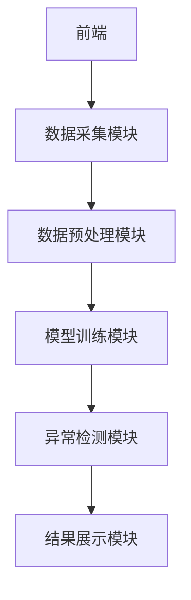
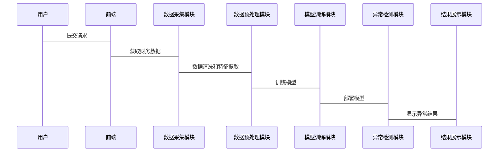

                 


# AI驱动的企业财务报表异常模式识别系统

> 关键词：AI, 财务报表, 异常模式识别, 深度学习, 机器学习, 自然语言处理, 数据挖掘

> 摘要：本文详细探讨了如何利用人工智能技术驱动企业财务报表异常模式识别系统的开发与应用。文章从背景、核心概念、算法原理、系统架构到项目实战，层层深入，结合理论与实践，为读者提供了全面的技术解析。

---

# 第一部分: AI驱动的企业财务报表异常模式识别系统概述

## 第1章: 财务报表异常模式识别的背景与挑战

### 1.1 问题背景

#### 1.1.1 企业财务报表的重要性
企业财务报表是反映企业财务状况、经营成果和现金流量的重要文件，是投资者、债权人和监管机构评估企业信用风险、投资价值和经营效率的关键依据。然而，财务报表中可能存在虚假信息、数据错误或异常交易，这些都需要通过专业的财务分析来识别和处理。

#### 1.1.2 财务报表异常模式的定义与分类
财务报表异常模式指的是在财务数据中出现的与正常情况不符的模式或趋势，可能包括收入突然下降、成本异常上升、应收账款大幅增加等。这些异常可能表明企业存在财务造假、经营不善或潜在的财务风险。

#### 1.1.3 传统财务报表分析的局限性
传统的财务报表分析主要依赖人工审查和经验判断，这种方法效率低下、耗时耗力，且容易受到主观因素的影响。此外，随着企业规模的扩大和数据量的增加，传统的分析方法难以应对海量数据的处理和复杂模式的识别。

### 1.2 问题描述

#### 1.2.1 异常模式识别的复杂性
财务报表异常模式的识别需要考虑多个因素，包括数据的多维性、时间序列的变化趋势以及上下文信息（如行业特点、企业规模等）。这些复杂性使得传统的统计方法难以有效识别异常。

#### 1.2.2 数据量与数据质量的挑战
企业的财务数据通常具有高维度、高噪声的特点，数据质量参差不齐，可能存在缺失值、异常值或数据格式不一致等问题。这些挑战使得数据预处理和特征提取成为系统设计的重要环节。

#### 1.2.3 传统方法与AI方法的对比
传统方法依赖人工经验和简单的统计分析，而AI方法（如深度学习和自然语言处理）能够从海量数据中自动提取特征并识别复杂模式，显著提高了异常检测的准确性和效率。

### 1.3 问题解决思路

#### 1.3.1 引入AI技术的必要性
AI技术能够处理海量数据，发现隐藏在数据中的复杂模式，从而帮助财务分析师快速识别潜在的财务异常。

#### 1.3.2 AI在财务报表分析中的优势
AI技术的优势包括高效率、高准确性、自动化处理以及能够发现非直观的异常模式。

#### 1.3.3 系统设计的目标与范围
系统设计的目标是构建一个能够自动识别财务报表异常模式的AI系统，范围包括数据采集、预处理、特征提取、模型训练和异常检测等环节。

### 1.4 系统的边界与外延

#### 1.4.1 系统的功能边界
系统主要关注财务数据的处理和分析，不包括企业的业务流程管理或其他非财务数据的处理。

#### 1.4.2 系统的适用范围
系统适用于需要进行财务风险评估和异常检测的企业、金融机构和监管机构。

#### 1.4.3 系统与其他系统的接口关系
系统需要与其他系统（如ERP系统、数据管理系统）进行数据交互，并能够输出分析结果供其他系统使用。

### 1.5 核心概念与组成

#### 1.5.1 系统的核心要素
- 数据源：包括财务报表数据、业务数据和外部数据。
- 数据处理模块：负责数据清洗、特征提取和数据增强。
- 异常检测模型：基于深度学习或机器学习算法，识别财务数据中的异常模式。
- 结果展示模块：将检测结果以可视化方式呈现，供用户分析和决策。

#### 1.5.2 系统的组成模块
1. 数据采集模块：负责从企业系统中获取财务数据。
2. 数据预处理模块：对数据进行清洗、标准化和特征提取。
3. 模型训练模块：训练异常检测模型。
4. 异常检测模块：对新数据进行异常识别。
5. 结果展示模块：以可视化形式展示异常结果。

#### 1.5.3 系统的核心流程
1. 数据采集与预处理。
2. 特征提取与模型训练。
3. 异常检测与结果分析。
4. 结果展示与决策支持。

---

## 第2章: AI驱动的财务报表异常模式识别的核心概念

### 2.1 数据预处理与特征提取

#### 2.1.1 数据清洗与标准化
数据清洗是去除噪声数据、处理缺失值和异常值的过程。标准化则是将数据转换为统一的格式，便于模型处理。

#### 2.1.2 特征选择与降维
特征选择是通过统计方法或模型评估选择重要特征，降维则是通过主成分分析等方法减少特征维度。

#### 2.1.3 文本数据的特征提取
对于财务报告中的文本数据，可以使用自然语言处理技术提取关键词和情感特征，作为模型的输入。

### 2.2 异常检测算法原理

#### 2.2.1 基于深度学习的异常检测
基于深度学习的异常检测方法（如LSTM和Transformer）能够捕捉时间序列数据中的复杂模式和长距离依赖关系。

#### 2.2.2 基于传统机器学习的异常检测
传统机器学习方法（如Isolation Forest和One-Class SVM）适用于低维数据，但对高维数据的处理能力有限。

#### 2.2.3 混合模型的优势与挑战
混合模型结合了深度学习和传统机器学习的优势，但在实际应用中可能面临计算复杂性和模型解释性的挑战。

### 2.3 系统设计与实现

#### 2.3.1 系统功能模块划分
系统划分为数据采集、数据预处理、模型训练、异常检测和结果展示五大模块。

#### 2.3.2 系统架构设计
系统采用微服务架构，各模块之间通过API进行通信，支持高可用性和可扩展性。

#### 2.3.3 系统实现的关键技术
- 数据采集：使用API从企业系统中获取财务数据。
- 数据预处理：利用Python的pandas库进行数据清洗和特征提取。
- 模型训练：基于深度学习框架（如TensorFlow或PyTorch）训练异常检测模型。

### 2.4 系统性能评估

#### 2.4.1 评估指标的定义
评估指标包括准确率、召回率、F1分数和AUC值。

#### 2.4.2 系统性能的优化
通过超参数调优、模型集成和数据增强等方法优化模型性能。

#### 2.4.3 系统的可扩展性与可维护性
系统设计注重模块化和松耦合，便于后续功能扩展和维护。

---

## 第3章: 算法原理与数学模型

### 3.1 异常检测算法原理

#### 3.1.1 基于深度学习的异常检测算法
- **LSTM模型**：通过长短期记忆网络捕捉时间序列数据中的长期依赖关系。
- **Transformer模型**：利用自注意力机制捕获数据中的全局关系。

#### 3.1.2 基于传统机器学习的异常检测算法
- **Isolation Forest**：通过随机选择特征和划分数据，隔离异常样本。
- **One-Class SVM**：用于学习正常样本的分布，识别异常样本。

#### 3.1.3 算法选择与优化
根据数据特点选择合适的算法，并通过交叉验证优化模型参数。

### 3.2 数学模型与公式

#### 3.2.1 异常检测的数学模型
异常检测模型的目标是最小化正常样本的误分类率，同时最大化异常样本的检测率。

#### 3.2.2 深度学习模型的数学推导
以LSTM为例，其损失函数可以表示为：
$$ L = -\frac{1}{N}\sum_{i=1}^{N}(y_i \log p(y_i) + (1 - y_i) \log (1 - p(y_i))) $$
其中，$y_i$是真实标签，$p(y_i)$是模型预测的概率。

#### 3.2.3 优化算法的数学表达
常用的优化算法包括Adam和SGD，其更新公式分别为：
$$ \theta_{t+1} = \theta_t - \eta \frac{\partial L}{\partial \theta_t} $$
其中，$\eta$是学习率。

### 3.3 算法实现与代码示例

#### 3.3.1 算法实现的步骤
1. 数据预处理：清洗和标准化数据。
2. 模型训练：选择合适的算法训练模型。
3. 模型评估：计算准确率、召回率等指标。
4. 模型部署：将模型集成到系统中，进行实时异常检测。

#### 3.3.2 Python代码实现
```python
import tensorflow as tf
from tensorflow.keras import layers

# 定义LSTM模型
def build_model(input_shape):
    model = tf.keras.Sequential()
    model.add(layers.LSTM(64, input_shape=input_shape))
    model.add(layers.Dense(1, activation='sigmoid'))
    model.compile(loss='binary_crossentropy', optimizer='adam', metrics=['accuracy'])
    return model

# 训练模型
model = build_model((timesteps, features))
model.fit(X_train, y_train, epochs=10, batch_size=32, validation_data=(X_test, y_test))
```

#### 3.3.3 算法的性能分析
通过实验对比不同算法的性能，选择最优模型进行部署。

---

## 第4章: 系统架构与设计

### 4.1 系统架构设计

#### 4.1.1 系统整体架构
系统采用微服务架构，主要包括前端、后端服务和数据存储三部分。

#### 4.1.2 模块划分与功能设计
- **数据采集模块**：负责从企业系统中获取财务数据。
- **数据预处理模块**：对数据进行清洗和特征提取。
- **模型训练模块**：训练异常检测模型。
- **异常检测模块**：对新数据进行异常识别。
- **结果展示模块**：以可视化形式展示异常结果。

#### 4.1.3 系统架构的优缺点
微服务架构具有高可用性和可扩展性，但可能存在服务间通信复杂和系统维护成本高的问题。

### 4.2 系统功能设计

#### 4.2.1 数据采集模块
- **功能**：通过API接口获取企业的财务数据。
- **技术选型**：使用Flask框架搭建API服务。

#### 4.2.2 数据预处理模块
- **功能**：清洗数据、提取特征。
- **技术选型**：使用Python的pandas库进行数据处理。

#### 4.2.3 模型训练模块
- **功能**：训练异常检测模型。
- **技术选型**：使用TensorFlow或PyTorch框架。

#### 4.2.4 异常检测模块
- **功能**：实时检测财务数据中的异常模式。
- **技术选型**：部署训练好的模型，进行实时预测。

#### 4.2.5 结果展示模块
- **功能**：以可视化方式展示异常结果。
- **技术选型**：使用Django或React框架搭建前端界面。

### 4.3 系统架构图（Mermaid）



### 4.4 系统交互图（Mermaid）



---

## 第5章: 项目实战

### 5.1 环境配置

#### 5.1.1 安装Python和相关库
- 安装Python 3.8及以上版本。
- 安装TensorFlow、Keras、pandas、numpy等库。

#### 5.1.2 安装框架和工具
- 安装Flask框架用于API开发。
- 安装Django或React框架用于前端开发。

### 5.2 系统核心实现

#### 5.2.1 数据采集与预处理
```python
import pandas as pd

# 数据采集
data = pd.read_csv('financial_data.csv')

# 数据预处理
data = data.dropna()
data = (data - data.mean()) / data.std()  # 标准化
```

#### 5.2.2 模型训练与部署
```python
import tensorflow as tf

# 构建模型
def build_model(input_shape):
    model = tf.keras.Sequential()
    model.add(layers.Dense(64, activation='relu', input_shape=input_shape))
    model.add(layers.Dense(1, activation='sigmoid'))
    model.compile(loss='binary_crossentropy', optimizer='adam', metrics=['accuracy'])
    return model

# 训练模型
model = build_model((input_shape,))
model.fit(X_train, y_train, epochs=10, batch_size=32, validation_data=(X_test, y_test))

# 保存模型
model.save('financial_anomaly_detection.h5')
```

#### 5.2.3 结果展示
```python
from tensorflow.keras.models import load_model

# 加载模型
model = load_model('financial_anomaly_detection.h5')

# 预测异常
predictions = model.predict(X_test)
```

### 5.3 实际案例分析

#### 5.3.1 数据来源
使用公开的财务数据集，如上市公司的财务报表数据。

#### 5.3.2 案例分析
通过模型预测，识别某公司在特定时期的财务异常情况，并分析其可能的原因。

#### 5.3.3 结果解读
解读模型的输出结果，判断哪些数据点是异常的，并分析这些异常可能对企业财务状况的影响。

### 5.4 项目小结

#### 5.4.1 项目总结
项目成功实现了基于AI的财务报表异常模式识别系统，验证了AI技术在财务分析中的应用价值。

#### 5.4.2 经验与教训
在项目实施过程中，需要注意数据质量、模型选择和系统架构设计等问题。

#### 5.4.3 项目意义
本项目为企业的财务风险管理提供了新的技术手段，有助于提高财务分析的效率和准确性。

---

## 第6章: 最佳实践与未来展望

### 6.1 最佳实践 tips

#### 6.1.1 数据处理
- 确保数据的完整性和准确性。
- 使用适当的数据增强技术提高模型的泛化能力。

#### 6.1.2 模型优化
- 通过交叉验证选择最优模型。
- 使用模型集成技术提高预测性能。

#### 6.1.3 系统维护
- 定期更新模型，适应数据分布的变化。
- 监控系统性能，及时发现和解决问题。

### 6.2 小结

#### 6.2.1 核心内容回顾
本文详细介绍了AI驱动的财务报表异常模式识别系统的开发与应用，涵盖背景、核心概念、算法原理、系统架构和项目实战。

#### 6.2.2 关键技术总结
- 数据预处理与特征提取。
- 基于深度学习的异常检测算法。
- 微服务架构设计与实现。

### 6.3 注意事项

#### 6.3.1 数据隐私与安全
在处理财务数据时，必须遵守相关法律法规，确保数据隐私和安全。

#### 6.3.2 模型解释性
在实际应用中，模型的解释性是用户关注的重要问题，需要通过可视化和可解释性算法提高模型的透明度。

#### 6.3.3 系统性能优化
通过优化算法和系统架构设计，提高系统的运行效率和响应速度。

### 6.4 未来展望

#### 6.4.1 技术发展趋势
- 深度学习模型的优化与创新。
- 多模态数据的融合与分析。
- 自动化机器学习（AutoML）的应用。

#### 6.4.2 应用场景扩展
- 更广泛地应用于金融、医疗、制造等行业的数据分析。
- 结合区块链技术，实现更加安全和透明的财务数据管理。

#### 6.4.3 人工智能与财务分析的结合
未来，随着AI技术的不断发展，财务分析将更加智能化和自动化，为企业创造更大的价值。

---

## 参考文献

1. LeCun, Y., Bengio, Y., & Hinton, G. (2015). Deep learning. Nature, 521(7555), 436-444.
2. Goodfellow, I., Bengio, Y., & Courville, A. (2016). Deep learning. MIT Press.
3. Hochreiter, S., & Schmidhuber, J. (1997). Long short-term memory. Neural computation, 9(8), 1735-1780.
4. Vaswani, A., et al. (2017). Attention is all you need. Advances in neural information processing systems, 30, 590-599.

---

通过本文的详细阐述，读者可以全面了解AI驱动的企业财务报表异常模式识别系统的开发与应用，掌握从理论到实践的全过程，并为未来的研究和实践提供有价值的参考。

