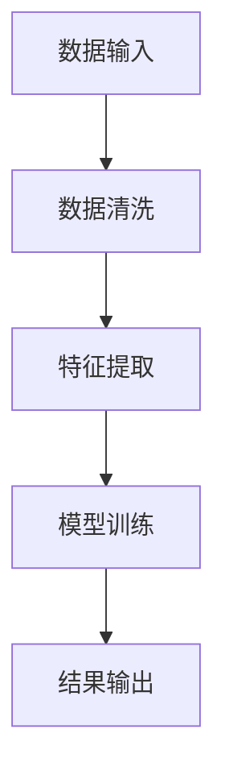
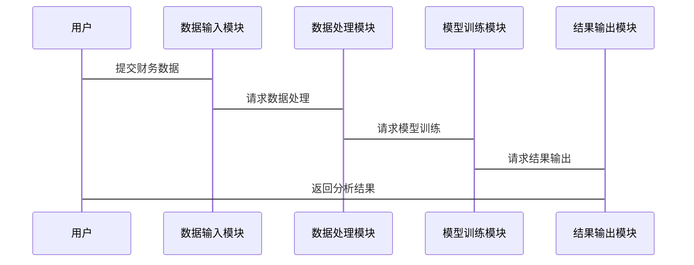

                 


# AI驱动的企业财务报表比较分析系统

> 关键词：AI驱动、财务报表分析、比较分析系统、企业财务、机器学习

> 摘要：随着人工智能技术的快速发展，企业财务报表分析正逐步从传统的人工分析模式向智能化、自动化方向转变。本文将深入探讨AI驱动的企业财务报表比较分析系统的构建与实现，从系统背景、核心概念、算法原理、系统架构到项目实战，全面解析如何利用AI技术提升财务报表分析的效率与准确性。

---

## 第1章：AI驱动的企业财务报表比较分析系统背景

### 1.1 问题背景与意义

#### 1.1.1 传统企业财务报表分析的局限性
传统的财务报表分析主要依赖于人工操作，包括数据录入、计算、对比和分析。这种方式存在以下问题：
- **效率低**：人工分析需要大量时间，尤其是在处理大量企业数据时。
- **准确性差**：人为错误难以避免，尤其是在复杂的财务数据处理中。
- **可扩展性有限**：人工分析难以快速应对大量企业的财务数据。

#### 1.1.2 AI技术在财务分析中的应用潜力
人工智能技术（AI）在财务分析中的应用，可以显著提升效率和准确性。AI技术能够快速处理大量数据，自动识别财务指标之间的关联性，并生成直观的分析结果。

#### 1.1.3 企业财务报表比较分析的重要性
财务报表比较分析是企业财务管理中的重要环节，通过对比不同企业或同一企业的不同期间的财务数据，可以揭示企业的财务健康状况、经营趋势和潜在问题。

### 1.2 问题描述与目标

#### 1.2.1 财务报表比较分析的核心问题
财务报表比较分析的核心问题是如何快速、准确地从大量财务数据中提取有用信息，并生成可读的分析结果。

#### 1.2.2 AI驱动的财务分析系统的建设目标
AI驱动的财务报表比较分析系统的建设目标是通过机器学习算法，实现对企业财务数据的自动分析、对比和预测，从而提高财务分析的效率和准确性。

#### 1.2.3 系统的边界与核心要素
系统的边界包括数据输入、数据处理、模型训练和结果输出。系统的核心要素包括：
- **数据源**：企业财务报表数据。
- **AI算法**：用于数据分析和预测的机器学习模型。
- **系统架构**：支持数据处理和模型运行的软件架构。

### 1.3 系统的核心要素与组成

#### 1.3.1 数据来源与处理
系统数据来源包括企业的资产负债表、利润表和现金流量表。数据处理包括数据清洗、标准化和特征提取。

#### 1.3.2 AI算法与模型
系统采用机器学习算法，如支持向量机（SVM）和随机森林（Random Forest），用于财务数据的分类和回归分析。

#### 1.3.3 系统架构与功能模块
系统架构包括数据输入模块、数据处理模块、模型训练模块和结果输出模块。

---

## 第2章：AI驱动的企业财务报表比较分析系统核心概念与联系

### 2.1 核心概念原理

#### 2.1.1 AI技术在财务分析中的应用原理
AI技术通过机器学习算法，从财务数据中提取特征，并利用这些特征进行分类和预测。

#### 2.1.2 财务报表比较分析的基本原理
财务报表比较分析通过对比不同企业的财务数据，识别企业的财务健康状况和经营趋势。

#### 2.1.3 系统的整体架构原理
系统整体架构包括数据输入、数据处理、模型训练和结果输出四个部分。

### 2.2 核心概念属性特征对比

```markdown
| 比较维度 | 传统财务分析 | AI驱动财务分析 |
|----------|--------------|----------------|
| 数据处理 | 离线、人工 | 实时、自动化 |
| 分析效率 | 低效 | 高效 |
| 准确性 | 易出错 | 高精度 |
| 可扩展性 | 有限 | 强 |
```

### 2.3 系统ER实体关系图

```mermaid
erDiagram
    actor 用户 {
        <属性> 用户ID : integer
        <属性> 用户名 : string
        <属性> 权限 : string
    }
    actor 系统管理员 {
        <属性> 管理员ID : integer
        <属性> 管理员名 : string
    }
    actor 数据源 {
        <属性> 数据源ID : integer
        <属性> 数据类型 : string
    }
    database 财务数据 {
        <属性> 数据ID : integer
        <属性> 财务指标 : string
        <属性> 时间戳 : timestamp
    }
    relation "使用" {
        用户 --> 财务数据 : "查询"
        系统管理员 --> 财务数据 : "管理"
        数据源 --> 财务数据 : "提供"
    }
```

---

## 第3章：AI驱动的企业财务报表比较分析系统算法原理

### 3.1 算法原理概述

#### 3.1.1 数据预处理
数据预处理包括数据清洗、标准化和特征提取。例如，使用Python中的`pandas`库进行数据清洗。

#### 3.1.2 特征提取
特征提取是从财务数据中提取有用的特征，例如，使用主成分分析（PCA）进行特征降维。

#### 3.1.3 模型训练
模型训练采用支持向量机（SVM）或随机森林（Random Forest）算法，进行分类和回归分析。

### 3.2 算法实现流程



### 3.3 算法数学模型

#### 3.3.1 支持向量机（SVM）
支持向量机的目标函数为：
$$ \min_{w,b,\xi} \frac{1}{2}||w||^2 + C\sum_{i=1}^n \xi_i $$
约束条件：
$$ y_i(w \cdot x_i + b) \geq 1 - \xi_i $$
$$ \xi_i \geq 0 $$

#### 3.3.2 随机森林（Random Forest）
随机森林的损失函数为：
$$ L = -\frac{1}{n}\sum_{i=1}^n y_i \log(p_i) + (1 - y_i)\log(1 - p_i) $$

---

## 第4章：AI驱动的企业财务报表比较分析系统分析与架构设计

### 4.1 系统分析

#### 4.1.1 项目背景
本项目旨在通过AI技术提升企业财务报表分析的效率和准确性。

#### 4.1.2 系统功能设计
系统功能包括数据输入、数据处理、模型训练和结果输出。

### 4.2 系统架构设计

#### 4.2.1 系统架构图


#### 4.2.2 系统接口设计
系统接口包括数据输入接口、模型训练接口和结果输出接口。

#### 4.2.3 系统交互流程图


---

## 第5章：AI驱动的企业财务报表比较分析系统项目实战

### 5.1 环境搭建

#### 5.1.1 安装Python环境
使用Anaconda安装Python 3.8及以上版本。

#### 5.1.2 安装依赖库
安装`pandas`、`scikit-learn`、`matplotlib`等依赖库。

### 5.2 系统核心实现

#### 5.2.1 数据预处理代码
```python
import pandas as pd

# 读取数据
data = pd.read_csv('financial_data.csv')

# 数据清洗
data = data.dropna()
data = data.drop_duplicates()

# 特征提取
from sklearn.preprocessing import StandardScaler
scaler = StandardScaler()
scaled_data = scaler.fit_transform(data)
```

#### 5.2.2 模型训练代码
```python
from sklearn.ensemble import RandomForestClassifier

model = RandomForestClassifier()
model.fit(scaled_data, labels)
```

### 5.3 实际案例分析

#### 5.3.1 数据分析结果
通过模型训练，可以得到企业的财务健康状况评估结果。

#### 5.3.2 案例解读
以某企业为例，分析其财务数据，生成财务健康状况报告。

### 5.4 项目小结
通过本项目，我们成功实现了AI驱动的企业财务报表比较分析系统，验证了系统的可行性和有效性。

---

## 第6章：总结与展望

### 6.1 系统总结
本系统通过AI技术实现了企业财务报表的自动分析和比较，显著提升了分析效率和准确性。

### 6.2 应用中的注意事项
在实际应用中，需要注意数据质量、模型选择和结果解释等问题。

### 6.3 未来展望
未来，可以进一步优化模型，引入更多AI技术，如深度学习和自然语言处理，提升系统的分析能力。

---

通过本文的详细讲解，我们全面分析了AI驱动的企业财务报表比较分析系统的构建与实现，从理论到实践，为读者提供了系统的知识和实践指导。

