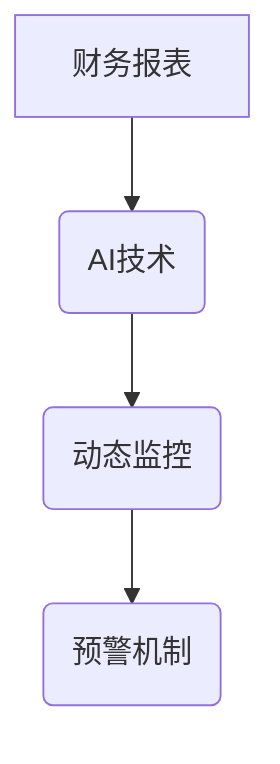
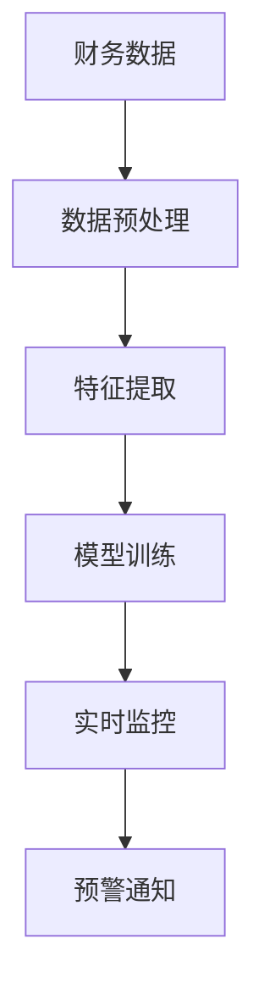
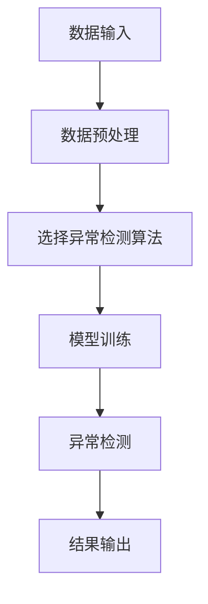
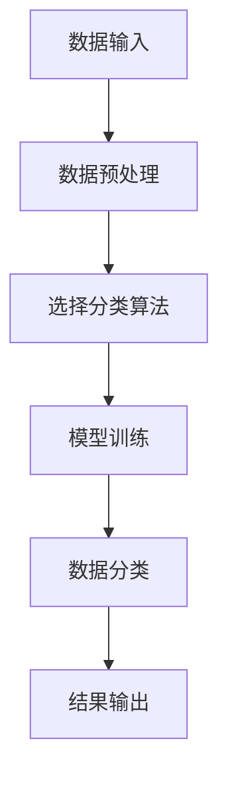
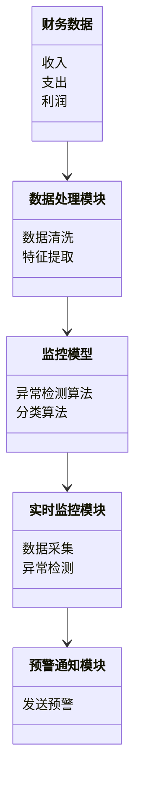
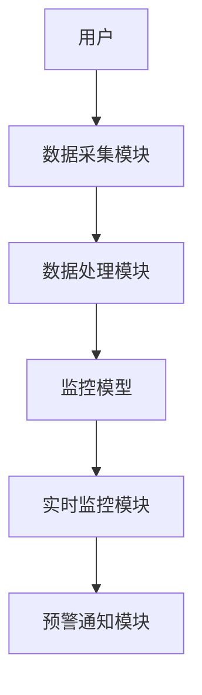
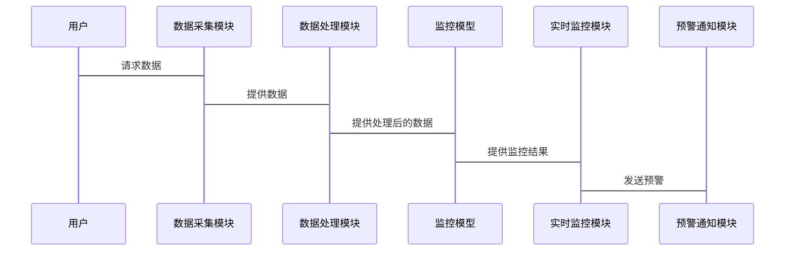

                 


# AI驱动的企业财务报表质量动态监控与预警系统

> 关键词：AI技术、财务报表、质量监控、动态预警、异常检测

> 摘要：本文详细探讨了如何利用人工智能技术构建企业财务报表质量的动态监控与预警系统。文章首先介绍了财务报表监控的重要性及其面临的挑战，然后深入分析了AI技术在财务报表监控中的应用前景。接着，详细讲解了基于AI的财务报表质量监控的核心概念、算法原理、系统架构设计及项目实战。通过实际案例分析，展示了该系统在企业财务管理中的应用价值，并提出了最佳实践建议。

---

## 第1章: 企业财务报表质量监控的背景与挑战

### 1.1 财务报表质量监控的重要性

#### 1.1.1 财务报表在企业管理中的核心地位
企业的财务报表是反映企业财务状况、经营成果和现金流量的重要文件，是企业管理层制定战略决策的重要依据。财务报表的质量直接影响到企业内部管理的透明度和外部投资者的信心。

#### 1.1.2 财务报表质量问题对企业的影响
财务报表质量问题可能引发企业决策失误、财务造假、法律风险等严重问题。例如，财务数据的不真实可能导致企业战略失误，甚至引发企业危机。

#### 1.1.3 传统财务报表监控的局限性
传统的财务报表监控主要依赖人工审核，存在效率低、成本高、主观性强、覆盖面窄等问题。面对海量的财务数据和复杂的业务场景，传统方法难以满足实时监控和动态预警的需求。

### 1.2 AI技术在财务报表监控中的应用前景

#### 1.2.1 AI技术的基本概念与特点
人工智能（AI）是指计算机模拟人类智能的技术，包括学习、推理、自我改进等功能。AI技术的特点是高效性、准确性、自动化和可扩展性。

#### 1.2.2 AI在财务领域的应用现状
目前，AI技术已在财务领域得到了广泛应用，例如财务预测、自动化记账、风险评估等。然而，财务报表的质量监控领域仍存在较大的改进空间。

#### 1.2.3 AI驱动财务报表监控的优势与潜力
AI技术能够快速处理大量数据，发现潜在的异常情况，提供实时监控和动态预警。通过机器学习算法，AI可以识别财务数据中的异常模式，从而提高财务报表质量监控的效率和准确性。

### 1.3 本章小结

#### 1.3.1 财务报表质量监控的核心问题
财务报表质量监控的核心问题是如何快速、准确地识别和预警财务数据中的异常情况。

#### 1.3.2 AI技术在其中的关键作用
AI技术通过自动化处理和智能分析，能够显著提升财务报表质量监控的效率和准确性。

#### 1.3.3 系统开发的目标与意义
开发AI驱动的财务报表质量监控系统，旨在实现对企业财务数据的实时监控和智能预警，帮助企业及时发现和纠正财务问题，提升财务管理水平。

---

## 第2章: 财务报表质量动态监控的核心概念

### 2.1 财务报表分析的关键维度

#### 2.1.1 财务报表的基本构成要素
财务报表主要包括资产负债表、利润表和现金流量表。这些报表反映了企业的财务状况、经营成果和现金流量。

#### 2.1.2 财务指标分析方法
常见的财务指标包括流动性比率、偿债能力比率、营运能力比率和盈利能力比率。通过这些指标的分析，可以评估企业的财务健康状况。

#### 2.1.3 异常数据的识别标准
异常数据是指与历史数据、行业标准或预期值显著偏离的财务数据。识别异常数据是财务报表质量监控的核心任务。

### 2.2 AI技术在财务报表分析中的应用

#### 2.2.1 机器学习在财务预测中的应用
机器学习算法可以用于预测企业的财务状况，例如预测企业是否可能违约。

#### 2.2.2 自然语言处理在财务文本分析中的应用
自然语言处理（NLP）技术可以用于分析财务报告中的文本内容，识别潜在的风险和异常情况。

#### 2.2.3 图神经网络在关联交易分析中的应用
图神经网络可以用于分析企业之间的关联交易，识别潜在的财务风险。

### 2.3 动态监控与预警机制的设计思路

#### 2.3.1 动态监控的基本概念
动态监控是指对财务数据进行实时分析，识别潜在的异常情况。

#### 2.3.2 预警机制的实现原理
预警机制通过设定阈值和规则，当财务数据触发预警条件时，系统会发出预警信号。

#### 2.3.3 动态监控与预警的系统架构
动态监控系统通常包括数据采集、数据处理、模型训练、实时监控和预警通知几个模块。

### 2.4 核心概念关系图

#### 2.4.1 财务报表、AI技术与动态监控的关系
以下用Mermaid绘制的概念关系图展示了财务报表、AI技术与动态监控的关系：



#### 2.4.2 用Mermaid绘制的概念结构图
以下是一个更详细的概念结构图：



---

## 第3章: 基于AI的财务报表质量监控算法原理

### 3.1 异常检测算法

#### 3.1.1 基于统计的异常检测方法
基于统计的异常检测方法通常使用均值、方差等统计量来识别异常数据点。

#### 3.1.2 基于机器学习的异常检测方法
基于机器学习的异常检测方法包括无监督学习算法（如Isolation Forest）和半监督学习算法（如One-Class SVM）。

#### 3.1.3 基于深度学习的异常检测方法
基于深度学习的异常检测方法包括使用自动编码器（Autoencoder）和生成对抗网络（GAN）等模型。

### 3.2 分类算法

#### 3.2.1 传统分类算法
传统的分类算法包括决策树、随机森林、逻辑回归等。

#### 3.2.2 支持向量机（SVM）在财务分类中的应用
支持向量机（SVM）是一种常用的分类算法，适用于高维数据的分类任务。

#### 3.2.3 神经网络在财务分类中的应用
神经网络是一种深度学习模型，适用于复杂的财务分类任务。

### 3.3 算法流程图

#### 3.3.1 异常检测算法的Mermaid流程图
以下是一个异常检测算法的Mermaid流程图：



#### 3.3.2 分类算法的Mermaid流程图
以下是一个分类算法的Mermaid流程图：



### 3.4 算法实现代码

#### 3.4.1 异常检测算法的Python代码
以下是一个使用Isolation Forest算法的异常检测代码示例：

```python
from sklearn.ensemble import IsolationForest

# 数据预处理
X = data[['收入', '支出', '利润']]

# 模型训练
iforest = IsolationForest(random_state=42)
iforest.fit(X)

# 预测异常点
y_pred = iforest.predict(X)
```

#### 3.4.2 分类算法的Python代码
以下是一个使用随机森林算法的分类代码示例：

```python
from sklearn.ensemble import RandomForestClassifier

# 数据预处理
X = data[['收入', '支出', '利润']]
y = data['分类标签']

# 模型训练
rf = RandomForestClassifier(random_state=42)
rf.fit(X, y)

# 预测分类结果
y_pred = rf.predict(X)
```

### 3.5 数学模型与公式

#### 3.5.1 异常检测的数学模型
异常检测的数学模型可以表示为：
$$ y = f(x) $$
其中，$x$ 是输入数据，$y$ 是输出标签（正常或异常）。

#### 3.5.2 分类算法的数学公式
分类算法的数学公式可以表示为：
$$ P(y|x) = \text{模型参数} $$

---

## 第4章: 系统分析与架构设计

### 4.1 问题场景介绍
本系统旨在实现对企业财务数据的实时监控和智能预警。系统需要处理大量的财务数据，并通过AI算法识别潜在的异常情况。

### 4.2 系统功能设计

#### 4.2.1 数据采集模块
数据采集模块负责从企业的财务系统中获取财务数据。

#### 4.2.2 数据处理模块
数据处理模块对采集到的财务数据进行预处理，包括数据清洗和特征提取。

#### 4.2.3 模型训练模块
模型训练模块负责训练异常检测和分类算法，生成监控模型。

#### 4.2.4 实时监控模块
实时监控模块对企业的财务数据进行实时分析，识别异常情况。

#### 4.2.5 预警通知模块
预警通知模块在检测到异常情况时，通过邮件或短信通知相关人员。

### 4.3 系统架构设计

#### 4.3.1 领域模型类图
以下是一个领域的模型类图：



#### 4.3.2 系统架构图
以下是一个系统的架构图：



### 4.4 系统接口设计

#### 4.4.1 数据接口
数据接口负责与企业的财务系统进行数据交互。

#### 4.4.2 API接口
API接口提供给其他系统或前端调用，返回监控结果。

### 4.5 系统交互序列图

#### 4.5.1 实时监控流程
以下是一个实时监控的交互序列图：



---

## 第5章: 项目实战

### 5.1 环境安装

#### 5.1.1 安装Python
安装Python 3.8及以上版本。

#### 5.1.2 安装依赖库
安装以下依赖库：
```bash
pip install numpy pandas scikit-learn
```

### 5.2 系统核心实现

#### 5.2.1 数据采集模块的实现
使用Python编写数据采集脚本：

```python
import pandas as pd

# 从数据库中采集数据
data = pd.read_sql_query("SELECT * FROM financial_data", connection)
```

#### 5.2.2 数据处理模块的实现
对采集到的数据进行预处理：

```python
# 数据清洗
data = data.dropna()
data = data.drop_duplicates()

# 特征提取
data['收入增长率'] = data['收入'].pct_change()
data['支出增长率'] = data['支出'].pct_change()
```

#### 5.2.3 模型训练模块的实现
训练异常检测模型：

```python
from sklearn.ensemble import IsolationForest

# 训练异常检测模型
iforest = IsolationForest(random_state=42)
iforest.fit(data[['收入', '支出', '利润']])

# 预测异常点
y_pred = iforest.predict(data[['收入', '支出', '利润']])
```

#### 5.2.4 实时监控模块的实现
实现实时监控功能：

```python
# 实时监控
new_data = pd.read_sql_query("SELECT * FROM financial_data", connection)
y_pred = iforest.predict(new_data[['收入', '支出', '利润']])

# 输出结果
print(y_pred)
```

#### 5.2.5 预警通知模块的实现
实现预警通知功能：

```python
import smtplib
from email.mime.text import MIMEText

# 发送邮件
msg = MIMEText("检测到异常情况，请及时处理。", 'plain', 'utf-8')
msg['Subject'] = '财务异常预警'
msg['From'] = 'admin@example.com'
msg['To'] = 'finance@example.com'

server = smtplib.SMTP('smtp.example.com', 25)
server.sendmail('admin@example.com', 'finance@example.com', msg.as_string())
server.quit()
```

### 5.3 代码解读与分析

#### 5.3.1 数据采集模块
数据采集模块负责从数据库中读取财务数据，并将其存储在Pandas DataFrame中。

#### 5.3.2 数据处理模块
数据处理模块对采集到的数据进行清洗和特征提取，为后续的模型训练做准备。

#### 5.3.3 模型训练模块
模型训练模块使用Isolation Forest算法训练异常检测模型，并对测试数据进行预测。

#### 5.3.4 实时监控模块
实时监控模块持续采集新的财务数据，并使用训练好的模型进行预测，输出异常检测结果。

#### 5.3.5 预警通知模块
预警通知模块在检测到异常情况时，通过邮件发送预警通知。

### 5.4 实际案例分析

#### 5.4.1 数据准备
准备企业的财务数据，包括收入、支出和利润等指标。

#### 5.4.2 模型训练
使用Isolation Forest算法训练异常检测模型。

#### 5.4.3 实时监控
持续采集企业的财务数据，使用训练好的模型进行异常检测。

#### 5.4.4 预警通知
当检测到异常情况时，系统自动发送预警通知。

### 5.5 项目小结

#### 5.5.1 项目实现的关键点
项目实现的关键点包括数据采集、数据处理、模型训练和实时监控。

#### 5.5.2 项目的实际应用价值
该系统能够帮助企业及时发现和纠正财务数据中的异常情况，提升财务管理水平。

#### 5.5.3 项目可能遇到的问题及解决方案
项目可能遇到的问题包括数据质量问题、模型训练时间长、预警通知延迟等。解决方案包括数据清洗、优化算法性能和使用更高效的通信方式。

---

## 第6章: 最佳实践与总结

### 6.1 最佳实践

#### 6.1.1 数据质量管理
确保数据的准确性和完整性是系统运行的基础。

#### 6.1.2 模型优化
通过不断优化模型参数和算法，提升系统的检测精度。

#### 6.1.3 系统维护
定期维护系统，确保系统的稳定性和安全性。

### 6.2 小结

#### 6.2.1 系统的核心功能
系统的核心功能包括数据采集、数据处理、模型训练、实时监控和预警通知。

#### 6.2.2 系统的优势
系统的优势在于高效性、准确性和实时性。

### 6.3 注意事项

#### 6.3.1 数据隐私保护
在处理财务数据时，必须注意数据的隐私保护，防止数据泄露。

#### 6.3.2 系统安全性
确保系统的安全性，防止黑客攻击和数据篡改。

### 6.4 拓展阅读

#### 6.4.1 推荐的书籍
推荐阅读《机器学习实战》和《深度学习》等书籍。

#### 6.4.2 推荐的学习资源
推荐学习Coursera上的《机器学习》课程和Kaggle上的相关数据集。

---

## 总结

本文详细探讨了AI驱动的企业财务报表质量动态监控与预警系统的设计与实现。通过结合AI技术与财务报表分析，系统能够实现对企业财务数据的实时监控和智能预警，帮助企业及时发现和纠正财务问题，提升财务管理水平。希望本文的内容能够为相关领域的研究和实践提供有价值的参考。

