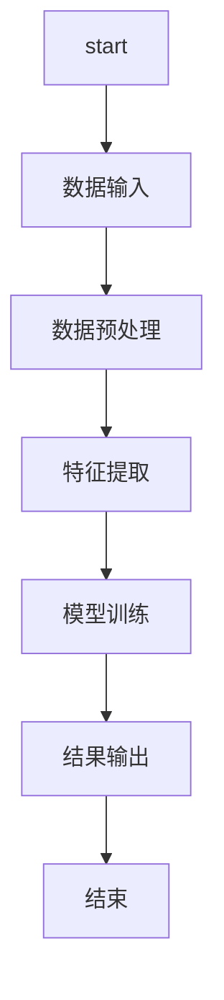
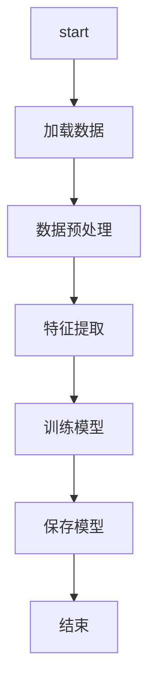
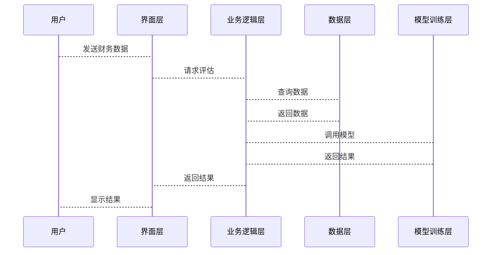

                 


# AI驱动的企业财务报表质量评估系统

> 关键词：AI驱动，财务报表，质量评估，机器学习，企业财务管理

> 摘要：本文探讨了如何利用人工智能技术提升企业财务报表质量评估的效率和准确性。通过分析AI在财务领域的应用现状，详细阐述了基于机器学习的财务报表质量评估系统的构建过程，包括算法原理、系统设计、项目实战等，为企业财务管理的智能化转型提供参考。

---

## 第一章：背景介绍

### 1.1 AI在企业财务中的应用现状
AI技术在企业财务领域的应用日益广泛，从自动化记账到智能审计，AI正在改变传统的财务管理方式。本文将重点探讨AI在财务报表质量评估中的应用。

#### 1.1.1 传统财务报表评估的局限性
传统财务报表评估依赖人工审核，存在效率低下、主观性强、易受人为干扰等问题。企业需要一种更高效、客观的评估方法。

#### 1.1.2 AI技术如何提升财务报表评估效率
AI技术能够快速处理大量数据，识别异常值，提高评估的准确性和效率。通过机器学习模型，可以预测财务数据的质量，辅助企业做出更明智的决策。

#### 1.1.3 企业对AI驱动财务系统的迫切需求
随着企业数据的快速增长，传统的财务评估方法已难以满足需求。AI驱动的财务系统能够实时分析数据，帮助企业在复杂的商业环境中保持竞争力。

### 1.2 财务报表质量评估的重要性
财务报表是企业经济活动的记录，其质量直接影响企业的信用评级、投资决策和风险管理。

#### 1.2.1 财务报表对企业决策的影响
准确的财务报表能够帮助管理层做出正确的战略决策，反之，则可能导致重大损失。

#### 1.2.2 财务报表质量对企业信用评级的作用
高质量的财务报表能够提升企业的信用评级，为企业获取资金支持提供有力保障。

#### 1.2.3 不良财务数据对企业的影响
虚假或错误的财务数据可能导致企业面临法律风险和信誉损失，甚至危及企业的生存。

### 1.3 AI驱动财务报表评估的优势
AI技术在财务报表评估中的应用，不仅提高了效率，还增强了结果的客观性和准确性。

#### 1.3.1 提高评估效率
AI能够快速处理大量数据，显著缩短评估时间。

#### 1.3.2 减少人为错误
机器学习模型能够自动识别异常值和潜在问题，降低人为判断的误差。

#### 1.3.3 实时数据分析能力
AI系统能够实时监控财务数据，及时发现并处理问题，提升企业的风险管理能力。

---

## 第二章：核心概念与联系

### 2.1 AI与财务报表评估的基本概念
本节将详细讲解AI在财务报表评估中的核心概念，包括数据预处理、特征提取和模型训练。

#### 2.1.1 数据预处理
数据预处理是AI系统中不可或缺的步骤，涉及数据清洗、标准化和特征工程。

##### 2.1.1.1 数据清洗
数据清洗是去除噪声数据，确保输入数据的质量。常用方法包括去除缺失值、处理异常值和标准化数据。

##### 2.1.1.2 特征工程
特征工程是通过选择和创建特征，提升模型的性能。例如，可以将销售额和成本合并为利润率作为新特征。

##### 2.1.1.3 数据标准化
数据标准化是将数据转换为统一尺度，通常使用归一化或标准化方法。

#### 2.1.2 特征提取
特征提取是从原始数据中提取有用的特征，常用方法包括主成分分析（PCA）和自动编码器。

#### 2.1.3 模型训练
模型训练是通过机器学习算法训练模型，常用算法包括随机森林、支持向量机（SVM）和神经网络。

### 2.2 系统架构的ER图
以下是系统架构的ER图，展示了系统的主要实体及其关系。

```mermaid
erDiagram
    customer[CUSTOMER] {
        +int id
        +string name
        +string email
    }
    transaction[TRANSACTION] {
        +int id
        +int amount
        +date date
    }
    CUSTOMER --> TRANSPORT: orders
```

### 2.3 系统流程的Mermaid图
以下是系统流程的Mermaid图，展示了从数据输入到结果输出的整个流程。



---

## 第三章：算法原理

### 3.1 机器学习算法的选择
在本系统中，我们选择了随机森林算法进行分类任务，使用均方误差（MSE）作为评估指标。

#### 3.1.1 随机森林算法
随机森林是一种基于决策树的集成学习算法，具有高准确性和良好的泛化能力。

##### 3.1.1.1 决策树的基本原理
决策树是一种树状结构，通过特征分裂将数据分成不同的子集，最终形成叶子节点的类别。

##### 3.1.1.2 随机森林的优势
随机森林通过构建多棵决策树并进行投票或平均，能够有效减少过拟合，提高模型的鲁棒性。

#### 3.1.2 模型训练流程
以下是模型训练的流程图：



#### 3.1.3 数学模型与公式
以下是随机森林算法的数学模型：

$$
\text{预测值} = \sum_{i=1}^{n} \text{树的预测值} \times \text{权重}
$$

其中，权重是根据每棵树的重要性确定的。

---

## 第四章：系统分析与架构设计

### 4.1 系统需求分析
本系统需要满足以下需求：
- 实时处理企业的财务数据。
- 提供高精度的财务报表质量评估结果。
- 提供友好的用户界面，方便用户操作。

### 4.2 系统功能设计
系统功能设计包括数据采集模块、预处理模块、模型训练模块和结果展示模块。

#### 4.2.1 数据采集模块
数据采集模块负责从数据库中获取企业的财务数据，支持多种数据格式的输入。

#### 4.2.2 数据预处理模块
数据预处理模块对采集到的数据进行清洗和标准化，确保数据质量。

#### 4.2.3 模型训练模块
模型训练模块使用随机森林算法对预处理后的数据进行训练，生成评估模型。

#### 4.2.4 结果展示模块
结果展示模块将评估结果以可视化的方式呈现，方便用户理解和分析。

### 4.3 系统架构设计
系统架构设计采用分层架构，包括数据层、业务逻辑层和表现层。

#### 4.3.1 数据层
数据层负责数据的存储和管理，使用关系型数据库进行存储。

#### 4.3.2 业务逻辑层
业务逻辑层负责处理用户的请求，调用模型进行评估，并将结果返回给表现层。

#### 4.3.3 表现层
表现层负责与用户交互，展示评估结果和系统状态。

### 4.4 系统接口设计
系统接口设计采用RESTful API，使用JSON格式进行数据交换。

### 4.5 系统交互的Mermaid图
以下是系统交互的Mermaid图：



---

## 第五章：项目实战

### 5.1 环境安装
项目实战部分首先需要安装必要的环境和工具，包括Python、Jupyter Notebook和相关库（如pandas、scikit-learn）。

### 5.2 数据集获取
从公开数据集获取企业的财务数据，清洗数据并提取特征。

### 5.3 代码实现
以下是系统的核心代码实现：

```python
import pandas as pd
from sklearn.ensemble import RandomForestClassifier
from sklearn.metrics import accuracy_score

# 加载数据
data = pd.read_csv('financial_data.csv')

# 数据预处理
data.dropna()
data = data[['revenue', 'profit', 'expenses']]

# 特征提取
X = data[['revenue', 'expenses']]
y = data['profit']

# 训练模型
model = RandomForestClassifier()
model.fit(X, y)

# 预测结果
y_pred = model.predict(X)
print(accuracy_score(y, y_pred))
```

### 5.4 结果分析
通过对实际案例的分析，评估系统的准确性和效率，验证系统的可行性。

---

## 第六章：系统测试与优化

### 6.1 系统测试
系统测试包括单元测试、集成测试和性能测试，确保系统的稳定性和高效性。

### 6.2 优化策略
根据测试结果，优化模型参数和系统架构，提高系统的准确性和效率。

---

## 第七章：最佳实践与小结

### 7.1 最佳实践
- 定期更新模型，保持系统的准确性。
- 提供数据可视化功能，帮助用户更好地理解结果。
- 建立完善的监控机制，及时发现和处理问题。

### 7.2 小结
本文详细介绍了AI驱动的企业财务报表质量评估系统的构建过程，从背景分析到系统设计，再到项目实战，为企业财务管理的智能化转型提供了参考。

### 7.3 注意事项
- 数据隐私和安全是系统设计中的重要考虑因素。
- 系统的可扩展性和可维护性需要在设计阶段充分考虑。

### 7.4 拓展阅读
- 《机器学习实战》
- 《深入浅出AI》
- 《企业财务管理数字化转型》

---

通过以上内容，我们全面介绍了AI驱动的企业财务报表质量评估系统的构建过程，从理论到实践，为企业的财务管理智能化提供了有力支持。

