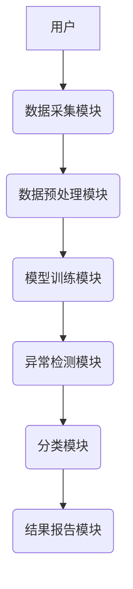
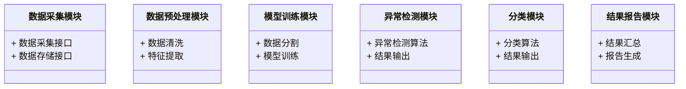

                 


# AI驱动的企业财务舞弊检测系统

## 关键词：AI，财务舞弊检测，异常检测，分类算法，系统架构，项目实战

## 摘要：  
本文详细探讨了AI技术在企业财务舞弊检测中的应用。首先，分析了传统财务舞弊检测方法的局限性，接着介绍了AI技术的核心优势。随后，深入讲解了AI驱动的财务舞弊检测系统的架构设计、算法原理，包括数据预处理、异常检测和分类算法等关键环节。通过实际项目案例，展示了如何利用Python和深度学习框架搭建AI驱动的财务舞弊检测系统，并详细分析了系统的实现过程和实际应用效果。最后，总结了最佳实践和未来研究方向。

---

## 第一部分：AI驱动的企业财务舞弊检测系统概述

### 第1章：企业财务舞弊检测的背景与挑战

#### 1.1 企业财务舞弊的背景
企业财务舞弊是指企业在财务报表或其他财务记录中故意提供虚假信息或隐瞒重要信息的行为。这种行为可能涉及虚增收入、虚减支出、隐瞒债务、虚假交易等，严重损害企业利益相关者的信任和利益。  
财务舞弊的常见类型包括：  
- **虚构收入**：通过虚构交易或虚增收入来夸大企业业绩。  
- **虚减支出**：通过少列支出或费用来虚增利润。  
- **关联交易舞弊**：通过关联方交易转移资产或利润。  
- **财务造假**：通过伪造会计凭证、篡改财务数据等方式制造虚假财务报表。  

#### 1.2 传统财务舞弊检测方法的局限性
传统的财务舞弊检测方法主要依赖人工审计和基于规则的检测方法，存在以下问题：  
- **效率低下**：人工审计需要大量时间，难以应对海量数据的处理。  
- **主观性较强**：审计人员的经验和判断会影响检测结果的准确性。  
- **规则有限**：基于规则的检测方法依赖于预定义的规则，难以发现新型舞弊行为。  

#### 1.3 AI技术在财务舞弊检测中的优势
AI技术通过大数据分析、模式识别和机器学习等方法，能够高效、准确地检测财务舞弊，具有以下优势：  
- **高效性**：AI能够快速处理大量数据，发现潜在的异常模式。  
- **准确性**：通过训练模型，AI能够识别复杂的舞弊模式，减少误判和漏判。  
- **自适应性**：AI模型能够根据新的数据不断优化，适应舞弊手段的变化。  

---

### 第2章：AI驱动的财务舞弊检测系统的核心概念

#### 2.1 系统核心概念
AI驱动的财务舞弊检测系统主要包括以下核心概念：  
- **数据预处理**：对原始数据进行清洗、归一化和特征提取，以便模型能够有效处理。  
- **异常检测**：通过机器学习算法识别数据中的异常模式，发现潜在的舞弊行为。  
- **分类算法**：基于历史数据训练分类模型，对新的数据进行分类，判断是否为舞弊行为。  

#### 2.2 核心概念与联系
以下是核心概念的联系与对比：

| 概念 | 描述 | 作用 |
|------|------|------|
| 数据预处理 | 对原始数据进行清洗、标准化和特征提取 | 提供高质量数据，确保模型准确性 |
| 异常检测 | 识别数据中的异常模式 | 发现潜在的舞弊行为 |
| 分类算法 | 基于历史数据训练模型，对新数据进行分类 | 判断数据是否为舞弊 |

---

## 第二部分：AI驱动的财务舞弊检测算法原理

### 第3章：异常检测算法

#### 3.1 基于聚类的异常检测
基于聚类的异常检测算法通过将数据点聚类，发现与大多数数据点不同的群落或孤立点。  
- **算法步骤**：  
  1. 数据预处理：归一化数据并提取特征。  
  2. 聚类：使用K-Means等算法将数据分成多个簇。  
  3. 异常检测：分析每个簇的密度，找出密度较低的簇中的数据点作为异常。  

- **示例代码**：  
  ```python
  from sklearn.cluster import KMeans
  import numpy as np

  # 假设X为数据矩阵
  kmeans = KMeans(n_clusters=2).fit(X)
  # 预测簇标签
  cluster_labels = kmeans.labels_
  # 计算每个簇的密度
  cluster_centers = kmeans.cluster_centers_
  # 找出密度较低的簇中的异常点
  anomalies = np.where(cluster_labels == np.argmin(np.sum((X - cluster_centers[:, np.newaxis])**2, axis=0)))[0]
  ```

#### 3.2 基于深度学习的异常检测
基于深度学习的异常检测算法通过训练自动编码器（Autoencoder）来学习数据的正常模式，并识别异常数据。  
- **算法步骤**：  
  1. 数据预处理：归一化数据并提取特征。  
  2. 模型训练：训练自动编码器，使其能够重构正常数据。  
  3. 异常检测：计算重构误差，误差较大的数据点为异常。  

- **示例代码**：  
  ```python
  import tensorflow as tf
  from tensorflow.keras import layers

  # 构建自动编码器模型
  input_dim = X.shape[1]
  encoder_dim = 64
  decoder_dim = input_dim

  encoder = layers.Dense(encoder_dim, activation='relu')(input_layer)
  decoder = layers.Dense(decoder_dim, activation='sigmoid')(encoder)
  autoencoder = Model(inputs=input_layer, outputs=decoder)

  # 编译模型
  autoencoder.compile(optimizer='adam', loss='binary_crossentropy')
  # 训练模型
  autoencoder.fit(X, X, epochs=100, batch_size=32)
  # 预测重构误差
  reconstructed = autoencoder.predict(X)
  errors = np.mean(np.abs(reconstructed - X), axis=1)
  anomalies = np.where(errors > 0.5)[0]
  ```

### 第4章：分类算法

#### 4.1 基于决策树的分类算法
决策树是一种基于树状结构的分类算法，能够通过特征选择和分割数据来识别舞弊行为。  
- **算法步骤**：  
  1. 数据预处理：归一化数据并提取特征。  
  2. 特征选择：选择对分类最重要的特征。  
  3. 模型训练：训练决策树模型。  
  4. 分类预测：对新数据进行分类，判断是否为舞弊行为。  

- **示例代码**：  
  ```python
  from sklearn.tree import DecisionTreeClassifier

  # 训练决策树模型
  clf = DecisionTreeClassifier(max_depth=5)
  clf.fit(X_train, y_train)
  # 预测分类结果
  y_pred = clf.predict(X_test)
  ```

#### 4.2 基于支持向量机的分类算法
支持向量机（SVM）是一种高效的分类算法，能够通过构建超平面将数据点分为两类。  
- **算法步骤**：  
  1. 数据预处理：归一化数据并提取特征。  
  2. 特征选择：选择对分类最重要的特征。  
  3. 模型训练：训练SVM模型。  
  4. 分类预测：对新数据进行分类，判断是否为舞弊行为。  

- **示例代码**：  
  ```python
  from sklearn import svm

  # 训练SVM模型
  clf = svm.SVC(kernel='linear', C=1)
  clf.fit(X_train, y_train)
  # 预测分类结果
  y_pred = clf.predict(X_test)
  ```

---

## 第三部分：系统分析与架构设计

### 第5章：系统架构与设计

#### 5.1 系统架构设计
以下是AI驱动的财务舞弊检测系统的架构图：



#### 5.2 系统功能设计
以下是系统的功能模块划分：



---

## 第四部分：项目实战与代码实现

### 第6章：项目实战

#### 6.1 环境搭建
- **Python版本**：建议使用Python 3.8及以上版本。  
- **依赖库安装**：  
  ```bash
  pip install numpy pandas scikit-learn tensorflow keras matplotlib
  ```

#### 6.2 核心代码实现
以下是AI驱动的财务舞弊检测系统的核心代码实现：

```python
import numpy as np
import pandas as pd
from sklearn.model_selection import train_test_split
from sklearn.preprocessing import StandardScaler
from sklearn.tree import DecisionTreeClassifier
from tensorflow.keras import layers
from tensorflow.keras.models import Model

# 数据加载
data = pd.read_csv('financial_data.csv')
X = data.drop('label', axis=1).values
y = data['label'].values

# 数据分割
X_train, X_test, y_train, y_test = train_test_split(X, y, test_size=0.2, random_state=42)

# 数据标准化
scaler = StandardScaler()
X_train_scaled = scaler.fit_transform(X_train)
X_test_scaled = scaler.transform(X_test)

# 构建决策树分类模型
dt_clf = DecisionTreeClassifier(max_depth=5)
dt_clf.fit(X_train_scaled, y_train)
dt_accuracy = dt_clf.score(X_test_scaled, y_test)
print(f"决策树分类准确率: {dt_accuracy}")

# 构建自动编码器模型
input_layer = layers.Input(shape=(X.shape[1],))
encoder = layers.Dense(64, activation='relu')(input_layer)
decoder = layers.Dense(X.shape[1], activation='sigmoid')(encoder)
autoencoder = Model(inputs=input_layer, outputs=decoder)
autoencoder.compile(optimizer='adam', loss='binary_crossentropy')
autoencoder.fit(X_train_scaled, X_train_scaled, epochs=100, batch_size=32)
reconstructed = autoencoder.predict(X_test_scaled)
errors = np.mean(np.abs(reconstructed - X_test_scaled), axis=1)
anomalies = np.where(errors > 0.5)[0]
print(f"自动编码器检测到的异常点数量: {len(anomalies)}")
```

---

## 第五部分：总结与展望

### 第7章：总结与展望

#### 7.1 最佳实践
- **数据质量**：确保数据的完整性和准确性，减少噪声对模型的影响。  
- **模型调优**：通过参数调整和模型优化，提高检测准确率。  
- **系统维护**：定期更新模型和数据，适应新的舞弊手段。  

#### 7.2 未来展望
随着AI技术的不断发展，财务舞弊检测系统将更加智能化和高效化。未来的研究方向包括：  
- **多模态数据融合**：结合文本、图像等多模态数据，提高检测精度。  
- **联邦学习**：通过联邦学习技术，在保护数据隐私的前提下，实现跨机构的联合检测。  
- **实时检测**：开发实时检测系统，快速发现和应对舞弊行为。  

---

## 附录：代码与资源

### 附录A：完整代码示例
```python
# 完整代码示例，包含数据加载、预处理、模型训练和结果输出
import numpy as np
import pandas as pd
from sklearn.model_selection import train_test_split
from sklearn.preprocessing import StandardScaler
from sklearn.tree import DecisionTreeClassifier
from tensorflow.keras import layers
from tensorflow.keras.models import Model

# 数据加载
data = pd.read_csv('financial_data.csv')
X = data.drop('label', axis=1).values
y = data['label'].values

# 数据分割
X_train, X_test, y_train, y_test = train_test_split(X, y, test_size=0.2, random_state=42)

# 数据标准化
scaler = StandardScaler()
X_train_scaled = scaler.fit_transform(X_train)
X_test_scaled = scaler.transform(X_test)

# 构建决策树分类模型
dt_clf = DecisionTreeClassifier(max_depth=5)
dt_clf.fit(X_train_scaled, y_train)
dt_accuracy = dt_clf.score(X_test_scaled, y_test)
print(f"决策树分类准确率: {dt_accuracy}")

# 构建自动编码器模型
input_layer = layers.Input(shape=(X.shape[1],))
encoder = layers.Dense(64, activation='relu')(input_layer)
decoder = layers.Dense(X.shape[1], activation='sigmoid')(encoder)
autoencoder = Model(inputs=input_layer, outputs=decoder)
autoencoder.compile(optimizer='adam', loss='binary_crossentropy')
autoencoder.fit(X_train_scaled, X_train_scaled, epochs=100, batch_size=32)
reconstructed = autoencoder.predict(X_test_scaled)
errors = np.mean(np.abs(reconstructed - X_test_scaled), axis=1)
anomalies = np.where(errors > 0.5)[0]
print(f"自动编码器检测到的异常点数量: {len(anomalies)}")
```

### 附录B：资源与工具
- **数据集**：公开可用的财务数据集（如Kaggle平台）。  
- **工具库**：scikit-learn、TensorFlow、Pandas。  
- **学习资料**：推荐学习《机器学习实战》和《深度学习》等书籍。  

---

通过本文的详细讲解，读者可以深入了解AI驱动的企业财务舞弊检测系统的原理和实现方法，并能够通过实际代码实现一个简单的系统。希望本文能够为相关领域的研究和实践提供有价值的参考。

