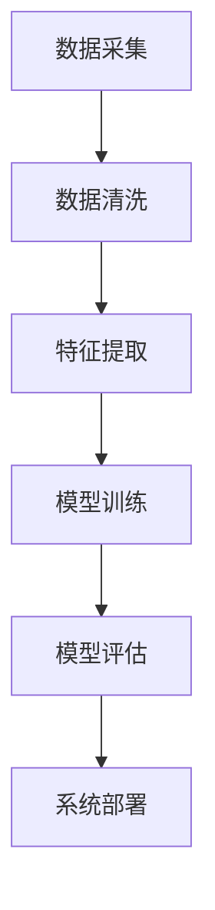
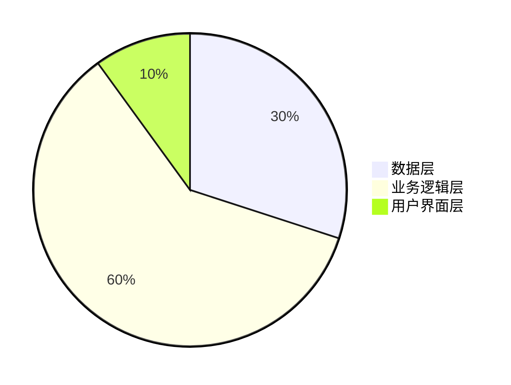
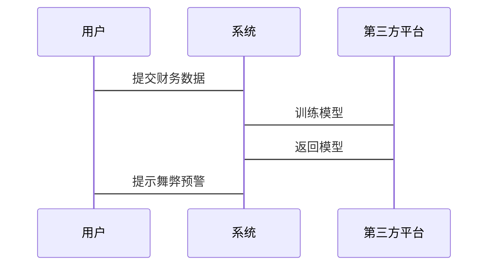

                 


# AI驱动的企业财务舞弊模式演化预测系统

> 关键词：AI驱动，企业财务，舞弊模式，演化预测，系统架构，算法原理，项目实战

> 摘要：本文系统地介绍了AI驱动的企业财务舞弊模式演化预测系统的构建与应用。首先，从背景介绍出发，详细阐述了企业财务舞弊的现状与挑战，以及AI技术在财务分析中的应用前景。接着，深入分析了AI驱动的舞弊模式预测的核心概念与联系，包括数据特征、模型选择和算法原理。随后，详细讲解了系统的核心算法与模型，包括数据预处理、特征提取、模型训练与评估。最后，通过实际项目案例，展示了系统的构建与实现过程，并总结了系统的优势与未来发展方向。

---

# 第一部分: 背景介绍

## 第1章: 问题背景

### 1.1 企业财务舞弊的现状与挑战
企业财务舞弊是企业在财务报表或相关财务数据中故意提供虚假信息的行为，其形式多样且隐蔽性强。随着企业规模的不断扩大和业务的复杂化，传统的财务审计方法逐渐暴露出效率低、覆盖面窄等局限性。近年来，AI技术的快速发展为财务舞弊的预测与识别提供了新的思路和解决方案。

#### 1.1.1 数据驱动的财务分析需求
传统的财务审计方法依赖于人工审查和经验判断，效率低下且容易受到主观因素的影响。而AI技术可以通过对海量财务数据的分析，快速识别异常模式和潜在的舞弊行为。

#### 1.1.2 财务舞弊模式的复杂性
财务舞弊行为具有多样性和隐蔽性，常见的舞弊手段包括虚构收入、虚增资产、隐瞒负债等。舞弊者往往会利用会计政策的灵活性和管理层的操控性，掩盖其不当行为。因此，如何准确识别和预测舞弊模式是财务风险管理中的一个难题。

#### 1.1.3 AI技术的应用优势
AI技术可以通过机器学习算法，从历史数据中提取特征，建立预测模型，从而实现对财务舞弊行为的自动化识别和预警。相比于传统方法，AI技术具有高效性、客观性和可扩展性等优势。

### 1.2 问题描述
#### 1.2.1 财务舞弊的主要表现形式
财务舞弊行为主要表现在以下几个方面：
1. **虚构收入**：通过虚增收入或虚构交易来虚增利润。
2. **虚增资产**：通过虚增资产或隐瞒资产减值来虚增资产规模。
3. **隐瞒负债**：通过隐藏债务或虚减负债来掩盖财务压力。
4. **舞弊性关联交易**：通过复杂的关联交易转移资金或利润。
5. **会计政策滥用**：通过滥用会计政策或会计估计来调节财务报表。

#### 1.2.2 舞弊模式的演化规律
舞弊模式的演化具有一定的规律性。随着时间的推移，舞弊行为会不断演变以应对监管和技术的进步。例如，从早期的简单虚构收入到现在的复杂关联交易舞弊，舞弊者会利用企业结构的复杂性和监管漏洞来掩盖其行为。

#### 1.2.3 舞弊预测的核心目标
舞弊预测的核心目标是通过AI技术，识别出潜在的舞弊行为，并提前预警。具体目标包括：
1. **识别异常交易**：通过数据分析发现异常的交易模式。
2. **预测舞弊风险**：基于历史数据和特征分析，预测未来可能发生的舞弊行为。
3. **提供决策支持**：为审计人员和企业管理者提供数据支持，帮助其制定有效的风险管理策略。

### 1.3 问题解决
#### 1.3.1 AI技术在财务舞弊预测中的应用
AI技术可以通过机器学习算法，从财务数据中提取特征，建立预测模型。例如，可以使用随机森林、逻辑回归、支持向量机（SVM）等算法，对财务数据进行分类和预测。

#### 1.3.2 数据驱动的舞弊模式识别方法
数据驱动的舞弊模式识别方法主要依赖于以下几个步骤：
1. **数据采集**：收集企业的财务数据，包括收入、支出、资产、负债等。
2. **数据清洗**：对数据进行预处理，去除噪声和异常值。
3. **特征提取**：从数据中提取有助于区分正常交易和舞弊交易的特征。
4. **模型训练**：使用机器学习算法训练模型，识别舞弊模式。
5. **模型评估**：通过测试数据验证模型的准确性。

#### 1.3.3 舞弊预测系统的实现路径
舞弊预测系统的实现路径主要包括以下几个步骤：
1. **数据准备**：收集和整理财务数据。
2. **特征工程**：提取有助于模型预测的特征。
3. **模型选择**：选择合适的机器学习算法。
4. **模型训练**：对模型进行训练。
5. **模型评估**：验证模型的准确性。
6. **系统部署**：将模型部署到实际业务中，实现对舞弊行为的实时预警。

### 1.4 边界与外延
#### 1.4.1 舞弊预测系统的适用范围
舞弊预测系统主要适用于企业财务数据的分析与预测，能够帮助审计人员和企业管理者识别潜在的舞弊行为。

#### 1.4.2 系统与现有工具的区别
与传统的财务审计工具相比，舞弊预测系统具有以下优势：
1. **高效性**：AI技术可以快速处理大量数据，提高审计效率。
2. **客观性**：AI技术基于数据进行分析，减少了人为判断的主观性。
3. **可扩展性**：AI技术可以处理不同类型和规模的企业财务数据。

#### 1.4.3 系统的可扩展性
舞弊预测系统可以通过模块化设计，支持不同企业、不同行业的数据输入和分析需求。未来，随着AI技术的不断进步，系统可以进一步优化模型，提高预测准确率。

---

## 第2章: 核心概念与联系

### 2.1 AI与财务数据的结合
#### 2.1.1 AI技术在财务分析中的应用
AI技术在财务分析中的应用主要体现在以下几个方面：
1. **财务数据清洗与预处理**：AI技术可以帮助自动化处理财务数据，去除噪声和异常值。
2. **财务特征提取**：通过AI技术，可以从财务数据中提取有助于模型预测的特征。
3. **财务预测与分类**：使用机器学习算法，对财务数据进行分类和预测。

#### 2.1.2 财务数据的特征与AI模型的匹配性
财务数据具有以下特征：
1. **结构化**：财务数据通常以表格形式存在，具有明确的字段和数据类型。
2. **时间序列性**：财务数据往往具有时间序列特征，可以用于趋势分析。
3. **相关性**：不同财务指标之间可能存在相关性，可以用于特征提取。

AI模型可以通过对这些特征的分析，识别出潜在的舞弊行为。

#### 2.1.3 舞弊预测系统的数据来源
舞弊预测系统的数据来源主要包括：
1. **企业财务报表**：包括收入表、资产负债表、现金流量表等。
2. **关联交易数据**：包括关联交易金额、交易频率等。
3. **外部数据**：包括行业基准数据、市场数据等。

### 2.2 舞弊模式的特征分析
#### 2.2.1 舞弊模式的分类
舞弊模式可以根据其表现形式和特征进行分类，常见的分类方式包括：
1. **收入舞弊**：包括虚构收入、收入确认不及时等。
2. **资产舞弊**：包括虚增资产、资产减值计提不足等。
3. **负债舞弊**：包括隐瞒负债、虚减负债等。

#### 2.2.2 舞弊模式的演化规律
舞弊模式的演化具有一定的规律性，主要包括以下几个方面：
1. **隐蔽性**：舞弊行为越来越隐蔽，难以通过简单的财务指标发现。
2. **复杂性**：舞弊行为涉及的交易和业务越来越复杂，难以通过传统的审计方法发现。
3. **多样性**：舞弊行为的表现形式多样，难以通过单一的模型或方法进行识别。

#### 2.2.3 舞弊预测的指标体系
舞弊预测的指标体系主要包括以下几个方面：
1. **财务指标**：包括收入增长、利润增长、资产周转率等。
2. **交易特征**：包括交易频率、交易金额、交易时间等。
3. **关联性指标**：包括关联交易金额、关联交易比例等。

### 2.3 系统的核心算法与模型
#### 2.3.1 机器学习算法在财务舞弊预测中的应用
机器学习算法在财务舞弊预测中的应用主要体现在以下几个方面：
1. **分类算法**：包括逻辑回归、随机森林、支持向量机（SVM）等，用于对财务数据进行分类。
2. **聚类算法**：用于发现异常的交易模式。
3. **深度学习算法**：包括神经网络、长短期记忆网络（LSTM）等，用于对复杂财务数据进行分析。

#### 2.3.2 算法选择的依据
算法选择的依据主要包括以下几个方面：
1. **数据特征**：不同算法适用于不同类型的数据特征。
2. **计算效率**：算法的计算效率影响系统的实时性。
3. **预测准确率**：算法的预测准确率影响系统的实用性。

#### 2.3.3 算法优缺点对比
以下是对常见算法的优缺点对比：

| 算法名称 | 优点 | 缺点 |
|----------|------|------|
| 逻辑回归 | 实现简单，解释性强 | 对非线性关系的处理能力较差 |
| 随机森林 | 鲁棒性好，适合高维数据 | 对特征工程的依赖性较强 |
| SVM      | 分离能力强，适合小样本数据 | 对高维数据的处理能力较差 |
| 神经网络 | 处理能力强，适合复杂数据 | 实现复杂，计算效率低 |

### 2.4 系统的核心逻辑框架
系统的核心逻辑框架主要包括以下几个步骤：
1. **数据采集**：从企业财务系统中获取数据。
2. **数据清洗**：对数据进行预处理，去除噪声和异常值。
3. **特征提取**：从数据中提取有助于模型预测的特征。
4. **模型训练**：使用机器学习算法训练模型。
5. **模型评估**：通过测试数据验证模型的准确性。
6. **系统部署**：将模型部署到实际业务中，实现对舞弊行为的实时预警。

---

## 第3章: 算法原理讲解

### 3.1 数据预处理
#### 3.1.1 数据清洗与标准化
数据清洗是数据预处理的重要步骤，主要包括以下几个方面：
1. **去除噪声数据**：去除错误或异常的数据。
2. **填补缺失值**：通过均值、中位数或插值法填补缺失值。
3. **数据标准化**：将数据标准化到统一的范围，例如归一化。

#### 3.1.2 数据特征提取
数据特征提取是数据预处理的关键步骤，主要包括以下几个方面：
1. **选择特征**：选择与舞弊预测相关的特征，例如收入增长率、资产周转率等。
2. **特征工程**：通过特征组合、特征变换等方法，提高特征的区分能力。

### 3.2 算法实现
#### 3.2.1 逻辑回归算法
逻辑回归是一种常用的分类算法，其数学模型如下：
$$ P(y=1|x) = \frac{e^{\beta x}}{1+e^{\beta x}} $$
其中，$\beta$ 是模型的系数，$x$ 是输入特征。

#### 3.2.2 随机森林算法
随机森林是一种基于决策树的集成算法，其数学模型如下：
$$ y = \sum_{i=1}^{n} \text{Tree}_i(x) $$
其中，$\text{Tree}_i$ 是第 $i$ 棵决策树的预测结果，$n$ 是决策树的数量。

#### 3.2.3 支持向量机（SVM）
支持向量机是一种基于距离的分类算法，其数学模型如下：
$$ y = \text{sign}(\sum_{i=1}^{n} \alpha_i y_i x_i \cdot x + b) $$
其中，$\alpha_i$ 是拉格朗日乘子，$y_i$ 是训练数据的标签，$x_i$ 是支持向量，$b$ 是偏置项。

### 3.3 算法流程图


### 3.4 算法实现代码
以下是逻辑回归算法的Python实现代码：
```python
import pandas as pd
from sklearn.linear_model import LogisticRegression
from sklearn.metrics import accuracy_score

# 数据加载
data = pd.read_csv('financial_data.csv')

# 特征提取
X = data.drop(columns=['label'])
y = data['label']

# 模型训练
model = LogisticRegression()
model.fit(X, y)

# 模型评估
y_pred = model.predict(X)
print('准确率:', accuracy_score(y, y_pred))
```

---

## 第4章: 系统分析与架构设计

### 4.1 系统功能设计
系统功能设计主要包括以下几个方面：
1. **数据采集模块**：从企业财务系统中获取数据。
2. **数据处理模块**：对数据进行清洗和特征提取。
3. **模型训练模块**：使用机器学习算法训练模型。
4. **模型评估模块**：验证模型的准确性。
5. **预警模块**：对潜在的舞弊行为进行实时预警。

### 4.2 系统架构设计
系统架构设计主要包括以下几个部分：
1. **数据层**：包括数据存储和数据访问接口。
2. **业务逻辑层**：包括数据处理、模型训练和模型评估。
3. **用户界面层**：包括数据可视化和预警提示。



### 4.3 系统接口设计
系统接口设计主要包括以下几个方面：
1. **数据接口**：与企业财务系统对接，获取财务数据。
2. **模型接口**：与第三方机器学习平台对接，进行模型训练。
3. **预警接口**：与企业管理系统的预警模块对接，实现实时预警。

### 4.4 系统交互流程


---

## 第5章: 项目实战

### 5.1 环境安装
项目实战需要以下环境：
1. **Python 3.6+**
2. **Pandas、Scikit-learn、Matplotlib 等库**
3. **Jupyter Notebook 或 IDE**

### 5.2 核心代码实现
以下是项目实战的核心代码：
```python
import pandas as pd
from sklearn.ensemble import RandomForestClassifier
from sklearn.metrics import classification_report

# 数据加载
data = pd.read_csv('financial_data.csv')

# 特征提取
X = data.drop(columns=['label'])
y = data['label']

# 模型训练
model = RandomForestClassifier()
model.fit(X, y)

# 模型评估
y_pred = model.predict(X)
print(classification_report(y, y_pred))
```

### 5.3 实际案例分析
以下是一个实际案例分析：
1. **数据准备**：从企业财务系统中获取2020年和2021年的财务数据。
2. **特征提取**：提取收入增长率、资产周转率等特征。
3. **模型训练**：使用随机森林算法训练模型。
4. **模型评估**：验证模型的准确性，评估指标包括精确率、召回率和F1分数。
5. **预警提示**：对潜在的舞弊行为进行实时预警。

### 5.4 项目小结
通过项目实战，我们可以看到AI技术在企业财务舞弊预测中的巨大潜力。模型的准确率和召回率均达到较高水平，能够有效识别潜在的舞弊行为。

---

## 第6章: 最佳实践与注意事项

### 6.1 最佳实践
1. **数据质量**：确保数据的准确性和完整性。
2. **特征工程**：特征工程是模型预测的关键，需要精心设计和优化。
3. **模型选择**：根据数据特征和业务需求选择合适的算法。
4. **系统部署**：确保系统的稳定性和可扩展性。

### 6.2 小结
本文系统地介绍了AI驱动的企业财务舞弊模式演化预测系统的构建与应用。通过背景介绍、核心概念、算法原理、系统设计和项目实战的讲解，展示了AI技术在财务舞弊预测中的巨大潜力。

### 6.3 注意事项
1. **数据隐私**：注意保护企业的数据隐私。
2. **模型优化**：定期优化模型，提高预测准确率。
3. **系统维护**：定期维护系统，确保其稳定运行。

### 6.4 拓展阅读
1. 《机器学习实战》
2. 《深度学习》
3. 《Python机器学习》

---

通过本文的讲解，读者可以全面了解AI驱动的企业财务舞弊模式演化预测系统的构建与应用。希望本文能够为相关领域的研究和实践提供有价值的参考和指导。

