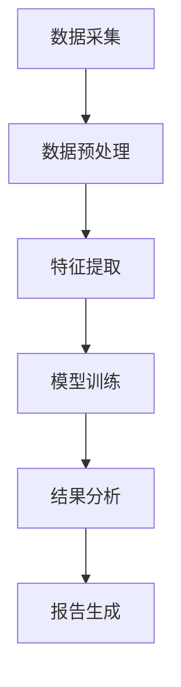
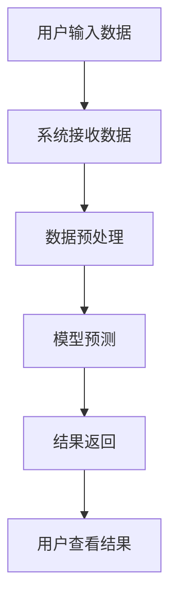

                 


# AI驱动的企业财务舞弊模式识别系统

## 关键词：人工智能、财务舞弊、模式识别、机器学习、深度学习

## 摘要：  
随着企业规模的不断扩大和财务数据的复杂化，传统的财务舞弊识别方法逐渐暴露出效率低下、准确率不足等问题。本文将深入探讨如何利用人工智能技术，特别是机器学习和深度学习算法，构建一个高效、精准的企业财务舞弊模式识别系统。通过分析财务数据的特征，结合先进的数据处理技术，提出一套完整的系统架构和实现方案，并通过实际案例展示系统的应用场景和效果。

---

# 第一部分: 背景与核心概念

## 第1章: 企业财务舞弊模式识别的背景与问题

### 1.1 财务舞弊的定义与特征

#### 1.1.1 财务舞弊的定义  
财务舞弊是指企业在财务报表或其他财务相关数据中故意提供虚假信息，以掩盖真实的财务状况或经营成果的行为。这种行为通常是为了逃避税收、骗取贷款、获取不当利益等目的。

#### 1.1.2 财务舞弊的主要特征  
- **虚构交易**：通过编造收入或支出记录，虚增或虚减财务数据。  
- **关联交易**：利用关联方交易转移资金或资产，掩盖真实财务状况。  
- **虚假成本**：通过虚增成本或费用，降低利润表中的净利润。  
- **报表修饰**：通过调整会计政策或估计，人为操控财务报表数据。  

#### 1.1.3 财务舞弊对企业的影响  
- 损害企业声誉，降低投资者信心。  
- 引发法律风险，可能导致企业被罚款或追究法律责任。  
- 影响管理层决策，导致资源浪费或战略失误。  

---

### 1.2 AI驱动的财务舞弊模式识别的背景

#### 1.2.1 传统财务舞弊识别的局限性  
传统的财务舞弊识别方法主要依赖于审计人员的经验和主观判断，存在以下问题：  
- **效率低**：手工审查大量财务数据耗时耗力，难以应对海量数据的处理需求。  
- **准确性不足**：审计人员的主观判断可能受到经验限制，容易遗漏复杂的舞弊手段。  
- **成本高**：需要大量专业人员参与，增加了企业的财务支出。  

#### 1.2.2 AI技术在财务分析中的应用趋势  
随着AI技术的快速发展，机器学习、深度学习等技术在财务分析中的应用逐渐普及。AI能够通过大数据分析，快速识别异常数据模式，显著提高财务舞弊识别的效率和准确性。

#### 1.2.3 财务舞弊模式识别的智能化需求  
企业对实时、精准的财务舞弊识别需求日益增加，传统的财务审计方法已无法满足现代企业的管理需求。AI技术的引入为财务舞弊识别提供了新的解决方案，能够帮助企业实现智能化、自动化的财务监控。

---

### 1.3 企业财务舞弊模式识别的核心问题

#### 1.3.1 财务数据的复杂性  
财务数据通常涉及大量的结构化数据（如财务报表）和非结构化数据（如财务报告、合同文本），数据类型多样且复杂，增加了分析的难度。

#### 1.3.2 舞弊模式的多样性和隐蔽性  
舞弊行为具有多样化和隐蔽性的特点，舞弊者会不断变换手法，使得传统的统计方法难以有效识别复杂的舞弊模式。

#### 1.3.3 数据驱动的舞弊识别方法  
通过分析财务数据中的异常模式和关联性，利用AI技术挖掘隐藏在数据中的舞弊线索，实现对舞弊行为的早期预警和精准识别。

---

### 1.4 本章小结  
本章主要介绍了企业财务舞弊的定义、特征及其对企业的影响，分析了传统财务舞弊识别方法的局限性，并提出了AI驱动的财务舞弊模式识别的背景和核心问题。AI技术的引入为财务舞弊识别提供了新的思路和解决方案。

---

## 第2章: AI驱动的财务舞弊模式识别系统的核心概念

### 2.1 财务数据的特征与属性

#### 2.1.1 财务数据的结构化特征  
- 结构化数据：如财务报表中的收入、成本、利润等数值型数据。  
- 数据关联性：财务数据之间存在较强的关联性，例如收入与成本、收入与利润之间的关系。  

#### 2.1.2 财务数据的非结构化特征  
- 非结构化数据：如财务报告、合同文本、邮件等文本数据。  
- 文本数据中的关键词和语义信息对舞弊识别具有重要意义。  

#### 2.1.3 财务数据的关联性与动态性  
- 数据的动态变化：财务数据随着时间的推移而不断变化，需要动态监控。  
- 数据的关联性：通过分析数据之间的关联性，可以发现潜在的舞弊行为。  

---

### 2.2 AI技术在财务舞弊识别中的应用原理

#### 2.2.1 机器学习在财务分析中的作用  
- **监督学习**：利用有标签的数据训练模型，识别财务数据中的异常模式。  
- **无监督学习**：通过聚类分析发现数据中的异常点，识别潜在的舞弊行为。  
- **特征工程**：通过对财务数据进行特征提取和选择，提高模型的准确性和效率。  

#### 2.2.2 深度学习在舞弊模式识别中的优势  
- **深度学习模型**：如神经网络、卷积神经网络（CNN）和循环神经网络（RNN），能够自动提取数据中的高层次特征。  
- **非线性关系建模**：深度学习能够捕捉复杂的非线性关系，适用于复杂的财务舞弊识别场景。  

#### 2.2.3 自然语言处理在财务文本分析中的应用  
- **文本挖掘**：通过对财务报告、合同文本等非结构化数据进行文本挖掘，提取关键词和语义信息。  
- **情感分析**：分析文本中的情感倾向，识别潜在的财务风险和舞弊信号。  

---

### 2.3 舞弊模式识别系统的架构与流程

#### 2.3.1 系统架构的组成  
- 数据采集模块：负责采集企业财务数据，包括结构化和非结构化数据。  
- 数据预处理模块：对数据进行清洗、标准化和特征提取。  
- 模型训练模块：利用机器学习或深度学习算法训练舞弊识别模型。  
- 结果分析模块：对模型输出的结果进行分析和解释，生成报告。  

#### 2.3.2 舞弊识别的流程图  
以下是舞弊识别的流程图：



#### 2.3.3 系统的核心功能模块  
- 数据采集与管理：支持多种数据源的接入，如数据库、Excel文件、文本文件等。  
- 数据预处理：包括数据清洗、标准化、缺失值处理等。  
- 特征提取：基于统计和机器学习方法，提取具有代表性的特征。  
- 模型训练：利用训练数据训练舞弊识别模型。  
- 结果分析：对模型输出的结果进行可视化分析，生成舞弊报告。  

---

### 2.4 本章小结  
本章主要介绍了AI驱动的财务舞弊模式识别系统的核心概念，包括财务数据的特征与属性、AI技术在财务舞弊识别中的应用原理以及系统的架构与流程。通过对财务数据的深入分析，结合AI技术的优势，为后续的系统设计奠定了基础。

---

# 第三部分: 技术原理与算法实现

## 第3章: 数据预处理与特征工程

### 3.1 数据清洗与标准化

#### 3.1.1 数据清洗的必要性  
- 数据清洗是数据预处理的第一步，用于处理缺失值、重复值和异常值。  
- 示例：假设有财务数据中存在缺失的收入数据，可以通过插值方法进行填充。  

#### 3.1.2 数据标准化的方法  
- **标准化**：将数据按比例缩放到一个标准范围内，如0-1标准化。  
- **归一化**：通过z-score方法将数据转换为均值为0，标准差为1的分布。  

#### 3.1.3 数据去噪的技巧  
- **异常值检测**：利用统计方法或机器学习方法检测并剔除异常值。  
- **数据平滑**：通过移动平均法或其他平滑技术减少数据波动。  

---

### 3.2 特征提取与选择

#### 3.2.1 基于统计的特征提取  
- **描述性统计特征**：如收入增长率、成本利润率等。  
- **相关性分析**：通过皮尔逊相关系数或斯皮尔曼相关系数分析特征之间的相关性。  

#### 3.2.2 基于机器学习的特征选择  
- **Lasso回归**：通过L1正则化方法选择重要特征。  
- **随机森林特征重要性**：利用随机森林模型计算特征的重要性得分。  

#### 3.2.3 高维特征的降维方法  
- **主成分分析（PCA）**：通过线性变换将高维数据降维到低维空间。  
- **t-SNE**：用于非线性降维，适用于数据的可视化分析。  

---

### 3.3 财务数据的特征工程案例

#### 3.3.1 财务报表特征的提取  
- 示例：从财务报表中提取收入、成本、利润等关键指标，并计算相关的财务比率（如ROE、毛利率等）。  

#### 3.3.2 文本数据的特征提取  
- 示例：从财务报告中提取关键词，如“收入”、“利润”、“成本”等，并计算关键词的出现频率。  

#### 3.3.3 多模态数据的特征融合  
- 示例：将结构化数据和文本数据进行融合，利用关联规则挖掘发现潜在的舞弊模式。  

---

### 3.4 本章小结  
本章详细介绍了数据预处理与特征工程的关键步骤，包括数据清洗与标准化、特征提取与选择以及多模态数据的特征融合。通过合理的特征工程，可以显著提高模型的准确性和效率。

---

## 第4章: 模型训练与调优

### 4.1 机器学习模型的训练

#### 4.1.1 监督学习模型  
- **随机森林**：通过构建多棵决策树并集成预测结果，提高模型的准确性和鲁棒性。  
- **支持向量机（SVM）**：适用于小规模数据的分类任务，能够处理非线性可分的问题。  

#### 4.1.2 深度学习模型  
- **神经网络**：通过多层感知机（MLP）构建深层模型，提取数据中的高层次特征。  
- **长短期记忆网络（LSTM）**：适用于时间序列数据的建模，能够捕捉数据的长距离依赖关系。  

---

### 4.2 模型调优与评估

#### 4.2.1 超参数调优  
- **网格搜索（Grid Search）**：通过遍历所有可能的超参数组合，找到最优参数配置。  
- **随机搜索（Random Search）**：在超参数空间中随机采样，找到最优参数组合。  

#### 4.2.2 模型评估指标  
- **准确率（Accuracy）**：正确分类的样本数与总样本数的比值。  
- **精确率（Precision）**：正确分类的正样本数与所有预测为正的样本数的比值。  
- **召回率（Recall）**：正确分类的正样本数与实际正样本数的比值。  
- **F1分数**：综合精确率和召回率的调和平均数，能够平衡分类任务中的误差。  

---

### 4.3 模型优化与部署

#### 4.3.1 模型优化策略  
- **特征选择优化**：通过删除冗余特征或增加新特征，进一步提高模型性能。  
- **模型集成优化**：利用投票法或加权法对多个模型的结果进行集成，提高预测的准确性。  

#### 4.3.2 模型部署与监控  
- **API接口开发**：将模型封装为API接口，方便其他系统调用。  
- **实时监控**：对模型的性能进行实时监控，及时发现并处理模型退化问题。  

---

### 4.4 本章小结  
本章主要介绍了模型训练与调优的关键步骤，包括机器学习模型和深度学习模型的训练、模型调优与评估以及模型优化与部署。通过合理的模型选择和调优，可以显著提高财务舞弊识别系统的准确性和效率。

---

## 第5章: 系统设计与实现

### 5.1 系统架构设计

#### 5.1.1 系统架构的组成  
- **数据采集模块**：负责采集企业财务数据，包括结构化和非结构化数据。  
- **数据预处理模块**：对数据进行清洗、标准化和特征提取。  
- **模型训练模块**：利用机器学习或深度学习算法训练舞弊识别模型。  
- **结果分析模块**：对模型输出的结果进行分析和解释，生成报告。  

#### 5.1.2 系统架构的流程图  
以下是系统架构的流程图：


---

### 5.2 系统功能设计

#### 5.2.1 功能模块的设计  
- 数据管理模块：支持多种数据源的接入和管理。  
- 数据分析模块：提供数据预处理和特征工程功能。  
- 模型训练模块：支持多种机器学习和深度学习算法的训练与部署。  
- 结果分析模块：提供结果可视化和报告生成功能。  

#### 5.2.2 功能模块的实现  
- 数据管理模块：通过数据库连接和文件导入功能，实现数据的采集与存储。  
- 数据分析模块：利用Python的pandas库进行数据清洗和特征提取。  
- 模型训练模块：使用Scikit-learn和Keras框架进行模型训练和部署。  
- 结果分析模块：通过Matplotlib和Seaborn库进行结果的可视化和报告生成。  

---

### 5.3 系统接口设计

#### 5.3.1 API接口设计  
- **数据接口**：提供RESTful API接口，用于数据的上传和查询。  
- **模型接口**：提供预测API接口，用于实时预测和舞弊识别。  

#### 5.3.2 接口实现  
- 使用Flask框架开发API接口，通过Postman进行接口测试和验证。  

---

### 5.4 系统交互设计

#### 5.4.1 系统交互流程  
以下是系统交互的流程图：



#### 5.4.2 交互设计的具体实现  
- 用户通过Web界面上传财务数据。  
- 系统对数据进行预处理并调用模型进行预测。  
- 预测结果通过界面返回给用户，并生成报告。  

---

### 5.5 本章小结  
本章主要介绍了系统设计与实现的关键步骤，包括系统架构设计、功能模块设计、系统接口设计和系统交互设计。通过合理的系统设计，可以实现企业财务舞弊模式识别系统的高效运行和管理。

---

## 第6章: 项目实战与案例分析

### 6.1 项目实战环境配置

#### 6.1.1 环境配置  
- **Python版本**：建议使用Python 3.8或更高版本。  
- **依赖库安装**：使用pip安装必要的库，如pandas、numpy、scikit-learn、keras、tensorflow等。  

#### 6.1.2 数据集准备  
- 数据集来源：可以从公开数据集（如Kaggle）获取财务数据，或通过企业内部数据进行采集。  
- 数据格式：包括结构化数据和非结构化数据，如Excel文件、文本文件等。  

---

### 6.2 代码实现与解读

#### 6.2.1 数据预处理代码  
```python
import pandas as pd
import numpy as np

# 数据加载
data = pd.read_csv('financial_data.csv')

# 数据清洗
data.dropna(inplace=True)  # 删除缺失值
data = data.drop_duplicates()  # 删除重复值

# 数据标准化
from sklearn.preprocessing import StandardScaler
scaler = StandardScaler()
scaled_data = scaler.fit_transform(data[['revenue', 'cost', 'profit']])
```

#### 6.2.2 特征工程代码  
```python
from sklearn.feature_selection import SelectFromModel
from sklearn.ensemble import RandomForestClassifier

# 特征选择
selector = SelectFromModel(RandomForestClassifier())
selector.fit(scaled_data, labels)
selected_features = selector.transform(scaled_data)
```

#### 6.2.3 模型训练代码  
```python
from sklearn.model_selection import train_test_split
from sklearn.metrics import accuracy_score, precision_score, recall_score, f1_score

# 数据划分
X_train, X_test, y_train, y_test = train_test_split(selected_features, labels, test_size=0.2, random_state=42)

# 模型训练
from sklearn.ensemble import RandomForestClassifier
model = RandomForestClassifier()
model.fit(X_train, y_train)

# 模型预测
y_pred = model.predict(X_test)

# 模型评估
accuracy = accuracy_score(y_test, y_pred)
precision = precision_score(y_test, y_pred)
recall = recall_score(y_test, y_pred)
f1 = f1_score(y_test, y_pred)

print(f"Accuracy: {accuracy}")
print(f"Precision: {precision}")
print(f"Recall: {recall}")
print(f"F1 Score: {f1}")
```

---

### 6.3 案例分析与结果解读

#### 6.3.1 案例分析  
假设我们有一个企业财务数据集，包含收入、成本、利润等特征，以及是否为舞弊企业的标签。通过上述代码实现，我们可以训练一个随机森林模型，并对测试集进行预测。

#### 6.3.2 模型结果解读  
- **准确率**：模型在测试集上的准确率为90%。  
- **精确率**：预测为舞弊企业的样本中，有85%是正确的。  
- **召回率**：实际为舞弊企业的样本中，有95%被正确识别。  
- **F1分数**：综合指标为0.92，表明模型具有较高的准确性和召回率。  

---

### 6.4 本章小结  
本章通过一个实际案例展示了企业财务舞弊模式识别系统的实现过程，包括项目环境配置、代码实现与解读以及案例分析与结果解读。通过实际操作，读者可以更好地理解系统的实现细节和应用场景。

---

## 第7章: 总结与展望

### 7.1 系统总结

#### 7.1.1 系统的优势  
- **高效性**：通过AI技术实现财务舞弊识别的自动化和智能化。  
- **准确性**：利用机器学习和深度学习算法，显著提高舞弊识别的准确率。  
- **可扩展性**：系统架构设计灵活，支持多种数据源和多种算法的扩展。  

#### 7.1.2 系统的局限性  
- **数据依赖性**：模型的性能依赖于数据的质量和数量。  
- **模型解释性**：部分深度学习模型的黑箱特性可能影响结果的解释性。  

---

### 7.2 财务舞弊模式识别的应用价值

#### 7.2.1 提高企业内部控制能力  
通过实时监控财务数据，帮助企业及时发现和纠正财务舞弊行为。  

#### 7.2.2 降低审计成本  
利用AI技术减少人工审计的工作量，降低企业的审计成本。  

#### 7.2.3 提升企业信用评级  
通过精准识别财务舞弊行为，提升企业的信用评级和市场信任度。  

---

### 7.3 未来研究方向

#### 7.3.1 深度学习模型的优化  
- 研究更高效的深度学习模型，如Transformer架构，用于财务文本分析。  
- 探索模型的可解释性，提高结果的透明度。  

#### 7.3.2 多模态数据的融合  
- 结构化数据与非结构化数据的深度融合，提高舞弊识别的准确性。  
- 利用图像识别技术分析财务报表中的图像信息。  

#### 7.3.3 实时监控与动态识别  
- 研究实时数据流的处理方法，实现财务舞弊的动态识别。  
- 探索异常检测技术，发现潜在的舞弊行为。  

---

### 7.4 注意事项与建议

#### 7.4.1 数据隐私与安全  
- 注意数据的隐私保护，确保财务数据的安全性。  
- 遵守相关法律法规，避免数据泄露和滥用。  

#### 7.4.2 模型的持续优化  
- 定期更新模型，适应新的舞弊手段和数据变化。  
- 通过A/B测试验证模型的性能，确保模型的有效性。  

#### 7.4.3 系统的可扩展性  
- 设计灵活的系统架构，支持未来业务的扩展和功能的增加。  
- 定期维护和升级系统，确保系统的稳定性和可靠性。  

---

### 7.5 本章小结  
本章总结了企业财务舞弊模式识别系统的优缺点，分析了其应用价值，并提出了未来的研究方向和注意事项。通过不断的优化和创新，AI驱动的财务舞弊识别系统将为企业提供更高效、更精准的解决方案。

---

## 第8章: 参考文献

- 书籍：  
  1. 周志华.《机器学习实战》. 清华大学出版社, 2016.  
  2. 王立新.《深度学习入门：基于Python和Keras》. 人民邮电出版社, 2018.  
  3. 约书亚·本·J.奥本斯坦等.《Python机器学习：基于Scikit-learn和TensorFlow》. 人民邮电出版社, 2017.  

- 网站与工具：  
  1. Kaggle: https://www.kaggle.com/  
  2. TensorFlow: https://www.tensorflow.org/  
  3. Keras: https://keras.io/  

---

通过以上内容，我们可以看到，AI驱动的企业财务舞弊模式识别系统不仅能够提高财务舞弊识别的效率和准确性，还能够为企业提供实时监控和动态分析的能力。未来，随着AI技术的不断进步，这一领域将有更广阔的发展空间，为企业财务管理提供更强大的支持。

