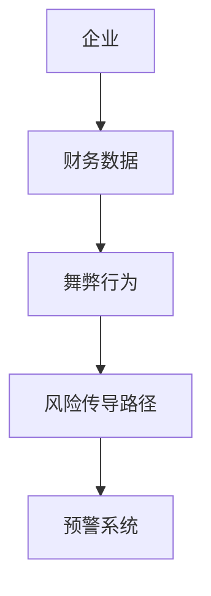
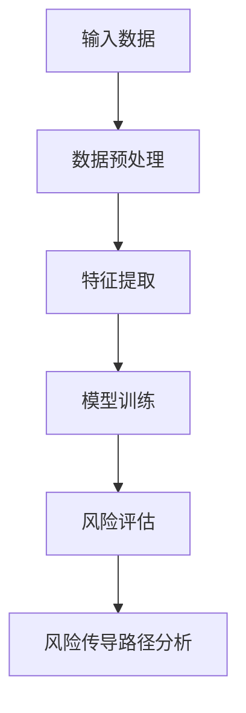
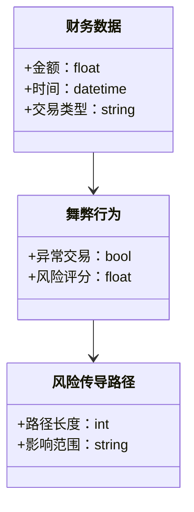
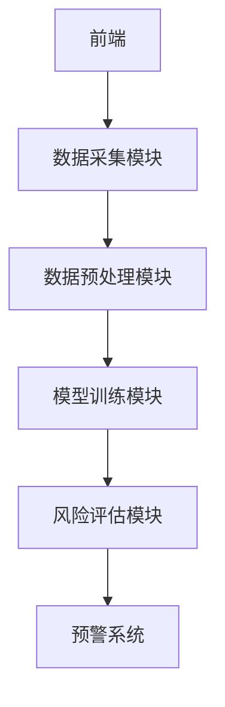
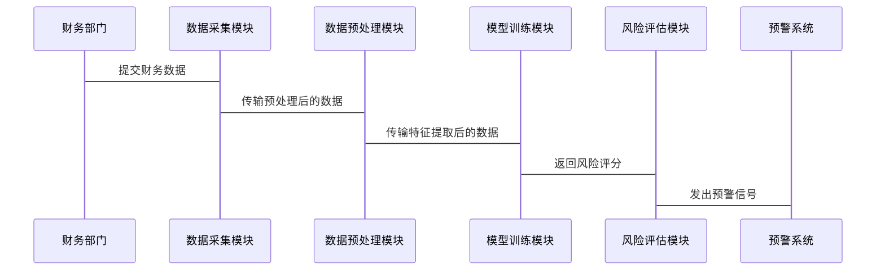

                 


# AI驱动的企业财务舞弊风险传导路径识别系统

## 关键词：AI技术、企业财务、舞弊风险、传导路径、系统设计、风险识别

## 摘要：本文介绍了一种基于AI技术的企业财务舞弊风险传导路径识别系统，分析了传统方法的局限性，详细阐述了AI在财务舞弊识别中的应用原理，包括数据特征提取、模型训练与风险评估，以及系统的架构设计。通过实际案例分析，展示了系统的实用价值，并展望了未来的研究方向。

---

## 正文

### 第一部分: 企业财务舞弊风险传导路径识别系统背景介绍

#### 第1章: 问题背景与描述

##### 1.1 问题背景
###### 1.1.1 企业财务舞弊的现状与挑战
企业财务舞弊行为日益复杂，传统基于规则的检测方法难以应对多样化的舞弊手段。企业内部的财务数据涉及多个部门和环节，舞弊行为可能通过虚构交易、虚增收入、隐瞒支出等方式进行，传统方法仅依赖财务数据中的某些特征，难以全面识别风险。

###### 1.1.2 传统财务舞弊识别方法的局限性
传统方法主要依赖财务审计和人工检查，效率低、成本高且难以及时发现隐藏在大量数据中的异常情况。此外，舞弊行为往往涉及复杂的内部操作，传统方法难以追踪舞弊风险的传导路径。

###### 1.1.3 AI技术在财务舞弊识别中的应用潜力
人工智能技术，尤其是深度学习和自然语言处理技术，能够从海量数据中提取复杂的特征，并通过模型训练识别潜在的舞弊模式。AI技术能够实时分析财务数据，识别异常交易，从而有效降低舞弊风险。

##### 1.2 问题描述
###### 1.2.1 财务舞弊的定义与分类
财务舞弊是指企业通过虚构、隐瞒、篡改财务数据等手段，误导财务报表使用者的行为。常见类型包括收入虚增、成本虚减、资产虚增等。

###### 1.2.2 舞弊风险传导路径的定义与特征
舞弊风险传导路径是指舞弊行为如何在企业内部传播和影响的过程。例如，某个部门的舞弊行为可能通过关联交易、内部资金调配等方式影响其他部门或整个企业。

###### 1.2.3 问题解决与目标
本系统旨在通过AI技术，识别企业财务数据中的异常模式，分析舞弊风险的传导路径，并提供预警机制，帮助企业在舞弊行为发生前进行有效干预。

##### 1.3 问题解决与目标
###### 1.3.1 系统设计目标与核心问题
系统设计目标包括实时监控财务数据、识别异常交易、分析舞弊风险传导路径等。核心问题是如何利用AI技术准确识别舞弊行为，并有效预测其传导路径。

###### 1.3.2 边界与外延
系统适用于企业财务数据的实时监控和舞弊风险分析，但不包括企业外部的舞弊行为识别，如供应商舞弊等。

### 第二部分: 核心概念与联系

#### 第2章: 核心概念与联系

##### 2.1 AI在财务舞弊识别中的应用原理
###### 2.1.1 数据特征提取
通过NLP技术提取财务数据中的关键词和模式，识别潜在的舞弊特征。

###### 2.1.2 模型训练与风险评估
使用深度学习模型训练财务数据，识别异常交易模式。

###### 2.1.3 舞弊风险传导路径的识别机制
通过分析异常交易之间的关联性，识别舞弊风险的传导路径。

##### 2.2 核心概念对比分析
###### 2.2.1 数据特征对比表格
| 特征类型 | 正常交易 | 异常交易 |
|----------|----------|----------|
| 交易金额 | 小幅波动 | 明显偏离 |
| 交易时间 | 集中在特定时段 | 分散在不同时间 |
| 交易频率 | 稳定 | 突然增加或减少 |

##### 2.3 实体关系图


### 第三部分: 算法原理

#### 第3章: 算法原理

##### 3.1 模型选择与算法设计
###### 3.1.1 模型结构
使用基于Transformer的模型，提取财务数据中的长距离依赖关系。

###### 3.1.2 损失函数与优化器
损失函数：交叉熵损失
优化器：Adam优化器

##### 3.2 算法流程图


##### 3.3 代码实现
```python
import torch
import torch.nn as nn
import torch.optim as optim

class TransformerModel(nn.Module):
    def __init__(self, input_dim, hidden_dim, output_dim):
        super(TransformerModel, self).__init__()
        self.embedding = nn.Embedding(input_dim, hidden_dim)
        self.transformer = nn.Transformer(hidden_dim, hidden_dim, num_layers=2)
        self.fc = nn.Linear(hidden_dim, output_dim)

    def forward(self, x):
        embedded = self.embedding(x)
        output = self.transformer(embedded)
        output = self.fc(output)
        return output

# 初始化模型和优化器
model = TransformerModel(input_dim=100, hidden_dim=50, output_dim=1)
optimizer = optim.Adam(model.parameters(), lr=0.001)
criterion = nn.CrossEntropyLoss()

# 训练过程
for epoch in range(num_epochs):
    for inputs, labels in dataloader:
        outputs = model(inputs)
        loss = criterion(outputs, labels)
        optimizer.zero_grad()
        loss.backward()
        optimizer.step()
```

### 第四部分: 系统分析与架构设计

#### 第4章: 系统分析与架构设计

##### 4.1 问题场景介绍
系统用于实时监控企业的财务数据，识别潜在的舞弊行为，并分析其风险传导路径。

##### 4.2 系统功能设计
###### 4.2.1 领域模型


##### 4.3 系统架构设计
###### 4.3.1 系统架构图


##### 4.4 系统接口设计
###### 4.4.1 API接口
- 输入接口：接收财务数据
- 输出接口：返回风险评估结果和传导路径

##### 4.5 系统交互流程


### 第五部分: 项目实战

#### 第5章: 项目实战

##### 5.1 环境安装
安装必要的库，如PyTorch、Transformers等。

##### 5.2 核心实现
```python
# 数据预处理
def preprocess(data):
    # 处理数据，提取特征
    return processed_data

# 模型训练
def train_model(model, data):
    # 训练模型
    return trained_model

# 风险评估
def evaluate_model(model, data):
    # 评估模型性能
    return evaluation_result
```

##### 5.3 实际案例分析
分析一个企业的财务数据，识别潜在的舞弊行为，并分析其风险传导路径。

### 第六部分: 总结与展望

#### 第6章: 总结与展望

##### 6.1 总结
本文详细介绍了AI驱动的企业财务舞弊风险传导路径识别系统的开发与应用，展示了系统的架构设计和实际应用价值。

##### 6.2 展望
未来的研究可以进一步优化模型，扩展系统的应用场景，提高系统的实时性和准确性。

---

**注**：由于篇幅限制，上述内容仅为部分章节的简要描述。完整的文章将详细展开每个部分，并提供更多的代码示例、图表和案例分析。

