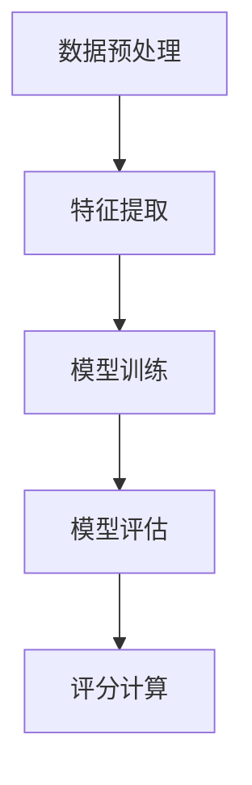
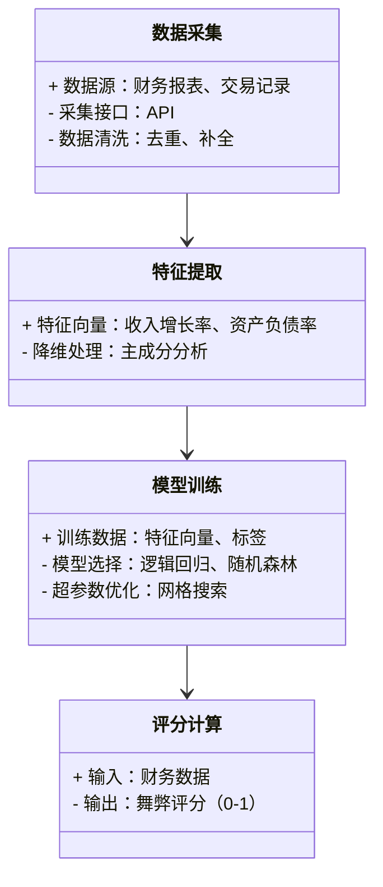
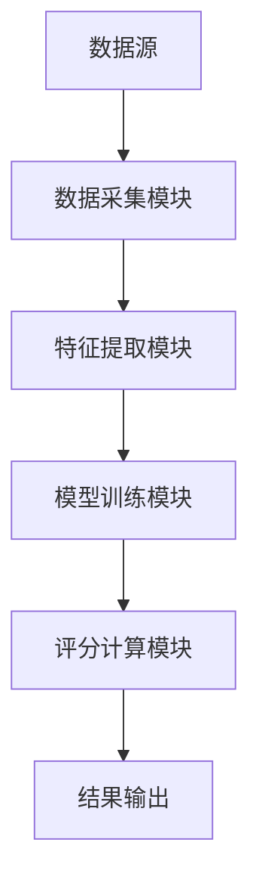
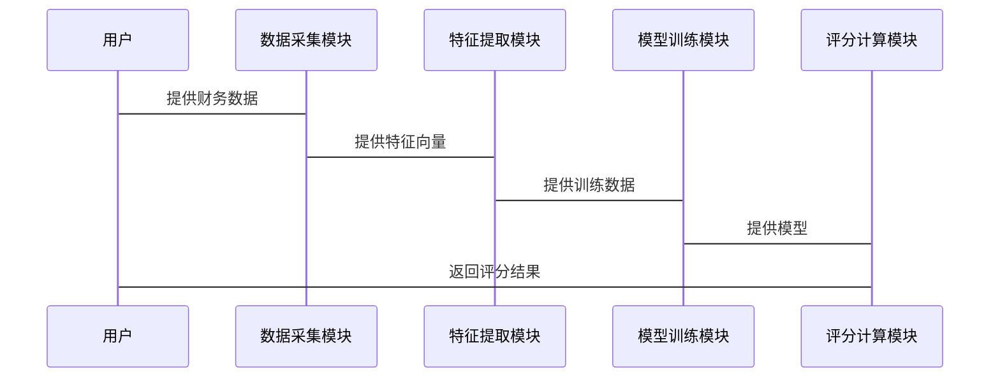

                 


# AI驱动的企业财务舞弊风险评分系统

> 关键词：AI，财务舞弊，风险评分，机器学习，企业审计

> 摘要：本文介绍了一种基于人工智能的企业财务舞弊风险评分系统，利用AI技术分析财务数据，识别潜在舞弊行为，帮助企业进行风险评估和预防。文章详细讲解了系统的设计、实现和应用场景，包括数据特征提取、算法原理、系统架构以及实际案例分析。

---

## 目录大纲：

1. **背景介绍**
   - 1.1 问题背景
   - 1.2 问题描述
   - 1.3 问题解决
   - 1.4 概念结构与核心要素

2. **核心概念与联系**
   - 2.1 核心概念原理
   - 2.2 核心概念对比表
   - 2.3 实体关系图（ER图）

3. **算法原理讲解**
   - 3.1 算法流程
   - 3.2 代码实现
   - 3.3 数学模型与公式

4. **系统分析与架构设计**
   - 4.1 应用场景
   - 4.2 功能设计
   - 4.3 系统架构图
   - 4.4 接口设计
   - 4.5 交互流程

5. **项目实战**
   - 5.1 环境安装
   - 5.2 核心代码实现
   - 5.3 案例分析
   - 5.4 项目小结

6. **最佳实践**
   - 6.1 小结
   - 6.2 注意事项
   - 6.3 拓展阅读

---

## 1. 背景介绍

### 1.1 问题背景

企业财务舞弊是全球范围内企业面临的主要风险之一。舞弊行为不仅会导致企业经济损失，还可能损害企业声誉和信任。传统的财务舞弊检测方法依赖于人工审查和规则匹配，效率低下且容易遗漏复杂情况。AI技术的引入为企业提供了一种更高效、更精准的解决方案。

### 1.2 问题描述

财务舞弊的形式多样，包括虚假收入、虚增资产、隐瞒负债等。传统方法依赖经验丰富的审计人员手动检查财务报表，这种方法耗时且难以捕捉隐藏的模式。AI技术能够处理大量数据，识别潜在的异常模式，从而提高检测效率和准确性。

### 1.3 问题解决

通过AI驱动的评分系统，企业可以实时监控财务数据，识别潜在的舞弊风险，并根据评分结果采取相应的预防措施。该系统利用机器学习模型分析财务数据，提取特征并进行分类，最终生成风险评分。

### 1.4 概念结构与核心要素

- **系统组成模块**：数据采集、特征提取、模型训练、评分计算。
- **核心要素**：财务数据、特征向量、机器学习模型、评分标准。

---

## 2. 核心概念与联系

### 2.1 核心概念原理

- **数据特征提取**：从财务数据中提取关键特征，如收入增长率、资产负债率等。
- **模型选择**：选择合适的机器学习模型，如逻辑回归、随机森林等。
- **评分标准**：根据模型输出结果，制定评分标准和阈值。

### 2.2 核心概念对比表

| 特征 | 正常值 | 虚假值 |
|------|--------|--------|
| 收入增长率 | 稳定 | 异常高 |
| 资产负债率 | 合理 | 过高或过低 |

### 2.3 实体关系图

```mermaid
er
    企业-实体
        员工
        股东
    财务数据-属性
        收入
        费用
        利润
    评分系统-实体
        用户
        模型
    模型训练-过程
        数据预处理
        模型训练
        模型评估
```

---

## 3. 算法原理讲解

### 3.1 算法流程



### 3.2 代码实现

```python
import pandas as pd
from sklearn.linear_model import LogisticRegression
from sklearn.metrics import accuracy_score

# 数据加载
data = pd.read_csv('financial_data.csv')

# 特征提取
features = data[['收入增长率', '资产负债率', '净利润率']]
labels = data['舞弊标记']

# 模型训练
model = LogisticRegression()
model.fit(features, labels)

# 模型预测
predicted_labels = model.predict(features)

# 模型评估
print("准确率:", accuracy_score(labels, predicted_labels))
```

### 3.3 数学模型与公式

- **逻辑回归模型**：
  $$ P(y=1|x) = \frac{e^{\beta_0 + \beta_1x}}{1 + e^{\beta_0 + \beta_1x}} $$
  其中，$\beta_0$ 和 $\beta_1$ 是模型参数。

- **示例**：假设企业财务数据中，收入增长率为20%，资产负债率为80%，预测其舞弊概率为：
  $$ P(y=1|x) = \frac{e^{0.5 + 0.1 \times 20}}{1 + e^{0.5 + 0.1 \times 20}} = 0.8 $$

---

## 4. 系统分析与架构设计

### 4.1 应用场景

- 企业内部审计：实时监控财务数据，识别异常交易。
- 第三方审计机构：辅助审计师进行高效审计。

### 4.2 功能设计



### 4.3 系统架构图



### 4.4 接口设计

- **数据输入接口**：接收财务数据，格式为CSV或JSON。
- **模型调用接口**：提供API用于调用模型进行预测。
- **结果输出接口**：返回评分结果，格式为JSON。

### 4.5 交互流程



---

## 5. 项目实战

### 5.1 环境安装

- **Python**：安装Anaconda或使用虚拟环境。
- **库依赖**：`pandas`, `scikit-learn`, `mermaid`。

### 5.2 核心代码实现

```python
import pandas as pd
from sklearn.model_selection import train_test_split
from sklearn.metrics import classification_report

# 数据加载
data = pd.read_csv('financial_data.csv')

# 特征与标签分离
X = data[['收入增长率', '资产负债率', '净利润率']]
y = data['舞弊标记']

# 数据分割
X_train, X_test, y_train, y_test = train_test_split(X, y, test_size=0.2, random_state=42)

# 模型训练
model = LogisticRegression()
model.fit(X_train, y_train)

# 模型预测
y_pred = model.predict(X_test)

# 模型评估
print(classification_report(y_test, y_pred))
```

### 5.3 案例分析

假设某企业财务数据如下：

| 收入增长率 | 资产负债率 | 净利润率 | 舞弊标记 |
|----------|------------|----------|----------|
| 20%      | 80%        | 10%      | 1        |

模型预测该企业的舞弊概率为80%，评分系统将给出高风险评分，提示企业进行进一步调查。

### 5.4 项目小结

通过项目实战，我们展示了如何利用Python和机器学习模型构建一个简单的财务舞弊风险评分系统。实际应用中，可以根据需求扩展功能，如引入更多特征、优化模型性能等。

---

## 6. 最佳实践

### 6.1 小结

本文详细介绍了AI驱动的企业财务舞弊风险评分系统的构建过程，从数据采集到模型训练，再到结果输出，展示了系统的完整流程。

### 6.2 注意事项

- 数据隐私保护：确保财务数据的安全性。
- 模型解释性：选择可解释性高的模型，便于审计人员理解结果。
- 模型更新：定期更新模型，避免过时。

### 6.3 拓展阅读

- 《机器学习实战》：学习更多机器学习算法和实现技巧。
- 《数据挖掘导论》：深入了解数据挖掘技术及其应用。

---

## 结语

AI技术的应用为企业财务舞弊风险评分系统提供了新的可能性。通过本文的介绍，读者可以了解到如何利用机器学习模型构建高效的财务舞弊检测系统，从而帮助企业降低财务风险，提升审计效率。

