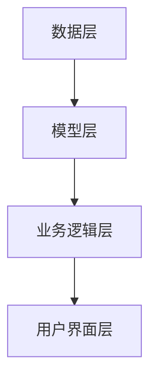
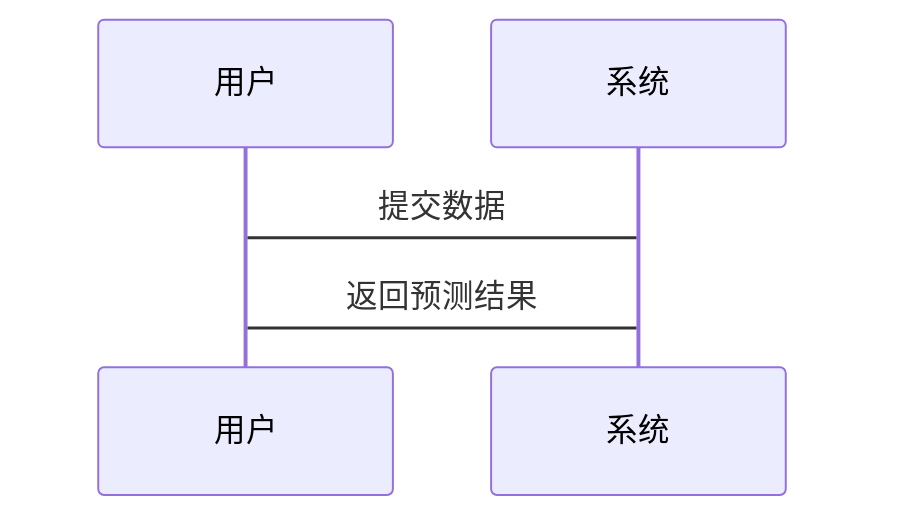

                 


# AI驱动的企业财务预算编制与调整系统

## 关键词：AI技术、财务预算、机器学习、系统架构、项目实战

## 摘要：本文详细探讨了AI技术在企业财务预算编制与调整中的应用，分析了传统方法的局限性，提出了基于机器学习的解决方案，并设计了系统的架构。通过实际案例和代码实现，展示了AI如何提升财务预算的准确性和效率，最后总结了系统的优化与维护策略。

---

# 第1章 背景介绍

## 1.1 问题背景

### 1.1.1 传统财务预算编制的痛点
传统财务预算编制过程复杂且耗时，依赖大量人工操作，容易受主观因素影响，且缺乏灵活性。企业在预算编制时需要处理大量历史数据、市场趋势和内部政策，这些数据通常分散在多个系统中，导致效率低下。

### 1.1.2 企业财务预算调整的复杂性
预算调整通常需要根据实际执行情况和市场变化进行实时调整，但传统方法难以快速响应，容易导致预算与实际执行结果偏差较大。

### 1.1.3 AI技术在财务领域的应用潜力
AI技术可以通过机器学习模型分析历史数据和市场趋势，预测未来的财务情况，从而提供更准确的预算建议和实时调整方案。

## 1.2 问题描述

### 1.2.1 预算编制的流程与挑战
预算编制需要收集、整理和分析大量数据，涵盖收入、支出、成本等多个方面。传统方法依赖人工计算，容易出错且效率低下。

### 1.2.2 预算调整的动态需求
企业在实际运营中会遇到突发情况，需要频繁调整预算。传统方法难以快速响应，导致预算灵活性不足。

### 1.2.3 传统方法的局限性
传统方法依赖人工经验，缺乏数据支持，难以应对复杂多变的市场环境。

## 1.3 问题解决

### 1.3.1 引入AI技术的核心目标
通过AI技术实现预算编制和调整的自动化和智能化，提高预算的准确性和灵活性。

### 1.3.2 AI驱动的财务预算系统的优势
AI系统能够快速分析大量数据，提供实时预算建议，降低人为错误，提高效率。

### 1.3.3 系统实现的关键步骤
数据收集、模型训练、系统设计、功能实现和测试优化。

## 1.4 系统的边界与外延

### 1.4.1 系统的功能边界
系统专注于预算编制和调整，不涉及财务报告的生成和审计。

### 1.4.2 与企业其他系统的交互
系统需要与ERP、CRM等系统集成，获取必要的数据。

### 1.4.3 系统的可扩展性
系统设计需考虑未来的扩展需求，如增加新的数据源或算法。

## 1.5 核心概念与组成要素

### 1.5.1 预算数据的来源与处理
预算数据包括历史财务数据、市场数据、业务数据等，需要进行清洗、整合和特征提取。

### 1.5.2 AI算法的核心作用
算法通过分析历史数据，预测未来的财务情况，辅助预算编制和调整。

### 1.5.3 系统的输出与反馈机制
系统输出预算建议和调整方案，并根据实际执行情况反馈数据，不断优化模型。

## 1.6 本章小结

---

# 第2章 核心概念与系统架构

## 2.1 核心概念原理

### 2.1.1 AI在财务预算中的应用原理
AI通过机器学习模型分析历史数据，预测未来的财务状况，辅助预算编制和调整。

### 2.1.2 机器学习在预算预测中的作用
机器学习算法能够识别数据中的模式和趋势，提供准确的预测。

### 2.1.3 系统的实时调整机制
系统根据实时数据和模型预测，自动调整预算，确保预算与实际情况一致。

## 2.2 核心概念对比分析

### 2.2.1 传统预算编制与AI驱动的对比
| 对比维度 | 传统方法 | AI驱动方法 |
|----------|----------|------------|
| 数据处理 | 手动整理 | 自动处理     |
| 预测精度 | 低       | 高          |
| 时间效率 | 低       | 高          |

### 2.2.2 预算调整的自动化与人工调整的对比
| 对比维度 | 自动化调整 | 人工调整     |
|----------|------------|-------------|
| 响应速度 | 快         | 慢          |
| 准确性   | 高         | 中          |

### 2.2.3 不同AI算法的优缺点对比
| 算法类型 | 优点       | 缺点         |
|----------|------------|-------------|
| 线性回归 | 简单，易解释 | 非线性关系差 |
| 神经网络 | 高准确性   | 复杂，难解释 |

## 2.3 ER实体关系图

```mermaid
graph TD
    A[用户] --> B[预算数据]
    B --> C[历史数据]
    C --> D[AI算法]
    D --> E[预算预测]
    E --> F[预
```

---

# 第3章 算法原理

## 3.1 算法原理概述

### 3.1.1 机器学习与深度学习的区别
机器学习通过特征工程进行预测，深度学习通过神经网络自动提取特征。

### 3.1.2 传统回归分析的局限性
线性回归模型难以处理复杂的非线性关系。

### 3.1.3 神经网络的优势
神经网络能够处理复杂的非线性关系，适合处理财务数据。

## 3.2 线性回归算法

### 3.2.1 算法原理
线性回归通过最小二乘法拟合直线，公式为：
$$ y = \beta_0 + \beta_1 x $$

### 3.2.2 优缺点
- 优点：简单，易于解释。
- 缺点：只能处理线性关系。

## 3.3 神经网络算法

### 3.3.1 算法原理
神经网络通过多层感知机处理复杂数据，公式为：
$$ y = \sigma(w x + b) $$

### 3.3.2 优缺点
- 优点：能够处理复杂的非线性关系。
- 缺点：模型复杂，难解释。

## 3.4 算法实现

### 3.4.1 线性回归实现
```python
import numpy as np

def linear_regression(X, y):
    X = np.array(X).reshape(-1, 1)
    y = np.array(y)
    model = linear_model.LinearRegression()
    model.fit(X, y)
    return model.coef_, model.intercept_
```

### 3.4.2 神经网络实现
```python
import tensorflow as tf

def neural_network(X, y):
    model = tf.keras.Sequential([
        tf.keras.layers.Dense(64, activation='relu'),
        tf.keras.layers.Dense(1)
    ])
    model.compile(optimizer='adam', loss='mse')
    model.fit(X, y, epochs=100, batch_size=32)
    return model
```

---

# 第4章 系统分析与架构设计

## 4.1 问题场景介绍

### 4.1.1 预算数据的收集与处理
系统需要收集历史财务数据、市场数据和业务数据。

### 4.1.2 预算预测与调整
系统根据数据预测预算，并根据实际情况调整。

## 4.2 项目介绍

### 4.2.1 项目目标
开发一个AI驱动的财务预算系统，实现预算编制和调整的自动化。

### 4.2.2 项目范围
涵盖预算数据收集、模型训练、系统设计和功能实现。

## 4.3 系统功能设计

### 4.3.1 预算数据管理模块
负责数据的收集、清洗和存储。

### 4.3.2 预算预测模块
基于机器学习模型进行预算预测。

### 4.3.3 预算调整模块
根据实际数据调整预算。

## 4.4 系统架构设计

### 4.4.1 总体架构
系统分为数据层、模型层、业务逻辑层和用户界面层。

### 4.4.2 模块架构


### 4.4.3 接口设计
系统需要与ERP、CRM等系统集成，提供API接口。

### 4.4.4 交互流程图


---

# 第5章 项目实战

## 5.1 环境配置

### 5.1.1 安装Python和必要的库
安装Python和numpy、pandas、scikit-learn、tensorflow等库。

## 5.2 系统核心实现

### 5.2.1 数据处理
```python
import pandas as pd

data = pd.read_csv('budget_data.csv')
X = data[['revenue', 'expenses']]
y = data['net_income']
```

### 5.2.2 模型训练
```python
from sklearn.linear_model import LinearRegression
import numpy as np

model = LinearRegression()
model.fit(X, y)
```

### 5.2.3 系统部署
将模型部署到服务器，提供API接口。

## 5.3 实际案例分析

### 5.3.1 案例背景
某公司过去三年的财务数据，需要预测未来一年的收入和支出。

### 5.3.2 数据分析
使用线性回归模型预测收入和支出，调整后的预算与实际数据对比。

---

# 第6章 系统优化与维护

## 6.1 系统性能优化

### 6.1.1 模型优化
使用超参数调优和模型融合提升预测精度。

### 6.1.2 系统优化
优化代码和架构，提升处理速度和响应时间。

## 6.2 数据安全与隐私保护

### 6.2.1 数据加密
对敏感数据进行加密处理。

### 6.2.2 权限管理
设置严格的访问权限，确保数据安全。

## 6.3 系统维护

### 6.3.1 定期更新
定期更新模型和系统，保持最新状态。

### 6.3.2 错误处理
建立完善的错误处理机制，确保系统稳定运行。

---

# 第7章 总结与展望

## 7.1 系统总结

### 7.1.1 系统特点
- 高效性：快速处理数据，提供实时预算建议。
- 准确性：基于机器学习模型，预测精度高。
- 灵活性：能够根据实际情况快速调整预算。

## 7.2 未来展望

### 7.2.1 技术发展
随着AI技术的进步，系统将更加智能化和自动化。

### 7.2.2 应用拓展
未来可以扩展到更多财务领域，如审计、风险管理等。

## 7.3 最佳实践 tips

### 7.3.1 数据质量
确保数据准确性和完整性，是系统运行的基础。

### 7.3.2 模型选择
根据具体需求选择合适的AI算法，避免盲目使用复杂模型。

### 7.3.3 系统维护
定期更新和维护系统，确保其稳定性和安全性。

---

# 结语

通过本文的详细讲解，我们了解了AI技术在企业财务预算编制与调整中的应用，从理论到实践，从算法到系统设计，全面展示了如何利用AI提升财务预算的效率和准确性。未来，随着AI技术的不断发展，企业财务预算系统将更加智能化和自动化，为企业创造更大的价值。

