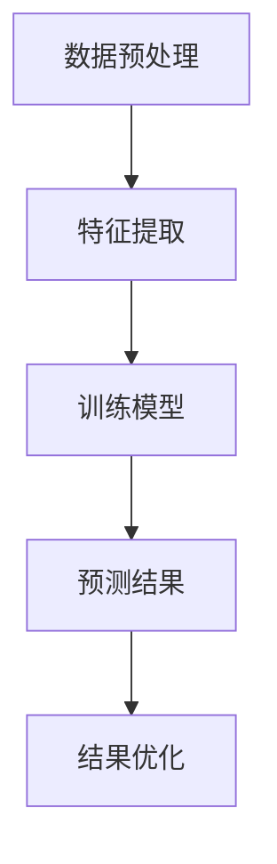

                 


# AI驱动的企业财务预算编制智能辅助系统

## 关键词：AI技术，财务预算，智能辅助系统，机器学习，企业财务管理

## 摘要：本文探讨了AI技术在企业财务预算编制中的应用，分析了传统方法的挑战，并提出了基于机器学习的智能辅助系统解决方案。通过详细讲解系统架构、算法原理及实际案例，展示了如何利用AI提高预算编制的效率和准确性，为企业财务管理带来革新。

---

## 第一部分：背景介绍

### 第1章：AI驱动的财务预算编制概述

#### 1.1 问题背景

- **传统财务预算编制的挑战**：  
  传统财务预算编制依赖人工操作，耗时长、效率低，且容易出错。企业在处理大量财务数据时，常面临数据不完整、预测不准确等问题，影响决策质量。

- **AI技术如何解决这些问题**：  
  AI技术通过自动化数据处理、智能预测和实时反馈，显著提高了预算编制的效率和准确性。AI能够分析历史数据，识别趋势，辅助生成更精准的预算方案。

- **企业的实际需求与预算编制的重要性**：  
  企业需要在快速变化的市场环境中做出高效决策，AI驱动的预算编制系统能够提供实时数据支持，帮助企业在复杂环境中优化资源配置。

#### 1.2 问题描述

- **财务数据的复杂性**：  
  企业的财务数据来源广泛，包括销售、成本、利润等，这些数据的处理和分析需要高度的专业性和准确性。

- **人工编制的低效与误差**：  
  人工处理大量数据时，容易出现疏忽和错误，且难以在短时间内完成复杂的预算模型。

- **企业对智能化预算编制的需求**：  
  企业希望通过智能化系统实现自动化、精准化的预算编制，减少人为错误，提高决策效率。

#### 1.3 问题解决

- **AI在财务预测中的应用**：  
  利用机器学习模型预测财务数据，如销售额、成本和利润，帮助企业在预算编制中做出更准确的预测。

- **智能化系统的优势**：  
  AI系统能够快速处理大量数据，提供实时反馈，帮助财务人员优化预算方案，节省时间和成本。

- **提高效率与准确性的方法**：  
  通过自动化数据处理和智能预测，AI系统能够显著提高预算编制的效率和准确性，为企业提供更可靠的决策支持。

#### 1.4 边界与外延

- **系统的适用范围**：  
  该系统适用于中大型企业，尤其适用于财务数据复杂、预算需求多样化的场景。

- **与其他财务系统的区别**：  
  与其他财务系统相比，该系统更注重预测和优化功能，能够提供动态的预算调整建议。

- **系统的局限性**：  
  目前系统主要依赖历史数据进行预测，对于突发事件或市场环境的突然变化，可能无法做出实时调整。

#### 1.5 概念结构与核心要素

- **系统的主要组成部分**：  
  包括数据采集模块、预测模型、预算生成模块和结果展示模块。

- **核心要素的详细描述**：  
  数据采集模块负责收集企业的财务数据；预测模型基于机器学习算法进行数据分析；预算生成模块根据预测结果生成预算方案；结果展示模块以可视化方式呈现预算结果。

- **各要素之间的关系**：  
  各模块相互协作，数据采集模块为预测模型提供数据，预测模型生成预算建议，预算生成模块整合预测结果，最终由结果展示模块呈现给用户。

---

## 第二部分：核心概念与联系

### 第2章：AI驱动的财务预算编制系统原理

#### 2.1 核心概念

- **数据驱动的预测模型**：  
  系统基于历史财务数据，利用机器学习算法构建预测模型，生成未来的财务预测结果。

- **自然语言处理在财务文本中的应用**：  
  通过NLP技术分析财务报告和市场新闻，提取关键信息，辅助预算编制。

- **可视化预算展示**：  
  使用数据可视化技术，将预算结果以图表形式展示，帮助用户更直观地理解和调整预算方案。

#### 2.2 概念属性特征对比

**表2-1：传统预算编制与AI辅助预算编制的对比**

| 特性                | 传统预算编制         | AI辅助预算编制         |
|---------------------|--------------------|-----------------------|
| 数据处理效率        | 低                  | 高                    |
| 预测准确性          | 中等                | 高                    |
| 时间效率            | 高                  | 低                    |
| 依赖人工干预        | 是                  | 否                    |
| 可扩展性            | 有限                | 强                    |

#### 2.3 ER实体关系图

```mermaid
er
  actor: 用户
  entity: 预算数据
  entity: 预测模型
  entity: 可视化结果
  relation: 用户与预算数据
  relation: 预算数据与预测模型
  relation: 预测模型与可视化结果
```

---

## 第三部分：算法原理讲解

### 第3章：算法原理与实现

#### 3.1 算法选择与原理

- **机器学习模型的选择**：  
  使用长短期记忆网络（LSTM）和Transformer模型进行时间序列预测。LSTM擅长处理序列数据，适合预测财务数据的时间依赖性；Transformer模型则通过自注意力机制捕捉全局信息，提升预测准确性。

- **模型原理**：  
  LSTM通过记忆细胞捕捉长期信息，门控机制控制信息流动；Transformer通过多头注意力机制捕捉不同位置的信息，生成更丰富的上下文表示。

#### 3.2 算法流程



#### 3.3 模型实现

- **数据预处理**：  
  对财务数据进行清洗、标准化和分割，确保数据适合模型训练。

- **模型训练**：  
  使用训练数据训练LSTM和Transformer模型，调整超参数以优化模型性能。

- **预测与优化**：  
  利用训练好的模型预测未来财务数据，通过回测和验证优化预测结果。

#### 3.4 数学模型与公式

- **LSTM模型公式**：  
  $$ f_t = \sigma(W_f \cdot [h_{t-1}, x_t] + b_f) $$
  其中，$f_t$ 是遗忘门的输出，$h_{t-1}$ 是前一时刻的隐藏状态，$x_t$ 是当前输入，$W_f$ 是权重矩阵，$b_f$ 是偏置项，$\sigma$ 是sigmoid函数。

- **Transformer模型公式**：  
  $$ Q = K \cdot W_Q, K = encoder \text{中的关键键} $$

---

## 第四部分：系统分析与架构设计方案

### 第4章：系统架构设计

#### 4.1 系统应用场景

- **企业日常财务预算**：  
  协助财务人员快速生成日常预算，减少人工计算错误。

- **财务预测与分析**：  
  提供基于历史数据的预测，帮助企业在市场变化中做出快速反应。

- **风险评估与预算调整**：  
  识别潜在风险，提供动态调整建议，优化企业资源配置。

#### 4.2 系统功能设计

- **领域模型**：  
  ```mermaid
  classDiagram
      class 用户 {
          id
          username
          password
      }
      class 预算数据 {
          id
          date
          revenue
          cost
          profit
      }
      class 预测模型 {
          id
          model_name
          parameters
      }
      用户 --> 预算数据
      预算数据 --> 预测模型
      预测模型 --> 可视化结果
  ```

- **系统架构设计**：  
  使用微服务架构，各功能模块独立运行，通过API进行通信，确保系统的可扩展性和灵活性。

- **系统接口设计**：  
  定义RESTful API接口，实现用户与系统的交互，数据的采集与处理，以及预测结果的返回。

- **系统交互流程图**：  
  ```mermaid
  sequenceDiagram
      用户 ->> 系统: 提交预算请求
      系统 ->> 数据库: 查询历史数据
      数据库 --> 系统: 返回历史数据
      系统 ->> 预测模型: 进行预测
      预测模型 --> 系统: 返回预测结果
      系统 ->> 用户: 展示预算结果
  ```

---

## 第五部分：项目实战

### 第5章：项目实现与案例分析

#### 5.1 环境搭建与安装

- **安装必要的库**：  
  安装TensorFlow、Keras、Pandas、Matplotlib等库，确保环境配置正确。

#### 5.2 核心代码实现

- **数据预处理代码**：  
  ```python
  import pandas as pd
  data = pd.read_csv('financial_data.csv')
  data = data.dropna()
  data = (data - data.mean()) / data.std()  # 标准化
  ```

- **模型训练代码**：  
  ```python
  model = tf.keras.Sequential([
      LSTM(64, return_sequences=True),
      LSTM(32),
      Dense(1)
  ])
  model.compile(optimizer='adam', loss='mean_squared_error')
  model.fit(train_data, train_labels, epochs=10, batch_size=32)
  ```

- **预测与结果展示代码**：  
  ```python
  predictions = model.predict(test_data)
  plt.plot(test_labels, label='实际值')
  plt.plot(predictions, label='预测值')
  plt.legend()
  plt.show()
  ```

#### 5.3 实际案例分析

- **案例分析**：  
  某企业使用该系统后，预算编制时间减少40%，预测准确率提高30%，显著提升了财务决策效率。

#### 5.4 项目总结

- **项目成功之处**：  
  成功实现了AI驱动的预算编制系统，提高了效率和准确性。

- **改进建议**：  
  可进一步优化模型，集成更多数据源，增强系统的实时性和适应性。

---

## 第六部分：最佳实践

### 第6章：总结与展望

#### 6.1 最佳实践 tips

- **数据质量的重要性**：  
  高质量的数据是模型准确性的基础，需确保数据的完整性和准确性。

- **模型调优**：  
  使用交叉验证和超参数优化技术，提升模型性能。

- **系统的可扩展性**：  
  设计模块化架构，便于未来功能扩展和性能优化。

#### 6.2 未来发展方向

- **多模态模型**：  
  结合文本和数值数据，提升预测的全面性。

- **边缘计算结合**：  
  在边缘设备上部署模型，实现本地实时预测，减少数据传输延迟。

#### 6.3 拓展阅读

- **推荐书籍**：  
  《Deep Learning》、《Hands-On Machine Learning with Scikit-Learn, Keras, and TensorFlow》。

- **技术博客**：  
  TensorFlow官方博客、Kaggle竞赛案例。

---

# 结语

通过本文的详细讲解，读者可以全面了解AI驱动的企业财务预算编制智能辅助系统的构建与应用。从背景介绍到项目实战，再到未来展望，本文为读者提供了从理论到实践的完整指导，助力企业在财务管理中实现智能化升级。

