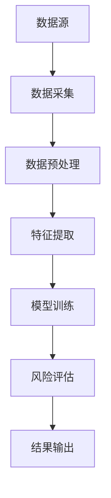
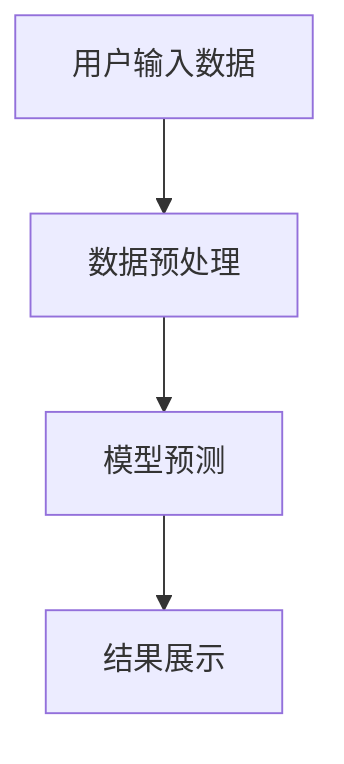

                 


# AI驱动的企业财务风险量化评估系统

## 关键词：AI，财务风险，量化评估，机器学习，系统架构

## 摘要：本文介绍了一种基于人工智能的企业财务风险量化评估系统，详细讲解了系统的构建过程，包括数据处理、模型选择、算法实现和案例分析，帮助读者理解如何利用AI技术进行风险评估和管理。

---

# 第一部分：AI驱动的企业财务风险量化评估系统概述

# 第1章：企业财务风险与AI驱动评估的背景

## 1.1 企业财务风险的基本概念

### 1.1.1 财务风险的定义与分类

- 财务风险是指企业在经营过程中由于内外部因素导致财务损失的可能性。
- 分类包括市场风险、信用风险、流动性风险等。

### 1.1.2 财务风险对企业的影响

- 影响企业的盈利能力、资金链稳定性和市场信用。
- 例如，高财务风险可能导致企业无法偿还债务，影响股东利益。

### 1.1.3 传统财务风险管理方法的局限性

- 传统方法依赖经验判断，主观性强，难以量化。
- 数据处理效率低，难以应对海量数据。

## 1.2 AI技术在财务风险管理中的应用前景

### 1.2.1 AI技术的基本概念与特点

- AI通过机器学习、深度学习等技术，能够自动处理和分析大量数据。
- 具有高效性、自适应性和可扩展性的特点。

### 1.2.2 AI在财务风险管理中的优势

- 提高数据分析效率，发现潜在风险。
- 实现风险的量化评估，提供数据支持。
- 支持实时监控，及时发现异常情况。

## 1.3 本书的核心目标与结构安排

### 1.3.1 本书的研究目标

- 探讨如何利用AI技术构建财务风险量化评估系统。
- 提供系统设计、实现和应用的详细指导。

### 1.3.2 本书的结构安排

- 分为系统概述、算法原理、系统架构、案例分析等部分。
- 结构清晰，内容详实。

### 1.3.3 本书的读者对象

- 适合企业财务管理人员、数据科学家、IT技术人员阅读。

# 第2章：AI驱动的财务风险量化评估系统核心概念

## 2.1 系统的核心概念与组成

### 2.1.1 数据源的获取与处理

- 数据来源包括企业财务报表、市场数据等。
- 数据清洗和特征提取是关键步骤。

### 2.1.2 风险评估模型的构建

- 使用机器学习算法训练模型，评估风险等级。
- 模型的选择需根据数据特点和应用场景。

### 2.1.3 风险量化与结果输出

- 量化风险程度，提供具体的评估结果。
- 输出格式包括数值、图表等，便于决策者理解。

## 2.2 系统的关键特性分析

### 2.2.1 数据驱动性

- 系统依赖大量数据进行训练和预测。
- 数据质量和数量直接影响评估结果。

### 2.2.2 智能性与自适应性

- 系统能够自动学习和优化模型。
- 能够适应数据变化，及时更新评估结果。

### 2.2.3 可解释性与透明性

- 模型需具备可解释性，便于理解结果来源。
- 透明性有助于建立信任，确保评估结果的可靠性。

## 2.3 系统的边界与外延

### 2.3.1 系统的功能边界

- 系统专注于风险评估，不涉及具体的风险应对策略。
- 系统与企业其他管理系统（如ERP）有接口。

### 2.3.2 系统的应用场景

- 适用于企业内部风险管理、投资决策等领域。
- 可用于实时监控，提供动态风险评估。

### 2.3.3 系统与其他系统的接口关系

- 与数据源系统（如财务系统）接口，获取实时数据。
- 与决策支持系统接口，提供风险评估结果。

# 第3章：AI驱动的财务风险量化评估系统架构设计

## 3.1 系统的整体架构

### 3.1.1 数据层

- 数据存储：关系型数据库（如MySQL）或NoSQL数据库（如MongoDB）。
- 数据预处理：清洗、转换和特征提取。

### 3.1.2 计算层

- 数据分析：使用Python、Pandas进行数据处理。
- 模型训练：使用机器学习库（如Scikit-learn）训练模型。

### 3.1.3 应用层

- 用户界面：Web界面或API接口。
- 风险评估结果展示：图表、报告等形式。

## 3.2 系统的功能模块设计

### 3.2.1 数据采集模块

- 从企业财务系统中获取数据。
- 数据格式转换，确保兼容性。

### 3.2.2 数据预处理模块

- 清洗数据：处理缺失值、异常值。
- 特征工程：提取关键特征，如收入增长率、资产负债率。

### 3.2.3 模型训练模块

- 选择合适的算法，如逻辑回归、随机森林。
- 调参优化，提高模型性能。

### 3.2.4 风险评估模块

- 使用训练好的模型进行风险预测。
- 输出风险等级和概率。

## 3.3 系统的流程图设计



# 第4章：AI驱动的财务风险量化评估系统算法原理

## 4.1 线性回归模型

### 4.1.1 线性回归的基本原理

- 假设变量之间存在线性关系。
- 通过最小化预测值与实际值之间的平方差之和来找到最佳拟合线。

### 4.1.2 线性回归的数学模型

$$ y = \beta_0 + \beta_1x + \epsilon $$

- $y$ 是目标变量。
- $x$ 是自变量。
- $\beta_0$ 是截距。
- $\beta_1$ 是回归系数。
- $\epsilon$ 是误差项。

### 4.1.3 线性回归的优缺点

- 优点：简单易懂，计算速度快。
- 缺点：假设线性关系，可能不适用于复杂场景。

## 4.2 支持向量机（SVM）

### 4.2.1 SVM的基本原理

- 将数据映射到高维空间，寻找最优超平面。
- 使用支持向量进行分类。

### 4.2.2 SVM的数学模型

$$ \text{minimize} \quad \frac{1}{2}\|w\|^2 + C\sum_{i=1}^n \xi_i $$
$$ \text{subject to} \quad y_i(w \cdot x_i + b) \geq 1 - \xi_i $$
$$ \xi_i \geq 0 $$

- $w$ 是法向量。
- $b$ 是偏置项。
- $C$ 是惩罚参数。
- $\xi_i$ 是松弛变量。

## 4.3 随机森林

### 4.3.1 随机森林的基本原理

- 由多个决策树组成，通过投票或平均进行预测。
- 能够处理高维数据，具有较强的抗过拟合能力。

### 4.3.2 随机森林的数学模型

- 每棵树的预测结果求平均或多数投票。

### 4.3.3 随机森林的优缺点

- 优点：高准确率，鲁棒性强。
- 缺点：计算复杂度较高。

## 4.4 神经网络

### 4.4.1 神经网络的基本原理

- 模拟人脑神经网络，通过多层处理进行学习。
- 常用卷积神经网络（CNN）和循环神经网络（RNN）。

### 4.4.2 神经网络的数学模型

$$ y = \sigma(wx + b) $$

- $\sigma$ 是激活函数，如ReLU、Sigmoid。
- $w$ 是权重，$b$ 是偏置。

## 4.5 算法选择与模型优化

### 4.5.1 算法选择策略

- 根据数据类型和问题选择合适的算法。
- 对比不同算法的性能，选择最优者。

### 4.5.2 模型优化方法

- 调参：调整学习率、树数等超参数。
- 正则化：防止过拟合。
- 数据增强：增加训练数据的多样性。

# 第5章：AI驱动的财务风险量化评估系统实现

## 5.1 系统开发环境搭建

### 5.1.1 安装必要的工具

- Python：3.6及以上版本。
- 数据处理库：Pandas、NumPy。
- 机器学习库：Scikit-learn、XGBoost。
- 数据可视化库：Matplotlib、Seaborn。
- 深度学习框架：TensorFlow或Keras。

### 5.1.2 安装与配置

- 使用虚拟环境管理依赖。
- 安装步骤示例：

```bash
pip install numpy pandas scikit-learn matplotlib
```

## 5.2 核心代码实现

### 5.2.1 数据预处理

```python
import pandas as pd
import numpy as np

# 读取数据
data = pd.read_csv('financial_data.csv')

# 处理缺失值
data = data.dropna()

# 分离特征与目标变量
X = data.drop(columns=['risk_score'])
y = data['risk_score']
```

### 5.2.2 特征工程

```python
from sklearn.preprocessing import StandardScaler

# 标准化处理
scaler = StandardScaler()
X_scaled = scaler.fit_transform(X)
```

### 5.2.3 模型训练

```python
from sklearn.ensemble import RandomForestClassifier
from sklearn.metrics import accuracy_score

# 初始化模型
model = RandomForestClassifier(n_estimators=100, random_state=42)

# 训练模型
model.fit(X_scaled, y)

# 预测
y_pred = model.predict(X_scaled)

# 计算准确率
print(accuracy_score(y, y_pred))
```

### 5.2.4 模型优化

```python
from sklearn.model_selection import GridSearchCV

# 调参
param_grid = {
    'n_estimators': [100, 200],
    'max_depth': [None, 10, 20],
    'min_samples_split': [2, 5]
}

grid_search = GridSearchCV(model, param_grid, cv=5)
grid_search.fit(X_scaled, y)

# 最佳参数
print(grid_search.best_params_)
```

## 5.3 系统交互设计

### 5.3.1 用户界面设计

- Web界面：用户输入企业财务数据，系统显示风险评估结果。
- API接口：其他系统调用接口获取风险评估结果。

### 5.3.2 系统流程图



## 5.4 系统部署与维护

### 5.4.1 系统部署

- 部署到云服务器，如AWS、阿里云。
- 使用Docker容器化部署，确保环境一致性。

### 5.4.2 系统维护

- 定期更新模型，确保数据新鲜。
- 监控系统性能，及时优化。

# 第6章：AI驱动的财务风险量化评估系统案例分析

## 6.1 案例背景

- 某中型制造企业，希望量化评估其财务风险。
- 数据包括过去三年的财务报表、市场数据等。

## 6.2 数据收集与处理

### 6.2.1 数据来源

- 企业财务系统：收入、支出、资产、负债等数据。
- 市场数据：行业趋势、经济指标。

### 6.2.2 数据清洗

- 删除缺失值，处理异常值。
- 标准化处理，确保特征在同一量纲。

## 6.3 模型训练与评估

### 6.3.1 模型选择

- 选择随机森林模型，因其在分类任务中表现良好。

### 6.3.2 模型训练

```python
# 训练随机森林模型
model = RandomForestClassifier(n_estimators=200, max_depth=10, random_state=42)
model.fit(X_scaled, y)
```

### 6.3.3 模型评估

- 准确率：85%
- 混淆矩阵：展示真阳性、假阳性等。

## 6.4 案例分析与结果解读

### 6.4.1 风险评估结果

- 预测企业在未来季度的财务风险等级为中等偏高。
- 主要风险来源：应收账款增加，存货周转率下降。

### 6.4.2 结果解读

- 提示企业加强应收账款管理，优化库存结构。
- 建议监控市场变化，及时调整财务策略。

## 6.5 案例总结

- 成功实现了企业财务风险的量化评估。
- 系统提供的评估结果为企业决策提供了数据支持。

# 第7章：系统总结与未来展望

## 7.1 系统总结

### 7.1.1 系统优势

- 高效性：自动化处理大量数据。
- 精准性：AI算法提高评估准确性。
- 可扩展性：支持多维度数据输入。

### 7.1.2 系统局限性

- 数据依赖性：模型依赖历史数据，可能无法预测极端情况。
- 黑箱问题：部分模型可解释性差，影响信任度。

## 7.2 未来展望

### 7.2.1 算法优化

- 探索更先进的深度学习模型，如Transformer。
- 结合迁移学习，提升模型泛化能力。

### 7.2.2 应用场景扩展

- 金融领域的信用风险评估。
- 宏观经济预测，辅助政策制定。

### 7.2.3 系统集成

- 与其他管理系统集成，提供全面的决策支持。
- 引入实时数据流处理，提升评估及时性。

## 7.3 最佳实践 Tips

- 数据预处理是关键，确保数据质量。
- 选择合适的模型，结合业务需求。
- 定期更新模型，适应数据变化。
- 注意模型的可解释性，建立信任。

## 7.4 小结

- AI驱动的财务风险量化评估系统具有广阔的应用前景。
- 通过不断优化算法和系统架构，可以进一步提升评估的准确性和效率。

## 7.5 注意事项

- 数据隐私保护：确保数据安全，遵守相关法律法规。
- 模型解释性：尽量选择可解释的模型，便于用户理解。
- 系统稳定性：建立完善的监控机制，及时发现和解决问题。

## 7.6 拓展阅读

- 推荐阅读《机器学习实战》深入理解算法原理。
- 关注领域最新研究，如强化学习在风险控制中的应用。

---

# 结语

通过本文的详细讲解，读者可以系统地了解如何构建和应用AI驱动的企业财务风险量化评估系统。从数据处理到模型训练，再到实际案例分析，每一步都进行了深入探讨。希望本文能为企业的风险管理提供有价值的参考和指导。未来，随着AI技术的不断进步，财务风险管理将更加智能化和精准化。

