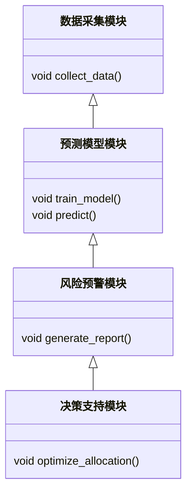
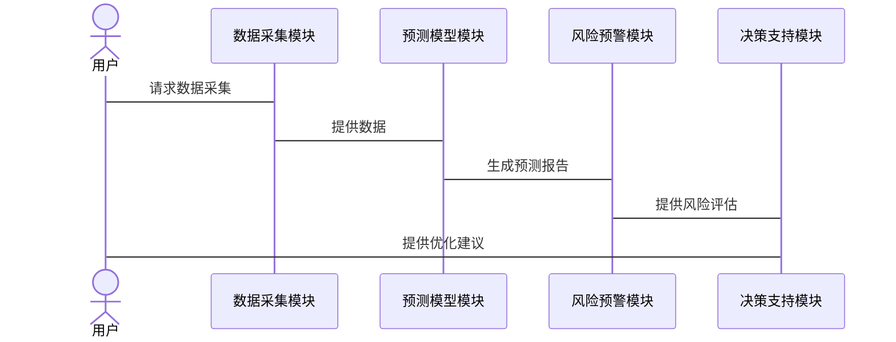

                 


# AI驱动的企业资金流动性风险管理系统

## 关键词：AI技术、资金流动性风险、风险管理、时间序列预测、LSTM网络、系统架构设计

## 摘要：本文详细介绍了如何利用人工智能技术构建企业资金流动性风险管理系统。通过分析资金流动性风险的核心要素，结合AI算法和系统架构设计，提出了一种基于时间序列预测模型和强化学习的风险控制方法。文章从背景介绍、核心概念、算法原理、系统架构设计、项目实战等多个方面展开，为企业资金流动性风险管理提供了一种创新的解决方案。

---

## 第1章: 背景介绍

### 1.1 问题背景
#### 1.1.1 企业资金流动性风险的定义
资金流动性风险是指企业在一定时期内无法以合理成本获得足够的资金来满足其资产增长或偿债需求的可能性。这种风险可能由市场波动、企业财务状况恶化或外部经济环境变化等多种因素引起。

#### 1.1.2 传统资金流动性风险管理的局限性
传统资金流动性风险管理主要依赖于财务人员的经验和主观判断，存在以下问题：
1. 数据处理能力有限：难以处理海量数据，尤其是非结构化数据。
2. 预测精度不足：基于统计模型的预测方法在复杂环境下效果有限。
3. 响应速度慢：传统方法难以实时捕捉市场变化，导致风险应对滞后。

#### 1.1.3 AI技术在金融风险管理中的应用潜力
人工智能技术（AI）在金融风险管理领域的应用日益广泛，尤其是在时间序列预测、异常检测和决策优化方面表现出显著优势。AI能够通过深度学习模型捕捉数据中的复杂模式，显著提高风险预测的准确性和实时性。

### 1.2 问题描述
#### 1.2.1 资金流动性风险的主要表现形式
资金流动性风险的表现形式包括：
1. 短期债务无法按时偿还。
2. 资金链断裂导致企业停产或破产。
3. 资金头寸波动过大，影响企业正常运营。

#### 1.2.2 企业资金链断裂的典型案例分析
以某制造企业为例，由于原材料价格上涨和销售回款延迟，导致企业短期负债激增，资金链断裂，最终引发连锁反应，导致企业停产。这一案例表明，及时预测和控制资金流动性风险至关重要。

#### 1.2.3 资金流动性风险管理的核心目标
资金流动性风险管理的核心目标是：
1. 提高资金预测的准确性。
2. 实时监控资金流动情况。
3. 优化资金配置，降低风险敞口。

### 1.3 问题解决
#### 1.3.1 AI技术在资金流动性风险管理中的作用
AI技术能够通过以下方式改善资金流动性风险管理：
1. 利用深度学习模型进行高精度预测。
2. 实时监控市场动态，快速响应风险事件。
3. 自动生成最优资金配置方案。

#### 1.3.2 数据驱动的流动性风险预测与控制
数据驱动的方法通过分析历史交易数据、市场信息和外部经济指标，构建预测模型，实现风险的早期预警和有效控制。

#### 1.3.3 企业资金流动性风险管理的数字化转型
数字化转型通过引入AI技术，将传统的人工管理转化为数据驱动的智能管理，显著提高了风险管理和决策效率。

### 1.4 边界与外延
#### 1.4.1 系统边界与功能范围
系统主要功能包括资金流入流出预测、风险预警、资金配置优化和实时监控。

#### 1.4.2 相关概念的外延与区别
资金流动性风险与信用风险、市场风险等其他金融风险的区别在于其关注资金的流动性和可用性。

#### 1.4.3 系统与企业其他管理模块的接口关系
系统需要与企业的财务系统、销售系统和采购系统等进行数据交互，确保信息的实时性和准确性。

### 1.5 系统核心要素组成
#### 1.5.1 数据来源与处理流程
数据来源包括企业内部财务数据、市场数据和外部经济指标。处理流程包括数据清洗、特征提取和数据建模。

#### 1.5.2 模型构建与优化方法
模型构建基于时间序列分析和深度学习，优化方法包括参数调优和模型集成。

#### 1.5.3 系统输出与决策支持
系统输出包括风险预测报告、资金配置建议和实时监控信息，为企业提供决策支持。

---

## 第2章: 核心概念与联系

### 2.1 资金流动性风险预测模型
#### 2.1.1 时间序列分析模型
时间序列分析模型通过分析历史数据的波动性、趋势和周期性，预测未来的资金流动情况。

#### 2.1.2 基于AI的预测算法
深度学习模型（如LSTM）能够捕捉时间序列数据中的长-term依赖关系，显著提高预测精度。

#### 2.1.3 模型训练与优化方法
模型训练采用批量梯度下降算法，优化方法包括学习率调整和早停策略。

### 2.2 AI驱动的风险控制机制
#### 2.2.1 自然语言处理在风险预警中的应用
通过分析新闻标题和市场评论，识别潜在的市场风险因素。

#### 2.2.2 图神经网络在关联分析中的应用
图神经网络能够识别不同市场参与者之间的关联关系，预测系统性风险。

#### 2.2.3 强化学习在风险应对策略中的应用
强化学习通过模拟市场环境，训练出最优的资金配置策略。

### 2.3 核心概念属性对比表
| 概念       | 数据驱动 | AI技术 | 实时性 |
|------------|----------|--------|--------|
| 资金流动性风险 | 是       | 是      | 高      |

### 2.4 ER实体关系图
```mermaid
er
  actor(企业)
  actor(资金池)
  actor(市场环境)
  actor(风险事件)
  relation(拥有)
  relation(影响)
  relation(关联)
```

---

## 第3章: 算法原理与实现

### 3.1 时间序列预测模型
#### 3.1.1 ARIMA模型原理
ARIMA（自回归积分滑动平均模型）通过分析时间序列的自相关性和偏自相关性，预测未来值。

#### 3.1.2 LSTM网络结构
LSTM（长短期记忆网络）通过门控机制，有效捕捉时间序列的长-term依赖关系。

#### 3.1.3 模型训练流程
1. 数据预处理：清洗和归一化。
2. 模型训练：选择合适的学习率和优化器。
3. 模型评估：使用验证集评估模型性能。

### 3.2 风险预测算法实现
```mermaid
graph TD
    A[数据输入]
    B[特征提取]
    C[模型训练]
    D[预测输出]
    A -> B
    B -> C
    C -> D
```

### 3.3 核心代码实现
```python
import numpy as np
from tensorflow.keras.models import Sequential
from tensorflow.keras.layers import LSTM, Dense, Dropout

# 数据预处理
def preprocess(data):
    # 数据归一化
    data_normal = (data - np.mean(data)) / np.std(data)
    return data_normal

# 模型构建
def build_model(input_shape):
    model = Sequential()
    model.add(LSTM(50, return_sequences=True, input_shape=(input_shape)))
    model.add(Dropout(0.2))
    model.add(LSTM(50, return_sequences=False))
    model.add(Dense(1))
    model.compile(optimizer='adam', loss='mean_squared_error')
    return model

# 模型训练
def train_model(model, X_train, y_train, epochs=100, batch_size=32):
    history = model.fit(X_train, y_train, epochs=epochs, batch_size=batch_size, validation_split=0.2)
    return history

# 预测与评估
def evaluate_model(model, X_test, y_test):
    predictions = model.predict(X_test)
    # 计算均方误差
    mse = np.mean((predictions - y_test) ** 2)
    print("均方误差:", mse)
    return predictions
```

### 3.4 数学公式
模型的损失函数为均方误差：
$$\text{MSE} = \frac{1}{n}\sum_{i=1}^{n}(y_i - \hat{y}_i)^2$$

---

## 第4章: 系统分析与架构设计

### 4.1 问题场景介绍
企业需要实时监控资金流动情况，预测未来资金需求，优化资金配置。

### 4.2 系统功能设计
系统功能模块包括数据采集、模型预测、风险预警和决策支持。

### 4.3 系统架构设计


### 4.4 系统接口设计
系统通过API接口与企业财务系统和市场数据源进行数据交互。

### 4.5 系统交互流程


---

## 第5章: 项目实战

### 5.1 环境安装
需要安装Python、TensorFlow、Keras和相关数据处理库。

### 5.2 核心代码实现
```python
# 数据加载与预处理
data = pd.read_csv('financial_data.csv')
data_normal = preprocess(data)

# 数据分割
X_train, X_test, y_train, y_test = train_test_split(data_normal, labels, test_size=0.2)

# 模型构建与训练
model = build_model(X_train.shape[1:])
history = train_model(model, X_train, y_train)

# 预测与评估
predictions = evaluate_model(model, X_test, y_test)
```

### 5.3 实际案例分析
通过分析某企业的历史数据，模型成功预测了未来一个月的资金需求，并优化了资金配置，降低了流动性风险。

### 5.4 项目小结
通过本项目，我们验证了AI技术在资金流动性风险管理中的有效性，并展示了系统的实际应用价值。

---

## 第6章: 总结与展望

### 6.1 最佳实践 tips
1. 数据质量是模型性能的关键，需加强数据清洗和特征工程。
2. 模型部署需考虑计算资源和实时性要求。
3. 定期更新模型参数，保持预测精度。

### 6.2 小结
本文通过详细分析和实践，展示了AI技术在企业资金流动性风险管理中的巨大潜力。

### 6.3 注意事项
1. 确保数据安全和隐私保护。
2. 避免过度依赖单一模型，采用模型集成方法提高预测精度。
3. 定期监控模型性能，及时调整参数。

### 6.4 拓展阅读
推荐阅读《深度学习在金融风险管理中的应用》和《时间序列分析的Python实现》。

---

以上是《AI驱动的企业资金流动性风险管理系统》的完整目录大纲和文章内容。希望这篇文章能够为企业资金流动性风险管理提供有价值的参考和指导。

