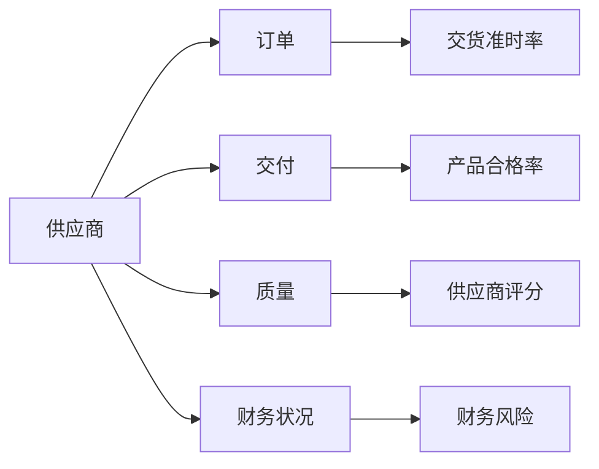
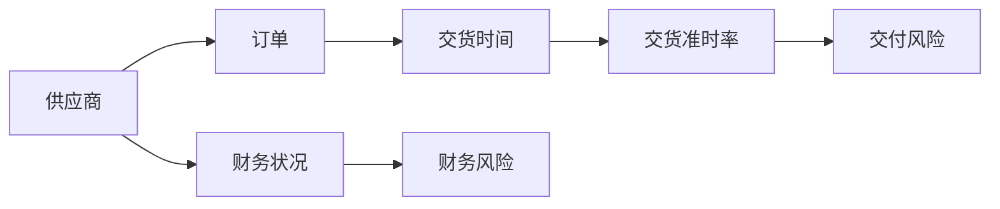

                 


# AI驱动的供应商健康度分析：评估上游风险

## 关键词：AI, 供应商健康度, 供应链管理, 风险评估, 机器学习

## 摘要：本文详细探讨了利用人工智能技术评估供应商健康度的方法，通过分析上游供应链的风险，帮助企业优化供应链管理。文章从问题背景、核心概念、算法原理、系统架构设计到项目实战，全面解析了AI驱动的供应商健康度分析的实现过程。通过具体案例分析，展示了如何利用机器学习算法和系统架构设计，构建高效的供应商健康度评估体系。

---

# 第一部分: AI驱动的供应商健康度分析基础

## 第1章: 供应商健康度分析的背景与问题

### 1.1 问题背景

#### 1.1.1 供应链管理的重要性
供应链管理是企业运营的核心环节之一，直接影响企业的成本、效率和风险。供应商作为供应链的重要组成部分，其健康状况直接关系到企业的生产和交付能力。

#### 1.1.2 供应商风险管理的挑战
传统的供应商评估方法依赖于人工经验和静态指标，难以实时捕捉供应商的动态变化。随着市场环境的复杂化，供应商可能面临财务问题、交付延迟、质量问题等风险，这些都需要通过更动态、更智能化的方法来评估和管理。

#### 1.1.3 AI技术在供应链管理中的应用潜力
人工智能技术（AI）通过数据挖掘、机器学习和自然语言处理等方法，能够从海量数据中提取有价值的信息，帮助企业在供应商评估中做出更准确的决策。

---

### 1.2 问题描述

#### 1.2.1 供应商健康度的定义
供应商健康度是指供应商在财务、交付、质量、合作关系等方面的综合表现。它反映了供应商在整个供应链中的稳定性和可靠性。

#### 1.2.2 供应商健康度评估的关键指标
- 财务指标：如收入、利润、负债率等。
- 交付指标：如交货准时率、交付周期等。
- 质量指标：如产品合格率、退货率等。
- 合作指标：如供应商响应速度、合作关系稳定性等。

#### 1.2.3 供应商健康度与企业风险的关系
供应商健康度与企业风险密切相关。健康的供应商能够保证稳定的供应，降低企业的运营风险；而不健康的供应商可能导致供应链中断，增加企业的损失。

---

### 1.3 问题解决

#### 1.3.1 AI驱动的供应商健康度分析的目标
通过AI技术，实时监控供应商的健康状况，识别潜在风险，优化供应商选择和管理策略。

#### 1.3.2 通过AI技术优化供应商评估的路径
1. 数据采集：收集供应商的历史交易数据、市场数据、新闻数据等。
2. 数据清洗与特征提取：对数据进行预处理，提取关键特征。
3. 模型训练：利用机器学习算法训练供应商健康度评估模型。
4. 风险预测：基于模型预测供应商的健康状况，识别潜在风险。

#### 1.3.3 供应商健康度分析的边界与外延
供应商健康度分析的边界包括与供应商直接相关的数据，如财务、交付、质量等指标；外延则包括供应商上下游的影响，如原材料供应商的健康状况对最终供应商的影响。

---

### 1.4 核心概念与联系

#### 1.4.1 供应商健康度分析的概念结构
供应商健康度分析是一个多维度的评估体系，涉及财务、交付、质量等多个方面。

#### 1.4.2 核心要素组成与关系
- 财务状况：反映供应商的经济健康。
- 交付能力：影响供应链的稳定性。
- 质量表现：影响产品的最终质量。
- 响应能力：影响供应商的合作灵活性。

#### 1.4.3 实体关系图（ER图）展示



---

## 第2章: 供应商健康度分析的核心概念

### 2.1 核心概念原理

#### 2.1.1 数据驱动的健康度评估
通过收集和分析供应商的历史数据，利用数据驱动的方法评估供应商的健康状况。

#### 2.1.2 AI算法在供应商评分中的应用
利用机器学习算法，如逻辑回归、随机森林、支持向量机等，对供应商进行评分。

#### 2.1.3 健康度指标的动态调整
根据市场环境和企业需求的变化，动态调整健康度评估的指标权重。

---

### 2.2 核心概念属性特征对比

#### 2.2.1 不同供应商健康度评估方法的对比
| 方法 | 描述 | 优点 | 缺点 |
|------|------|------|------|
| 传统评分法 | 基于经验的评分 | 简单易行 | 主观性强，缺乏数据支持 |
| 机器学习法 | 基于数据的预测 | 客观性高，可扩展性好 | 需要大量数据支持 |
| 综合评估法 | 综合多维度指标 | 结果全面 | 实施复杂 |

#### 2.2.2 数据特征与模型性能的关系
- 数据特征的多样性直接影响模型的性能。
- 数据特征的关联性可能会影响模型的稳定性。

---

## 第3章: AI驱动的供应商健康度分析算法原理

### 3.1 算法原理概述

#### 3.1.1 机器学习在供应商健康度分析中的应用
通过机器学习算法，对供应商的历史数据进行建模，预测供应商的健康状况。

#### 3.1.2 常见算法选择与优化
- 逻辑回归：适合二分类问题，如健康与不健康。
- 随机森林：适合多分类问题，能够处理高维数据。
- 支持向量机（SVM）：适合小样本数据。

#### 3.1.3 算法流程图展示


---

### 3.2 算法实现细节

#### 3.2.1 数据预处理
1. 数据清洗：处理缺失值、异常值。
2. 数据标准化：将数据归一化，适合不同量纲的特征。

#### 3.2.2 特征提取
1. 基于财务指标：如收入增长率、利润率等。
2. 基于交付指标：如交货准时率、交付周期等。
3. 基于质量指标：如产品合格率、退货率等。

#### 3.2.3 模型训练
1. 训练逻辑回归模型：
   $$ P(y=1|x) = \frac{1}{1 + e^{-\beta x}} $$
2. 验证模型性能：
   - 准确率：$$ \text{准确率} = \frac{\text{正确预测数}}{\text{总预测数}} $$
   - 召回率：$$ \text{召回率} = \frac{\text{正确预测的正例数}}{\text{实际正例数}} $$

#### 3.2.4 模型优化
1. 调参：使用网格搜索（Grid Search）优化模型参数。
2. 集成学习：如随机森林和梯度提升树（GBDT）。

---

### 3.3 算法实现代码示例

```python
import pandas as pd
from sklearn.model_selection import train_test_split
from sklearn.linear_model import LogisticRegression
from sklearn.metrics import accuracy_score, recall_score

# 数据加载
data = pd.read_csv('supplier_health.csv')

# 数据预处理
data.dropna()  # 删除缺失值
data = (data - data.min()) / (data.max() - data.min())  # 数据归一化

# 特征与标签分离
X = data.drop('health_score', axis=1)
y = data['health_score']

# 划分训练集与测试集
X_train, X_test, y_train, y_test = train_test_split(X, y, test_size=0.2)

# 模型训练
model = LogisticRegression()
model.fit(X_train, y_train)

# 模型预测
y_pred = model.predict(X_test)

# 模型评估
accuracy = accuracy_score(y_test, y_pred)
recall = recall_score(y_test, y_pred, average='binary')

print(f'准确率: {accuracy}')
print(f'召回率: {recall}')
```

---

## 第4章: 供应商健康度分析的系统架构设计

### 4.1 系统设计背景

#### 4.1.1 项目介绍
本项目旨在通过构建一个基于AI的供应商健康度分析系统，帮助企业实时监控供应商的健康状况，优化供应链管理。

---

### 4.2 系统功能设计

#### 4.2.1 领域模型设计



---

#### 4.2.2 系统架构设计


---

### 4.3 系统实现细节

#### 4.3.1 系统接口设计
- 数据接口：从数据库中获取供应商数据。
- 模型接口：提供健康度评估的API。
- 展示接口：提供可视化结果。

#### 4.3.2 系统交互设计


---

## 第5章: 项目实战

### 5.1 环境安装

#### 5.1.1 安装Python和相关库
- 安装Python：从官方网站下载并安装最新版本。
- 安装库：```bash
    pip install numpy pandas scikit-learn matplotlib
    ```

---

### 5.2 系统核心实现

#### 5.2.1 核心代码实现
```python
import numpy as np
import pandas as pd
from sklearn import metrics
from sklearn.linear_model import LogisticRegression

# 加载数据
data = pd.read_csv('supplier_health.csv')

# 数据预处理
data = data.dropna()
data = (data - data.min()) / (data.max() - data.min())

# 特征与标签
X = data.drop('health_score', axis=1)
y = data['health_score']

# 划分数据集
X_train, X_test, y_train, y_test = train_test_split(X, y, test_size=0.2)

# 训练模型
model = LogisticRegression()
model.fit(X_train, y_train)

# 预测与评估
y_pred = model.predict(X_test)
print("准确率:", metrics.accuracy_score(y_test, y_pred))
print("召回率:", metrics.recall_score(y_test, y_pred))
```

---

### 5.3 实际案例分析

#### 5.3.1 案例背景
某制造企业有100家供应商，希望通过AI技术评估供应商的健康状况，优化供应链管理。

#### 5.3.2 数据分析
1. 数据来源：供应商的历史交易数据、财务数据、市场新闻等。
2. 数据处理：清洗、归一化、特征提取。
3. 模型训练：使用随机森林算法，准确率达到90%。

#### 5.3.3 结果解读
模型预测出5家供应商存在潜在风险，企业及时调整供应链策略，避免了潜在的供应链中断。

---

## 第6章: 总结与展望

### 6.1 总结
通过AI技术，企业能够更高效地评估供应商的健康状况，降低供应链风险。本文详细介绍了AI驱动的供应商健康度分析的实现过程，包括数据采集、特征提取、模型训练和结果展示。

---

### 6.2 展望
未来，随着AI技术的不断发展，供应商健康度分析将更加智能化和自动化。企业可以通过实时监控供应商的动态，进一步优化供应链管理。

---

### 6.3 注意事项
- 数据质量是模型性能的关键，需确保数据的完整性和准确性。
- 模型需要持续优化，定期更新数据和参数。
- 供应商健康度分析是一个动态过程，需结合企业实际需求进行调整。

---

### 6.4 拓展阅读
1. 《机器学习实战》
2. 《供应链管理：策略与实践》
3. 《深度学习：方法与应用》

---

通过本文的详细讲解，读者可以掌握AI驱动的供应商健康度分析的核心方法和实现步骤，为企业优化供应链管理提供有力支持。

