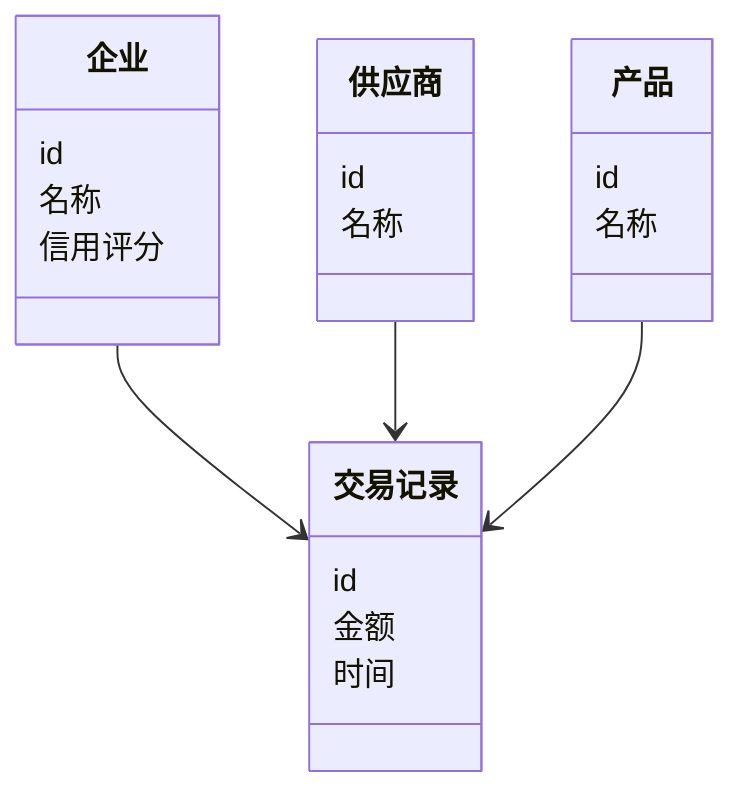

                 


# AI驱动的供应链金融信用评分模型

> 关键词：供应链金融，人工智能，信用评分，机器学习，深度学习

> 摘要：供应链金融作为现代企业运营的关键环节，其信用评分模型在确保资金流动性和安全性方面发挥着重要作用。本文探讨了如何利用AI技术构建高效的信用评分模型，涵盖了从基础概念到实际应用的全过程，包括算法原理、系统架构设计和项目实战等。

---

## 第1章: 背景介绍

### 1.1 供应链金融的背景与现状
#### 1.1.1 供应链金融的基本概念
供应链金融是指围绕企业供应链上的各个参与方（供应商、制造商、分销商、零售商等）提供的资金支持。其目的是优化现金流，降低运营成本，并确保供应链的稳定性和高效性。

#### 1.1.2 供应链金融的发展历程
从传统的银行贷款到现代的数字化融资，供应链金融经历了多个阶段的发展。随着技术的进步，尤其是AI技术的引入，供应链金融的效率和准确性得到了显著提升。

#### 1.1.3 当前供应链金融面临的挑战
- 数据孤岛问题：不同环节的数据分散，难以整合。
- 风险评估复杂：涉及多个变量和动态变化。
- 传统模型的局限性：难以捕捉复杂关系，导致评估不准确。

### 1.2 信用评分模型的必要性
#### 1.2.1 信用评分模型的基本概念
信用评分模型通过分析企业的财务状况、交易历史、市场表现等多方面因素，评估其信用风险，从而决定贷款额度和利率。

#### 1.2.2 供应链金融中信用评分的重要性
准确的信用评分能够帮助金融机构降低坏账率，同时确保供应链上的企业能够及时获得所需资金，维持供应链的稳定运行。

#### 1.2.3 AI技术在信用评分中的应用潜力
AI技术，特别是机器学习和深度学习，能够处理大量非结构化数据，发现传统模型难以捕捉的模式和关系，从而提高信用评分的准确性和实时性。

---

## 第2章: 核心概念与原理

### 2.1 供应链金融信用评分模型的构成
#### 2.1.1 数据来源与特征
数据来源包括企业财务报表、供应链交易记录、市场数据、新闻报道等。特征包括财务指标（如资产负债率）、交易频率、供应商稳定性等。

#### 2.1.2 模型构建与评估
模型构建需要选择合适的算法，进行特征工程，训练模型，并通过交叉验证等方法评估模型的性能。

#### 2.1.3 结果应用与反馈
模型的应用包括自动化贷款审批、风险预警等，同时通过反馈机制不断优化模型。

### 2.2 AI技术在信用评分中的应用
#### 2.2.1 机器学习算法的选择与优化
常用的算法包括逻辑回归、随机森林、支持向量机等。选择合适的算法并进行参数调优是关键。

#### 2.2.2 自然语言处理在信用评估中的应用
通过分析企业新闻、行业报告等文本数据，提取情感倾向、关键词等信息，丰富信用评估的维度。

#### 2.2.3 图神经网络在供应链关系中的应用
图神经网络能够建模复杂的供应链关系，捕捉企业之间的关联性，提高信用评估的准确性。

---

## 第3章: 核心概念对比与ER实体关系图

### 3.1 核心概念对比
#### 3.1.1 不同信用评分模型的对比分析
- 传统信用评分模型：基于财务指标，评估单一企业。
- AI驱动的信用评分模型：结合多维度数据，评估企业及其供应链关系。

#### 3.1.2 AI驱动模型与传统模型的差异
- 数据来源更广泛。
- 模型复杂度更高，能够捕捉非线性关系。
- 可扩展性更好，能够处理大规模数据。

#### 3.1.3 各种算法的优缺点
- 逻辑回归：解释性强，但表现受限。
- 随机森林：鲁棒性强，但可解释性差。
- 深度学习：表现最佳，但计算资源需求高。

### 3.2 ER实体关系图
```mermaid
erd
 供应商
   id
   名称
   联系方式
 产品
   id
   名称
   规格
 交易记录
   id
   供应商id
   产品id
   交易金额
   交易时间
 企业
   id
   名称
   联系方式
   信用评分
```

---

## 第4章: 算法原理与实现

### 4.1 机器学习算法原理
#### 4.1.1 逻辑回归
逻辑回归通过 sigmoid 函数将线性组合映射到概率空间，用于分类任务。

$$ P(y=1) = \frac{1}{1 + e^{-z}} $$

其中，z 是线性组合：$$ z = w_1x_1 + w_2x_2 + ... + w_nx_n + b $$

#### 4.1.2 随机森林
随机森林通过构建多个决策树，并通过投票或平均的方式进行预测，具有较强的抗过拟合能力。

#### 4.1.3 支持向量机
支持向量机通过找到超平面，将数据分成两类，适用于小规模数据。

### 4.2 算法实现与代码示例
#### 4.2.1 数据预处理
```python
import pandas as pd
data = pd.read_csv('credit_data.csv')
data = data.dropna()
```

#### 4.2.2 模型训练
```python
from sklearn.ensemble import RandomForestClassifier
model = RandomForestClassifier()
model.fit(X_train, y_train)
```

#### 4.2.3 模型评估
```python
from sklearn.metrics import accuracy_score
print("Accuracy:", accuracy_score(y_test, model.predict(X_test)))
```

---

## 第5章: 系统分析与架构设计方案

### 5.1 系统功能设计
#### 5.1.1 领域模型


#### 5.1.2 系统架构设计


---

## 第6章: 项目实战

### 6.1 环境安装
```bash
pip install pandas scikit-learn matplotlib
```

### 6.2 核心代码实现
```python
import pandas as pd
from sklearn.model_selection import train_test_split
from sklearn.ensemble import RandomForestClassifier
from sklearn.metrics import accuracy_score

# 加载数据
data = pd.read_csv('credit_data.csv')

# 数据分割
X = data.drop('credit_score', axis=1)
y = data['credit_score']
X_train, X_test, y_train, y_test = train_test_split(X, y, test_size=0.2)

# 模型训练
model = RandomForestClassifier()
model.fit(X_train, y_train)

# 模型评估
print("Accuracy:", accuracy_score(y_test, model.predict(X_test)))
```

---

## 第7章: 总结与展望

### 7.1 总结
本文详细探讨了AI驱动的供应链金融信用评分模型的构建过程，从背景到实现，全面分析了其优势和挑战。

### 7.2 展望
未来，随着AI技术的不断发展，供应链金融的信用评分模型将更加智能化和个性化，为企业的融资和风险管理提供更有力的支持。

---

通过以上结构，文章系统地介绍了AI在供应链金融信用评分中的应用，从理论到实践，为读者提供了全面的指导和参考。

