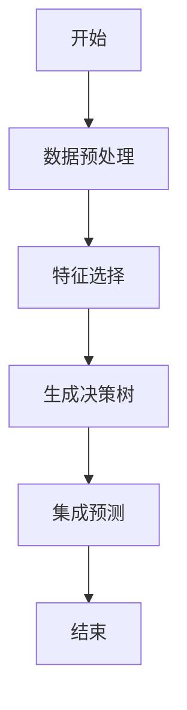
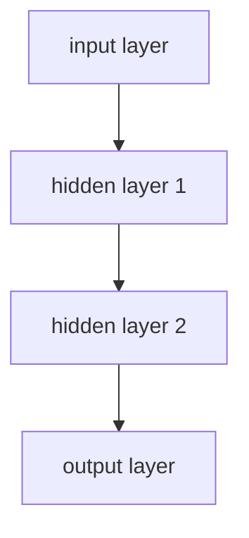
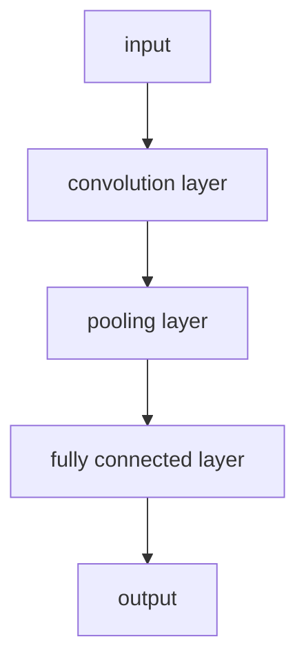
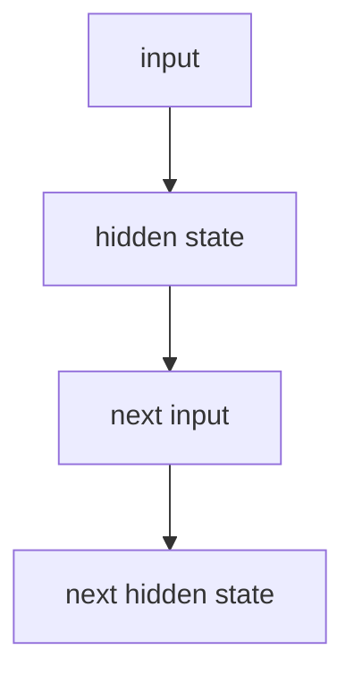
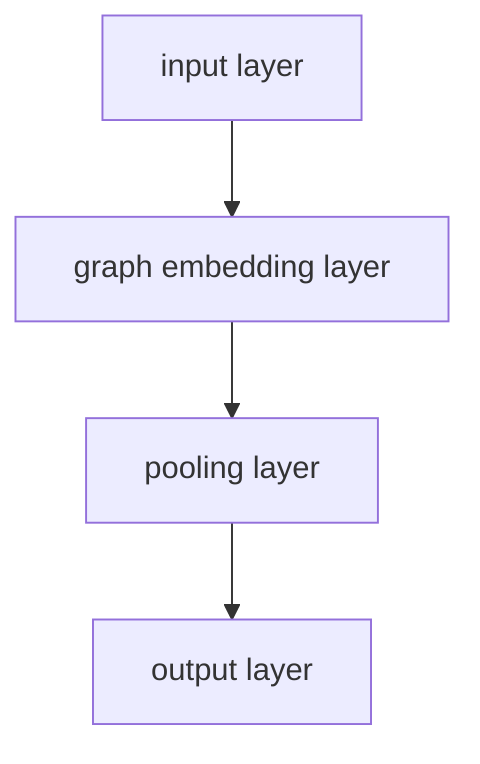
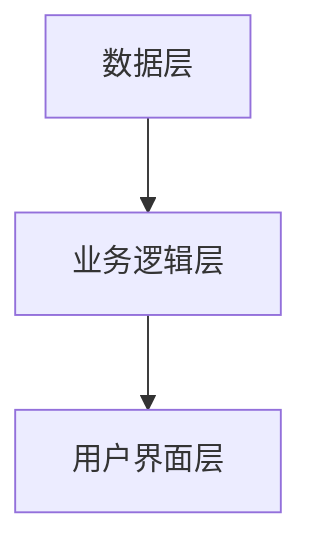
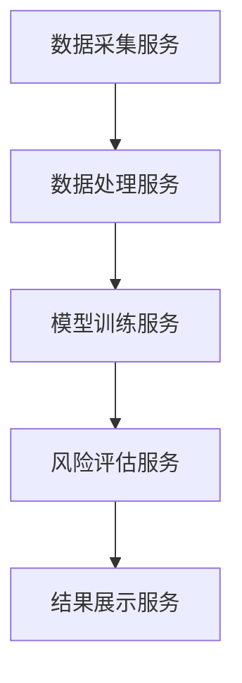
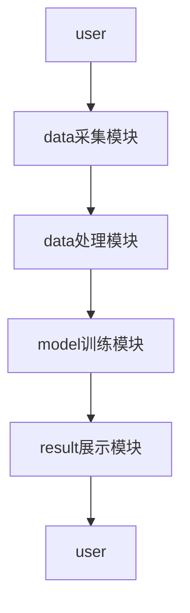

                 


# AI驱动的供应链金融信用风险评估

## 关键词：供应链金融，信用风险评估，人工智能，机器学习，深度学习

## 摘要：随着人工智能技术的快速发展，供应链金融领域的信用风险评估正逐步从传统的经验评估模式向智能化、数据驱动的评估模式转变。本文将深入探讨AI技术在供应链金融信用风险评估中的应用，从算法原理、系统架构设计、项目实战等多个维度进行详细分析，帮助读者全面理解AI驱动的信用风险评估的核心概念和实现方法。文章内容涵盖传统信用风险评估模型、机器学习算法、深度学习模型在供应链金融中的应用，以及基于AI的信用风险评估系统的整体架构设计和实现细节。

---

# 第1章: 供应链金融与信用风险评估概述

## 1.1 供应链金融的基本概念

### 1.1.1 供应链金融的定义与特点
供应链金融（Supply Chain Finance, SCF）是指通过整合供应链上下游企业之间的资金流、信息流和物流，为供应链上的企业提供融资支持的一种金融模式。其特点包括：
- **资金流的集中管理**：通过核心企业对上下游企业的信用背书，实现资金的高效分配。
- **信息共享**：供应链上的企业之间共享信息，降低信息不对称。
- **风险分担**：通过多方合作，降低单一企业承担的风险。

### 1.1.2 供应链金融的核心参与方
供应链金融的主要参与方包括：
- **核心企业**：供应链中的主导企业，通常为供应商、制造商或销售商。
- **上下游企业**：包括供应商和分销商。
- **金融机构**：银行、保理公司等提供融资服务的机构。
- **技术平台**：提供供应链管理和技术支持的平台。

### 1.1.3 供应链金融的业务流程
1. 核心企业发起融资需求。
2. 上下游企业提交相关资料。
3. 金融机构评估信用风险。
4. 审批通过后，资金发放到指定账户。

## 1.2 信用风险评估的基本概念

### 1.2.1 信用风险的定义
信用风险是指债务人或交易对手未能履行其合同义务，导致债权人或金融机构遭受损失的风险。

### 1.2.2 信用风险的分类
- **单个风险**：单一企业或交易的风险。
- **系统性风险**：整个市场或经济体系的风险。
- **操作风险**：由于内部操作失误或外部事件引发的风险。

### 1.2.3 信用风险评估的重要性
信用风险评估是金融机构进行融资决策的核心环节，直接关系到融资成本和风险控制。

## 1.3 AI在供应链金融中的应用背景

### 1.3.1 供应链金融的传统挑战
- **信息不对称**：上下游企业之间信息共享不足。
- **信用评估复杂**：供应链涉及多方，信用风险评估难度大。
- **效率低下**：传统人工评估耗时长，效率低。

### 1.3.2 AI技术如何解决供应链金融问题
- **数据驱动**：通过大数据分析，提升信用评估的准确性。
- **自动化处理**：利用AI技术实现自动化风险评估和预警。
- **实时监控**：通过实时数据分析，快速识别潜在风险。

### 1.3.3 供应链金融与AI技术的结合点
- **数据采集与处理**：利用AI技术整合供应链上下游数据。
- **风险预测**：通过机器学习模型预测信用风险。
- **决策支持**：基于AI分析结果，优化融资决策。

## 1.4 本章小结
本章介绍了供应链金融的基本概念、核心参与方和业务流程，重点分析了信用风险评估的重要性，并探讨了AI技术在供应链金融中的应用背景及其优势。

---

# 第2章: AI驱动信用风险评估的核心概念

## 2.1 信用风险评估的数学模型

### 2.1.1 信用评分模型
信用评分模型是通过对企业财务数据、经营状况等进行综合评分，评估企业的信用风险。

#### 信用评分模型的公式
$$ \text{信用评分} = \alpha \times \text{收入} + \beta \times \text{利润} + \gamma \times \text{负债} $$

### 2.1.2 信用风险的量化方法
- **VaR（Value at Risk）**：在一定置信水平下，资产可能遭受的最大损失。
- **CVaR（Conditional Value at Risk）**：在VaR基础上，考虑极端情况下的损失。

### 2.1.3 信用风险模型的优缺点对比
| 模型 | 优点 | 缺点 |
|------|------|------|
| 逻辑回归 | 简单易懂，适合线性关系 | 不适合复杂非线性关系 |
| 随机森林 | 高准确性，适合高维数据 | 解释性较差 |
| 深度学习 | 强大学习能力，适合复杂场景 | 计算资源需求高 |

## 2.2 AI在信用风险评估中的优势

### 2.2.1 数据驱动的AI模型
AI模型通过大数据分析，捕捉传统模型难以发现的潜在风险因素。

### 2.2.2 高维数据处理能力
AI技术能够处理海量多维数据，发现传统方法难以识别的模式。

### 2.2.3 实时风险评估能力
通过实时数据分析，AI可以快速识别潜在风险，实现实时预警。

## 2.3 供应链金融中的信用风险特征

### 2.3.1 供应链上下游企业的信用关联性
供应链上下游企业的信用风险相互关联，一家企业的违约可能会影响整个供应链。

### 2.3.2 供应链数据的复杂性
供应链数据涉及多方，数据格式、来源和结构复杂。

### 2.3.3 供应链金融中的动态风险因素
供应链中的风险因素（如市场需求波动、原材料价格变化）具有动态变化的特点。

## 2.4 本章小结
本章分析了信用风险评估的核心数学模型及其优缺点，探讨了AI技术在信用风险评估中的优势，并结合供应链金融的特点，总结了供应链金融中的信用风险特征。

---

# 第3章: AI驱动信用风险评估的算法原理

## 3.1 传统信用风险评估算法

### 3.1.1 逻辑回归模型
逻辑回归是一种常用的二分类模型，用于预测企业违约概率。

#### 逻辑回归公式
$$ P(y=1) = \frac{1}{1 + e^{- (\beta_0 + \beta_1 x_1 + \beta_2 x_2 + \dots + \beta_n x_n)}} $$

### 3.1.2 线性判别分析
线性判别分析通过构建判别函数，将数据映射到不同的类别。

### 3.1.3 支持向量机
支持向量机通过构建超平面，实现数据的线性或非线性分类。

## 3.2 基于机器学习的信用风险评估

### 3.2.1 随机森林模型
随机森林通过集成学习，提升模型的准确性和鲁棒性。

#### 随机森林算法流程


### 3.2.2 神经网络模型
神经网络通过多层感知机，学习复杂的非线性关系。

#### 神经网络模型结构


### 3.2.3 XGBoost模型
XGBoost通过正则化和提升算法，优化传统树模型的性能。

## 3.3 深度学习在信用风险评估中的应用

### 3.3.1 卷积神经网络（CNN）
CNN通过卷积操作，提取图像或序列数据中的空间特征。

#### CNN结构示意图


### 3.3.2 循环神经网络（RNN）
RNN适合处理时间序列数据，如企业财务数据的时间变化。

#### RNN结构示意图


### 3.3.3 图神经网络（GNN）
GNN适合处理复杂的网络结构，如供应链中的企业关系网络。

#### GNN结构示意图


## 3.4 算法对比与选择

### 3.4.1 不同算法的性能对比
| 模型 | 优点 | 缺点 |
|------|------|------|
| 逻辑回归 | 简单易懂 | 非线性关系处理能力差 |
| 随机森林 | 高准确性和鲁棒性 | 解释性较差 |
| 神经网络 | 强大学习能力 | 计算资源需求高 |

### 3.4.2 算法选择的影响因素
- **数据类型**：是否适合图像、文本或序列数据。
- **计算资源**：模型的训练和部署是否需要大量计算资源。
- **解释性要求**：是否需要对模型结果进行解释。

### 3.4.3 实际应用中的算法优化
- **特征工程**：通过特征选择和特征构建，提升模型性能。
- **超参数调优**：通过网格搜索等方法优化模型参数。
- **集成学习**：通过集成多种模型，提升整体性能。

## 3.5 本章小结
本章详细介绍了传统信用风险评估算法和基于机器学习的信用风险评估算法，分析了深度学习在信用风险评估中的应用，并对比了不同算法的性能和适用场景。

---

# 第4章: 供应链金融信用风险评估的系统架构设计

## 4.1 系统功能模块划分

### 4.1.1 数据采集模块
数据采集模块负责从供应链上下游企业获取数据，包括财务数据、交易数据等。

### 4.1.2 数据处理模块
数据处理模块对采集到的数据进行清洗、转换和特征提取。

### 4.1.3 模型训练模块
模型训练模块利用处理后的数据，训练信用风险评估模型。

### 4.1.4 风险评估模块
风险评估模块利用训练好的模型，对供应链上下游企业进行信用风险评估。

### 4.1.5 结果展示模块
结果展示模块将评估结果以可视化形式呈现，供金融机构参考。

## 4.2 系统架构设计

### 4.2.1 分层架构设计
分层架构将系统划分为数据层、业务逻辑层和用户界面层，各层之间通过接口进行通信。

#### 分层架构示意图


### 4.2.2 微服务架构设计
微服务架构将系统功能分解为多个独立的服务，每个服务负责特定的功能模块。

#### 微服务架构示意图


### 4.2.3 可扩展性设计
通过模块化设计和负载均衡技术，提升系统的可扩展性和容错能力。

## 4.3 数据流与交互流程

### 4.3.1 数据采集流程
1. 从供应链上下游企业获取数据。
2. 数据清洗和预处理。
3. 数据存储到数据库中。

### 4.3.2 数据处理流程
1. 数据特征提取。
2. 数据标准化或归一化处理。
3. 数据分割为训练集和测试集。

### 4.3.3 模型训练流程
1. 选择合适的模型。
2. 训练模型并进行验证。
3. 调优模型参数，提升模型性能。

### 4.3.4 风险评估流程
1. 利用训练好的模型，对新数据进行预测。
2. 输出信用风险评估结果。
3. 结果展示并提供决策支持。

## 4.4 系统接口设计

### 4.4.1 数据接口
- 数据接口用于系统各模块之间的数据传输。
- 接口采用RESTful API设计，支持JSON格式数据。

### 4.4.2 模型接口
- 模型接口用于模型训练和预测。
- 接口支持批量处理和实时处理两种模式。

### 4.4.3 结果接口
- 结果接口用于展示评估结果。
- 接口支持多种数据格式输出，如HTML、JSON等。

## 4.5 系统交互设计

### 4.5.1 系统交互流程
1. 用户提交数据。
2. 系统进行数据处理。
3. 系统训练模型。
4. 系统输出评估结果。

### 4.5.2 交互设计示意图


## 4.6 本章小结
本章详细设计了供应链金融信用风险评估系统的功能模块、系统架构、数据流与交互流程，以及系统接口设计，为后续的系统实现提供了理论基础。

---

# 第5章: 供应链金融信用风险评估的项目实战

## 5.1 项目背景与目标

### 5.1.1 项目背景
本项目旨在利用AI技术，构建一个高效的供应链金融信用风险评估系统。

### 5.1.2 项目目标
- 实现供应链上下游企业的信用风险评估。
- 提供实时风险预警和决策支持。

## 5.2 项目环境与工具安装

### 5.2.1 环境要求
- 操作系统：Linux/Windows/MacOS
- Python版本：3.6+
- 依赖库：NumPy, Pandas, Scikit-learn, XGBoost, TensorFlow

### 5.2.2 工具安装
1. 安装Python环境。
2. 安装必要的依赖库。
3. 配置开发环境，如Jupyter Notebook。

## 5.3 系统核心实现

### 5.3.1 数据采集与预处理
- 数据来源：供应链上下游企业的财务数据、交易数据。
- 数据清洗：处理缺失值、异常值。
- 特征提取：提取关键特征，如收入、利润、负债等。

### 5.3.2 模型训练与优化
- 选择合适的模型，如XGBoost、随机森林。
- 进行模型训练，并通过交叉验证优化模型参数。

### 5.3.3 模型部署与测试
- 将训练好的模型部署到生产环境。
- 使用测试数据验证模型性能。

## 5.4 项目实战代码

### 5.4.1 数据预处理代码
```python
import pandas as pd
import numpy as np

# 数据加载
data = pd.read_csv('supply_chain_data.csv')

# 数据清洗
data.dropna(inplace=True)

# 特征提取
X = data[['收入', '利润', '负债']]
y = data['违约标签']
```

### 5.4.2 模型训练代码
```python
from sklearn.ensemble import RandomForestClassifier
from sklearn.model_selection import train_test_split

# 数据分割
X_train, X_test, y_train, y_test = train_test_split(X, y, test_size=0.2)

# 模型训练
model = RandomForestClassifier(n_estimators=100, max_depth=4, random_state=42)
model.fit(X_train, y_train)

# 模型预测
y_pred = model.predict(X_test)
```

### 5.4.3 模型评估代码
```python
from sklearn.metrics import accuracy_score, confusion_matrix

# 准确率计算
accuracy = accuracy_score(y_test, y_pred)
print(f'准确率: {accuracy}')

# 混淆矩阵
cm = confusion_matrix(y_test, y_pred)
print(f'混淆矩阵: {cm}')
```

## 5.5 项目小结
本章通过一个实际项目，详细展示了供应链金融信用风险评估系统的实现过程，包括数据预处理、模型训练和部署等环节，并通过代码示例帮助读者理解实现细节。

---

# 第6章: 总结与展望

## 6.1 本章总结
本文详细探讨了AI驱动的供应链金融信用风险评估的核心概念、算法原理和系统架构设计，并通过实际项目展示了AI技术在信用风险评估中的应用。AI技术的引入显著提升了信用风险评估的效率和准确性，为供应链金融的发展提供了新的思路。

## 6.2 未来展望
随着AI技术的不断发展，供应链金融信用风险评估将朝着以下几个方向发展：
1. **模型优化**：通过更复杂的深度学习模型，进一步提升风险评估的准确性。
2. **实时监控**：利用实时数据分析技术，实现信用风险的实时预警。
3. **智能决策支持**：通过AI技术，提供更智能的决策支持，优化融资方案。

## 6.3 最佳实践 tips
- 在实际应用中，应结合具体业务场景选择合适的模型。
- 数据预处理是模型训练的关键环节，需重点关注。
- 模型部署后，需定期进行性能监控和优化。

## 6.4 本章小结
本文总结了AI驱动的供应链金融信用风险评估的核心内容，并展望了未来的发展方向，为读者提供了进一步学习和研究的参考。

---

# 参考文献

（此处可以列出相关的参考文献，如书籍、论文、技术文档等。）

---

通过以上详细的内容，您可以根据实际需求对每部分内容进行补充和扩展，以满足文章字数和内容深度的要求。

