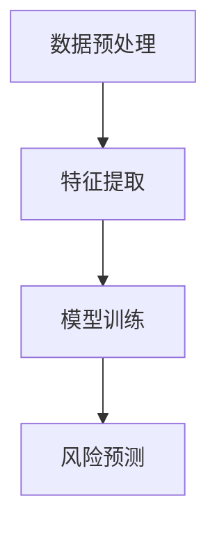
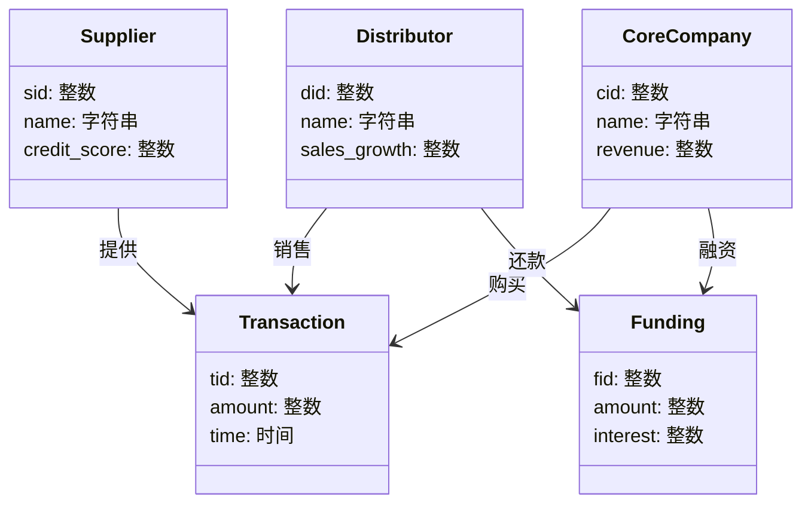

                 


# AI驱动的供应链金融风险传导分析

---

## 关键词

- 供应链金融
- 人工智能
- 风险传导
- 数学建模
- 机器学习
- 系统架构

---

## 摘要

供应链金融是现代企业管理和金融创新的重要领域，其核心在于通过优化资金流与物流的协同，提升供应链整体效率和风险控制能力。然而，供应链金融的复杂性使得传统的方法难以全面捕捉和分析风险因素。随着人工智能技术的快速发展，AI在供应链金融中的应用日益广泛，特别是在风险传导分析方面，展现了强大的潜力。

本文将从供应链金融的基本概念出发，深入分析AI驱动的风险传导机制，探讨如何通过机器学习和数学建模等技术手段，构建高效的供应链金融风险分析系统。文章还将结合实际案例，展示AI技术在供应链金融中的具体应用，并总结其优势与挑战。

---

# 第一章: 供应链金融与AI驱动的背景介绍

## 1.1 供应链金融的基本概念

### 1.1.1 供应链金融的定义与特点

供应链金融是指通过整合供应链上下游企业，优化资金流和物流，降低企业运营成本，提升整体供应链效率的金融活动。其特点包括：

- **协同性**：供应链金融强调上下游企业的协同合作。
- **嵌入性**：金融服务嵌入到供应链的实际运营中。
- **数据驱动**：依赖于供应链中的数据流进行决策。

### 1.1.2 供应链金融的核心参与方

供应链金融涉及多方参与者，主要包括：

1. **核心企业**：供应链中的主导企业，如制造企业或零售商。
2. **供应商**：为下游企业提供原材料或服务的企业。
3. **分销商/零售商**：负责产品分销和零售的企业。
4. **金融机构**：提供融资、保险等金融服务的机构。
5. **物流服务商**：负责产品运输和仓储的服务商。

### 1.1.3 供应链金融的业务流程

供应链金融的业务流程通常包括：

1. **需求分析**：核心企业分析供应链中的资金需求。
2. **融资申请**：上下游企业提出融资需求。
3. **风险评估**：金融机构评估融资风险。
4. **资金发放**：金融机构向企业发放资金。
5. **监控与管理**：跟踪资金使用情况，确保资金流向合理。

## 1.2 AI驱动供应链金融的必要性

### 1.2.1 传统供应链金融的痛点

传统供应链金融存在以下痛点：

- **信息不对称**：上下游企业间信息传递不畅，导致融资效率低下。
- **风险难控**：金融机构难以全面评估供应链中的风险因素。
- **效率低下**：传统方法依赖人工审核，耗时且容易出错。

### 1.2.2 AI技术在供应链金融中的优势

AI技术能够有效解决传统供应链金融的痛点，其优势包括：

- **数据处理能力**：AI能够快速处理海量数据，发现潜在风险。
- **自动化决策**：通过机器学习模型，实现自动化风险评估和融资决策。
- **实时监控**：AI可以实时跟踪供应链中的资金流动和物流信息，及时发现异常。

### 1.2.3 数据驱动的风险分析新范式

AI驱动的供应链金融基于数据驱动的方法，构建了新的风险分析范式：

1. **数据采集**：从供应链中的交易数据、物流数据、信用数据等多源数据中提取特征。
2. **特征工程**：通过数据预处理和特征提取，构建风险评估所需的输入特征。
3. **模型训练**：利用机器学习算法，训练风险评估模型。
4. **风险预测**：基于模型预测供应链中的潜在风险，并制定应对策略。

## 1.3 供应链金融风险传导机制

### 1.3.1 供应链金融风险的定义与分类

供应链金融中的风险主要包括：

1. **信用风险**：供应链上下游企业未能履行合同义务的风险。
2. **操作风险**：供应链运作中的流程失误或人为错误。
3. **市场风险**：市场价格波动对供应链价值的影响。
4. **流动性风险**：供应链中的资金链断裂风险。

### 1.3.2 风险传导的路径与影响

供应链金融中的风险传导路径通常包括：

1. **核心企业风险**：核心企业的经营状况直接影响整个供应链的风险。
2. **供应商风险**：供应商的供货稳定性影响供应链的资金流动。
3. **分销商风险**：分销商的销售能力影响供应链的现金流。
4. **金融机构风险**：金融机构的融资决策影响供应链的资金链。

### 1.3.3 风险传导的数学模型概述

风险传导的数学模型可以通过以下步骤构建：

1. **数据收集**：收集供应链中的相关数据，包括交易数据、物流数据、信用数据等。
2. **特征提取**：从数据中提取特征，如供应商的信用评分、物流延迟率等。
3. **模型构建**：使用机器学习算法（如逻辑回归、随机森林）构建风险评估模型。
4. **风险预测**：基于模型预测供应链中的潜在风险，并评估其传导路径。

---

# 第二章: 供应链金融风险传导的核心概念与联系

## 2.1 核心概念的定义与属性

### 2.1.1 供应链金融中的核心实体

供应链金融中的核心实体包括：

1. **企业**：供应链中的各个参与方，如供应商、分销商、核心企业等。
2. **交易**：企业之间的交易行为，包括采购、销售、融资等。
3. **资金流**：供应链中的资金流动情况，包括融资、还款等。
4. **物流**：供应链中的物流运作，包括运输、仓储等。

### 2.1.2 各实体的属性特征对比表格

以下是一个对比表格，展示了供应链金融中各实体的属性特征：

| 实体       | 属性             | 示例值                     |
|------------|------------------|-----------------------------|
| 供应商     | 信用评分         | 85分                       |
|            | 供货准时率       | 95%                        |
| 分销商     | 销售额增长率     | 15%                        |
|            | 库存周转率       | 3次/月                     |
| 核心企业   | 主营业务收入     | 10亿元                     |
|            | 供应链依赖度     | 80%                        |
| 金融机构   | 贷款余额         | 5000万元                  |
|            | 贷款逾期率       | 2%                         |

### 2.1.3 实体关系的ER图架构

以下是一个使用Mermaid绘制的实体关系图，展示了供应链金融中的核心实体及其关系：

```mermaid
erDiagram
    supplier[供应商] {
        +sid : 整数
        +name : 字符串
        +credit_score : 整数
    }
    distributor[分销商] {
        +did : 整数
        +name : 字符串
        +sales_growth : 整数
    }
    core_company[核心企业] {
        +cid : 整数
        +name : 字符串
        +revenue : 整数
    }
    transaction[交易] {
        +tid : 整数
        +amount : 整数
        +time : 时间
    }
    funding[资金] {
        +fid : 整数
        +amount : 整数
        +interest : 整数
    }
    supplier --> transaction : 提供
    distributor --> transaction : 销售
    core_company --> transaction : 购买
    core_company --> funding : 融资
    distributor --> funding : 还款
```

## 2.2 供应链金融风险传导的数学模型

### 2.2.1 风险传导的数学表达式

供应链金融风险传导的数学模型可以通过以下公式表示：

$$
R = f(x_1, x_2, ..., x_n)
$$

其中：
- \( R \) 表示风险值
- \( x_1, x_2, ..., x_n \) 表示各风险因素
- \( f \) 表示风险评估函数

### 2.2.2 风险传导的路径模型

风险传导的路径模型可以通过图示化表示，以下是一个使用Mermaid绘制的流程图：


### 2.2.3 风险传导的权重计算公式

为了量化各风险因素的影响程度，可以使用权重计算公式：

$$
w_i = \frac{\sum_{j} f_{ij}}{\sum_{i,j} f_{ij}}
$$

其中：
- \( w_i \) 表示第 \( i \) 个风险因素的权重
- \( f_{ij} \) 表示第 \( i \) 个风险因素在第 \( j \) 个场景中的影响程度

---

# 第三章: 基于AI的供应链金融风险传导算法原理

## 3.1 算法原理概述

### 3.1.1 数据预处理

数据预处理是AI算法的基础，主要包括：

1. **数据清洗**：去除重复数据和异常值。
2. **特征提取**：从原始数据中提取有用的特征。
3. **数据标准化**：将数据标准化到统一的范围。

### 3.1.2 算法选择与实现

常用的AI算法包括逻辑回归、随机森林和神经网络。以下是基于逻辑回归的实现示例：

```python
import pandas as pd
from sklearn.linear_model import LogisticRegression

# 数据加载与预处理
data = pd.read_csv('supply_chain_data.csv')
X = data.drop('risk', axis=1)
y = data['risk']

# 模型训练
model = LogisticRegression()
model.fit(X, y)

# 预测与评估
print(model.predict(X))
```

### 3.1.3 算法流程图

以下是一个使用Mermaid绘制的算法流程图：



## 3.2 数学模型与公式

### 3.2.1 逻辑回归模型

逻辑回归模型的数学公式如下：

$$
P(y=1|x) = \frac{1}{1 + e^{-(\beta_0 + \beta_1 x)}}
$$

其中：
- \( y \) 表示风险结果（1表示高风险，0表示低风险）
- \( x \) 表示输入特征
- \( \beta_0 \) 和 \( \beta_1 \) 表示模型参数

### 3.2.2 随机森林模型

随机森林模型通过集成学习提高模型的准确性和稳定性。其数学公式可以表示为：

$$
y = \sum_{i=1}^{n} \text{Tree}_i(x)
$$

其中：
- \( \text{Tree}_i \) 表示第 \( i \) 棵决策树的预测结果

---

# 第四章: 供应链金融风险传导的系统架构设计

## 4.1 系统功能设计

### 4.1.1 领域模型类图

以下是一个使用Mermaid绘制的领域模型类图：



### 4.1.2 系统架构图

以下是一个使用Mermaid绘制的系统架构图：


---

# 第五章: 项目实战与案例分析

## 5.1 项目实战

### 5.1.1 环境安装

项目实战需要以下环境：

- Python 3.6+
- Pandas、Scikit-learn等库

### 5.1.2 核心代码实现

以下是核心代码实现示例：

```python
import pandas as pd
from sklearn.ensemble import RandomForestClassifier

# 数据加载与预处理
data = pd.read_csv('supply_chain_data.csv')
X = data.drop('risk', axis=1)
y = data['risk']

# 模型训练
model = RandomForestClassifier()
model.fit(X, y)

# 预测与评估
print(model.predict(X))
```

### 5.1.3 案例分析

以下是一个案例分析示例：

假设我们有一个供应链金融项目，核心企业为一家制造公司，供应商和分销商分别为A和B。通过AI算法，我们预测了供应商A的信用评分为85，分销商B的销售增长率为15%。基于这些数据，模型预测供应链的整体风险为中等偏高。

---

# 第六章: 总结与展望

## 6.1 本章总结

本文详细探讨了AI驱动的供应链金融风险传导分析，从理论到实践，展示了如何通过AI技术优化供应链金融的风险管理。

## 6.2 未来展望

未来，随着AI技术的不断进步，供应链金融风险传导分析将更加智能化和自动化。建议进一步研究如何结合区块链技术，构建更加安全和透明的供应链金融体系。

---

通过以上内容，我们可以看到，AI技术在供应链金融中的应用前景广阔，但仍需进一步研究和实践，以实现更高效的供应链管理。

--- 

# END

