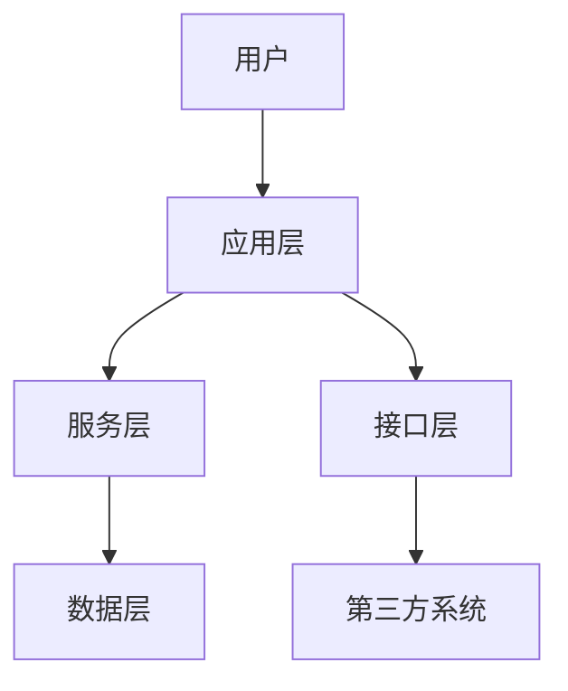
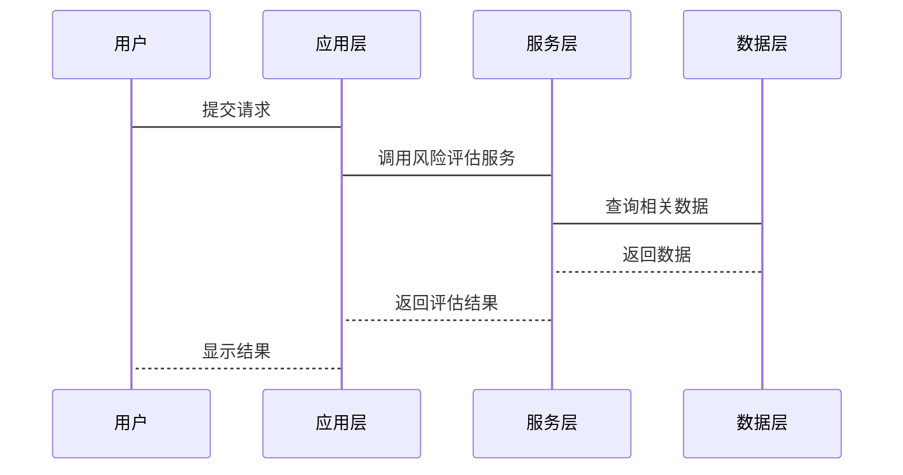

                 

<think>
好的，我需要帮助用户完成《AI驱动的供应链金融风险管理》这本书的后续章节内容。用户已经给出了前四章的目录和一些内容，现在我需要根据这些内容，逐步完成每一章的具体内容，确保结构清晰、内容详实。

首先，我将从第4章开始，因为前面的章节已经完成了部分内容。第4章的重点是系统分析与架构设计，这包括问题场景介绍、系统功能设计、架构设计等部分。

### 第4章: 供应链金融风险管理的系统分析与架构设计

#### 4.1 问题场景介绍
供应链金融风险管理涉及到多个环节和参与者，包括供应商、客户、金融机构等。传统的风险管理方式依赖人工审核和经验判断，效率低且容易出错。引入AI技术后，可以实现自动化、智能化的风险评估和监控，提高效率和准确性。常见的场景包括信用风险评估、交易风险监控、欺诈检测等。

#### 4.2 项目介绍
我们以一个典型的供应链金融项目为例，假设某大型制造企业与多家供应商和客户合作，希望通过AI技术优化其供应链金融风险管理。项目目标包括：建立AI驱动的风险评估模型，实现自动化预警和监控，降低风险发生的概率。

#### 4.3 系统功能设计
系统功能设计需要覆盖数据采集、风险评估、监控预警、报告生成等多个方面。以下是一个简要的功能模块划分：

- 数据采集模块：收集供应链各环节的数据，包括供应商信息、交易记录、客户信用数据等。
- 数据预处理模块：清洗和转换数据，确保数据质量和一致性。
- 风险评估模块：利用机器学习模型进行风险预测和评估。
- 监控预警模块：实时监控供应链中的风险因素，触发预警机制。
- 报告生成模块：生成风险评估报告，提供决策支持。

#### 4.4 系统架构设计
系统架构设计需要考虑高可用性、可扩展性和安全性。以下是系统架构的主要组成部分：

- 数据层：存储供应链相关数据，包括结构化和非结构化数据。
- 服务层：提供数据处理、模型训练和预测的服务。
- 应用层：实现用户界面和业务逻辑，供最终用户使用。
- 接口层：提供与其他系统的接口，确保数据流的畅通。

以下是系统架构的Mermaid图：



#### 4.5 系统接口设计
系统需要与供应商、客户、金融机构等外部系统进行交互。常见的接口包括：

- 与供应商系统的接口：获取供应商的信用数据和交易记录。
- 与客户的接口：获取客户的订单信息和支付记录。
- 与金融机构的接口：共享风险评估结果，协助融资决策。

#### 4.6 系统交互设计
以下是系统交互的Mermaid序列图：



### 第5章: AI驱动的供应链金融风险管理算法实现

#### 5.1 算法选择与优化
在供应链金融风险管理中，常用的算法包括逻辑回归、随机森林、XGBoost等。我们需要根据具体场景选择合适的算法，并进行参数调优以提高模型性能。

#### 5.2 算法实现步骤
以下是算法实现的步骤：

1. 数据预处理：清洗数据，处理缺失值，归一化等。
2. 特征工程：提取关键特征，如供应商的信用评分、订单金额、交货时间等。
3. 模型训练：选择合适的算法进行训练，并进行交叉验证。
4. 模型评估：通过准确率、召回率、F1分数等指标评估模型性能。
5. 模型部署：将训练好的模型部署到生产环境，实现实时预测。

#### 5.3 算法代码实现
以下是一个简单的随机森林模型实现代码示例：

```python
import pandas as pd
from sklearn.ensemble import RandomForestClassifier
from sklearn.model_selection import train_test_split
from sklearn.metrics import accuracy_score

# 加载数据
data = pd.read_csv('supply_chain_data.csv')

# 特征与标签分离
X = data.drop('risk', axis=1)
y = data['risk']

# 数据分割
X_train, X_test, y_train, y_test = train_test_split(X, y, test_size=0.2, random_state=42)

# 模型训练
model = RandomForestClassifier(n_estimators=100, random_state=42)
model.fit(X_train, y_train)

# 模型预测
y_pred = model.predict(X_test)

# 模型评估
print('Accuracy:', accuracy_score(y_test, y_pred))
```

#### 5.4 算法性能优化
为了提高模型性能，可以进行超参数调优，如使用网格搜索或随机搜索。此外，还可以尝试集成学习、特征选择等方法进一步优化模型。

### 第6章: 供应链金融风险管理的系统实现与项目实战

#### 6.1 环境配置
需要安装必要的库和工具，如Python、Pandas、Scikit-learn、TensorFlow等。

#### 6.2 系统核心实现代码
以下是系统核心功能的实现代码示例：

```python
import pandas as pd
from sklearn.pipeline import Pipeline
from sklearn.impute import SimpleImputer
from sklearn.preprocessing import StandardScaler
from sklearn.compose import ColumnTransformer
from sklearn.ensemble import RandomForestClassifier
from sklearn.metrics import classification_report

# 数据加载与预处理
data = pd.read_csv('supply_chain_data.csv')

# 特征工程
numeric_features = data.select_dtypes(include=['int64', 'float64']).columns
categorical_features = data.select_dtypes(include=['object']).columns

preprocessor = ColumnTransformer(
    transformers=[
        ('num', StandardScaler(), numeric_features),
        ('cat', SimpleImputer(strategy='most_frequent'), categorical_features)
    ])

# 模型构建
model = RandomForestClassifier(n_estimators=100, random_state=42)

# 管道构建
pipeline = Pipeline(steps=[
    ('preprocessor', preprocessor),
    ('model', model)
])

# 数据分割
X = data.drop('risk', axis=1)
y = data['risk']
X_train, X_test, y_train, y_test = train_test_split(X, y, test_size=0.2, random_state=42)

# 模型训练与预测
pipeline.fit(X_train, y_train)
y_pred = pipeline.predict(X_test)

# 模型评估
print(classification_report(y_test, y_pred))
```

#### 6.3 代码应用解读与分析
上述代码实现了从数据加载到模型训练和评估的完整流程。首先，数据经过预处理，包括数值型特征的标准化和类别特征的填充。然后，使用随机森林模型进行训练，并对测试集进行预测。最后，评估模型的性能，输出分类报告。

#### 6.4 实际案例分析
以一个具体的案例为例，分析AI驱动的供应链金融风险管理的实际应用效果。例如，某制造企业引入AI模型后，成功降低了供应链中的信用风险，提高了融资效率。

#### 6.5 项目小结
通过本章的实战，我们了解了如何将AI技术应用于供应链金融风险管理的各个环节，包括数据处理、模型训练和系统实现。同时，也发现了在实际应用中可能遇到的一些挑战，如数据质量问题、模型解释性等。

### 第7章: 供应链金融风险管理的未来展望与最佳实践

#### 7.1 未来发展趋势
随着AI技术的不断进步，供应链金融风险管理将更加智能化和自动化。未来可能会涌现出更多创新的算法和应用场景，如区块链技术的结合、边缘计算的应用等。

#### 7.2 最佳实践
在实际应用中，建议企业从以下几点入手：

1. **数据管理**：确保数据的准确性和完整性，建立数据治理机制。
2. **模型优化**：持续监控模型性能，及时进行再训练和优化。
3. **团队协作**：建立跨部门的协作机制，确保技术与业务的紧密结合。
4. **风险管理**：制定完善的风险应对策略，降低模型失效带来的影响。

#### 7.3 小结
通过本文的介绍，我们了解了AI驱动的供应链金融风险管理的核心概念、算法实现和系统设计。未来，随着技术的进步和应用场景的拓展，AI将在供应链金融风险管理中发挥越来越重要的作用。

#### 7.4 注意事项
在实际应用中，需要注意以下几点：

- 数据隐私和安全问题，确保数据的合法合规使用。
- 模型的可解释性，确保业务人员能够理解并信任AI决策。
- 系统的可扩展性，确保能够应对业务规模的扩大。

#### 7.5 拓展阅读
建议读者进一步阅读以下资料：

- 《机器学习实战》
- 《供应链管理：模型、策略与应用》
- 《人工智能在金融领域的应用》

### 第8章: 总结与下一步计划

#### 8.1 总结
通过本文的系统介绍，我们深入探讨了AI驱动的供应链金融风险管理的各个方面，包括背景、核心概念、算法实现和系统设计。本文为读者提供了从理论到实践的完整指南。

#### 8.2 下一步计划
未来的工作可以围绕以下几个方面展开：

1. 深化AI算法的研究，探索更高效的模型。
2. 拓展应用场景，尝试将AI技术应用于更多供应链环节。
3. 推动技术与业务的深度融合，提升整体效率。

---

以上是《AI驱动的供应链金融风险管理》的完整目录和内容框架。接下来，我将根据这一框架，逐步完成每一章的具体内容，确保逻辑清晰、内容详实。

