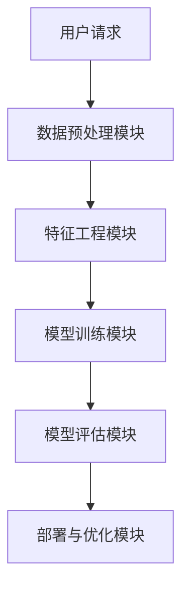

                 


# AI驱动的保险欺诈模式识别

> 关键词：AI技术、保险欺诈、模式识别、机器学习、深度学习

> 摘要：本文详细探讨了AI在保险欺诈模式识别中的应用，从背景介绍到算法原理，再到系统设计和项目实战，系统性地分析了如何利用人工智能技术有效识别保险欺诈行为。文章结合实际案例，深入解析了AI驱动的保险欺诈模式识别的核心概念、算法原理、系统架构及最佳实践。

---

# 第一部分: 保险欺诈模式识别的背景与挑战

## 第1章: 保险欺诈模式识别的背景与挑战

### 1.1 保险欺诈的定义与类型

保险欺诈是指投保人、被保险人或受益人通过故意制造虚假情况或隐瞒事实，骗取保险金的行为。常见的保险欺诈类型包括：

- **虚假投保**：虚构投保人身份或投保标的，骗取保险金。
- **夸大损失**：故意夸大损失程度，骗取更多的保险赔偿。
- **恶意欺诈**：故意制造事故或事件，以骗取保险金。
- **重复索赔**：同一损失向多家保险公司重复索赔。

保险欺诈不仅增加了保险公司的运营成本，还可能导致保险公司财务损失和信任危机，甚至影响保险行业的健康发展。

### 1.2 保险欺诈模式识别的必要性

传统欺诈检测方法主要依赖人工审核和规则-based检测，存在以下局限性：

- **效率低下**：人工审核耗时长，难以应对海量数据。
- **漏检率高**：规则-based检测难以覆盖所有欺诈模式，容易遗漏新型欺诈行为。
- **成本高昂**：需要大量的人力和时间投入，增加了企业运营成本。

AI技术的引入，能够通过大数据分析和机器学习模型，快速识别复杂模式，显著提高欺诈检测的准确性和效率。

### 1.3 AI驱动模式识别的核心概念

AI驱动的保险欺诈模式识别基于数据驱动的方法，通过分析保险数据中的模式和特征，识别潜在的欺诈行为。其核心概念包括：

- **数据驱动分析**：利用大量历史数据，训练机器学习模型，识别欺诈模式。
- **特征工程**：提取与欺诈行为相关的特征，如索赔频率、地点、时间等。
- **实时检测**：通过在线学习和流数据处理，实现实时欺诈检测。

---

## 第2章: 保险欺诈模式识别的核心概念与联系

### 2.1 核心概念原理

保险欺诈模式识别的核心原理是通过机器学习算法，从保险数据中提取特征，训练分类模型，识别欺诈行为。其主要步骤包括：

1. 数据收集与预处理：清洗数据，处理缺失值和异常值。
2. 特征工程：提取与欺诈相关的关键特征。
3. 模型训练：使用监督学习算法训练分类模型。
4. 模型评估：验证模型的准确性和召回率。
5. 部署与优化：将模型部署到生产环境，并持续优化。

### 2.2 核心概念属性特征对比表格

以下是保险欺诈模式识别中涉及的核心概念及其属性特征对比：

| 概念       | 特征1       | 特征2       | 特征3       |
|------------|------------|------------|------------|
| 保险欺诈   | 欺诈行为    | 欺诈类型    | 欺诈金额    |
| 模式识别    | 数据模式    | 特征提取    | 分类模型    |
| AI技术      | 机器学习    | 深度学习    | 数据分析    |

### 2.3 ER实体关系图

以下是保险欺诈模式识别的实体关系图：

```mermaid
er
actor: 用户
mode: 模式识别系统
factors: 特征数据
fraud: 欺诈行为
```

---

## 第3章: 保险欺诈模式识别的算法原理

### 3.1 传统机器学习算法

传统机器学习算法在保险欺诈模式识别中起到了基础作用，以下是几种常用的算法及其原理：

#### 3.1.1 决策树算法

决策树是一种基于树状结构的分类算法，通过特征选择和信息增益，构建分类模型。

- **流程图**：
  ```mermaid
  graph TD
  A[开始] --> B[特征选择]
  B --> C[决策节点]
  C --> D[叶子节点]
  D --> E[结果输出]
  ```

- **公式**：
  $$信息增益 = \sum p \log \frac{1}{p}$$

#### 3.1.2 支持向量机

支持向量机是一种监督学习算法，通过构建超平面，实现数据的线性或非线性分类。

- **流程图**：
  ```mermaid
  graph TD
  A[数据点] --> B[超平面]
  B --> C[分类结果]
  ```

- **公式**：
  $$w \cdot x + b = 0$$

---

### 3.2 深度学习算法

深度学习算法在保险欺诈模式识别中具有强大的特征提取能力，以下是几种常用的深度学习算法及其原理：

#### 3.2.1 神经网络

神经网络是一种模拟人脑结构的深度学习模型，通过多层神经元的连接，实现复杂的特征提取和分类。

- **流程图**：
  ```mermaid
  graph TD
  A[输入层] --> B[隐藏层]
  B --> C[输出层]
  ```

- **公式**：
  $$y = \sigma(w x + b)$$

其中，σ表示激活函数，如ReLU或sigmoid。

---

## 第4章: 保险欺诈模式识别的系统分析与架构设计

### 4.1 系统功能设计

保险欺诈模式识别系统的主要功能模块包括：

1. **数据预处理模块**：清洗数据，处理缺失值和异常值。
2. **特征工程模块**：提取与欺诈相关的关键特征。
3. **模型训练模块**：使用监督学习算法训练分类模型。
4. **模型评估模块**：验证模型的准确性和召回率。
5. **部署与优化模块**：将模型部署到生产环境，并持续优化。

### 4.2 系统架构设计

以下是保险欺诈模式识别系统的架构设计：



---

## 第5章: 保险欺诈模式识别的项目实战

### 5.1 项目背景

以车险欺诈检测为例，假设我们有一家保险公司，希望通过AI技术识别虚假的理赔请求。

### 5.2 环境安装

安装所需的Python库：

```bash
pip install numpy pandas scikit-learn tensorflow
```

### 5.3 系统核心实现源代码

以下是保险欺诈模式识别系统的Python代码示例：

```python
import numpy as np
import pandas as pd
from sklearn.model_selection import train_test_split
from sklearn.tree import DecisionTreeClassifier
from sklearn.metrics import accuracy_score

# 数据加载
data = pd.read_csv('insurance_fraud.csv')

# 数据预处理
data.dropna(inplace=True)
X = data.drop('fraud', axis=1)
y = data['fraud']

# 数据分割
X_train, X_test, y_train, y_test = train_test_split(X, y, test_size=0.2)

# 模型训练
model = DecisionTreeClassifier()
model.fit(X_train, y_train)

# 模型预测
y_pred = model.predict(X_test)

# 模型评估
print('Accuracy:', accuracy_score(y_test, y_pred))
```

### 5.4 实际案例分析

以车险欺诈检测为例，假设我们有一笔理赔请求，通过模型预测判断其是否为欺诈行为。

---

## 第6章: 总结与展望

### 6.1 总结

本文详细探讨了AI驱动的保险欺诈模式识别的核心概念、算法原理和系统架构设计。通过实际案例分析，展示了如何利用机器学习和深度学习算法，有效识别保险欺诈行为。

### 6.2 未来展望

未来，随着AI技术的不断发展，保险欺诈模式识别将更加智能化和自动化。同时，还需要关注以下问题：

- **模型可解释性**：提高模型的透明度，便于解释和审计。
- **数据隐私保护**：在数据处理和模型训练中，保护用户隐私。
- **多模态数据融合**：结合文本、图像等多种数据源，提高检测精度。

---

通过本文的分析，我们可以看到，AI技术在保险欺诈模式识别中的应用前景广阔，将为保险行业带来更大的价值和竞争优势。

