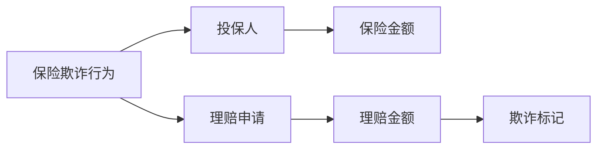

                 


# AI驱动的保险理赔欺诈模式识别

> 关键词：保险，AI，欺诈检测，机器学习，模式识别

> 摘要：本文探讨了人工智能在保险理赔欺诈模式识别中的应用，分析了欺诈检测的必要性与挑战，详细讲解了基于机器学习和深度学习的算法原理，系统设计与实现，并通过实际案例展示了AI在识别复杂欺诈行为中的优势，为保险行业提供了有效的欺诈检测解决方案。

---

# 第一部分：保险理赔欺诈模式识别的背景与挑战

## 第1章：保险行业与欺诈问题概述

### 1.1 保险行业的现状与发展

#### 1.1.1 保险行业的基本概念
保险是一种风险管理工具，通过分散风险来减少潜在损失。保险行业涵盖寿险、健康险、财险等多个领域，随着数字化转型的推进，保险业务逐渐依赖于数据分析和AI技术。

#### 1.1.2 保险行业的数字化转型
数字化转型使保险行业能够更高效地处理理赔、客户交互和风险评估。AI技术的应用显著提升了保险公司的运营效率和风险控制能力。

#### 1.1.3 保险理赔的核心流程
理赔流程包括报案、审核、调查、赔付等环节。欺诈行为可能在这些环节中出现，影响保险公司的财务健康和客户信任。

### 1.2 欺诈问题的严重性与影响

#### 1.2.1 保险欺诈的定义与类型
保险欺诈是指通过虚假陈述或隐瞒事实，骗取保险金的行为。常见类型包括夸大损失、虚构事故、重复索赔等。

#### 1.2.2 欺诈行为对保险行业的冲击
欺诈行为导致保险公司赔付成本增加，影响财务稳定性。同时，欺诈行为破坏了保险市场的公平性，损害了合法客户的利益。

#### 1.2.3 欺诈检测的必要性与挑战
及时识别欺诈行为可以减少经济损失，维护保险市场的健康。然而，欺诈手段不断演变，传统方法难以应对复杂场景，需要借助AI技术提升检测能力。

### 1.3 AI技术在保险欺诈检测中的应用前景

#### 1.3.1 AI技术在保险行业的应用现状
AI技术已应用于保险定价、风险评估、客户画像等领域。在欺诈检测方面，AI能够快速分析大量数据，识别异常模式。

#### 1.3.2 欺诈模式识别的AI驱动趋势
随着深度学习和自然语言处理技术的进步，AI能够处理非结构化数据，识别复杂欺诈行为。未来，AI将在欺诈检测中发挥越来越重要的作用。

#### 1.3.3 保险欺诈检测的未来发展方向
未来，AI驱动的欺诈检测将更加智能化、自动化。结合实时数据分析和预测模型，保险公司能够更早发现并阻止欺诈行为。

---

## 第2章：保险欺诈模式识别的核心概念

### 2.1 AI驱动的欺诈模式识别原理

#### 2.1.1 机器学习在欺诈检测中的应用
机器学习算法通过训练数据学习欺诈特征，识别潜在的欺诈行为。常用算法包括决策树、随机森林和逻辑回归。

#### 2.1.2 深度学习在欺诈模式识别中的优势
深度学习模型能够处理复杂数据，捕捉非线性特征。神经网络在处理图像、文本和时间序列数据方面表现出色。

#### 2.1.3 混合模型在复杂欺诈场景中的应用
混合模型结合了机器学习和深度学习的优势，适用于复杂欺诈场景。例如，使用LSTM处理时间序列数据，识别异常交易模式。

### 2.2 欺诈模式识别的关键特征

#### 2.2.1 数据特征的提取与分析
关键特征包括索赔金额、理赔时间、地点、涉及人员等。通过特征工程优化模型性能，识别欺诈相关特征。

#### 2.2.2 行为模式的识别与建模
分析投保人的行为模式，识别异常行为。例如，频繁索赔或索赔金额异常的情况可能表明欺诈行为。

#### 2.2.3 时间序列分析在欺诈检测中的应用
时间序列分析适用于检测异常交易模式。通过分析历史数据，识别欺诈行为的时间特征。

### 2.3 欺诈模式识别的实体关系图



---

## 第3章：欺诈模式识别的算法原理

### 3.1 常见的欺诈检测算法

#### 3.1.1 基于决策树的欺诈检测
决策树模型通过特征分割构建分类树，识别欺诈行为。例如，使用ID3或C4.5算法训练决策树模型。

#### 3.1.2 基于逻辑回归的欺诈预测
逻辑回归模型用于分类问题，预测欺诈概率。通过训练数据，模型可以学习欺诈特征，预测新案例的欺诈风险。

#### 3.1.3 基于神经网络的深度学习方法
深度学习模型如CNN、RNN和LSTM适用于复杂数据。神经网络能够自动提取特征，识别隐藏的欺诈模式。

### 3.2 算法流程图

#### 3.2.1 决策树算法流程图


#### 3.2.2 随机森林算法流程图


### 3.3 算法实现与数学模型

#### 3.3.1 逻辑回归模型

$$ P(y=1) = \frac{1}{1 + e^{-\beta x}} $$

其中，$\beta$ 是模型参数，$x$ 是输入特征。模型通过训练数据优化$\beta$，最小化损失函数。

#### 3.3.2 随机森林算法

随机森林是一种集成学习方法，通过组合多个决策树的预测结果，提高模型准确性和稳定性。

#### 3.3.3 LSTM网络

LSTM（长短期记忆网络）适用于时间序列数据。其核心是设计记忆单元，捕捉长期依赖关系。

---

## 第4章：系统架构设计

### 4.1 保险欺诈检测系统介绍

#### 4.1.1 系统目标
设计一个基于AI的欺诈检测系统，能够实时分析理赔数据，识别欺诈行为。

#### 4.1.2 系统功能模块
系统功能模块包括数据预处理、特征提取、模型训练、预测引擎和结果分析。

#### 4.1.3 系统架构图


### 4.2 系统实现细节

#### 4.2.1 数据预处理
数据清洗和转换是关键步骤，处理缺失值、异常值和数据格式。

#### 4.2.2 特征提取
从理赔数据中提取关键特征，如索赔金额、理赔时间、地点等，用于模型训练。

#### 4.2.3 模型训练
使用训练数据训练欺诈检测模型，选择合适的算法，优化模型参数。

#### 4.2.4 预测引擎
实时接收新理赔请求，通过模型预测欺诈概率，生成预警报告。

#### 4.2.5 结果分析
分析模型预测结果，评估准确率、召回率和F1分数，优化模型性能。

---

## 第5章：项目实战

### 5.1 环境安装与配置

#### 5.1.1 安装Python和相关库
安装Python 3.8及以上版本，安装机器学习库如scikit-learn、xgboost和深度学习框架如TensorFlow或Keras。

#### 5.1.2 数据集准备
获取保险理赔数据，包括正常和欺诈案例，确保数据包含关键特征。

### 5.2 核心代码实现

#### 5.2.1 数据预处理代码

```python
import pandas as pd
import numpy as np

# 读取数据
data = pd.read_csv('insurance_fraud.csv')

# 处理缺失值
data = data.dropna()

# 转换分类变量
data = pd.get_dummies(data)
```

#### 5.2.2 模型训练代码

```python
from sklearn.model_selection import train_test_split
from sklearn.ensemble import RandomForestClassifier
from sklearn.metrics import accuracy_score

# 划分训练集和测试集
X_train, X_test, y_train, y_test = train_test_split(data.drop('fraud', axis=1), data['fraud'], test_size=0.2)

# 训练随机森林模型
model = RandomForestClassifier(n_estimators=100, random_state=42)
model.fit(X_train, y_train)

# 预测与评估
y_pred = model.predict(X_test)
print("准确率:", accuracy_score(y_test, y_pred))
```

### 5.3 实际案例分析

#### 5.3.1 案例背景
分析一个虚构的保险理赔案例，识别其中的欺诈行为。例如，一位投保人频繁索赔，金额异常。

#### 5.3.2 模型预测
模型预测该案例的欺诈概率为90%，触发预警机制，保险公司进行进一步调查。

#### 5.3.3 结果解读
模型成功识别欺诈行为，避免了潜在的经济损失，证明了AI在欺诈检测中的有效性。

### 5.4 项目小结

项目通过构建AI驱动的欺诈检测系统，显著提高了欺诈识别的准确性和效率。系统能够实时处理理赔请求，减少欺诈行为的发生。

---

## 第6章：综合分析与总结

### 6.1 总结与成果

本文详细介绍了AI在保险理赔欺诈检测中的应用，展示了如何利用机器学习和深度学习技术识别欺诈模式。通过实际案例分析，证明了AI技术的有效性。

### 6.2 应用前景与挑战

AI驱动的欺诈检测在保险行业具有广阔的应用前景。然而，仍需解决数据隐私、模型解释性和计算资源等挑战，以进一步提升检测能力。

### 6.3 最佳实践与建议

#### 6.3.1 数据质量的重要性
确保数据的完整性和准确性，有助于提高模型的性能和检测效果。

#### 6.3.2 模型调优与优化
通过交叉验证和超参数优化，选择最优模型和参数，提升检测准确率。

#### 6.3.3 模型的可解释性
提高模型的可解释性，帮助保险公司理解和信任AI的决策过程。

### 6.4 拓展阅读与深入学习

建议读者进一步研究最新的AI技术，如图神经网络和强化学习，探索其在保险欺诈检测中的应用潜力。

---

## 附录

### 附录A：数据集描述

数据集包含以下字段：索引号、索赔金额、理赔时间、地点、涉及人员、欺诈标记等。数据样本量为10000条，其中欺诈案例占比10%。

### 附录B：工具安装指南

#### 1. 安装Python
```bash
python --version
```
确保安装Python 3.8或更高版本。

#### 2. 安装依赖库
```bash
pip install numpy pandas scikit-learn xgboost tensorflow
```

### 附录C：参考文献

1. 书籍：《Python机器学习》
2. 论文：《基于深度学习的保险欺诈检测研究》
3. 网站：Kaggle保险欺诈检测数据集

---

# 结语

通过本文的详细讲解，读者可以深入了解AI在保险理赔欺诈检测中的应用，掌握相关技术和实现方法。希望本文能为保险行业提供有价值的参考，推动AI技术在欺诈检测中的进一步应用和发展。

