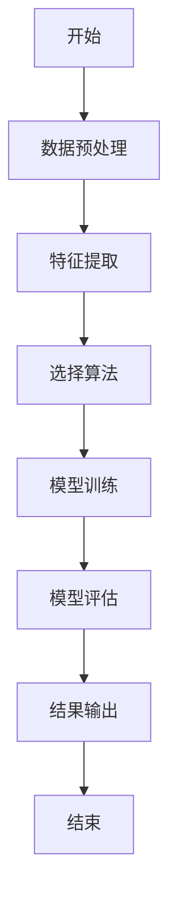
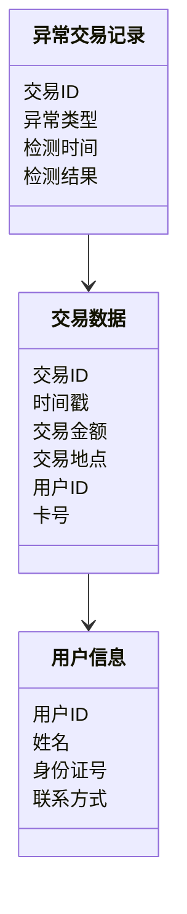
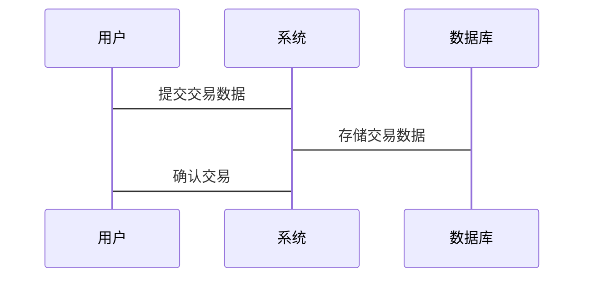
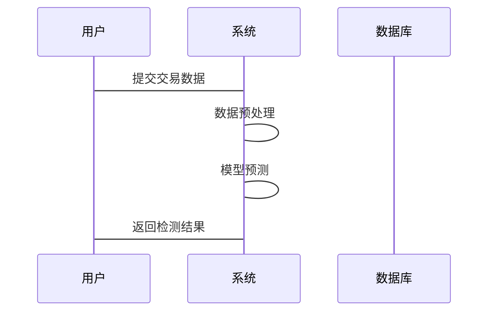

                 


# AI驱动的信用卡异常交易实时检测

## 关键词
- AI技术
- 异常交易检测
- 信用卡安全
- 机器学习
- 实时检测

## 摘要
随着信用卡的普及，异常交易检测变得至关重要。传统的基于规则和统计的方法存在局限性，而人工智能技术提供了更高效的解决方案。本文详细探讨了AI在信用卡异常交易实时检测中的应用，包括背景介绍、核心概念、算法原理、系统架构设计以及项目实战等内容。通过随机森林和XGBoost等算法的实现，结合系统架构设计，展示了如何构建高效、准确的异常交易检测系统，并通过实际案例分析验证了系统的有效性。

---

# 第一部分：AI驱动的信用卡异常交易实时检测概述

## 第1章：异常交易检测的背景与问题

### 1.1 信用卡交易安全的重要性

#### 1.1.1 信用卡交易的基本流程
信用卡交易涉及多个环节，包括交易发起、授权、清算和结算。每一环节都需要确保交易的合法性和安全性。

#### 1.1.2 信用卡交易中的潜在风险
信用卡交易面临多种风险，如欺诈交易、身份盗窃和数据泄露等。这些风险可能导致持卡人和发卡机构的重大损失。

#### 1.1.3 异常交易检测的方法与挑战
传统的异常交易检测方法依赖于规则和统计分析，但面对复杂多变的欺诈手段，这些方法显得力不从心。

### 1.2 异常交易检测的定义与分类

#### 1.2.1 异常交易的定义
异常交易是指不符合正常交易模式的交易行为，可能涉及欺诈或误用信用卡。

#### 1.2.2 异常交易的主要类型
- 欺诈交易：未经授权的交易行为。
- 账户盗用：持卡人账户被他人盗用进行交易。
- 恶意交易：故意进行的破坏性交易。

#### 1.2.3 异常交易检测的目标与意义
目标是通过检测异常交易，减少欺诈行为，保护持卡人和发卡机构的利益。意义在于提升交易安全性，降低经济损失。

### 1.3 传统交易检测方法的局限性

#### 1.3.1 基于规则的传统检测方法
通过设定固定的规则来识别异常交易，但规则难以覆盖所有可能的欺诈场景。

#### 1.3.2 基于统计的传统检测方法
利用统计方法分析交易数据的分布，识别异常值。但这种方法对数据分布的变化不够敏感。

#### 1.3.3 传统方法的不足与改进方向
传统方法难以应对复杂和多样化的欺诈手段，需要引入更先进的技术手段，如人工智能。

### 1.4 AI技术在异常交易检测中的优势

#### 1.4.1 AI技术的基本特点
人工智能技术具有学习能力强、适应性好、能够处理复杂数据等特点。

#### 1.4.2 AI在异常交易检测中的独特优势
- 能够处理高维数据。
- 可以实时学习和适应新的欺诈模式。
- 具备高准确性，减少误报和漏报。

#### 1.4.3 AI驱动的实时检测的创新性
通过实时分析交易数据，快速识别异常交易，实现主动防御。

### 1.5 本章小结
本章介绍了信用卡交易安全的重要性，定义了异常交易，分析了传统检测方法的局限性，并阐述了AI技术在异常交易检测中的优势。

---

## 第2章：异常交易检测的核心概念与联系

### 2.1 异常检测的核心原理

#### 2.1.1 异常检测的基本概念
异常检测是指识别数据中偏离预期模式或行为的过程。

#### 2.1.2 异常检测的主要算法原理
- 基于统计的方法：如孤立森林算法。
- 基于机器学习的方法：如随机森林和XGBoost。
- 基于深度学习的方法：如自动编码器和GAN。

#### 2.1.3 异常检测与分类的关系
异常检测是一种特殊的分类问题，通常属于无监督或半监督学习任务。

### 2.2 异常交易检测的核心要素

#### 2.2.1 交易数据的特征分析
- 交易金额：是否超出持卡人的消费习惯。
- 交易地点：是否与持卡人的地理位置相符。
- 时间间隔：交易时间是否过于集中或异常。

#### 2.2.2 异常交易的模式识别
识别欺诈行为的典型模式，如短时间内多次小额交易。

#### 2.2.3 检测系统的性能评估
评估指标包括准确率、召回率、F1分数等。

### 2.3 异常检测与分类算法的对比分析

#### 2.3.1 常见分类算法的特点
- K-近邻：简单易用，但计算复杂度高。
- 支持向量机：适合小规模数据，对高维数据表现较好。
- 神经网络：适合复杂模式识别，但训练时间较长。

#### 2.3.2 异常检测算法的特点
- One-Class SVM：适用于无监督异常检测。
- Isolation Forest：适合处理高维数据。
- Autoencoder：适用于深度学习场景。

#### 2.3.3 分类与异常检测的对比表格
| 算法类型   | 分类任务          | 异常检测任务        |
|------------|-------------------|---------------------|
| K-近邻     | 有监督            | 无监督              |
| 支持向量机 | 有监督            | 无监督              |
| 神经网络   | 有监督            | 无监督              |
| One-Class SVM | 无监督 | 无监督 |
| Isolation Forest | 无监督 | 无监督 |
| Autoencoder | 无监督 | 无监督 |

### 2.4 ER实体关系图架构

```mermaid
er
    entity 信用卡交易 (id, 时间戳, 交易金额, 交易地点, 用户ID, 卡号)
    entity 用户信息 (用户ID, 姓名, 身份证号, 联系方式)
    entity 异常交易记录 (交易ID, 异常类型, 检测时间, 检测结果)
    relationship 每笔交易关联一个用户信息
    relationship 每笔异常交易记录关联一条信用卡交易
```

### 2.5 本章小结
本章分析了异常检测的核心原理，探讨了异常交易检测的核心要素，并通过对比分析和ER图展示了异常检测与分类的关系。

---

## 第3章：基于AI的异常交易检测算法原理

### 3.1 常见的异常检测算法

#### 3.1.1 基于统计的异常检测
- Z-score：通过标准化计算偏离程度。
- IQR：通过四分位数计算异常值。

#### 3.1.2 基于机器学习的异常检测
- 随机森林：通过特征重要性识别异常。
- XGBoost：通过梯度提升算法学习异常模式。

#### 3.1.3 基于深度学习的异常检测
- Autoencoder：通过自编码器重构异常数据。
- GAN：通过生成对抗网络识别异常。

### 3.2 随机森林算法在异常检测中的应用

#### 3.2.1 随机森林的基本原理
随机森林是一种集成学习算法，通过构建多个决策树并对结果进行投票或平均。

#### 3.2.2 随机森林应用于异常检测的流程
1. 数据预处理：标准化和特征选择。
2. 构建随机森林模型。
3. 模型训练：使用正常交易数据训练模型。
4. 异常检测：通过模型预测交易是否异常。

#### 3.2.3 随机森林的优缺点分析
优点：高准确率，易于实现。
缺点：计算复杂度较高，对特征选择敏感。

### 3.3 XGBoost算法在异常检测中的应用

#### 3.3.1 XGBoost的基本原理
XGBoost是一种基于树的提升算法，通过优化目标函数和正则化项来提升模型性能。

#### 3.3.2 XGBoost应用于异常检测的流程
1. 数据预处理：清洗和特征工程。
2. 模型训练：使用异常样本和正常样本训练模型。
3. 异常检测：通过预测概率判断交易是否异常。

#### 3.3.3 XGBoost的优缺点分析
优点：高准确率，计算效率高。
缺点：对参数敏感，容易过拟合。

### 3.4 算法流程图



### 3.5 数学模型与公式

#### 3.5.1 随机森林的数学模型
随机森林通过集成多个决策树的预测结果，最终得到一个加权的预测结果。决策树的预测结果通过投票或平均得到。

#### 3.5.2 XGBoost的数学模型
XGBoost的目标函数为：
$$
\text{目标函数} = \text{损失函数} + \text{正则化项}
$$
损失函数通常采用对数损失函数：
$$
\text{损失函数} = \sum_{i=1}^{n} \frac{1}{2}[log(\frac{1}{1 + e^{-y_i\hat{y}_i}})]
$$
正则化项用于防止过拟合：
$$
\text{正则化项} = \lambda \sum_{j=1}^{m} \theta_j^2
$$

### 3.5.3 异常检测的数学公式
通过XGBoost模型预测异常概率：
$$
P(\text{异常}) = \sum_{i=1}^{n} \text{模型预测值}
$$

### 3.5 本章小结
本章详细介绍了几种常见的异常检测算法，重点讲解了随机森林和XGBoost的应用流程，并通过公式和流程图展示了算法的实现细节。

---

## 第4章：异常交易检测的系统架构设计

### 4.1 项目场景介绍
一个典型的信用卡异常交易检测系统需要实时处理大量的交易数据，快速识别潜在的异常交易。

### 4.2 系统功能设计

#### 4.2.1 领域模型设计


#### 4.2.2 系统架构设计


#### 4.2.3 系统接口设计
API接口定义：
- POST /transaction：提交交易数据。
- GET /anomaly：获取异常交易列表。
- POST /train：训练模型。

### 4.3 交互设计

#### 4.3.1 交易数据采集流程


#### 4.3.2 异常交易检测流程


### 4.4 本章小结
本章通过领域模型、架构图和交互图展示了异常交易检测系统的整体设计，为后续的实现提供了理论基础。

---

## 第5章：异常交易检测的项目实战

### 5.1 环境安装与配置

#### 5.1.1 安装Python环境
使用Anaconda安装Python 3.8及以上版本。

#### 5.1.2 安装依赖库
安装以下库：
- pandas
- numpy
- scikit-learn
- xgboost
- mermaid
- plotly

#### 5.1.3 数据集准备
使用Kaggle上的信用卡欺诈数据集（creditcard.csv）。

### 5.2 系统核心实现

#### 5.2.1 数据预处理
```python
import pandas as pd
from sklearn.model_selection import train_test_split
from sklearn.preprocessing import StandardScaler

# 加载数据
data = pd.read_csv('creditcard.csv')

# 分离特征和标签
X = data.iloc[:, :-1]
y = data.iloc[:, -1]

# 数据分割
X_train, X_test, y_train, y_test = train_test_split(X, y, test_size=0.2, random_state=42)

# 特征标准化
scaler = StandardScaler()
X_train = scaler.fit_transform(X_train)
X_test = scaler.transform(X_test)
```

#### 5.2.2 模型训练与评估
```python
from xgboost import XGBClassifier
from sklearn.metrics import classification_report

# 初始化模型
model = XGBClassifier(n_estimators=100, learning_rate=0.1, max_depth=6)

# 训练模型
model.fit(X_train, y_train)

# 模型预测
y_pred = model.predict(X_test)

# 评估结果
print(classification_report(y_test, y_pred))
```

#### 5.2.3 实时检测实现
```python
import joblib

# 加载模型
model = joblib.load('xgboost_model.pkl')

# 实时检测
def detect_anomaly(transaction):
    # 数据预处理
    transaction_scaled = scaler.transform([transaction])
    # 预测结果
    prediction = model.predict(transaction_scaled)
    return prediction[0]
```

### 5.3 案例分析与解读

#### 5.3.1 正常交易案例
输入一个正常交易数据，系统返回正常。

#### 5.3.2 异常交易案例
输入一个异常交易数据，系统返回异常。

### 5.4 项目小结
通过项目实战，展示了如何使用XGBoost算法实现异常交易检测，并通过实时检测功能保护持卡人和发卡机构的利益。

---

## 第6章：总结与展望

### 6.1 本章总结
本文详细介绍了AI在信用卡异常交易实时检测中的应用，涵盖了背景、核心概念、算法原理、系统架构设计以及项目实战等内容。

### 6.2 未来研究方向

#### 6.2.1 更先进的算法研究
研究如图神经网络等更先进的算法，提升检测准确率。

#### 6.2.2 实时性优化
优化系统性能，提升实时检测的速度和效率。

#### 6.2.3 多模态数据融合
结合用户行为数据、地理位置数据等多模态数据，提升检测能力。

### 6.3 注意事项与最佳实践

#### 6.3.1 数据隐私保护
在处理用户数据时，必须遵守数据隐私保护法规。

#### 6.3.2 模型更新策略
定期更新模型，应对新的欺诈手段。

#### 6.3.3 系统稳定性保障
确保系统在高并发情况下的稳定运行。

### 6.4 拓展阅读
推荐阅读相关领域的最新论文和书籍，关注AI技术在金融领域的最新应用。

---

## 附录：数学公式与代码实现

### 附录A：数学公式汇总

#### 附录A.1 XGBoost的目标函数
$$
\text{目标函数} = \sum_{i=1}^{n} \frac{1}{2}[log(\frac{1}{1 + e^{-y_i\hat{y}_i}})] + \lambda \sum_{j=1}^{m} \theta_j^2
$$

#### 附录A.2 随机森林的集成学习公式
$$
P(\text{异常}) = \frac{1}{n} \sum_{i=1}^{n} \text{模型预测值}
$$

### 附录B：代码实现示例

#### 附录B.1 数据预处理代码
```python
import pandas as pd
from sklearn.model_selection import train_test_split
from sklearn.preprocessing import StandardScaler

data = pd.read_csv('creditcard.csv')
X = data.iloc[:, :-1]
y = data.iloc[:, -1]

X_train, X_test, y_train, y_test = train_test_split(X, y, test_size=0.2, random_state=42)
scaler = StandardScaler()
X_train = scaler.fit_transform(X_train)
X_test = scaler.transform(X_test)
```

#### 附录B.2 模型训练代码
```python
from xgboost import XGBClassifier
from sklearn.metrics import classification_report

model = XGBClassifier(n_estimators=100, learning_rate=0.1, max_depth=6)
model.fit(X_train, y_train)
y_pred = model.predict(X_test)
print(classification_report(y_test, y_pred))
```

---

# 结语

通过本文的详细讲解，读者可以全面了解AI在信用卡异常交易实时检测中的应用。从理论到实践，从算法到系统设计，本文为读者提供了一个完整的解决方案。未来，随着AI技术的不断发展，异常交易检测系统将更加智能化和高效化，为金融安全提供更强大的保障。

