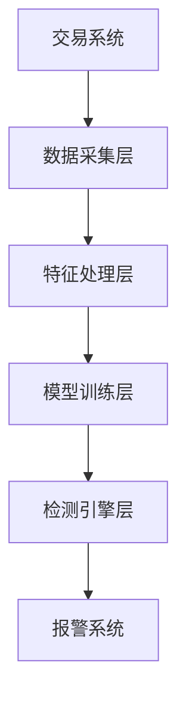
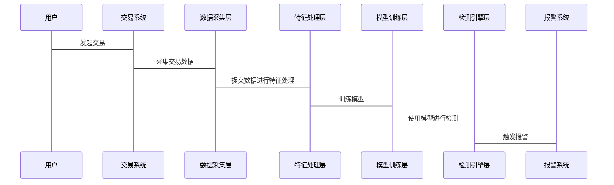

                 


# AI驱动的信用卡欺诈模式识别

> 关键词：AI驱动，信用卡欺诈，模式识别，机器学习，深度学习

> 摘要：随着信用卡的广泛使用，欺诈行为日益猖獗，传统的欺诈检测方法已难以应对复杂多变的欺诈手段。本文将详细探讨如何利用人工智能技术，特别是机器学习和深度学习算法，来识别信用卡欺诈模式。通过分析欺诈行为的特征，设计高效的特征工程和模型选择策略，结合系统的架构设计和实际项目案例，展示AI在信用卡欺诈检测中的强大能力。

---

## 第一部分：信用卡欺诈模式识别的背景与挑战

### 第1章：信用卡欺诈模式识别的背景与问题

#### 1.1 信用卡欺诈的现状与挑战

- **1.1.1 信用卡欺诈的主要形式**
  - 伪卡欺诈：利用 stolen 卡片进行交易。
  - 账户盗用：未经授权的第三方使用持卡人账户进行交易。
  - 伪冒交易：持卡人身份被冒用，进行非法交易。
  - 走单欺诈：利用商家漏洞，进行虚假交易。

- **1.1.2 欺诈行为对金融机构和用户的危害**
  - 金融机构面临高额的欺诈损失。
  - 用户可能因账户被盗用而蒙受经济损失和信誉损害。
  - 欺诈行为还可能导致金融机构声誉受损。

- **1.1.3 传统欺诈检测方法的局限性**
  - 基于规则的检测方法难以应对新型欺诈手段。
  - 人工审核效率低，且容易受到人为因素的影响。
  - 数据量大、维度高，传统方法难以高效处理。

#### 1.2 AI在欺诈检测中的作用

- **1.2.1 AI技术如何提升欺诈检测的效率**
  - 利用机器学习算法自动识别欺诈模式。
  - 通过深度学习技术捕捉复杂的数据特征。
  - 实时分析交易数据，快速响应欺诈行为。

- **1.2.2 机器学习在信用卡欺诈中的应用潜力**
  - 监督学习：基于标注数据训练分类器。
  - 无监督学习：识别异常交易模式。
  - 强化学习：动态调整检测策略。

- **1.2.3 智能风控系统的未来发展趋势**
  - 结合多种 AI 技术，构建多模态风控系统。
  - 利用联邦学习保护数据隐私。
  - 嵌入式风控：实时在线检测。

#### 1.3 数据特征与欺诈模式分析

- **1.3.1 信用卡交易数据的特征分析**
  - 时间特征：交易时间间隔、高峰交易时段。
  - 金额特征：交易金额分布、异常金额波动。
  - 地理特征：交易地理位置分布、异常地点跳跃。
  - 行为特征：交易频率、设备信息、用户行为模式。

- **1.3.2 欺诈交易的模式识别**
  - 分布特征：欺诈交易的金额、时间分布与正常交易的差异。
  - 关联特征：欺诈交易之间的关联性分析。
  - 聚类特征：欺诈交易的聚类分析。

- **1.3.3 数据隐私与合规性挑战**
  - 数据保护：如何在保证隐私的前提下进行特征提取。
  - 合规要求：符合 GDPR 等数据保护法规。

### 第2章：信用卡欺诈模式识别的核心概念与联系

#### 2.1 核心概念与原理

- **2.1.1 欺诈模式识别的基本原理**
  - 数据预处理：清洗、特征提取、数据标准化。
  - 模型训练：基于训练数据构建分类器。
  - 模型预测：对新交易进行分类，判断是否为欺诈。

- **2.1.2 特征工程在欺诈检测中的作用**
  - 特征选择：选择对欺诈检测有区分度的特征。
  - 特征变换：通过 PCA 等方法降低数据维度。
  - 特征组合：将多个特征组合成新的特征。

- **2.1.3 模型选择与优化策略**
  - 基于准确率、召回率的模型评估。
  - 交叉验证：避免过拟合，优化模型参数。
  - 模型融合：通过集成学习提升模型性能。

#### 2.2 欺诈模式识别的系统架构

- **2.2.1 系统功能模块划分**
  - 数据采集：实时采集交易数据。
  - 特征提取：对交易数据进行特征处理。
  - 模型训练：训练欺诈检测模型。
  - 检测引擎：实时检测交易是否为欺诈。
  - 报警系统：触发报警并采取措施。

- **2.2.2 数据流与信息处理流程**
  - 数据输入：交易数据从各个渠道进入系统。
  - 数据处理：清洗、特征提取、标准化。
  - 模型推理：分类器对交易进行分类。
  - 结果输出：返回欺诈检测结果。

- **2.2.3 系统性能与可扩展性分析**
  - 实时性：系统需要快速处理交易数据。
  - 可扩展性：能够处理大规模数据。
  - 可靠性：系统需要高可用性。

#### 2.3 欺诈模式识别的评估指标

- **2.3.1 真正正类率（TPR）**
  - 衡量模型检测欺诈交易的能力。
  - 公式：$$ TPR = \frac{TP}{TP + FN} $$

- **2.3.2 真正负类率（TNR）**
  - 衡量模型区分正常交易的能力。
  - 公式：$$ TNR = \frac{TN}{TN + FP} $$

- **2.3.3 准确率与召回率的平衡**
  - 准确率：$$ Accuracy = \frac{TP + TN}{TP + TN + FP + FN} $$
  - 召回率：$$ Recall = \frac{TP}{TP + FN} $$
  - F1分数：$$ F1 = 2 \cdot \frac{Precision \cdot Recall}{Precision + Recall} $$

---

## 第二部分：AI驱动的信用卡欺诈模式识别算法原理

### 第3章：监督学习与无监督学习在欺诈检测中的应用

#### 3.1 监督学习算法

- **3.1.1 logistic回归模型**
  - 用于分类问题，可以预测交易是否为欺诈。
  - 模型公式：$$ P(Y=1|X) = \frac{e^{\beta_0 + \beta_1 X}}{1 + e^{\beta_0 + \beta_1 X}} $$
  - 优点：简单易用，解释性强。
  - 缺点：对非线性关系的拟合能力有限。

- **3.1.2 支持向量机（SVM）模型**
  - 适用于高维数据的分类。
  - 核函数的选择：线性核、多项式核、RBF 核。
  - 优点：能够在高维空间中找到最优分割面。
  - 缺点：对参数敏感，需要调节惩罚参数。

- **3.1.3 随机森林与梯度提升树（GBDT）**
  - 随机森林：通过随机采样和随机特征选择构建多棵决策树。
  - GBDT：通过梯度下降法优化损失函数，逐步提升模型性能。
  - 优点：对噪声数据鲁棒，易于处理非线性关系。
  - 缺点：模型解释性较差。

#### 3.2 无监督学习算法

- **3.2.1 K-means聚类**
  - 将交易数据聚类，识别异常聚类。
  - 聚类过程：初始化质心，计算距离，更新质心，直到收敛。
  - 优点：简单高效，适合处理大规模数据。
  - 缺点：对初始质心敏感，难以处理噪声数据。

- **3.2.2 层次聚类**
  - 通过构建层次化结构，识别数据的层次关系。
  - 聚类方法：凝聚聚类和分裂聚类。
  - 优点：能够发现数据的层次结构。
  - 缺点：计算复杂度高，适合小规模数据。

- **3.2.3 Isolation Forest异常检测**
  - 通过构建随机树，隔离异常样本。
  - 优点：对异常样本敏感，适合小样本数据。
  - 缺点：对正常样本的分布假设敏感。

#### 3.3 混合学习策略

- **3.3.1 半监督学习的应用**
  - 利用标注和未标注数据进行联合训练。
  - 优点：减少标注数据的需求，提高模型泛化能力。
  - 缺点：需要设计有效的半监督学习算法。

- **3.3.2 弱监督学习的挑战**
  - 利用弱标注数据进行训练。
  - 优点：适用于标注数据不足的情况。
  - 缺点：模型性能受限于标注质量。

- **3.3.3 多模态数据融合的策略**
  - 结合交易数据、用户行为数据、设备信息等多种数据源。
  - 优点：提高模型的鲁棒性和准确性。
  - 缺点：数据整合和处理复杂。

### 第4章：深度学习与特征提取

#### 4.1 神经网络在欺诈检测中的应用

- **4.1.1 卷积神经网络（CNN）**
  - 适用于时间序列数据的特征提取。
  - 模型结构：卷积层、池化层、全连接层。
  - 优点：能够自动提取复杂特征。
  - 缺点：需要大量标注数据，计算资源消耗大。

- **4.1.2 循环神经网络（RNN）**
  - 适用于序列数据的建模。
  - 模型结构：循环层、门控循环层（GRU）、长短时记忆层（LSTM）。
  - 优点：能够捕捉序列数据的时序信息。
  - 缺点：训练过程中存在梯度消失或爆炸问题。

- **4.1.3 图神经网络（GNN）**
  - 适用于社交网络或交易网络中的欺诈检测。
  - 模型结构：图嵌入层、聚合层、前馈层。
  - 优点：能够捕捉节点之间的关系特征。
  - 缺点：需要构建有效的图结构。

#### 4.2 特征提取与降维技术

- **4.2.1 主成分分析（PCA）**
  - 通过线性变换将高维数据降维。
  - 优点：降低计算复杂度，去除冗余信息。
  - 缺点：可能丢失数据的非线性特征。

- **4.2.2 线性判别分析（LDA）**
  - 通过最大化类别可分性进行降维。
  - 优点：适合分类问题，能够提高分类性能。
  - 缺点：需要类别信息，不适合无监督学习。

- **4.2.3 t-SNE与UMAP降维技术**
  - 适用于数据可视化和降维。
  - 优点：能够保持数据的局部结构。
  - 缺点：计算复杂，适合小规模数据。

### 第5章：模型融合与调优

#### 5.1 模型融合策略

- **5.1.1 硬投票与软投票**
  - 硬投票：多数投票法。
  - 软投票：基于概率的加权投票。
  - 优点：能够提高模型的准确率和稳定性。
  - 缺点：需要训练多个模型，计算资源消耗大。

- **5.1.2 增强学习的策略**
  - 利用强化学习框架优化模型选择。
  - 优点：能够动态调整模型权重。
  - 缺点：需要设计复杂的强化学习环境。

- **5.1.3 多任务学习的策略**
  - 同时优化多个相关任务，共享特征表示。
  - 优点：能够提高模型的泛化能力。
  - 缺点：需要设计有效的任务协同策略。

#### 5.2 模型调优与优化

- **5.2.1 超参数调优**
  - 利用网格搜索或随机搜索优化模型参数。
  - 优点：能够提高模型性能。
  - 缺点：计算资源消耗大。

- **5.2.2 模型压缩与剪枝**
  - 通过剪枝减少模型复杂度。
  - 优点：降低计算复杂度，提高推理速度。
  - 缺点：可能会影响模型的准确性。

- **5.2.3 模型解释性优化**
  - 利用 SHAP 或 LIME 提供模型解释。
  - 优点：能够解释模型的决策过程。
  - 缺点：需要额外的计算资源。

---

## 第三部分：系统分析与架构设计方案

### 第6章：系统分析与架构设计

#### 6.1 问题场景介绍

- **6.1.1 信用卡欺诈检测的业务场景**
  - 实时检测：需要快速响应交易是否为欺诈。
  - 大数据分析：处理海量交易数据。
  - 数据隐私：保护用户数据隐私。

#### 6.2 系统功能设计

- **6.2.1 领域模型设计**
  - 实体关系图（ER 图）：交易、用户、卡片、欺诈行为。
  - 类图：交易实体、用户实体、欺诈检测算法。

- **6.2.2 系统架构设计**
  - 分层架构：数据采集层、特征处理层、模型训练层、检测引擎层。
  - 微服务架构：数据采集服务、特征处理服务、模型训练服务、检测引擎服务。

- **6.2.3 接口设计**
  - 数据接口：与交易系统、用户系统对接。
  - 检测接口：提供欺诈检测服务的 API。
  - 报警接口：触发报警通知。

#### 6.3 系统架构图



#### 6.4 系统交互序列图



---

## 第四部分：项目实战

### 第7章：项目实战

#### 7.1 环境安装

- **7.1.1 安装 Python 和依赖库**
  ```bash
  pip install numpy pandas scikit-learn tensorflow
  ```

- **7.1.2 安装数据处理工具**
  ```bash
  pip install matplotlib seaborn
  ```

- **7.1.3 安装深度学习框架**
  ```bash
  pip install keras tensorflow
  ```

#### 7.2 系统核心实现源代码

- **7.2.1 数据预处理代码**
  ```python
  import pandas as pd
  import numpy as np

  # 读取数据
  df = pd.read_csv('creditcard.csv')

  # 删除缺失值
  df.dropna(inplace=True)

  # 标准化处理
  from sklearn.preprocessing import StandardScaler
  scaler = StandardScaler()
  df_scaled = pd.DataFrame(scaler.fit_transform(df), columns=df.columns)
  ```

- **7.2.2 模型训练代码**
  ```python
  from sklearn.model_selection import train_test_split
  from sklearn.linear_model import LogisticRegression
  from sklearn.metrics import accuracy_score, recall_score

  # 划分训练集和测试集
  X_train, X_test, y_train, y_test = train_test_split(df_scaled, df['is_fraud'], test_size=0.2)

  # 训练 logistic regression 模型
  model = LogisticRegression()
  model.fit(X_train, y_train)

  # 模型预测
  y_pred = model.predict(X_test)

  # 模型评估
  accuracy = accuracy_score(y_test, y_pred)
  recall = recall_score(y_test, y_pred)
  print(f'Accuracy: {accuracy}, Recall: {recall}')
  ```

- **7.2.3 实时检测代码**
  ```python
  def predict_fraud(transaction):
      # 特征提取
      features = transaction.values.reshape(1, -1)
      scaled_features = scaler.transform(features)
      # 预测
      prediction = model.predict(scaled_features)
      return prediction[0]

  # 示例交易
  transaction = pd.Series([...], index=df.columns)
  print(predict_fraud(transaction))
  ```

#### 7.3 实际案例分析

- **7.3.1 数据分析**
  - 使用可视化工具分析欺诈交易的分布特征。
  - 绘制交易金额的分布图，识别异常金额。
  - 绘制交易时间的热力图，发现异常时间段。

- **7.3.2 模型调优**
  - 使用交叉验证选择最优参数。
  - 调整模型的阈值，平衡准确率和召回率。
  - 使用集成学习方法提高模型性能。

#### 7.4 项目小结

- **7.4.1 项目成果**
  - 成功构建了一个信用卡欺诈检测系统。
  - 提高了欺诈检测的准确率和召回率。
  - 实现了系统的实时检测功能。

- **7.4.2 经验总结**
  - 数据预处理是关键，特征工程直接影响模型性能。
  - 模型选择需要根据实际场景进行调整。
  - 系统架构设计需要考虑扩展性和可维护性。

---

## 第五部分：总结与展望

### 第8章：总结与展望

#### 8.1 总结

- 本文详细探讨了 AI 在信用卡欺诈模式识别中的应用。
- 结合监督学习、无监督学习和深度学习算法，构建了高效的欺诈检测系统。
- 通过系统架构设计和项目实战，验证了 AI 技术在欺诈检测中的有效性。

#### 8.2 未来展望

- **8.2.1 技术发展**
  - 结合联邦学习保护数据隐私。
  - 利用强化学习动态调整检测策略。
  - 嵌入式风控：实时在线检测。

- **8.2.2 应用场景扩展**
  - 扩展到其他金融领域，如反洗钱、信用评分。
  - 应用于非金融领域，如身份验证、行为分析。

- **8.2.3 挑战与机遇**
  - 数据隐私保护：如何在不泄露数据的前提下进行特征提取。
  - 模型解释性：如何解释模型的决策过程。
  - 实时性与可扩展性：如何在大规模数据下保持实时检测能力。

---

### 最佳实践 Tips

- **数据隐私保护**：在处理敏感数据时，采用差分隐私或同态加密等技术保护用户隐私。
- **模型解释性**：使用 SHAP 或 LIME 等工具解释模型的决策过程，提高模型的透明性和可信度。
- **实时性优化**：采用流数据处理技术，如 Apache Flink 或 Apache Kafka，实现实时欺诈检测。
- **系统可扩展性**：采用分布式架构，如 Apache Spark 或 Hadoop，处理大规模数据。

---

### 思考与总结

通过本文的详细讲解，读者可以全面了解 AI 在信用卡欺诈模式识别中的应用。从背景分析到算法实现，再到系统设计和项目实战，每一步都经过了深入的思考和验证。未来，随着 AI 技术的不断发展，信用卡欺诈检测系统将更加智能化、高效化，为金融机构和用户提供更安全的支付环境。

---

### 注意事项

- 在实际应用中，需要结合具体业务场景选择合适的算法和模型。
- 数据预处理和特征工程是关键，需要投入足够的精力进行优化。
- 模型调优和部署需要考虑系统的可扩展性和可维护性。

---

### 拓展阅读

- 《Python机器学习实战》：深入理解机器学习算法的实现和应用。
- 《深度学习入门：基于Python的CNN、RNN、GAN等模型原理与实践》：掌握深度学习的核心技术。
- 《数据科学项目实战：从数据获取到结果展示》：学习数据科学项目的完整流程。

--- 

本文通过系统地分析 AI 在信用卡欺诈检测中的应用，结合理论和实践，为读者提供了全面的解决方案。希望本文能为相关领域的研究和实践提供有价值的参考。

