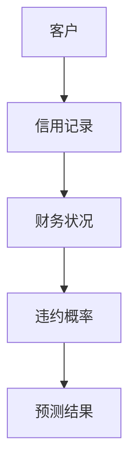
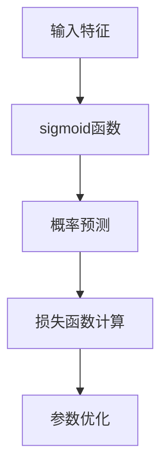
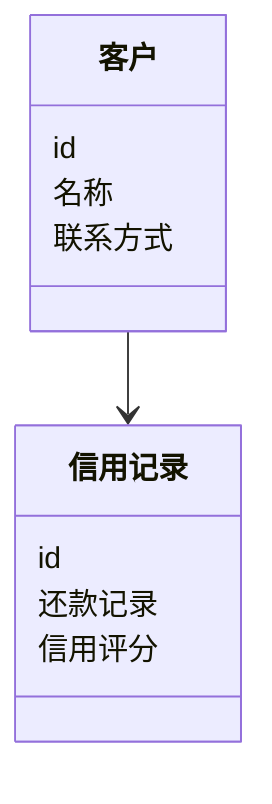
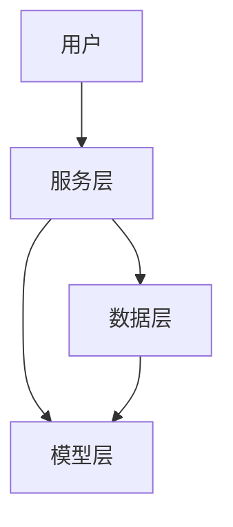

                 


# AI驱动的信用违约预测

> 关键词：信用违约预测，人工智能，机器学习，金融风险管理，数据分析

> 摘要：本文探讨AI在信用违约预测中的应用，从背景介绍到实战项目，详细分析了传统方法的局限性、AI的优势、核心算法原理、系统架构设计以及实际案例。通过数学模型、算法流程图和代码实现，深入讲解AI如何提升信用风险评估的准确性和效率，为金融行业提供新的风险管理工具。

---

## 第一部分: 信用违约预测的背景与概念

### 第1章: 信用违约预测的背景介绍

#### 1.1 信用违约的基本概念
- **定义与特征**：信用违约是指借款方未能按约定偿还贷款本息的行为，具有隐蔽性、传染性和系统性等特征。
- **分类与场景**：个人违约、企业违约；零售信贷、企业信贷等场景。
- **业务价值**：降低金融机构的损失，优化信贷资源配置。

#### 1.2 AI在信用违约预测中的应用背景
- **传统方法的局限性**：依赖专家经验，难以处理非线性关系。
- **AI技术的应用趋势**：深度学习、自然语言处理在金融领域的应用。
- **AI的优势**：非线性拟合能力强，特征学习自动。

#### 1.3 数据来源与特征分析
- **数据来源**：客户信息、交易记录、财务报表、市场数据。
- **数据特征**：人口统计特征、行为特征、财务特征、市场特征。
- **数据预处理**：缺失值处理、异常值处理、特征标准化。

#### 1.4 信用违约预测的评估指标
- **常见指标**：AUC、F1分数、准确率、召回率。
- **模型性能评价**：ROC曲线、PR曲线。
- **指标权重**：业务场景中的指标优先级。

#### 1.5 信用风险与违约预测的关系
- **信用风险**：指债权人无法按期收回债务的风险。
- **违约预测的作用**：识别高风险客户，提前采取措施。
- **量化与模型化**：将信用风险转化为可预测的违约概率。

---

## 第二部分: AI驱动信用违约预测的核心概念与联系

### 第2章: 核心概念对比分析

#### 2.1 核心概念对比
| 概念          | 传统方法                     | AI方法                       |
|---------------|------------------------------|------------------------------|
| 数据来源      | 有限，主要依赖财务数据       | 多源数据，包括文本、行为数据 |
| 模型复杂度    | 线性模型为主                 | 非线性模型为主               |
| 可解释性      | 高                          | 低                          |

#### 2.2 ER实体关系图


---

## 第三部分: 信用违约预测的核心算法原理

### 第3章: 逻辑回归算法

#### 3.1 算法原理
- **数学模型**：$$ P(y=1|x) = \frac{1}{1 + e^{- (w^T x + b)}} $$
- **流程图**：


#### 3.2 Python实现
```python
import numpy as np
from sklearn.linear_model import LogisticRegression

# 数据加载与预处理
X = ...
y = ...

# 模型训练
model = LogisticRegression()
model.fit(X, y)

# 预测与评估
y_pred = model.predict(X)
print("准确率:", model.score(X, y))
```

---

## 第四部分: 系统分析与架构设计方案

### 第4章: 系统架构设计

#### 4.1 领域模型


#### 4.2 系统架构图


---

## 第五部分: 项目实战

### 第5章: 项目实战

#### 5.1 环境安装
- **Anaconda**：用于Python环境管理。
- **依赖库**：scikit-learn, pandas, numpy。

#### 5.2 核心代码实现
```python
import pandas as pd
from sklearn.model_selection import train_test_split
from sklearn.metrics import roc_auc_score

# 数据加载
data = pd.read_csv('credit_data.csv')

# 特征选择与分割
X = data.drop('default', axis=1)
y = data['default']

X_train, X_test, y_train, y_test = train_test_split(X, y, test_size=0.2)

# 模型训练与评估
from sklearn.ensemble import RandomForestClassifier
model = RandomForestClassifier()
model.fit(X_train, y_train)

y_pred = model.predict(X_test)
print("AUC:", roc_auc_score(y_test, y_pred))
```

---

## 第六部分: 最佳实践与小结

### 第6章: 最佳实践

#### 6.1 小结
- AI显著提升了信用违约预测的准确性。
- 综合使用多种模型和特征工程是关键。

#### 6.2 注意事项
- 数据隐私与合规性。
- 模型的可解释性问题。
- 模型的实时更新与维护。

#### 6.3 拓展阅读
- 《机器学习实战》
- 《深度学习》

---

# 结语

AI驱动的信用违约预测通过深度学习和大数据分析，为金融行业提供了高效的风险管理工具。随着技术进步，未来将实现更精准的预测和更个性化的风险管理策略。

