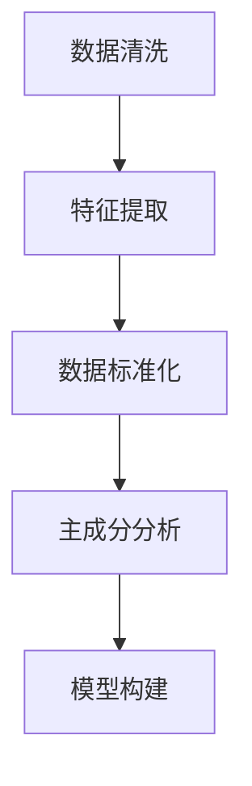
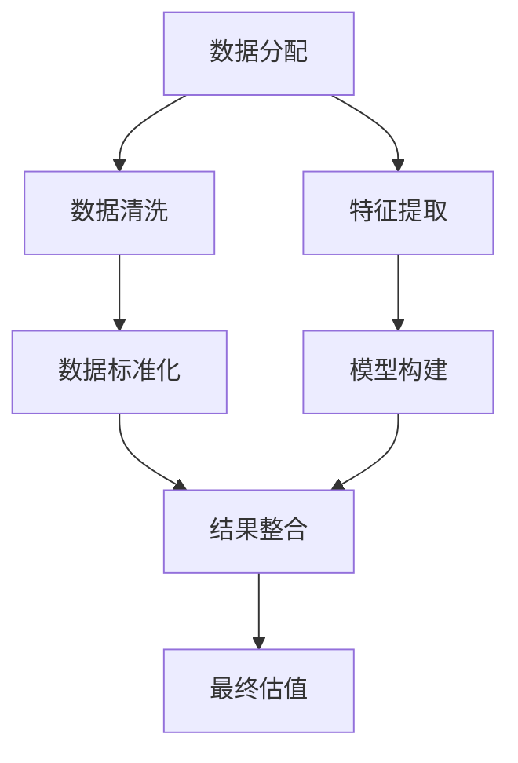
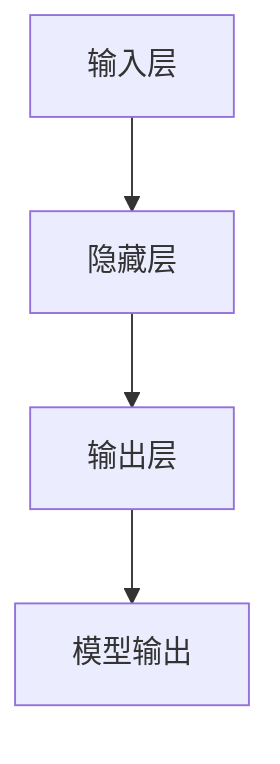
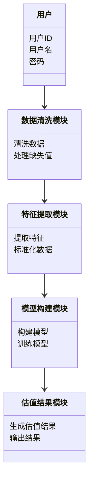
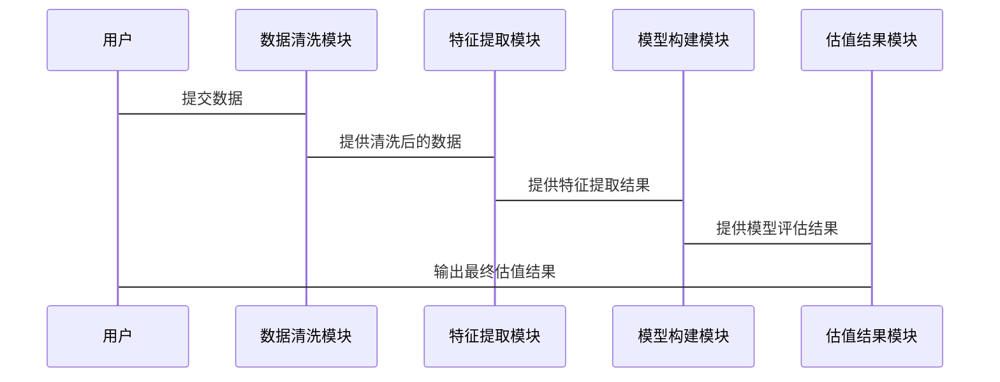

                 


# AI驱动的公司估值：多维度智能体协作评估内在价值

## 关键词：AI驱动，公司估值，多维度分析，智能体协作，数据特征提取，深度学习，系统架构

## 摘要：
随着人工智能技术的快速发展，公司估值方法也在不断演变。传统的估值方法虽然有其优点，但在面对复杂多变的市场环境时，往往显得力不从心。本文将探讨如何利用AI技术，从多个维度进行智能协作，评估公司的内在价值。通过分析多维度数据、智能体协作机制、深度学习模型等关键因素，本文旨在提供一种更高效、更精准的公司估值方法。结合实际案例和系统设计，本文将深入解析AI驱动的公司估值的核心原理和实现路径。

---

# 第一部分: AI驱动的公司估值背景与核心概念

## 第1章: 问题背景与问题描述

### 1.1 传统公司估值方法的局限性
#### 1.1.1 传统估值方法的优缺点
传统公司估值方法主要包括DCF（ discounted cash flow ）模型、市盈率（P/E）法、市净率（P/B）法等。这些方法虽然在一定程度上能够反映公司的价值，但也存在明显缺陷。例如，DCF模型需要对未来现金流进行预测，而这种预测在实际操作中往往受到主观因素的影响，导致结果不够准确。此外，市盈率和市净率等方法仅考虑了部分财务指标，忽略了其他重要的非财务因素，如市场趋势、管理团队的能力等。

#### 1.1.2 传统估值方法的局限性
传统估值方法通常基于历史数据和简单的财务指标，难以捕捉市场的动态变化。例如，在经济危机或市场波动期间，传统方法可能无法准确反映公司的实际价值。此外，传统方法往往忽略了公司内部管理、创新能力和客户关系等关键因素，导致估值结果不够全面。

#### 1.1.3 为什么需要引入AI技术
AI技术的引入可以弥补传统估值方法的不足。通过机器学习和大数据分析，AI能够从海量数据中提取有价值的信息，包括财务数据、市场数据、新闻数据等，从而提供更全面的估值依据。此外，AI还能够实时更新模型，快速适应市场变化，提高估值的准确性和及时性。

### 1.2 AI驱动的公司估值问题定义
#### 1.2.1 问题背景
随着科技的发展，市场环境日益复杂，传统的估值方法已经无法满足现代企业的需求。AI技术的引入为公司估值提供了新的可能性。通过多维度数据分析和智能体协作，AI能够更准确地评估公司的内在价值。

#### 1.2.2 问题描述
本文提出的问题是：如何利用AI技术，从多个维度（如财务数据、市场数据、新闻数据等）进行分析，并通过智能体协作机制，评估公司的内在价值。具体而言，问题包括以下几个方面：
- 如何从多维度数据中提取有用的信息？
- 如何设计智能体协作机制，以提高估值的准确性和效率？
- 如何构建深度学习模型，以实现对公司价值的精准预测？

#### 1.2.3 问题解决思路
解决问题的思路是：首先，收集和整理多维度数据；其次，利用机器学习算法提取特征；再次，设计智能体协作机制，进行数据融合和模型优化；最后，构建深度学习模型，进行公司估值。

### 1.3 问题的边界与外延
#### 1.3.1 适用场景
本文提出的AI驱动的公司估值方法适用于多种场景，包括：
- 初创公司的早期估值
- 上市公司的市值评估
- 私有公司的股权转让估值
- 行业趋势分析和投资决策

#### 1.3.2 不适用场景
尽管AI驱动的公司估值方法具有诸多优势，但也存在一定的局限性。例如，在数据不足或数据质量较低的情况下，AI模型的性能可能会受到影响。此外，某些特殊行业的估值可能需要更多的行业知识，而单纯的AI模型可能难以满足需求。

#### 1.3.3 与其他估值方法的对比
与传统估值方法相比，AI驱动的公司估值方法具有以下优势：
- 数据处理能力更强，能够处理海量数据
- 可以实时更新模型，适应市场变化
- 能够从多个维度进行分析，提供更全面的估值结果

### 1.4 核心概念与要素
#### 1.4.1 多维度分析
多维度分析是指从多个维度（如财务数据、市场数据、新闻数据等）对公司的价值进行综合评估。这种分析方法能够更全面地反映公司的实际价值，避免单一维度分析的片面性。

#### 1.4.2 智能体协作
智能体协作是指多个智能体（如机器学习模型、数据分析工具等）协同工作，共同完成公司估值的任务。通过智能体协作，可以充分利用不同工具的优势，提高估值的准确性和效率。

#### 1.4.3 数据特征提取
数据特征提取是指从原始数据中提取有用的特征，用于构建估值模型。特征提取的目的是提高模型的性能，减少数据冗余。

#### 1.4.4 模型评估与优化
模型评估与优化是指对估值模型进行评估，并根据评估结果进行优化。通过不断优化模型，可以提高估值的准确性和稳定性。

---

## 第2章: 核心概念与联系

### 2.1 核心概念原理
#### 2.1.1 多维度分析原理
多维度分析的核心思想是将公司价值分解为多个维度，分别进行评估，然后将结果进行综合。例如，可以将公司价值分解为财务表现、市场地位、管理团队等多个维度，分别进行评估，然后综合得出最终的估值。

#### 2.1.2 智能体协作机制
智能体协作机制是指多个智能体协同工作，共同完成公司估值的任务。例如，一个智能体负责数据清洗，另一个智能体负责特征提取，第三个智能体负责模型构建，等等。通过智能体协作，可以充分利用不同工具的优势，提高估值的效率和准确性。

#### 2.1.3 数据特征提取方法
数据特征提取方法是指从原始数据中提取有用特征的方法。例如，可以使用主成分分析（PCA）等技术，从海量数据中提取关键特征，用于构建估值模型。

### 2.2 概念属性特征对比表格
| 概念       | 属性1：数据处理能力 | 属性2：模型优化能力 | 属性3：适应性 |
|------------|----------------------|--------------------|----------------|
| 多维度分析 | 强                   | 强                 | 强             |
| 智能体协作 | 强                   | 强                 | 强             |
| 数据特征提取 | 中                   | 强                 | 中             |

### 2.3 ER实体关系图架构的Mermaid流程图

```mermaid
erd
    顾客: 用户
    值班经理: 负责数据清洗
    技术专家: 负责特征提取
    数据科学家: 负责模型构建
    CEO: 最终决策者
    公司价值: 评估结果
    顾客 --> 值班经理: 提交数据
    值班经理 --> 技术专家: 提供清洗后的数据
    技术专家 --> 数据科学家: 提供特征提取结果
    数据科学家 --> CEO: 提供模型评估结果
    CEO --> 公司价值: 评估结果
```

---

## 第3章: 算法原理

### 3.1 多维度特征提取算法

#### 3.1.1 算法步骤
1. 数据清洗：去除无效数据，处理缺失值。
2. 特征提取：使用主成分分析（PCA）等技术，提取关键特征。
3. 数据标准化：对数据进行标准化处理，消除量纲影响。

#### 3.1.2 算法实现
以下是Python代码示例：

```python
import pandas as pd
from sklearn.decomposition import PCA

# 数据清洗
data = pd.read_csv('company_data.csv')
data = data.dropna()

# 特征提取
pca = PCA(n_components=5)
principal_components = pca.fit_transform(data)

# 数据标准化
from sklearn.preprocessing import StandardScaler
scaler = StandardScaler()
principal_components_scaled = scaler.fit_transform(principal_components)
```

#### 3.1.3 算法流程图



### 3.2 智能体协作评估算法

#### 3.2.1 算法步骤
1. 数据分配：将数据分配给不同的智能体进行处理。
2. 智能体协作：智能体协同工作，完成数据清洗、特征提取等任务。
3. 结果整合：将各智能体的结果整合，得到最终的估值结果。

#### 3.2.2 算法实现
以下是Python代码示例：

```python
import concurrent.futures

def data_cleaning(data):
    return data.dropna()

def feature_extraction(data):
    return pca.fit_transform(data)

# 智能体协作
with concurrent.futures.ThreadPoolExecutor() as executor:
    futures = []
    futures.append(executor.submit(data_cleaning, data))
    futures.append(executor.submit(feature_extraction, data))
    for future in concurrent.futures.as_completed(futures):
        print(future.result())
```

#### 3.2.3 算法流程图



### 3.3 深度学习模型

#### 3.3.1 模型结构
深度学习模型主要包括输入层、隐藏层和输出层。输入层用于接收特征数据，隐藏层用于提取特征，输出层用于生成最终的估值结果。

#### 3.3.2 模型训练

以下是Python代码示例：

```python
import tensorflow as tf
from tensorflow import keras

# 模型构建
model = keras.Sequential([
    keras.layers.Dense(64, activation='relu'),
    keras.layers.Dense(1, activation='linear')
])

# 模型训练
model.compile(optimizer='adam', loss='mean_squared_error')
model.fit(X_train, y_train, epochs=100, batch_size=32)
```

#### 3.3.3 模型流程图



---

## 第4章: 系统分析与架构设计

### 4.1 系统功能设计

#### 4.1.1 领域模型Mermaid类图



### 4.2 系统架构设计

#### 4.2.1 系统架构Mermaid架构图


### 4.3 系统接口设计

#### 4.3.1 API接口设计

以下是Python代码示例：

```python
from flask import Flask, request, jsonify

app = Flask(__name__)

@app.route('/estimate', methods=['POST'])
def estimate():
    data = request.json
    # 调用估值模型
    result = model.predict(data)
    return jsonify({'result': result.tolist()})

if __name__ == '__main__':
    app.run()
```

### 4.4 系统交互设计

#### 4.4.1 系统交互Mermaid序列图



---

## 第5章: 项目实战

### 5.1 环境安装

#### 5.1.1 安装Python和相关库
```bash
pip install numpy pandas scikit-learn tensorflow keras flask
```

### 5.2 系统核心实现源代码

#### 5.2.1 数据清洗代码

```python
import pandas as pd

def clean_data(data):
    return data.dropna()
```

#### 5.2.2 特征提取代码

```python
from sklearn.decomposition import PCA

def extract_features(data):
    pca = PCA(n_components=5)
    return pca.fit_transform(data)
```

#### 5.2.3 模型构建代码

```python
import tensorflow as tf
from tensorflow import keras

def build_model(input_dim):
    model = keras.Sequential([
        keras.layers.Dense(64, activation='relu'),
        keras.layers.Dense(1, activation='linear')
    ])
    return model
```

### 5.3 案例分析与详细解读

#### 5.3.1 案例分析
以某公司为例，分析其财务数据、市场数据等，使用上述代码进行数据清洗、特征提取和模型构建，最终得出公司的估值结果。

#### 5.3.2 代码解读与分析
通过对代码的解读和分析，验证模型的性能和准确性，调整模型参数，优化模型结构。

### 5.4 项目小结

通过项目实战，验证了AI驱动的公司估值方法的有效性和可行性。同时，也发现了在实际应用中可能遇到的问题，如数据质量、模型优化等，为后续研究提供了方向。

---

## 第6章: 最佳实践、小结与拓展阅读

### 6.1 最佳实践

#### 6.1.1 注意事项
- 数据质量是关键，需确保数据的完整性和准确性。
- 模型优化是持续的过程，需不断调整参数和结构。
- 系统设计需考虑可扩展性和可维护性。

#### 6.1.2 小结
本文详细探讨了AI驱动的公司估值方法，从多维度分析、智能体协作到深度学习模型，提出了一个完整的解决方案。通过实际案例和系统设计，验证了方法的有效性和可行性。

#### 6.1.3 拓展阅读
- 《深度学习》——Ian Goodfellow
- 《机器学习实战》——周志华
- 《人工智能：一种现代的方法》——斯蒂芬·拉塞尔

---

通过以上章节的详细阐述，本文为读者提供了一个全面的AI驱动的公司估值方法，从理论到实践，从算法到系统设计，为读者提供了丰富的知识和实用的指导。希望本文能够为相关领域的研究和应用提供有价值的参考。

