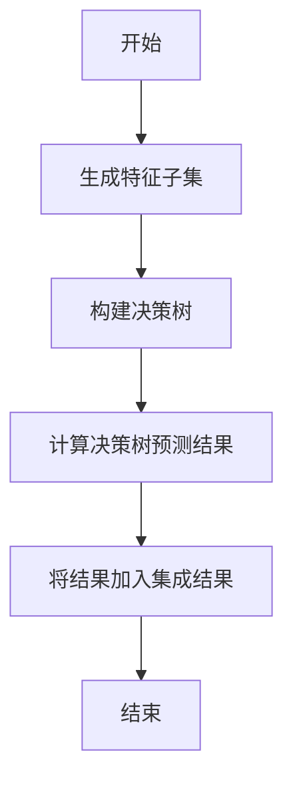
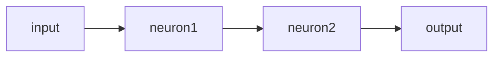
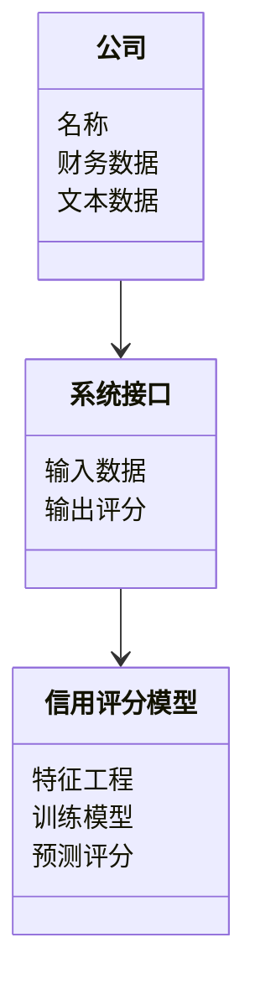
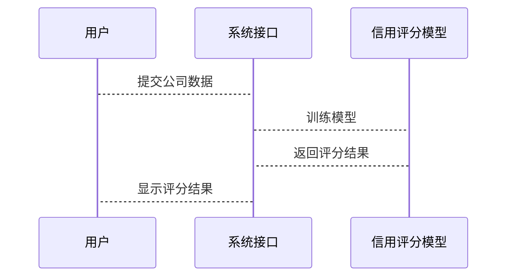

                 


# AI驱动的公司信用风险评估：增强价值投资的安全性

---

## 关键词：AI技术、信用风险评估、机器学习、深度学习、信用评分模型、风险投资、金融分析

---

## 摘要

随着金融市场的不断发展，信用风险评估在投资决策中扮演着至关重要的角色。传统的信用评估方法存在效率低下、覆盖面有限以及主观性强等问题，难以满足现代金融市场的复杂需求。人工智能（AI）技术的兴起为信用风险评估带来了革命性的变化。通过机器学习、深度学习和自然语言处理等技术，AI能够更准确地分析大量数据，识别潜在风险，从而增强价值投资的安全性。本文将从信用风险评估的背景与挑战入手，深入探讨AI驱动的信用风险评估的核心概念、算法原理、系统架构设计以及实际应用案例，为读者提供全面的技术解析。

---

## 第1章: 信用风险评估的背景与挑战

### 1.1 信用风险的基本概念

#### 1.1.1 信用风险的定义

信用风险是指债务人在偿还债务时发生违约的可能性。在金融领域，信用风险是投资者和金融机构关注的核心问题之一。准确评估信用风险，可以帮助投资者做出更明智的投资决策，降低财务损失。

#### 1.1.2 信用风险的分类

信用风险可以分为系统性风险和非系统性风险。系统性风险是由于市场整体波动引起的，例如经济衰退或金融危机；而非系统性风险则是由于个别公司或行业的特定因素引起的，例如管理不善或财务造假。

#### 1.1.3 信用风险的衡量指标

常用的信用风险衡量指标包括信用评分、违约概率（PD）、违约损失率（LGD）和风险价值（VaR）等。信用评分是衡量企业信用状况的重要指标，通常基于财务数据和市场表现进行评估。

### 1.2 传统信用风险评估方法的局限性

#### 1.2.1 传统信用评分模型的局限性

传统的信用评分模型，如线性回归模型，主要依赖于少量的财务数据，难以捕捉复杂的市场动态和非结构化信息。此外，传统模型的泛化能力较弱，容易过拟合，导致评估结果的不准确。

#### 1.2.2 数据不足与模型过拟合问题

传统信用评估方法通常依赖于有限的数据集，难以充分利用大数据的优势。此外，由于数据量不足，模型容易过拟合，导致在实际应用中表现不佳。

#### 1.2.3 人工评估的主观性和效率低下

传统的信用评估过程需要大量的人工分析，不仅效率低下，还容易受到主观因素的影响，导致评估结果的不一致性和不准确性。

### 1.3 AI技术在信用风险评估中的优势

#### 1.3.1 AI驱动的自动化评估能力

AI技术能够自动化处理大量数据，快速生成信用评分，显著提高了评估效率。通过机器学习算法，AI可以发现数据中的隐藏模式，捕捉传统模型难以察觉的风险因素。

#### 1.3.2 大数据分析能力

AI技术能够处理结构化和非结构化数据，包括财务报表、新闻报道、社交媒体信息等，从而更全面地评估公司的信用状况。这种多源数据的整合能力是传统方法无法比拟的。

#### 1.3.3 智能预测与决策支持

通过深度学习和自然语言处理技术，AI能够预测未来的信用风险，并为投资决策提供智能化的支持。例如，AI可以通过分析公司财报和市场动态，提前识别潜在的违约风险。

---

## 第2章: AI驱动的信用风险评估核心概念

### 2.1 AI在信用风险评估中的核心原理

#### 2.1.1 机器学习与深度学习的基本原理

机器学习是一种通过数据训练模型的技术，能够在大量数据中发现模式和关系。深度学习作为机器学习的一种，通过多层神经网络模型，能够捕捉更复杂的特征和关系。

#### 2.1.2 自然语言处理在信用评估中的应用

自然语言处理（NLP）技术可以分析公司公告、新闻报道等文本数据，提取情感、关键词等信息，帮助评估公司的信用状况。例如，通过分析公司的负面新闻，可以识别潜在的信用风险。

#### 2.1.3 图神经网络在信用关系中的应用

图神经网络（GNN）可以建模公司之间的信用关系，识别系统性风险。通过分析公司之间的关联，GNN可以帮助预测某一公司的违约风险对整个市场的影响。

### 2.2 核心概念与联系

#### 2.2.1 信用风险评估的ER实体关系图

以下是信用风险评估的ER图，展示了公司与信用评分的关系：

```mermaid
er
  actor: 公司
  attribute: 信用评分
  relation: 公司-信用评分关系
  actor --> relation
  attribute --> relation
```

---

## 第3章: AI驱动信用风险评估的算法原理

### 3.1 传统信用评分模型

#### 3.1.1 逻辑回归模型

逻辑回归是一种常用的分类模型，适用于二分类问题。其数学模型如下：

$$ P(y=1) = \frac{e^{\beta_0 + \beta_1 x_1 + \cdots + \beta_n x_n}}{1 + e^{\beta_0 + \beta_1 x_1 + \cdots + \beta_n x_n}} $$

#### 3.1.2 线性判别分析

线性判别分析（LDA）是一种用于分类的统计方法，适用于小样本数据。其基本思想是通过线性组合将数据投影到一个低维空间，使得不同类别的数据尽可能分开。

#### 3.1.3 支持向量机

支持向量机（SVM）是一种强大的分类模型，适用于高维数据。其核心思想是通过找到一个超平面，将数据分为两类。

### 3.2 基于机器学习的信用风险评估算法

#### 3.2.1 随机森林算法

随机森林是一种基于树的集成方法，通过组合多个决策树的结果，提高模型的准确性和鲁棒性。以下是随机森林算法的流程图：



#### 3.2.2 神经网络模型

神经网络是一种模拟人脑结构的模型，适用于复杂的非线性分类问题。以下是神经网络模型的结构图：



#### 3.2.3 XGBoost算法

XGBoost是一种高效的梯度提升算法，通过优化决策树模型，显著提高了分类性能。

### 3.3 算法实现的Python代码示例

以下是使用随机森林算法实现信用评分模型的代码示例：

```python
import pandas as pd
from sklearn.ensemble import RandomForestClassifier
from sklearn.metrics import accuracy_score

# 加载数据
data = pd.read_csv('credit_data.csv')

# 特征和标签分离
X = data.drop('default', axis=1)
y = data['default']

# 训练模型
model = RandomForestClassifier()
model.fit(X, y)

# 预测
y_pred = model.predict(X)

# 计算准确率
print(accuracy_score(y, y_pred))
```

---

## 第4章: 系统分析与架构设计

### 4.1 信用风险评估系统的应用场景

AI驱动的信用风险评估系统可以应用于银行、证券公司、投资机构等领域，帮助投资者和金融机构更好地管理信用风险。

### 4.2 系统功能设计

以下是信用风险评估系统的领域模型图：



### 4.3 系统架构设计

以下是信用风险评估系统的分层架构图：


### 4.4 系统接口设计

系统接口包括数据输入接口和评分输出接口，确保系统能够与外部数据源和用户界面无缝对接。

### 4.5 系统交互流程

以下是系统交互的序列图：



---

## 第5章: 项目实战

### 5.1 环境安装与配置

需要安装Python、Scikit-learn、XGBoost、TensorFlow等库。

### 5.2 系统核心实现

以下是信用评分模型的核心代码实现：

```python
import pandas as pd
from sklearn.ensemble import RandomForestClassifier
from sklearn.metrics import accuracy_score

# 加载数据
data = pd.read_csv('credit_data.csv')

# 特征和标签分离
X = data.drop('default', axis=1)
y = data['default']

# 训练模型
model = RandomForestClassifier()
model.fit(X, y)

# 预测
y_pred = model.predict(X)

# 计算准确率
print(accuracy_score(y, y_pred))
```

### 5.3 代码解读与分析

代码通过随机森林算法训练信用评分模型，并对数据进行预测，输出准确率。

### 5.4 实际案例分析

通过具体案例分析，展示系统如何根据公司数据生成信用评分，并预测违约风险。

---

## 第6章: 最佳实践与小结

### 6.1 小结

本文详细探讨了AI驱动的信用风险评估的核心概念、算法原理、系统架构设计以及实际应用案例。通过AI技术的应用，信用风险评估的效率和准确性得到了显著提升。

### 6.2 注意事项

在实际应用中，需要注意数据隐私、模型解释性和实时性等问题。此外，模型需要定期更新，以适应市场变化。

### 6.3 拓展阅读

推荐阅读《Python机器学习实战》、《深度学习》等书籍，进一步深入学习AI技术在金融领域的应用。

---

## 总结

通过本文的分析，读者可以全面理解AI在公司信用风险评估中的应用价值，并掌握相关的技术细节。希望本文能够为读者在信用风险评估领域的研究和实践提供有益的指导。

