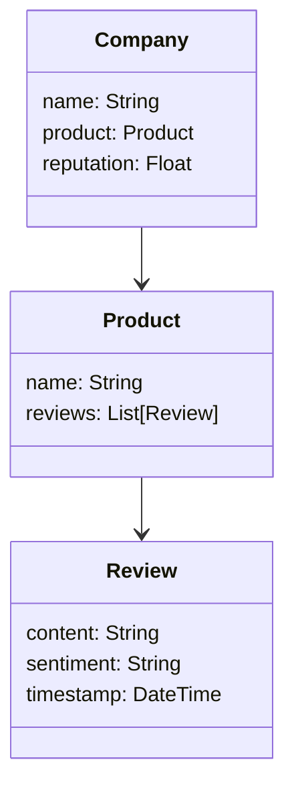
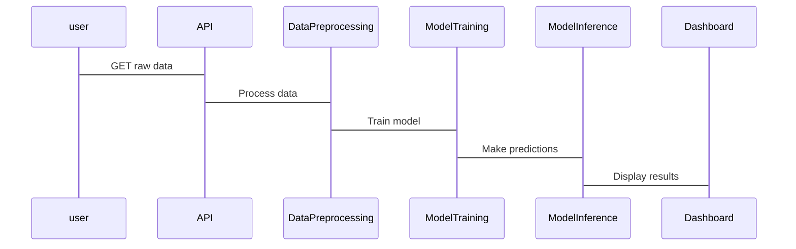

                 


# AI驱动的公司声誉分析：评估无形资产价值

---

## 关键词：公司声誉、无形资产、AI技术、NLP、机器学习、数据挖掘、情感分析

---

## 摘要：  
在数字化时代，公司声誉已成为企业最重要的无形资产之一。随着人工智能（AI）技术的快速发展，通过自然语言处理（NLP）和机器学习等技术，企业可以更高效地分析海量数据，量化声誉价值，识别潜在风险，并制定精准的声誉管理策略。本文将深入探讨AI驱动的公司声誉分析的核心概念、算法原理、系统架构以及实际应用，并通过案例分析和项目实战，为读者提供全面的技术解读。

---

# 第1章: 公司声誉分析的背景与意义

## 1.1 公司声誉的定义与重要性  
公司声誉是企业在市场中建立的信任和品牌形象的综合体现，直接影响客户忠诚度、市场份额和投资价值。  

### 1.1.1 公司声誉的定义  
公司声誉是企业在行业内外部 stakeholders（利益相关者）心中的综合评价，包括产品质量、服务水平、社会责任等方面。  

### 1.1.2 公司声誉的重要性  
- 影响客户决策：好的声誉能提升客户信任度和购买意愿。  
- 影响股价：声誉良好的企业通常能获得更高的估值。  
- 影响招聘：优秀的企业声誉能吸引更优秀的人才。  

### 1.1.3 公司声誉的构成要素  
- 产品质量与服务：客户对产品的满意度和售后服务的评价。  
- 媒体与公众舆论：媒体报道、社交媒体评论和用户反馈。  
- 社会责任：企业对环境保护、员工福利等方面的表现。  

## 1.2 无形资产的定义与价值评估  
无形资产是指企业没有实物形态的资产，包括品牌、专利、商誉等。  

### 1.2.1 无形资产的定义  
无形资产是企业长期积累形成的，具有持续价值的非实物资产。  

### 1.2.2 无形资产的分类  
- 知识资本：包括员工技能、组织知识等。  
- 品牌价值：品牌知名度和品牌忠诚度。  
- 商誉：企业超出净资产公允价值的部分。  

### 1.2.3 无形资产价值评估的挑战  
- 数据复杂性：无形资产的价值难以量化。  
- 时间依赖性：无形资产的价值随时间变化。  
- 方法多样性：评估方法包括市场法、收益法和成本法。  

## 1.3 AI驱动的声誉分析的背景与趋势  
AI技术的快速发展为声誉分析提供了新的工具和方法。  

### 1.3.1 数字化时代的声誉管理  
- 社交媒体的兴起使得公众舆论更加分散和复杂。  
- 数据的海量增长为声誉分析提供了丰富的数据来源。  

### 1.3.2 AI技术在声誉分析中的应用  
- 自然语言处理（NLP）：用于情感分析和主题挖掘。  
- 机器学习：用于模式识别和预测建模。  

### 1.3.3 声誉分析的未来发展趋势  
- 数据融合：结合结构化和非结构化数据进行分析。  
- 实时监控：通过流数据处理实现实时声誉监测。  
- 可解释性：提升模型的可解释性以增强信任度。  

## 1.4 本章小结  
本章从公司声誉的定义、重要性以及无形资产的价值评估入手，分析了AI技术在声誉管理中的应用背景和未来发展趋势，为后续的技术探讨奠定了基础。

---

# 第2章: 公司声誉分析的核心概念  

## 2.1 声誉分析的关键要素  

### 2.1.1 企业形象  
企业形象是公众对企业的整体感知，包括品牌形象、视觉形象和文化形象。  

### 2.1.2 产品与服务质量  
产品质量和售后服务直接影响客户的满意度和忠诚度。  

### 2.1.3 媒体与公众舆论  
媒体的报道和公众的评论是声誉分析的重要数据来源。  

## 2.2 数据来源与特征  

### 2.2.1 数据来源的多样性  
- 社交媒体：如微博、Twitter、Facebook等。  
- 新闻媒体：如新闻网站、报纸等。  
- 用户评论：如电商平台的用户评价。  

### 2.2.2 数据特征的分析  
- 数据的非结构化：文本数据需要进行NLP处理。  
- 数据的实时性：需要实时监控和分析。  
- 数据的关联性：不同数据之间的关联性影响分析结果。  

### 2.2.3 数据预处理的重要性  
- 数据清洗：去除噪声数据，如重复、错误或无关信息。  
- 数据标注：对数据进行分类或标注，便于后续分析。  
- 数据标准化：统一数据格式和编码标准。  

## 2.3 声誉分析的指标体系  

### 2.3.1 声誉指标的构建  
- 声誉指数：综合多个指标计算出的声誉得分。  
- 情感倾向：文本的情感极性分析。  
- 主题相似度：文本内容的相似性分析。  

### 2.3.2 指标权重的确定  
- 根据业务需求和数据特征确定各指标的权重。  
- 使用层次分析法（AHP）或因子分析法确定权重。  

### 2.3.3 指标体系的动态调整  
- 根据市场环境和企业战略调整指标权重。  
- 定期更新指标体系以适应新的数据特征。  

## 2.4 本章小结  
本章详细探讨了声誉分析的关键要素、数据来源与特征，以及声誉指标体系的构建方法，为后续的算法设计和系统实现提供了理论基础。

---

# 第3章: AI驱动的声誉分析技术  

## 3.1 自然语言处理技术  

### 3.1.1 NLP技术的基本原理  
自然语言处理（NLP）是研究如何让计算机理解和生成人类语言的学科。  

### 3.1.2 常见的NLP算法  
- 分词：将文本分割成词语或短语。  
- 词性标注：给每个词语标注词性。  
- 停用词处理：去除对情感分析无贡献的常见词语。  

### 3.1.3 NLP在声誉分析中的应用  
- 情感分析：判断文本的情感倾向（正面、负面、中性）。  
- 主题挖掘：提取文本中的主要主题和关键词。  

## 3.2 机器学习与深度学习  

### 3.2.1 机器学习的基本概念  
机器学习是通过数据训练模型，使其能够进行预测或分类。  

### 3.2.2 深度学习的核心算法  
- 词嵌入：如Word2Vec、GloVe等。  
- 深度神经网络：如RNN、LSTM、BERT等。  

### 3.2.3 声誉分析中的机器学习模型  
- 文本分类：用于情感分析和主题分类。  
- 实体识别：识别文本中的公司名称、人名等。  

## 3.3 情感分析与主题挖掘  

### 3.3.1 情感分析的定义与方法  
- 基于规则的方法：使用情感词典进行情感判断。  
- 基于机器学习的方法：使用训练好的模型进行分类。  

### 3.3.2 主题挖掘的技术与应用  
- 主题模型：如LDA（Latent Dirichlet Allocation）。  
- 主题聚类：将相似主题的文本聚类。  

### 3.3.3 情感与主题的结合分析  
- 综合情感倾向和主题分布，进行更精准的声誉分析。  

## 3.4 本章小结  
本章介绍了自然语言处理和机器学习技术在声誉分析中的应用，重点讨论了情感分析和主题挖掘的方法，为后续的算法实现提供了技术基础。

---

# 第4章: 声誉分析的算法原理  

## 4.1 基于TF-IDF的情感分析  

### 4.1.1 TF-IDF的基本原理  
TF-IDF（Term Frequency-Inverse Document Frequency）是一种衡量词语重要性的统计方法。  

$$ TF-IDF(t, d) = \text{TF}(t, d) \times \text{IDF}(t, d) $$  

其中，TF是词语t在文档d中的频率，IDF是词语t的逆文档频率。  

### 4.1.2 基于TF-IDF的情感分析流程  

1. 数据预处理：分词、去停用词。  
2. 计算TF-IDF值：为每个词语计算TF-IDF值。  
3. 情感分类：基于TF-IDF值进行情感倾向判断。  

### 4.1.3 优缺点分析  
- 优点：计算简单，适合小规模数据。  
- 缺点：无法捕捉词语的语义信息，对复杂语境的处理能力有限。  

## 4.2 基于BERT的情感分析  

### 4.2.1 BERT模型的基本原理  
BERT（Bidirectional Encoder Representations from Transformers）是一种预训练的深度学习模型，能够捕获文本的双向语义信息。  

### 4.2.2 BERT的情感分析流程  

1. 文本输入：将文本输入BERT模型。  
2. 模型编码：编码器将文本转换为向量表示。  
3. 情感分类：基于向量进行情感分类。  

### 4.2.3 优缺点分析  
- 优点：语义理解能力强，效果优于传统方法。  
- 缺点：计算资源消耗大，适合大规模数据。  

## 4.3 基于LSTM的主题挖掘  

### 4.3.1 LSTM的基本原理  
LSTM（Long Short Term Memory）是一种特殊的RNN，能够有效处理长序列数据。  

### 4.3.2 LSTM的主题挖掘流程  

1. 文本输入：将文本输入LSTM网络。  
2. 主题编码：LSTM输出主题向量。  
3. 主题聚类：基于主题向量进行聚类分析。  

## 4.4 本章小结  
本章详细讲解了基于TF-IDF和BERT的情感分析算法，以及基于LSTM的主题挖掘方法，分析了各自的优缺点和适用场景。

---

# 第5章: 系统分析与架构设计  

## 5.1 问题场景介绍  
企业需要实时监控市场声誉，快速响应负面舆论，优化品牌形象。  

## 5.2 系统功能设计  

### 5.2.1 领域模型设计  
- 实体类：公司、客户、媒体等。  
- 关系：公司-产品、客户-评论等。  

### 5.2.2 领域模型的Mermaid类图  


## 5.3 系统架构设计  

### 5.3.1 系统架构的Mermaid图  


## 5.4 系统接口设计  

### 5.4.1 API接口  
- 数据接口：获取原始数据。  
- 处理接口：执行数据预处理。  
- 分析接口：运行模型进行声誉分析。  

## 5.5 系统交互设计  

### 5.5.1 交互流程的Mermaid序列图  


## 5.6 本章小结  
本章通过系统分析和架构设计，明确了声誉分析系统的功能模块和交互流程，为后续的系统实现提供了指导。

---

# 第6章: 项目实战  

## 6.1 环境安装与配置  

### 6.1.1 安装Python环境  
- 安装Python 3.x  
- 安装必要的库：numpy、pandas、scikit-learn、transformers  

### 6.1.2 安装NLP工具  
- 安装spaCy和jieba进行分词。  

## 6.2 核心代码实现  

### 6.2.1 数据预处理  
```python
import pandas as pd
from sklearn.feature_extraction.text import TfidfVectorizer

# 加载数据
data = pd.read_csv('reviews.csv')

# 分词和去停用词
def preprocess(text):
    # 假设已经完成了分词和去停用词
    return text

data['processed_text'] = data['text'].apply(preprocess)
```

### 6.2.2 情感分析模型训练  
```python
from sklearn.model_selection import train_test_split
from sklearn.linear_model import LogisticRegression
from sklearn.metrics import accuracy_score

# 划分训练集和测试集
X_train, X_test, y_train, y_test = train_test_split(data['processed_text'], data['label'], test_size=0.2)

# 特征提取
vectorizer = TfidfVectorizer()
X_train_vec = vectorizer.fit_transform(X_train)
X_test_vec = vectorizer.transform(X_test)

# 训练模型
model = LogisticRegression()
model.fit(X_train_vec, y_train)

# 模型评估
y_pred = model.predict(X_test_vec)
print("Accuracy:", accuracy_score(y_test, y_pred))
```

### 6.2.3 主题挖掘  
```python
from sklearn.decomposition import LatentDirichletAllocation

# 主题数
n_topics = 5
lda = LatentDirichletAllocation(n_topics)
lda.fit(X_train_vec)

# 输出主题
for topic_idx, topic in enumerate(lda.components_):
    print(f"Topic {topic_idx + 1}:")
    print(" ".join([word for word, prob in sorted(zip(vectorizer.get_feature_names(), topic), key=lambda x: -x[1])[:10]]))
    print()
```

## 6.3 案例分析与解读  
假设我们分析一家科技公司的声誉，数据来自社交媒体和新闻媒体。通过模型训练和主题挖掘，我们发现公众主要关注产品质量和客户服务问题，负面评论集中在产品功能缺陷和客服响应速度上。  

## 6.4 本章小结  
本章通过实际项目的环境配置和代码实现，展示了如何利用AI技术进行公司声誉分析，并通过案例分析验证了模型的实用性和有效性。

---

# 第7章: 总结与展望  

## 7.1 总结  
本文详细探讨了AI驱动的公司声誉分析的核心概念、算法原理和系统架构，并通过实际案例展示了技术的应用。  

## 7.2 最佳实践Tips  
- 数据预处理是关键，确保数据质量和相关性。  
- 选择合适的模型：小数据适合TF-IDF，大数据适合BERT或LSTM。  
- 定期更新模型：适应数据分布的变化。  

## 7.3 未来展望  
- 更加智能化的声誉管理：结合知识图谱和强化学习。  
- 更加实时化的分析：基于流数据处理技术。  
- 更加个性化的分析：根据目标受众的特征定制化分析。  

## 7.4 本章小结  
本文总结了AI驱动的公司声誉分析的核心内容，并展望了未来的发展方向，为读者提供了进一步学习和研究的参考。

---

# 参考文献  
（此处列出相关的技术文档、学术论文和书籍）  

---

通过以上结构，文章内容涵盖了公司声誉分析的背景、核心概念、AI技术、算法原理、系统架构、项目实战以及总结展望，内容详实且逻辑清晰。

