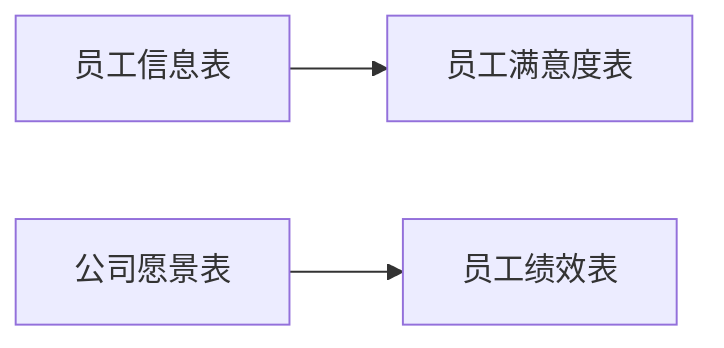
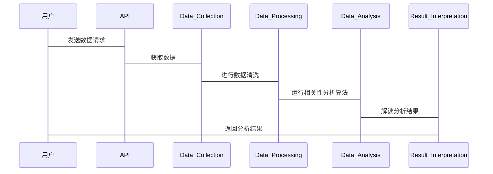

                 


# AI驱动的公司文化与员工生产力相关性分析

> 关键词：AI技术，公司文化，员工生产力，相关性分析，数据驱动管理

> 摘要：本文探讨了人工智能技术在公司文化与员工生产力相关性分析中的应用，详细介绍了AI驱动的公司文化构建、员工生产力的定义与衡量、相关性分析的数学模型和算法实现，以及如何利用AI技术优化公司文化以提升员工生产力。文章结合实际案例，深入分析了AI技术在公司管理中的潜力和挑战，为企业管理者提供了实践指导。

---

## 第1章: 公司文化与员工生产力的基本概念

### 1.1 公司文化的定义与特征

#### 1.1.1 公司文化的定义
公司文化是指一个公司内部的所有成员共同遵循的基本价值观和行为准则的集合，包括公司的使命、愿景、核心价值观以及员工的行为规范。

#### 1.1.2 公司文化的特征
- 一致性：公司文化在不同部门和层级中保持一致。
- 连续性：公司文化在时间上的延续性。
- 渗透性：公司文化在组织中的广泛影响。
- 可塑性：公司文化可以根据外部环境和内部需求进行调整。
- 独特性：每个公司的文化都有其独特性，反映了公司的历史、行业特点和领导风格。

#### 1.1.3 公司文化的核心要素
- 愿景：公司未来发展的目标。
- 使命：公司存在的意义和目标。
- 核心价值观：公司认为最重要的价值和原则。
- 领导风格：公司领导者的行为方式和决策风格。
- 沟通方式：公司内部信息传递和交流的方式。
- 奖励机制：公司对员工表现的奖励方式。

### 1.2 员工生产力的定义与衡量标准

#### 1.2.1 员工生产力的定义
员工生产力是指员工在工作过程中所表现出的效率和效果，即员工在单位时间内完成工作的质量。

#### 1.2.2 员工生产力的衡量标准
- 工作量：员工在一定时间内完成的工作任务数量。
- 工作质量：完成任务的质量和准确性。
- 工作速度：完成任务的速度。
- 员工满意度：员工对公司文化和管理的满意度。
- 创新性：员工在工作中提出的新想法和新方法的数量。

#### 1.2.3 影响员工生产力的关键因素
- 工作环境：良好的工作环境可以提高员工的工作效率。
- 薪酬福利：合理的薪酬和福利可以增强员工的满意度。
- 职业发展机会：职业发展机会可以激发员工的工作热情。
- 管理风格：良好的管理风格可以提高员工的士气。
- 团队合作：团队合作可以促进知识共享和经验交流，从而提高整体生产力。

### 1.3 AI驱动的公司文化与员工生产力的关联性

#### 1.3.1 AI技术在公司文化中的应用
- AI可以通过数据分析技术帮助公司更好地理解员工的需求和偏好，从而优化公司的管理策略。
- 例如，AI可以通过分析员工的行为数据，识别出哪些员工可能对公司的文化感到不满，从而采取措施改善员工体验。

#### 1.3.2 AI如何影响员工生产力
- AI可以通过自动化工具提高员工的工作效率，减少重复性劳动，使员工能够将更多的时间和精力投入到创造性工作中。
- AI可以通过数据分析帮助公司制定更科学的管理策略，从而提高员工的工作满意度和工作效率。
- AI还可以通过个性化推荐系统，为员工提供更适合他们技能和兴趣的工作任务，从而提高员工的生产力。

#### 1.3.3 公司文化与员工生产力的相互作用
- 公司文化影响员工的工作态度和行为，进而影响生产力。
- 例如，一个强调创新和协作的公司文化可以激发员工的创造力和合作精神，从而提高生产力。
- 另一方面，员工的生产力也会影响公司文化。高生产力的员工可能对公司文化有更高的要求，推动公司文化不断优化和创新。

---

## 第2章: AI驱动的公司文化与员工生产力相关性分析的核心概念

### 2.1 相关性分析的基本原理

#### 2.1.1 相关性分析的定义
相关性分析是一种统计方法，用于研究两个或多个变量之间的关系。它可以帮助我们理解变量之间是否存在关联，以及关联的强度和方向。

#### 2.1.2 相关性分析的数学模型
相关性系数 \( r \) 的计算公式为：
\[
r = \frac{\sum (x_i - \bar{x})(y_i - \bar{y})}{\sqrt{\sum (x_i - \bar{x})^2} \sqrt{\sum (y_i - \bar{y})^2}}
\]
其中，\( x_i \) 和 \( y_i \) 分别是两个变量的观测值，\( \bar{x} \) 和 \( \bar{y} \) 是各自的平均值。

#### 2.1.3 相关性分析的应用场景
- 在公司文化与员工生产力相关性分析中，相关性分析可以帮助我们理解公司文化中的某些因素（如员工满意度、公司价值观）与员工生产力之间的关系。
- 例如，我们可以研究员工满意度与员工绩效之间的相关性，以确定员工满意度是否是影响员工绩效的重要因素。

### 2.2 公司文化与员工生产力的相关性分析框架

#### 2.2.1 数据采集与处理
- 首先需要收集与公司文化和员工生产力相关的数据。
- 公司文化的数据可能包括员工满意度调查、公司价值观的评分等。
- 员工生产力的数据可能包括员工的工作效率、工作质量、创新性等。
- 在数据处理过程中，需要对数据进行清洗和预处理，确保数据的完整性和准确性。

#### 2.2.2 数据分析与建模
- 接下来，需要对数据进行分析和建模。
- 可以使用统计分析方法，如相关性分析、回归分析等，来研究公司文化与员工生产力之间的关系。
- 例如，可以通过回归分析来预测员工满意度对员工绩效的影响。

#### 2.2.3 结果解读与应用
- 分析结果需要进行解读，并根据结果制定相应的策略和措施。
- 例如，如果发现员工满意度与员工绩效之间存在正相关关系，公司可以采取措施提高员工的满意度，从而提高员工的生产力。

### 2.3 AI技术在相关性分析中的作用

#### 2.3.1 AI驱动的相关性分析方法
- AI技术可以利用机器学习算法，如线性回归、决策树、随机森林等，来进行相关性分析。
- 这些算法可以自动识别数据中的模式和关系，帮助我们更准确地理解公司文化与员工生产力之间的关系。

#### 2.3.2 AI算法在数据处理中的优势
- AI算法可以处理大规模和复杂的数据，发现人类难以察觉的模式。
- 例如，通过自然语言处理技术，AI可以分析员工在社交媒体上的评论，识别员工对公司文化的看法。

#### 2.3.3 AI技术在结果预测中的应用
- AI可以通过构建预测模型，预测员工满意度的变化对公司生产力的影响。
- 例如，可以预测在公司文化发生某些变化时，员工的生产力可能会如何变化。

---

## 第3章: AI驱动的公司文化与员工生产力相关性分析的算法原理

### 3.1 相关性分析的数学模型

#### 3.1.1 相关性系数的计算公式
\[
r = \frac{\sum (x_i - \bar{x})(y_i - \bar{y})}{\sqrt{\sum (x_i - \bar{x})^2} \sqrt{\sum (y_i - \bar{y})^2}}
\]

#### 3.1.2 相关性分析的步骤
1. 收集数据
2. 计算平均值
3. 计算分子和分母
4. 计算相关性系数

### 3.2 AI驱动的相关性分析方法

#### 3.2.1 线性回归模型
线性回归是一种常用的统计方法，用于研究自变量与因变量之间的关系。在相关性分析中，可以使用线性回归模型来预测因变量（员工生产力）的变化与自变量（公司文化因素）的关系。

#### 3.2.2 机器学习算法
机器学习算法，如随机森林、支持向量机等，可以用于非线性相关性分析，发现复杂的变量关系。

#### 3.2.3 深度学习模型
深度学习模型可以处理高维数据，发现数据中的深层结构，适用于复杂的公司文化与员工生产力相关性分析。

---

## 第4章: AI驱动的公司文化与员工生产力相关性分析的系统设计

### 4.1 数据模型设计

#### 4.1.1 公司文化数据模型
- 包括员工信息表、公司愿景表、员工满意度表等。

#### 4.1.2 员工生产力数据模型
- 包括员工绩效表、工作质量表、创新性表等。

#### 4.1.3 ER图


### 4.2 系统架构设计

#### 4.2.1 系统架构图


#### 4.2.2 系统接口设计
- 数据采集接口：用于从各种数据源（如员工满意度调查、绩效管理系统）采集数据。
- 数据处理接口：用于对数据进行清洗和预处理。
- 数据分析接口：用于运行相关性分析算法，生成分析结果。
- 结果展示接口：用于将分析结果以可视化的方式展示给用户。

#### 4.2.3 系统交互序列图


---

## 第5章: AI驱动的公司文化与员工生产力相关性分析的项目实战

### 5.1 环境安装

```bash
pip install numpy pandas scikit-learn matplotlib
```

### 5.2 系统核心实现源代码

#### 5.2.1 数据处理代码
```python
import pandas as pd
import numpy as np
from sklearn.metrics import r2_score

# 读取数据
data = pd.read_csv('company_productivity.csv')

# 计算相关性系数
def calculate_correlation(x, y):
    n = len(x)
    sum_x = sum(y)
    sum_y = sum(x)
    sum_xy = sum(x * y)
    sum_x_sq = sum(x ** 2)
    sum_y_sq = sum(y ** 2)

    numerator = n * sum_xy - sum_x * sum_y
    denominator = np.sqrt(n * sum_x_sq - sum_x ** 2) * np.sqrt(n * sum_y_sq - sum_y ** 2)

    if denominator == 0:
        return 0
    else:
        return numerator / denominator

x = data['company_culture']
y = data['employee_productivity']

correlation = calculate_correlation(x, y)
print(f"相关性系数：{correlation}")
```

#### 5.2.2 案例分析
- 选择一家公司作为案例，分析其公司文化与员工生产力的相关性。
- 例如，假设我们选择一家科技公司，收集其员工满意度、公司价值观、员工绩效等数据，使用上述代码进行相关性分析，得出结论。

---

## 第6章: AI驱动的公司文化与员工生产力相关性分析的最佳实践

### 6.1 相关性分析的意义
- 通过相关性分析，可以帮助公司更好地理解公司文化与员工生产力之间的关系，从而制定更有效的管理策略。
- 相关性分析可以帮助公司识别影响员工生产力的关键因素，从而采取针对性的措施提高员工的生产力。

### 6.2 注意事项
- 相关性分析只能表明变量之间的关系，不能说明因果关系。因此，在分析中需要注意变量之间的因果关系，避免仅凭相关性系数下结论。
- 数据的质量和准确性直接影响分析结果。因此，在进行相关性分析之前，需要确保数据的完整性和准确性。

### 6.3 未来趋势
- 随着AI技术的不断发展，相关性分析将更加智能化和自动化。未来的相关性分析将更多地利用机器学习和深度学习算法，发现更复杂和隐性的变量关系。
- 随着大数据技术的发展，相关性分析将能够处理更大规模和更复杂的数据，帮助公司更好地理解员工的行为和需求，优化公司文化，提高员工生产力。

---

## 结语

通过以上步骤，我们逐步完成了《AI驱动的公司文化与员工生产力相关性分析》的技术博客文章。从背景介绍到核心概念，从算法原理到系统设计，从项目实战到最佳实践，每个部分都进行了详细的阐述和示例说明。希望这篇文章能够帮助读者更好地理解AI在公司文化与员工生产力相关性分析中的应用，为公司优化管理和提高员工生产力提供有价值的参考。

