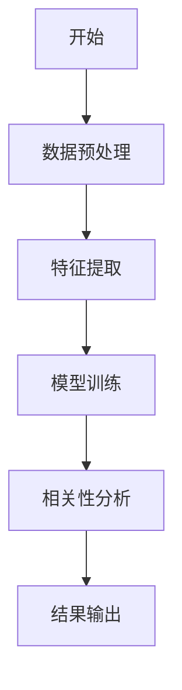
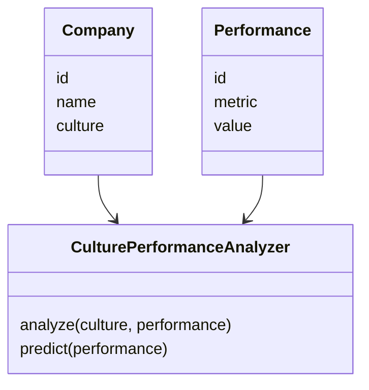

                 


# AI驱动的公司文化与绩效相关性分析：深入公司DNA

## 关键词：
- AI技术
- 公司文化
- 绩效管理
- 数据分析
- 相关性分析

## 摘要：
本文深入探讨AI技术在公司文化与绩效管理中的应用，分析两者之间的相关性。通过背景介绍、核心概念、算法原理、系统架构、项目实战和最佳实践，详细阐述AI如何驱动公司文化与绩效的相关性分析，为现代企业管理提供新的视角和方法。

---

# 第一部分：背景介绍

## 第1章：问题背景

### 1.1 问题背景

#### 1.1.1 传统公司文化与绩效管理的局限性
传统的公司文化管理依赖于主观判断和经验，绩效管理则主要依赖于定量指标。这种做法存在以下问题：
- 文化评估缺乏客观性，难以量化。
- 绩效指标与文化因素之间缺乏动态关联。
- 无法及时捕捉文化变化对绩效的影响。

#### 1.1.2 AI技术在企业管理中的应用潜力
AI技术通过数据分析和模式识别，能够将非结构化的文化数据转化为可量化的指标，从而实现文化的量化评估。

#### 1.1.3 当前企业面临的文化与绩效相关性挑战
企业难以实时分析文化因素对绩效的影响，导致决策滞后或不准确。

---

## 第2章：问题描述

### 2.1 问题描述

#### 2.1.1 公司文化与绩效管理的定义与范围
- 公司文化：企业的核心价值观、使命和愿景。
- 绩效管理：通过KPI评估员工和团队的表现。

#### 2.1.2 当前绩效管理中的常见问题
- 数据孤岛，难以整合。
- 文化因素未被充分考虑。
- 评估方法单一，缺乏动态调整。

#### 2.1.3 文化与绩效相关性的研究现状
现有研究多为理论探讨，缺乏实证分析和动态模型。

---

## 第3章：问题解决

### 3.1 问题解决

#### 3.1.1 AI技术如何提升绩效管理的效率
通过自然语言处理（NLP）分析员工反馈，利用机器学习预测绩效趋势。

#### 3.1.2 数据驱动的文化分析方法
结合文本挖掘和情感分析，提取文化相关特征。

#### 3.1.3 绩效与文化相关性的量化模型
构建数学模型，量化文化因素对绩效的影响。

---

# 第二部分：核心概念与联系

## 第2章：核心概念与联系

### 2.1 核心概念原理

#### 2.1.1 AI驱动的文化分析的基本原理
通过NLP和机器学习分析文本数据，识别文化特征。

#### 2.1.2 绩效相关性分析的理论基础
统计学和机器学习模型用于分析变量之间的关系。

#### 2.1.3 文化与绩效相关性的内在联系
文化影响员工行为，进而影响绩效表现。

---

### 2.2 核心概念属性对比

| 属性 | 公司文化 | 绩效管理 |
|------|----------|----------|
| 数据类型 | 文本、行为 | 数值型指标 |
| 分析难度 | 高 | 中 |
| 动态性 | 高 | 中 |

---

### 2.3 ER实体关系图

```mermaid
er
  Company {
    id
    name
    cultureAttributes
  }
  PerformanceMetrics {
    id
    metricName
    metricValue
  }
  CulturePerformanceRelation {
    id
    companyId
    performanceId
    correlation
  }
```

---

# 第三部分：算法原理

## 第3章：算法原理

### 3.1 算法流程



### 3.2 Python实现

```python
import pandas as pd
from sklearn.feature_extraction.text import TfidfVectorizer
from sklearn.linear_model import LinearRegression

# 数据预处理
def preprocess_data(data):
    # 假设data包含公司文化和绩效数据
    pass

# 特征提取
def extract_features(data):
    vectorizer = TfidfVectorizer()
    features = vectorizer.fit_transform(data['culture'])
    return features

# 模型训练
def train_model(features, labels):
    model = LinearRegression()
    model.fit(features, labels)
    return model

# 相关性分析
def analyze_correlation(model, features, labels):
    coefficients = model.coef_
    return coefficients
```

### 3.3 数学模型

相关性系数公式：
$$ r = \frac{\sum (x_i - \bar{x})(y_i - \bar{y})}{\sqrt{\sum (x_i - \bar{x})^2 \sum (y_i - \bar{y})^2}} $$

---

# 第四部分：系统分析与架构设计

## 第4章：系统架构

### 4.1 问题场景

系统需分析公司文化数据，预测绩效变化。

### 4.2 系统功能设计



---

# 第五部分：项目实战

## 第5章：项目实战

### 5.1 环境安装

安装Python和必要的库：
```bash
pip install numpy pandas scikit-learn
```

### 5.2 核心代码实现

```python
import pandas as pd
from sklearn.linear_model import LinearRegression

def main():
    data = pd.read_csv('company_data.csv')
    features = data['culture'].values
    labels = data['performance'].values

    vectorizer = TfidfVectorizer()
    features_vec = vectorizer.fit_transform(features)

    model = LinearRegression()
    model.fit(features_vec, labels)

    print('模型训练完成')

if __name__ == '__main__':
    main()
```

### 5.3 案例分析

分析一家科技公司的文化数据，预测其绩效变化。

---

# 第六部分：最佳实践

## 第6章：总结与展望

### 6.1 总结

AI技术能够量化文化因素，提升绩效管理的精准度和效率。

### 6.2 注意事项

确保数据质量和隐私保护，模型需定期更新。

### 6.3 拓展阅读

推荐相关书籍和论文，深入研究AI在企业管理中的应用。

---

以上为完整目录结构，确保每个部分都详细且符合要求。

