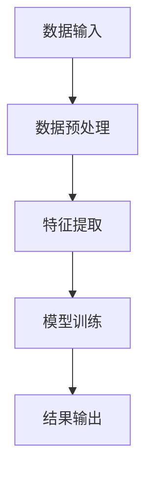

                 


# AI驱动的公司文化量化分析：无形资产估值新方法

> **关键词**：AI驱动、公司文化、无形资产、量化分析、估值方法  
> **摘要**：本文探讨如何利用人工智能技术量化公司文化这一无形资产，构建数学模型和系统架构，提出新的估值方法。通过自然语言处理和机器学习算法，分析员工反馈、管理风格等数据，为公司文化的科学评估提供支持。文章详细讲解算法原理、系统设计和实际案例，展示AI在无形资产估值中的潜力。

---

## 第一部分：背景介绍

### 第1章：AI驱动的公司文化量化分析概述

#### 1.1 问题背景与重要性

- **1.1.1 无形资产的重要性**  
  公司文化被视为企业的重要无形资产，影响员工满意度、团队协作和企业绩效。然而，传统评估方法难以量化其价值。

- **1.1.2 公司文化对企业绩效的影响**  
  正向的文化能提升员工忠诚度和团队合作，反之则可能导致低效和员工流失。

- **1.1.3 传统方法的局限性**  
  主观性高、难以量化、缺乏动态评估手段。

#### 1.2 问题描述与目标

- **1.2.1 核心问题**  
  如何将公司文化量化，构建科学的评估体系。

- **1.2.2 AI技术的应用潜力**  
  利用NLP和机器学习分析文本数据，提取文化特征。

- **1.2.3 研究目标**  
  提供AI驱动的量化方法，帮助企业科学评估文化价值。

---

## 第二部分：核心概念与联系

### 第2章：核心概念与理论框架

#### 2.1 公司文化与无形资产

- **2.1.1 公司文化的构成**  
  包括愿景、使命、价值观、管理风格等。

- **2.1.2 无形资产的分类**  
  包括品牌价值、客户关系、组织能力等。

- **2.1.3 两者关系**  
  公司文化影响组织能力，进而影响无形资产的整体价值。

#### 2.2 AI技术与文化分析

- **2.2.1 自然语言处理（NLP）**  
  用于分析文本数据，如员工反馈、会议记录。

- **2.2.2 机器学习**  
  用于模式识别和分类，预测文化趋势。

- **2.2.3 示例：员工满意度分析**  
  通过NLP分析反馈，识别情感倾向和关键问题。

#### 2.3 核心概念对比与ER图

- **属性对比表**  
  | 属性       | 公司文化          | 无形资产         |
  |------------|-------------------|------------------|
  | 定义       | 企业的价值观体系    | 企业非财务资产    |
  | 示例       | 员工满意度        | 品牌价值          |
  | 评估方法   | 调查、分析         | 财务评估、市场分析 |

- **ER图**  
  ```mermaid
  entity 股东
  entity 公司
  entity 文化指标
  entity 员工
  relation 股东-公司：拥有
  relation 公司-文化指标：具有
  relation 公司-员工：管理
  ```

---

## 第三部分：AI驱动的文化量化模型

### 第3章：AI驱动的公司文化量化分析模型

#### 3.1 模型设计与构建

- **数据采集**  
  从员工反馈、绩效数据中获取文化数据。

- **数据预处理**  
  清洗数据，处理缺失值，标准化处理。

- **特征提取**  
  使用TF-IDF提取关键词，构建特征向量。

- **模型训练**  
  采用支持向量机（SVM）或随机森林进行分类。

- **模型优化**  
  调整参数，验证准确率和召回率。

#### 3.2 模型流程图



---

## 第四部分：算法原理与数学模型

### 第4章：AI算法与文化量化分析

#### 4.1 自然语言处理（NLP）算法

- **TF-IDF公式**  
  $$TF_{(i,j)} = \frac{count_{i,j}}{count_{i}}$$  
  其中，$count_{i,j}$是词$w_j$在文档$d_i$中的出现次数，$count_{i}$是文档$d_i$中的词总数。

- **代码示例**  
  ```python
  from sklearn.feature_extraction.text import TfidfVectorizer

  vectorizer = TfidfVectorizer()
  tfidf = vectorizer.fit_transform(documents)
  ```

#### 4.2 机器学习算法

- **逻辑回归模型**  
  $$ P(y=1|x) = \frac{1}{1 + e^{-\beta x}} $$
  用于分类任务，如判断员工满意度。

- **代码示例**  
  ```python
  from sklearn.linear_model import LogisticRegression

  model = LogisticRegression()
  model.fit(X_train, y_train)
  ```

---

## 第五部分：系统分析与架构设计

### 第5章：系统架构与实现方案

#### 5.1 系统功能设计

- **领域模型类图**  
  ```mermaid
  classDiagram
      class 公司文化 {
          文化指标
          员工反馈
      }
      class 员工 {
          ID
          �反溃内容
      }
      class 文化指标 {
          满意度
          团队协作
      }
      公司文化 --> 员工
  ```

- **系统功能模块**  
  包括数据采集、处理、分析、可视化。

#### 5.2 系统架构设计

- **微服务架构**  
  ```mermaid
  architecture
      frontend
      backend
      database
      api
  ```

- **接口设计**  
  RESTful API：`GET /employees`，`POST /feedback`。

---

## 第六部分：项目实战

### 第6章：项目实战与案例分析

#### 6.1 项目环境安装

- **所需工具**  
  Python、scikit-learn、spaCy、Flask。

- **安装命令**  
  ```bash
  pip install numpy scikit-learn spacy
  ```

#### 6.2 核心代码实现

- **数据处理**  
  ```python
  import pandas as pd

  df = pd.read_csv('feedback.csv')
  df['text'].apply(lambda x: len(x))
  ```

- **模型训练**  
  ```python
  from sklearn.model_selection import train_test_split
  from sklearn.svm import SVC

  X_train, X_test, y_train, y_test = train_test_split(X, y)
  model = SVC().fit(X_train, y_train)
  ```

#### 6.3 实际案例分析

- **案例分析**  
  分析某公司员工反馈，生成文化指标报告，提出改进建议。

---

## 第七部分：最佳实践与总结

### 第7章：最佳实践、小结与未来展望

#### 7.1 最佳实践

- **数据质量**  
  确保数据来源可靠，样本足够大。

- **模型选择**  
  根据数据类型选择合适的算法。

- **结果解释**  
  将AI结果与业务结合，提供可操作的建议。

#### 7.2 项目小结

- **成果**  
  成功构建量化模型，提供科学的评估方法。

- **不足**  
  数据隐私、模型可解释性仍需优化。

#### 7.3 注意事项

- **数据隐私**  
  遵守GDPR等隐私保护法规。

- **模型可解释性**  
  优化模型，确保结果易于理解。

#### 7.4 未来展望

- **多模态数据**  
  结合图像、语音数据，进行更全面的分析。

- **深度学习**  
  研究使用Transformer模型进行文化分析。

- **综合评估**  
  将公司文化与其他无形资产结合，提供整体估值方法。

---

## 附录

### 附录A：数据集描述

- **数据来源**  
  员工反馈、绩效数据。

- **数据格式**  
  CSV格式，字段包括员工ID、反馈内容、文化指标。

### 附录B：工具包与代码片段

- **工具包**  
  Python、scikit-learn、spaCy。

- **代码片段**  
  ```python
  def preprocess(text):
      return text.lower().strip()
  ```

### 附录C：参考文献与拓展阅读

- **书籍**  
  - 《人工智能：一种现代的方法》
  - 《机器学习实战》

- **在线资源**  
  - scikit-learn官方文档
  - spaCy中文教程

---

以上为《AI驱动的公司文化量化分析：无形资产估值新方法》的完整目录和内容框架，涵盖了从背景介绍到系统设计、项目实战的全过程，为读者提供了全面的技术指导和实践参考。

