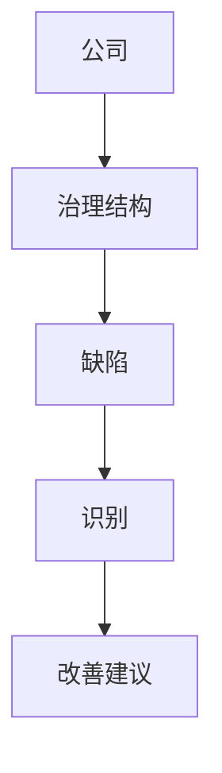
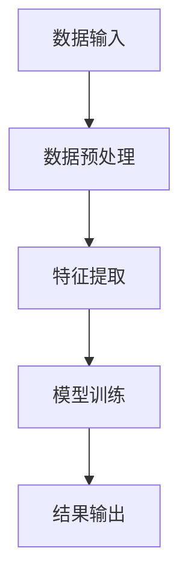
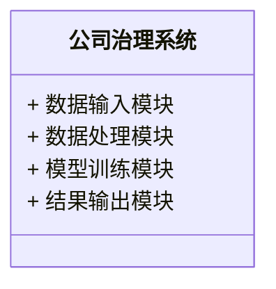
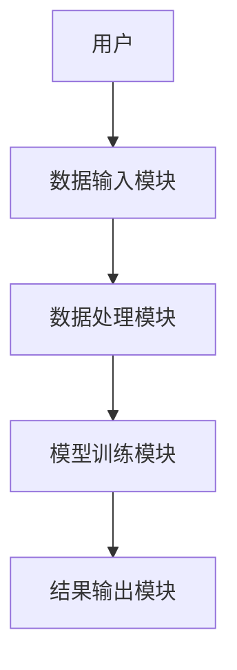
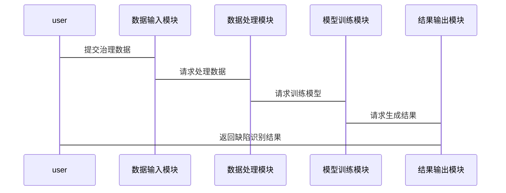

                 


# AI驱动的公司治理缺陷识别与改善建议

> 关键词：AI技术，公司治理，缺陷识别，改善建议，系统架构，文本挖掘

> 摘要：本文探讨了如何利用人工智能技术识别和改善公司治理中的缺陷。通过分析公司治理的核心要素，结合文本挖掘、机器学习等技术，构建了缺陷识别模型，并提出了系统化的改善建议。文章详细介绍了算法原理、系统架构及项目实战，为公司治理的智能化提供了参考。

---

# 第1章 公司治理缺陷识别的背景与问题背景

## 1.1 公司治理的基本概念

### 1.1.1 公司治理的定义与核心要素

公司治理是指通过合理的结构和机制，确保公司战略目标的实现、资源的高效利用和风险的有效控制。其核心要素包括：

1. **股权结构**：股东的权益分配与监督机制。
2. **董事会结构**：董事会的组成、职责和运作方式。
3. **管理层职责**：高管的权限、责任与决策流程。
4. **内部控制**：财务、审计、风险管理等内部控制系统。
5. **透明度与披露**：公司信息的公开性和准确性。

### 1.1.2 公司治理缺陷的定义与分类

公司治理缺陷指公司治理机制未能有效运作，导致企业绩效下降、风险增加或利益相关者权益受损。常见缺陷包括：

1. **治理结构不合理**：董事会结构单一，独立董事比例不足。
2. **决策效率低下**：决策流程复杂，决策时间延长。
3. **透明度不足**：信息披露不及时或不完整。
4. **监督失效**：内部控制机制失效，监督不力。

### 1.1.3 公司治理缺陷对企业的影响

公司治理缺陷可能导致企业面临声誉损失、法律风险、财务损失等问题。例如，治理结构不合理可能导致决策失误，透明度不足可能引发投资者信任危机。

---

## 1.2 AI技术在公司治理中的应用背景

### 1.2.1 AI技术的发展与公司治理的结合

随着AI技术的快速发展，其在多个领域的应用逐渐普及。公司治理作为企业运营的核心，也开始引入AI技术来优化治理流程、提高决策效率。

### 1.2.2 公司治理缺陷识别的痛点与难点

传统公司治理缺陷识别主要依赖人工审核，存在效率低、成本高、覆盖面窄等问题。AI技术的引入可以解决这些问题，实现自动化、智能化的缺陷识别。

### 1.2.3 AI驱动公司治理缺陷识别的优势

1. **高效性**：AI技术可以快速处理大量数据，提高缺陷识别的效率。
2. **准确性**：通过机器学习模型，AI能够精准识别潜在的治理缺陷。
3. **全面性**：AI可以从多维度分析数据，发现人工难以察觉的隐性问题。

---

# 第2章 AI驱动公司治理缺陷识别的核心概念与联系

## 2.1 核心概念原理

### 2.1.1 公司治理缺陷识别的原理

AI驱动的公司治理缺陷识别主要基于文本挖掘和机器学习技术。通过分析公司年报、公告等文本数据，提取关键词、情感倾向等特征，构建分类模型，识别潜在的治理缺陷。

### 2.1.2 AI技术在缺陷识别中的作用

AI技术通过以下方式在缺陷识别中发挥作用：

1. **数据处理**：对文本数据进行清洗、分词、去停用词等预处理。
2. **特征提取**：利用TF-IDF、词嵌入等方法提取文本特征。
3. **模型训练**：基于特征训练分类模型，识别治理缺陷。

### 2.1.3 缺陷识别的数学模型与算法

常见的缺陷识别算法包括逻辑回归、支持向量机（SVM）、随机森林等。以下是支持向量机的数学模型：

$$
\text{目标函数：} \quad \min_{w,b,\xi} \frac{1}{2}||w||^2 + C\sum_{i=1}^n \xi_i
$$

$$
\text{约束条件：} \quad y_i(w \cdot x_i + b) \geq 1 - \xi_i, \quad \xi_i \geq 0
$$

---

## 2.2 核心概念属性特征对比表格

### 表2-1: 公司治理缺陷与AI技术的属性对比

| 属性           | 公司治理缺陷                | AI技术应用                |
|----------------|-----------------------------|---------------------------|
| 核心目标       | 识别治理问题                | 提供技术支持              |
| 数据来源       | 公司年报、公告              | 文本、结构化数据          |
| 分析方法       | 人工审核、专家判断          | 文本挖掘、机器学习        |
| 处理效率       | 低效、耗时                  | 高效、快速                |

---

## 2.3 ER实体关系图架构



---

# 第3章 AI驱动公司治理缺陷识别的算法原理

## 3.1 算法原理讲解

### 3.1.1 文本挖掘与自然语言处理

文本挖掘用于从非结构化数据中提取有用信息，自然语言处理（NLP）技术用于理解文本内容。例如，使用TF-IDF提取关键词：

$$
\text{TF-IDF} = \frac{\text{词频}}{\text{文档频率}}
$$

### 3.1.2 机器学习模型的构建

构建分类模型，如支持向量机（SVM）：

$$
\text{SVM目标：} \quad \text{minimize } \frac{1}{2}||w||^2
$$

$$
\text{约束条件：} \quad y_i(w \cdot x_i + b) \geq 1
$$

### 3.1.3 缺陷识别的分类算法

常用的分类算法包括逻辑回归、随机森林等。以下是逻辑回归的损失函数：

$$
\text{损失函数：} \quad L = -\sum_{i=1}^n [y_i \ln p_i + (1-y_i)\ln(1-p_i)]
$$

其中，$p_i$为预测概率。

---

## 3.2 算法流程图



---

## 3.3 算法实现代码示例

### 缺陷识别分类模型实现

```python
from sklearn.feature_extraction.text import TfidfVectorizer
from sklearn.svm import SVC
from sklearn.pipeline import Pipeline

# 数据预处理
def preprocess(text):
    return text.lower()

# 管道模型
model = Pipeline([
    ('tfidf', TfidfVectorizer(preprocessor=preprocess)),
    ('svc', SVC(probability=True))
])

# 训练模型
model.fit(X_train, y_train)

# 预测
y_pred = model.predict(X_test)
```

---

# 第4章 系统分析与架构设计方案

## 4.1 系统功能设计

### 4.1.1 领域模型（Mermaid类图）



---

## 4.2 系统架构设计

### 4.2.1 系统架构（Mermaid架构图）



---

## 4.3 系统接口设计

### 4.3.1 API接口设计

1. 数据输入接口：接收公司治理相关的文本数据。
2. 模型训练接口：处理数据并训练模型。
3. 结果输出接口：返回识别的缺陷及改善建议。

---

## 4.4 系统交互设计（Mermaid序列图）



---

# 第5章 项目实战

## 5.1 环境安装

### 5.1.1 安装Python环境

```bash
python --version
pip install numpy scikit-learn
```

---

## 5.2 系统核心实现源代码

### 5.2.1 缺陷识别系统实现

```python
import pandas as pd
from sklearn.model_selection import train_test_split
from sklearn.metrics import classification_report

# 数据加载
df = pd.read_csv('corporate_governance.csv')
X = df['text']
y = df['label']

# 数据分割
X_train, X_test, y_train, y_test = train_test_split(X, y, test_size=0.2)

# 模型训练
from sklearn.feature_extraction.text import TfidfVectorizer
from sklearn.svm import SVC

model = SVC()
model.fit(TfidfVectorizer().fit_transform(X_train), y_train)

# 模型预测
y_pred = model.predict(TfidfVectorizer().fit_transform(X_test))
print(classification_report(y_test, y_pred))
```

---

## 5.3 实际案例分析

### 5.3.1 案例背景

某公司年报中存在信息披露不完整的问题，AI系统识别出这一缺陷并提出改善建议。

### 5.3.2 案例分析

1. 数据预处理：清洗年报文本数据。
2. 特征提取：使用TF-IDF提取关键词。
3. 模型训练：训练分类模型识别缺陷。
4. 结果分析：输出缺陷位置及改善建议。

---

## 5.4 项目小结

通过本项目，我们成功利用AI技术实现了公司治理缺陷的智能化识别，提高了缺陷识别的效率和准确性，为企业治理提供了有力支持。

---

# 第6章 最佳实践与小结

## 6.1 最佳实践 tips

1. 数据质量是关键，确保数据的准确性和完整性。
2. 选择合适的模型和算法，根据实际需求进行调优。
3. 结合领域知识，优化特征提取和模型解释性。

## 6.2 小结

本文详细探讨了AI驱动的公司治理缺陷识别与改善建议，从理论到实践，为公司治理的智能化提供了参考。

## 6.3 注意事项

- 数据隐私和合规性需严格遵守相关法律法规。
- 模型的可解释性需关注，确保结果的透明性。
- 持续优化模型，适应公司治理的新需求。

## 6.4 拓展阅读

1. 《机器学习实战》
2. 《自然语言处理入门》
3. 《公司治理与风险管理》

---

# 结论

通过AI技术的应用，公司治理缺陷识别变得更加高效和精准。未来，随着技术的不断发展，AI将在公司治理中发挥更大的作用，为企业创造更大的价值。

