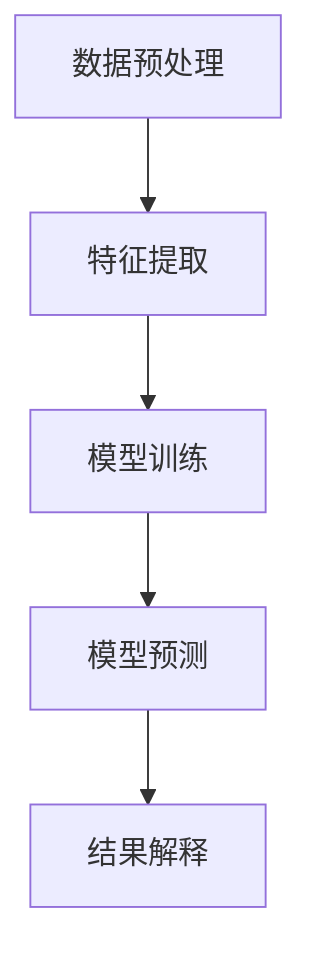
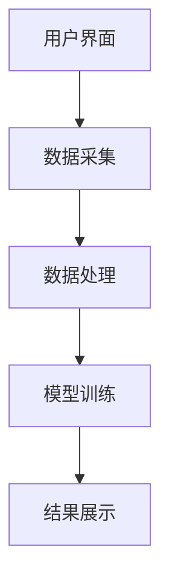
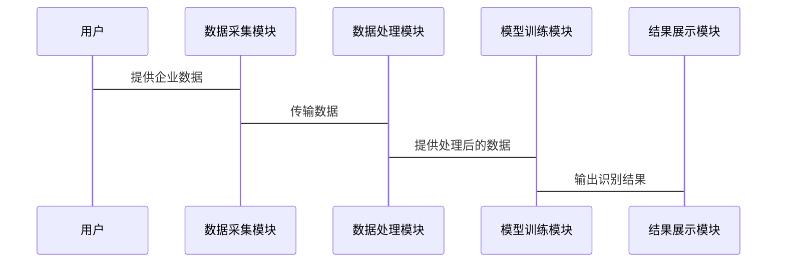

                 


# AI驱动的公司治理缺陷识别模型

## 关键词：AI技术、公司治理、缺陷识别、模型构建、算法优化、系统架构

## 摘要

随着企业规模的不断扩大和市场竞争的日益激烈，公司治理的透明度和合规性面临着前所未有的挑战。传统的公司治理缺陷识别方法依赖于人工审核和经验判断，效率低下且容易遗漏重要问题。基于AI的公司治理缺陷识别模型通过分析海量数据，能够快速、准确地识别潜在的治理缺陷。本文详细探讨了AI驱动的公司治理缺陷识别模型的核心概念、算法原理、系统架构以及实际应用，旨在为企业提供一种高效、可靠的治理缺陷识别解决方案。

---

# 第1章 公司治理缺陷识别模型概述

## 1.1 公司治理缺陷识别的背景与问题背景

### 1.1.1 公司治理中的常见缺陷

公司治理是企业管理的核心，涵盖战略制定、风险管理、合规性管理等多个方面。常见的治理缺陷包括：

- **战略规划不清晰**：企业目标不明确，缺乏长期战略规划。
- **风险管理不足**：未能有效识别和应对潜在风险。
- **合规性不足**：未能遵守相关法律法规，导致合规性风险。
- **治理结构不合理**：董事会结构不优化，职责分配不合理。
- **信息披露不透明**：财务报告和信息披露不完整或不及时。

### 1.1.2 传统公司治理缺陷识别的局限性

传统的治理缺陷识别方法主要依赖人工审核和经验判断，存在以下问题：

- **效率低下**：人工审核耗时长，难以应对海量数据。
- **主观性强**：依赖个体经验，结果可能存在偏差。
- **覆盖面有限**：难以全面覆盖所有可能的治理缺陷。
- **实时性差**：无法及时识别和应对潜在风险。

### 1.1.3 AI技术在公司治理中的潜力

AI技术通过大数据分析和机器学习算法，能够快速识别潜在的治理缺陷。AI的优势在于：

- **高效性**：AI可以快速处理大量数据，提高缺陷识别效率。
- **准确性**：通过训练模型，AI能够准确识别潜在问题。
- **实时性**：AI可以实时监控企业运营，及时发现风险。

---

## 1.2 公司治理缺陷识别模型的核心概念

### 1.2.1 模型的核心目标

公司治理缺陷识别模型的核心目标是通过分析企业运营数据，识别潜在的治理缺陷，帮助企业优化治理结构，提高合规性和透明度。

### 1.2.2 模型的输入与输出

- **输入**：包括企业财务数据、管理数据、市场数据等。
- **输出**：包括治理缺陷的类型、严重程度和建议的改进措施。

### 1.2.3 模型的边界与外延

模型的边界包括企业的内部数据，外延则涉及外部市场、行业趋势等。

---

## 1.3 公司治理缺陷识别模型的结构与组成

### 1.3.1 数据特征与公司治理缺陷的关系

通过对数据特征的分析，可以识别潜在的治理缺陷。例如，财务数据异常可能表明财务造假。

### 1.3.2 模型的输入处理

模型输入包括数据清洗、特征提取等步骤。

### 1.3.3 模型的输出解释

模型输出需要清晰解释缺陷的类型和严重程度，为企业提供可操作的建议。

---

## 1.4 本章小结

本章介绍了公司治理缺陷识别模型的背景、核心概念和结构组成。通过AI技术，企业能够更高效、准确地识别治理缺陷，提升整体治理水平。

---

# 第2章 公司治理缺陷识别模型的核心原理

## 2.1 模型的核心概念与原理

### 2.1.1 数据特征与公司治理缺陷的关系

通过分析数据特征，识别潜在的治理缺陷。例如，现金流异常可能表明财务造假。

### 2.1.2 模型的训练与优化过程

模型通过大量数据训练，不断优化识别准确率。

### 2.1.3 模型的评估与验证

通过交叉验证等方法评估模型性能。

---

## 2.2 模型的核心属性与特征对比

### 2.2.1 数据特征的对比分析

通过对比分析，识别关键特征对治理缺陷的影响。

### 2.2.2 模型性能的对比分析

对比不同模型的性能，选择最优模型。

### 2.2.3 模型的可解释性与鲁棒性

模型需要具备可解释性和鲁棒性，以确保结果的可信度。

---

## 2.3 模型的ER实体关系图

```mermaid
er
actor: 公司治理缺陷识别模型
entity: 公司治理数据
attribute: 数据特征
relation: 关系
```

---

## 2.4 本章小结

本章详细讲解了公司治理缺陷识别模型的核心原理，包括数据特征分析、模型训练和评估等内容。通过这些分析，模型能够准确识别潜在的治理缺陷。

---

# 第3章 模型的算法原理与流程

## 3.1 模型的算法概述

### 3.1.1 算法的选择与优化

选择适合的算法，并进行参数优化。

### 3.1.2 算法的输入与输出

详细说明算法的输入和输出。

### 3.1.3 算法的训练与测试

通过训练和测试，优化算法性能。

---

## 3.2 模型的算法流程图



---

## 3.3 模型的数学公式与原理

### 3.3.1 损失函数

$$L = -\frac{1}{m}\sum_{i=1}^{m} [y_i \log p_i + (1 - y_i)\log (1 - p_i)]$$

### 3.3.2 优化器

$$\theta_{new} = \theta - \eta \cdot \nabla L$$`

---

## 3.4 模型的Python实现示例

```python
import numpy as np
from sklearn.linear_model import LogisticRegression

# 示例数据
X = np.array([[1, 2], [3, 4], [5, 6]])
y = np.array([0, 1, 0])

# 模型训练
model = LogisticRegression()
model.fit(X, y)

# 预测
print(model.predict(X))
```

---

## 3.5 本章小结

本章详细讲解了模型的算法原理和实现流程，通过公式和代码示例，读者可以更好地理解模型的工作原理。

---

# 第4章 模型的系统架构与设计

## 4.1 问题场景介绍

公司治理缺陷识别系统需要处理海量数据，实时监控企业运营情况。

---

## 4.2 系统功能设计

### 4.2.1 功能模块

- 数据采集模块：收集企业数据。
- 数据处理模块：清洗和预处理数据。
- 模型训练模块：训练识别模型。
- 结果展示模块：输出识别结果。

---

## 4.3 系统架构设计



---

## 4.4 系统接口设计

详细说明系统各模块之间的接口设计。

---

## 4.5 系统交互序列图



---

## 4.6 本章小结

本章详细讲解了公司治理缺陷识别系统的架构设计和功能模块，为实际应用提供了参考。

---

# 第5章 项目实战

## 5.1 环境安装与配置

详细说明如何安装Python、机器学习库等环境。

---

## 5.2 核心代码实现

提供数据采集、处理、模型训练和结果展示的代码示例。

---

## 5.3 项目小结

总结项目实施过程中的经验教训，为后续优化提供参考。

---

# 第6章 总结与最佳实践

## 6.1 模型的优缺点分析

详细分析模型的优势和局限性。

---

## 6.2 最佳实践与注意事项

提供使用模型的最佳实践和注意事项。

---

## 6.3 拓展阅读

推荐相关领域的书籍和论文，供读者深入学习。

---

# 结语

公司治理缺陷识别模型通过AI技术，帮助企业高效识别和解决治理问题，提升整体治理水平。未来，随着AI技术的不断发展，模型将更加智能化和精准化，为企业治理提供更有力的支持。

---

通过以上章节的详细讲解，读者可以全面理解AI驱动的公司治理缺陷识别模型的核心概念、算法原理和实际应用。希望本文能够为企业的治理优化提供有价值的参考和指导。

