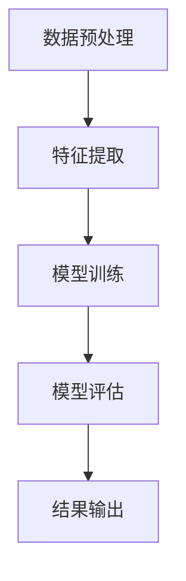
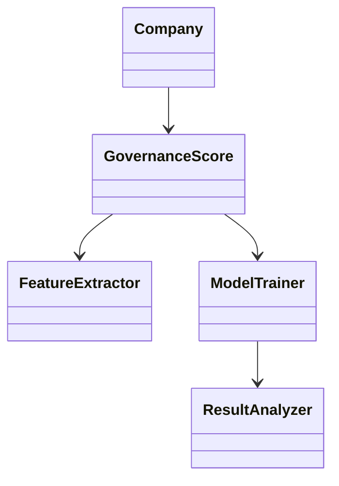

                 


# AI驱动的公司治理评分系统：量化管理质量

> 关键词：AI驱动，公司治理，评分系统，量化管理，数据科学

> 摘要：本文探讨了如何利用人工智能技术构建公司治理评分系统，通过量化方法评估和优化企业的管理质量。文章从问题背景、核心概念、算法原理、系统架构到项目实战，详细阐述了AI在公司治理中的应用，旨在为企业的管理优化提供科学依据和实践指导。

---

## 第一章：公司治理与评分系统背景

### 1.1 问题背景与意义

#### 1.1.1 传统公司治理的局限性
现代企业面临着日益复杂的管理挑战，传统公司治理模式依赖于人工评估和经验判断，存在主观性强、效率低下、难以量化等问题。企业需要一种更客观、高效的方法来评估和优化管理质量。

#### 1.1.2 数字化转型与AI技术的引入
随着数字化转型的推进，人工智能技术在企业治理中的应用逐渐兴起。AI技术能够通过大数据分析和机器学习算法，帮助企业实现管理质量的量化评估，提升决策效率。

#### 1.1.3 公司治理评分系统的价值与目标
公司治理评分系统的目标是通过AI技术，将企业的管理活动转化为可量化的指标，帮助企业识别管理中的问题，优化资源配置，提升整体治理效率。

### 1.2 公司治理评分系统的核心要素

#### 1.2.1 公司治理的基本概念
公司治理是指通过一系列制度和机制，确保企业决策的科学性、透明性和合规性。它涵盖了股权结构、董事会治理、高管责任、利益相关者关系等多个方面。

#### 1.2.2 评分系统的定义与特点
评分系统是一种通过量化方法评估企业治理质量的工具。它基于多维度的指标，结合AI算法，为企业提供客观的评分结果和改进建议。

#### 1.2.3 系统的核心功能与边界
- 核心功能：数据采集与处理、指标计算、评分生成、结果分析与可视化。
- 边界：不直接干预企业的具体管理活动，仅提供评估和建议。

---

## 第二章：AI驱动的公司治理评分系统原理

### 2.1 核心概念与联系

#### 2.1.1 AI在公司治理中的应用
AI技术通过自然语言处理（NLP）、机器学习等方法，从企业年报、新闻报道等文本数据中提取治理相关信息，进行分析和评估。

#### 2.1.2 评分系统的构建原理
评分系统基于多维度的指标体系，利用AI算法对企业的各项治理指标进行加权计算，生成综合评分。

#### 2.1.3 实体关系图（ER图）与系统架构
以下是系统的核心实体关系图：

```mermaid
erd
    股东
    董事会
    高管团队
    利益相关者
    治理指标
    评分结果
    公司
    -- 股东 -> 公司
    -- 董事会 -> 公司
    -- 高管团队 -> 公司
    -- 利益相关者 -> 公司
    -- 治理指标 -> 评分结果
```

---

## 第三章：AI驱动评分系统的算法原理

### 3.1 算法原理概述

#### 3.1.1 数据预处理与特征提取
- 数据清洗：去除缺失值和异常值。
- 特征提取：从文本数据中提取关键词，从财务数据中提取关键指标。

#### 3.1.2 模型训练与优化
- 使用随机森林或支持向量机（SVM）进行分类或回归训练。
- 通过交叉验证优化模型参数。

#### 3.1.3 算法流程图


### 3.2 数学模型与公式

#### 3.2.1 线性回归模型
$$ y = \beta_0 + \beta_1x_1 + \beta_2x_2 + \dots + \beta_nx_n + \epsilon $$

其中：
- \( y \)：评分结果
- \( x_i \)：各个治理指标
- \( \beta_i \)：回归系数
- \( \epsilon \)：误差项

#### 3.2.2 评分计算公式
$$ Score = \sum_{i=1}^{n} w_i \cdot x_i $$

其中：
- \( w_i \)：第 \( i \) 个指标的权重
- \( x_i \)：第 \( i \) 个指标的数值

---

## 第四章：系统分析与架构设计

### 4.1 系统功能设计

#### 4.1.1 领域模型（Mermaid类图）


### 4.2 系统架构设计

#### 4.2.1 系统架构图
```mermaid
graph LR
    Client --> API Gateway
    API Gateway --> Service1
    API Gateway --> Service2
    Service1 --> Database
    Service2 --> Database
```

### 4.3 系统接口设计

#### 4.3.1 API接口
- 输入：企业治理数据（如董事会结构、高管薪酬等）。
- 输出：治理评分和改进建议。

#### 4.3.2 数据接口
- 数据源：企业年报、新闻报道、财务数据等。

---

## 第五章：项目实战

### 5.1 环境安装与数据准备

#### 5.1.1 环境安装
- 安装Python、Jupyter Notebook、Scikit-learn、NLTK等工具。

#### 5.1.2 数据准备
- 数据来源：公开企业数据集，如企业年报文本、财务数据等。

### 5.2 系统核心实现

#### 5.2.1 数据预处理代码
```python
import pandas as pd
import numpy as np

# 加载数据
data = pd.read_csv('governance_data.csv')

# 删除缺失值
data = data.dropna()

# 标准化处理
from sklearn.preprocessing import StandardScaler
scaler = StandardScaler()
data_scaled = scaler.fit_transform(data)
```

#### 5.2.2 模型训练代码
```python
from sklearn.ensemble import RandomForestRegressor
from sklearn.metrics import mean_squared_error

# 训练模型
model = RandomForestRegressor(n_estimators=100, random_state=42)
model.fit(X_train, y_train)

# 评估模型
y_pred = model.predict(X_test)
print('均方误差:', mean_squared_error(y_test, y_pred))
```

### 5.3 案例分析与解读

#### 5.3.1 案例分析
以某公司为例，分析其治理评分结果，评估其董事会结构、高管薪酬等指标的表现。

#### 5.3.2 评分结果解读
解释评分结果背后的意义，提出改进建议。

### 5.4 项目小结

#### 5.4.1 成果总结
总结项目的实现成果，包括模型准确率、评分系统的实用性等。

#### 5.4.2 经验总结
分享项目中的经验教训，优化建议。

---

## 第六章：最佳实践与总结

### 6.1 最佳实践

#### 6.1.1 数据质量管理
确保数据的准确性和完整性，避免偏差。

#### 6.1.2 模型优化
定期更新模型，保持其适应性和准确性。

### 6.2 小结与展望

#### 6.2.1 系统总结
总结AI驱动的公司治理评分系统的实现过程和应用价值。

#### 6.2.2 未来展望
探讨该技术在企业治理中的未来发展，如动态评分、实时监控等。

### 6.3 注意事项

#### 6.3.1 数据隐私
注意数据隐私和合规性，确保符合相关法律法规。

#### 6.3.2 模型解释性
确保模型的可解释性，方便用户理解评分结果。

### 6.4 拓展阅读

#### 6.4.1 推荐书籍
- 《人工智能：一种现代方法》
- 《企业治理与风险管理》

#### 6.4.2 相关技术
- 自然语言处理（NLP）
- 机器学习
- 数据可视化

---

## 结语

通过本文的详细阐述，我们可以看到AI驱动的公司治理评分系统在量化管理质量方面的巨大潜力。它不仅能够帮助企业客观评估治理水平，还能为决策者提供科学依据，推动企业治理的持续优化。未来，随着技术的不断发展，评分系统将更加智能化和精准化，为企业治理带来更多的价值。

---

# END

