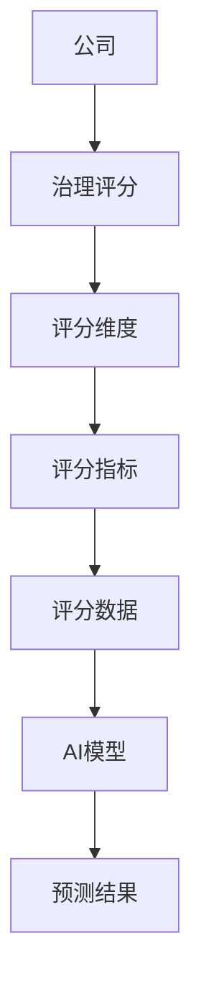
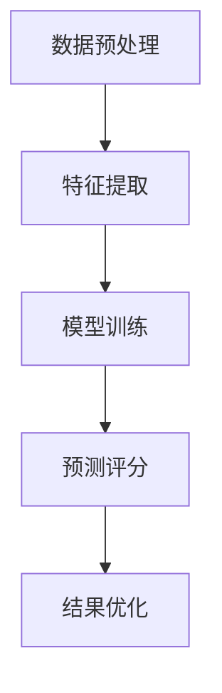
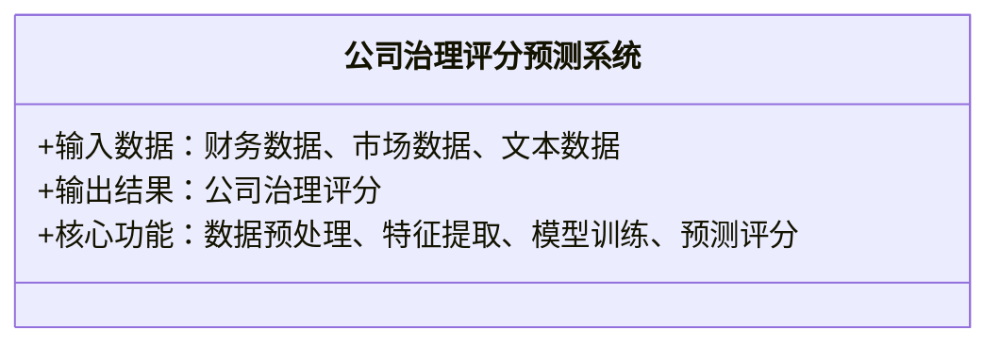
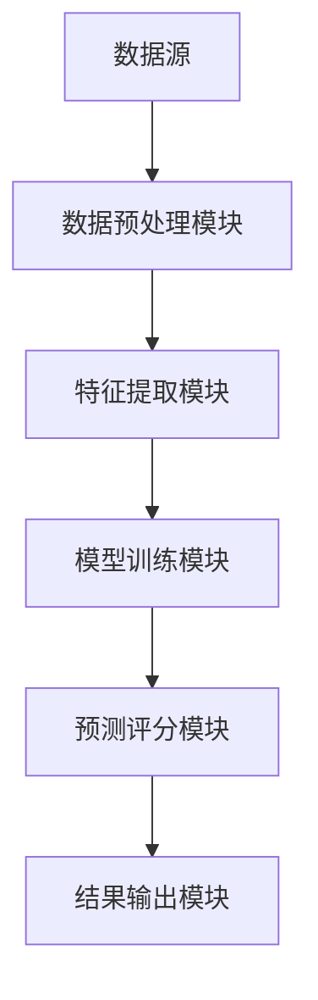
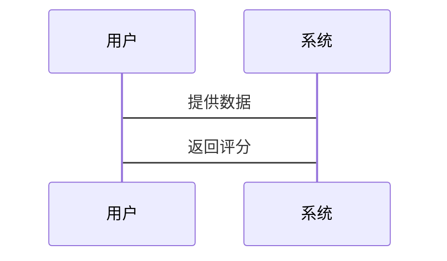

                 


# AI驱动的公司治理评分预测

## 关键词：公司治理、AI驱动、评分预测、机器学习、数据挖掘、NLP技术

## 摘要：本文探讨了如何利用人工智能技术驱动公司治理评分预测。通过分析公司治理的核心要素、构建AI预测模型、设计系统架构，以及实际案例分析，展示了AI在提升公司治理透明度和效率中的重要作用。

---

# 第1章 公司治理评分预测的背景与问题

## 1.1 公司治理的核心概念

### 1.1.1 公司治理的定义与内涵

公司治理是指通过合理分配权力、责任和利益，确保公司有效运作和长期发展的管理过程。其核心目标是实现股东价值最大化，同时兼顾利益相关者权益保护。

### 1.1.2 公司治理评分的定义与意义

公司治理评分是对公司治理效能的量化评估，反映了公司在治理结构、透明度、合规性、风险管理等方面的表现。评分越高，表明公司治理越完善。

### 1.1.3 公司治理评分预测的背景与现状

随着全球化和信息化的深入，公司治理的重要性日益凸显。然而，传统评分方法存在主观性、滞后性和低效性的问题。AI技术的应用为公司治理评分预测提供了新的解决方案。

## 1.2 问题背景与问题描述

### 1.2.1 公司治理评分预测的核心问题

- 数据获取困难：公司治理数据分散，难以整合。
- 模型复杂性：评分预测涉及多维度数据，模型构建复杂。
- 实时性要求：企业需要及时了解自身治理状况。

### 1.2.2 传统公司治理评分方法的局限性

传统评分方法依赖专家经验，存在主观性和片面性。同时，评分结果缺乏实时性和动态性，难以满足现代企业的管理需求。

### 1.2.3 AI驱动评分预测的必要性与优势

AI技术能够处理海量数据，提取关键特征，构建高精度预测模型，帮助企业在复杂环境中做出科学决策。

## 1.3 问题解决与边界

### 1.3.1 AI驱动评分预测的解决方案

通过数据挖掘、机器学习和NLP技术，构建AI驱动的公司治理评分预测系统。

### 1.3.2 解决方案的边界与外延

- 数据范围：仅限于公开的财务数据和新闻数据。
- 适用场景：适用于上市公司和大型企业。
- 不考虑企业内部数据。

### 1.3.3 核心要素与组成结构

- 数据采集：收集公司财务数据、新闻数据和行业报告。
- 特征提取：从数据中提取关键特征。
- 模型训练：构建评分预测模型。
- 结果输出：生成评分预测结果。

## 1.4 本章小结

本章分析了公司治理评分预测的背景、核心问题及AI驱动的解决方案，为后续章节奠定了基础。

---

# 第2章 公司治理评分预测的核心概念与联系

## 2.1 核心概念原理

### 2.1.1 公司治理评分预测的基本原理

通过分析公司的财务数据、市场表现和行业新闻，利用AI技术预测公司治理评分。

### 2.1.2 AI技术在评分预测中的应用

- 数据挖掘：提取治理相关特征。
- 机器学习：构建预测模型。
- NLP技术：分析文本数据。

### 2.1.3 多维度数据的融合与分析

- 财务数据：收入、利润、负债等。
- 市场数据：股价、市值、交易量。
- 文本数据：新闻、公告、社交媒体。

## 2.2 核心概念属性特征对比

| 特征类型 | 输入数据 | 输出结果 | 模型复杂度 |
|----------|----------|----------|------------|
| 财务数据 | 财务报表 | 治理评分 | 中等复杂度 |
| 市场数据 | 股价数据 | 治理评分 | 较低复杂度 |
| 文本数据 | 新闻数据 | 治理评分 | 较高复杂度 |

## 2.3 ER实体关系图架构



## 2.4 本章小结

本章详细介绍了公司治理评分预测的核心概念和AI技术的应用，为后续章节的模型构建奠定了基础。

---

# 第3章 AI驱动评分预测的算法原理

## 3.1 算法原理概述

### 3.1.1 机器学习在评分预测中的应用

- 线性回归：适用于线性关系的预测。
- 随机森林：适用于非线性关系的预测。
- 神经网络：适用于复杂关系的预测。

### 3.1.2 常见评分预测算法介绍

- 线性回归：简单易用，但适合线性关系。
- 支持向量机：适用于小规模数据。
- 神经网络：适合复杂数据。

### 3.1.3 AI驱动评分预测的核心算法

- 线性回归：$y = \beta_0 + \beta_1x + \epsilon$
- 随机森林：基于决策树的集成学习方法。

## 3.2 算法流程图



## 3.3 算法实现代码

```python
import pandas as pd
from sklearn.model import LinearRegression

# 数据预处理
data = pd.read_csv('governance.csv')
data = data.dropna()

# 特征提取
X = data[['收入', '利润', '负债']]
y = data['治理评分']

# 模型训练
model = LinearRegression()
model.fit(X, y)

# 预测评分
predicted_scores = model.predict(X)
```

## 3.4 本章小结

本章详细讲解了AI驱动评分预测的算法原理，包括线性回归和随机森林等方法，并通过代码示例展示了模型的实现过程。

---

# 第4章 公司治理评分预测的系统架构设计

## 4.1 系统分析与架构设计方案

### 4.1.1 问题场景介绍

构建一个实时公司治理评分预测系统，帮助企业管理者快速了解公司治理状况。

### 4.1.2 项目介绍

项目目标：构建AI驱动的公司治理评分预测系统。

### 4.1.3 系统功能设计



### 4.1.4 系统架构设计



### 4.1.5 系统接口设计

- 输入接口：接收财务数据、市场数据和文本数据。
- 输出接口：输出公司治理评分。

### 4.1.6 系统交互设计



## 4.2 本章小结

本章详细设计了公司治理评分预测系统的架构，包括功能模块、数据流和系统交互。

---

# 第5章 AI驱动评分预测的项目实战

## 5.1 环境安装

- 安装Python和必要的库：`pip install pandas sklearn`

## 5.2 系统核心实现

```python
import pandas as pd
from sklearn.model import LinearRegression

# 数据预处理
data = pd.read_csv('governance.csv')
data = data.dropna()

# 特征提取
X = data[['收入', '利润', '负债']]
y = data['治理评分']

# 模型训练
model = LinearRegression()
model.fit(X, y)

# 预测评分
predicted_scores = model.predict(X)
```

## 5.3 代码应用解读与分析

- 数据预处理：去除缺失值。
- 特征提取：选择收入、利润、负债作为特征。
- 模型训练：使用线性回归模型。
- 预测评分：生成预测结果。

## 5.4 实际案例分析

以某公司为例，展示数据输入、模型训练和结果输出的全过程。

## 5.5 本章小结

本章通过实际案例展示了AI驱动评分预测的实现过程，帮助读者理解理论与实践的结合。

---

# 第6章 公司治理评分预测的最佳实践

## 6.1 小结与总结

AI驱动的公司治理评分预测能够提高企业治理透明度和效率。

## 6.2 注意事项

- 数据质量：确保数据准确。
- 模型优化：不断调整模型参数。

## 6.3 拓展阅读

推荐相关书籍和论文，进一步深入学习。

---

# 附录

## 附录A Python代码实现

```python
import pandas as pd
from sklearn.model import LinearRegression

data = pd.read_csv('governance.csv')
data = data.dropna()

X = data[['收入', '利润', '负债']]
y = data['治理评分']

model = LinearRegression()
model.fit(X, y)

predicted_scores = model.predict(X)
```

## 附录B Mermaid图表代码


---

# 结语

AI驱动的公司治理评分预测为企业提供了新的管理思路。通过数据挖掘和机器学习技术，企业可以更高效地评估和优化其治理结构，提升竞争力。

