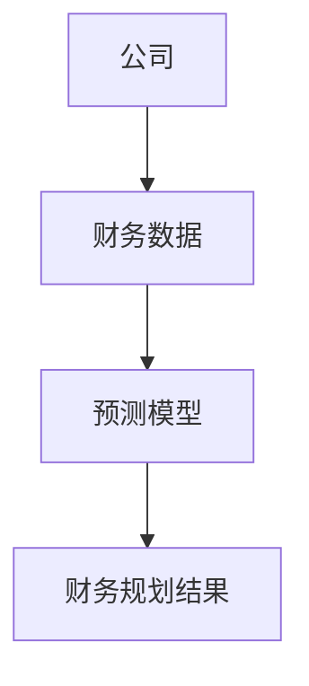
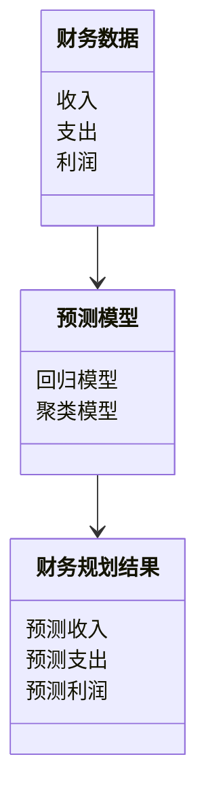
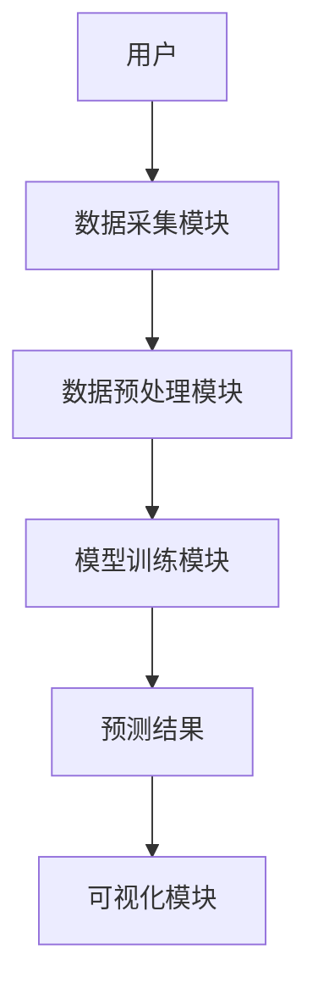
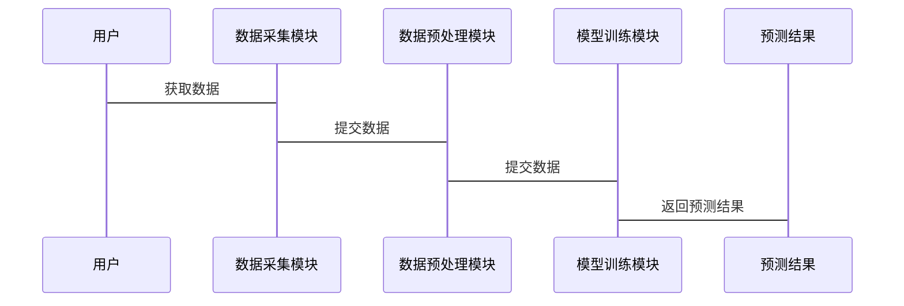

                 


# AI驱动的公司财务规划工具

## 关键词：人工智能、财务规划、机器学习、财务模型、数据驱动决策

## 摘要：本文探讨了AI技术在公司财务规划中的应用，分析了AI驱动的财务规划工具的核心概念、算法原理和系统架构。通过实际案例，展示了如何利用AI技术提高财务规划的准确性和效率，为企业提供科学的决策支持。

---

# 第1章：AI驱动的公司财务规划工具背景介绍

## 1.1 问题背景与描述

### 1.1.1 传统财务规划的局限性
传统的财务规划工具主要依赖于人工分析和经验判断，存在以下问题：
- 数据处理能力有限，难以应对海量数据。
- 预测模型简单，缺乏动态调整能力。
- 分析结果主观性较强，难以保证准确性。

### 1.1.2 AI技术如何解决财务规划问题
人工智能技术的引入，为财务规划带来了革命性的变化：
- 利用机器学习算法，可以自动处理大量数据，提取关键特征。
- 通过深度学习模型，可以实现高精度的财务预测。
- 自然语言处理技术可以帮助分析财务报告中的非结构化数据。

### 1.1.3 公司财务规划工具的边界与外延
公司财务规划工具的边界包括：
- 数据输入范围：财务数据、市场数据、业务数据。
- 预测范围：财务预测、预算制定、资金分配。
- 输出范围：财务报表、预测报告、决策建议。

外延包括：
- 数据来源的扩展：外部市场数据、竞争对手数据。
- 应用场景的扩展：风险管理、投资决策。

## 1.2 核心概念与问题解决

### 1.2.1 AI驱动的财务规划工具的核心要素
AI驱动的财务规划工具的核心要素包括：
- 数据采集模块：从多个数据源获取财务数据。
- 数据预处理模块：清洗和标准化数据。
- 模型训练模块：训练机器学习模型。
- 预测模块：生成财务预测结果。
- 可视化模块：以图表形式展示预测结果。

### 1.2.2 问题解决的流程与方法
问题解决的流程包括：
1. 数据采集：获取公司财务数据、市场数据。
2. 数据预处理：清洗数据，处理缺失值。
3. 模型训练：选择合适的算法，训练模型。
4. 模型评估：验证模型的准确性。
5. 预测与优化：生成预测结果，并优化模型。

### 1.2.3 核心概念的结构与组成
核心概念的结构包括：
- 数据层：输入数据、特征提取。
- 模型层：选择算法、训练模型。
- 输出层：生成预测结果。

## 1.3 本章小结
本章介绍了AI驱动的公司财务规划工具的背景，分析了传统财务规划的局限性，探讨了AI技术如何解决这些问题，并总结了核心概念和问题解决的流程与方法。

---

# 第2章：AI驱动的公司财务规划工具核心概念与联系

## 2.1 核心概念原理

### 2.1.1 AI算法在财务规划中的应用
AI算法在财务规划中的应用包括：
- 回归分析：用于预测收入和支出。
- 聚类分析：用于分类财务数据。
- 自然语言处理：用于分析财务报告。

### 2.1.2 数据分析与预测模型
数据分析与预测模型的核心在于：
- 数据预处理：清洗数据，提取特征。
- 模型训练：选择合适的算法，训练模型。
- 模型评估：验证模型的准确性。

### 2.1.3 自然语言处理在财务报告中的应用
自然语言处理技术可以用于：
- 从财务报告中提取关键信息。
- 分析报告的语义，生成摘要。

## 2.2 核心概念属性对比

### 2.2.1 AI驱动工具与传统工具的对比分析
| 特性 | AI驱动工具 | 传统工具 |
|------|-------------|-----------|
| 数据处理能力 | 强 | 弱 |
| 预测准确性 | 高 | 低 |
| 自动化程度 | 高 | 低 |

### 2.2.2 不同AI算法的性能对比
| 算法 | 回归分析 | 聚类分析 | 支持向量机 |
|------|-----------|-----------|------------|
| 适用场景 | 预测数值型数据 | 分类数据 | 分类与回归 |

### 2.2.3 数据源的特征对比
| 数据源 | 财务数据 | 市场数据 | 业务数据 |
|--------|----------|----------|----------|
| 类型 | 结构化 | 结构化 | 结构化 |
| 例子 | 收入、支出 | 行业趋势 | 客户行为 |

## 2.3 ER实体关系图



## 2.4 本章小结
本章分析了AI驱动的公司财务规划工具的核心概念，探讨了AI算法在财务规划中的应用，并通过对比分析和ER图展示了核心概念的结构与关系。

---

# 第3章：AI驱动的公司财务规划工具算法原理

## 3.1 算法原理

### 3.1.1 回归分析
回归分析是一种统计方法，用于预测数值型数据。其数学模型为：
$$ y = \beta_0 + \beta_1 x + \epsilon $$
其中，$y$ 是目标变量，$x$ 是自变量，$\beta_0$ 是截距，$\beta_1$ 是回归系数，$\epsilon$ 是误差项。

### 3.1.2 聚类分析
聚类分析是一种无监督学习方法，用于将数据分成不同的类别。常用算法包括K-means和层次聚类。

## 3.2 算法实现

### 3.2.1 回归分析的Python实现

```python
import numpy as np
from sklearn.linear_model import LinearRegression

# 示例数据
X = np.array([[1], [2], [3], [4], [5]])
y = np.array([2, 4, 5, 4, 6])

# 训练模型
model = LinearRegression()
model.fit(X, y)

# 预测结果
print(model.predict(X))
```

### 3.2.2 聚类分析的Python实现

```python
from sklearn.cluster import KMeans

# 示例数据
X = np.array([[1, 2], [3, 4], [5, 6], [7, 8], [9, 10]])

# 训练模型
model = KMeans(n_clusters=2)
model.fit(X)

# 获取聚类结果
print(model.labels_)
```

## 3.3 算法优化

### 3.3.1 参数调整
- 回归分析：调整回归系数。
- 聚类分析：调整聚类数目。

### 3.3.2 模型评估
- 回归分析：R平方值、均方误差。
- 聚类分析： silhouette score。

## 3.4 本章小结
本章详细讲解了回归分析和聚类分析的算法原理，并通过Python代码展示了实现过程。同时，讨论了算法优化和模型评估的方法。

---

# 第4章：AI驱动的公司财务规划工具系统架构设计

## 4.1 系统功能设计

### 4.1.1 领域模型



### 4.1.2 系统架构设计



## 4.2 系统接口设计

### 4.2.1 API接口
- 数据接口：获取财务数据。
- 模型接口：调用预测模型。

### 4.2.2 数据流



## 4.3 本章小结
本章设计了AI驱动的公司财务规划工具的系统架构，包括功能设计、架构设计和接口设计。

---

# 第5章：AI驱动的公司财务规划工具项目实战

## 5.1 项目介绍

### 5.1.1 项目背景
本项目旨在利用AI技术，开发一个公司财务规划工具，帮助公司提高财务预测的准确性和效率。

## 5.2 项目核心实现

### 5.2.1 环境安装
```bash
pip install numpy pandas scikit-learn matplotlib
```

### 5.2.2 核心代码实现

```python
import numpy as np
from sklearn.linear_model import LinearRegression
from sklearn.cluster import KMeans

# 示例数据
X = np.array([[1, 2], [3, 4], [5, 6], [7, 8], [9, 10]])
y = np.array([2, 4, 5, 4, 6])

# 回归分析
model_regression = LinearRegression()
model_regression.fit(X[:, 0].reshape(-1, 1), y)
print("回归系数:", model_regression.coef_)

# 聚类分析
model_clustering = KMeans(n_clusters=2)
model_clustering.fit(X)
print("聚类结果:", model_clustering.labels_)
```

### 5.2.3 代码应用解读与分析
- 回归分析用于预测收入和支出。
- 聚类分析用于分类财务数据。

## 5.3 项目总结

### 5.3.1 项目成果
- 开发了一个AI驱动的财务规划工具。
- 提高了财务预测的准确性和效率。

### 5.3.2 经验与教训
- 数据清洗和特征提取是关键。
- 模型选择和优化需要结合实际场景。

## 5.4 本章小结
本章通过一个实际项目，展示了AI驱动的公司财务规划工具的开发过程，包括环境安装、代码实现和案例分析。

---

# 第6章：AI驱动的公司财务规划工具扩展内容

## 6.1 最佳实践 tips

### 6.1.1 数据处理
- 数据清洗：处理缺失值、异常值。
- 数据标准化：归一化和标准化。

### 6.1.2 模型优化
- 参数调整：选择合适的参数。
- 模型评估：使用交叉验证。

### 6.1.3 结果可视化
- 使用图表展示预测结果。
- 可视化工具：Matplotlib、Seaborn。

## 6.2 未来发展趋势

### 6.2.1 技术发展
- 更先进的算法：深度学习、强化学习。
- 自然语言处理的进一步应用。

### 6.2.2 应用场景扩展
- 更多业务场景的应用：风险管理、投资决策。

## 6.3 注意事项

### 6.3.1 数据隐私
- 注意数据隐私和安全。
- 遵守相关法律法规。

### 6.3.2 模型解释性
- 提高模型的解释性。
- 使用可解释的算法。

## 6.4 拓展阅读
- 推荐阅读《机器学习实战》、《深度学习》等书籍。

## 6.5 本章小结
本章总结了AI驱动的公司财务规划工具的最佳实践，探讨了未来的发展趋势，并提出了注意事项和拓展阅读建议。

---

# 第7章：附录

## 7.1 数据集
- 示例数据集：公司财务数据、市场数据。

## 7.2 工具包
- Python库：numpy、pandas、scikit-learn。

## 7.3 参考文献
- [1] 周志华. 机器学习. 清华大学出版社, 2016.
- [2] Ian Goodfellow. 深度学习. 清华大学出版社, 2016.

---

# 结语

AI驱动的公司财务规划工具正在改变传统的财务管理模式，通过引入机器学习和深度学习技术，可以提高财务预测的准确性和效率。未来，随着技术的不断发展，AI驱动的财务规划工具将在更多业务场景中得到应用，为企业创造更大的价值。

