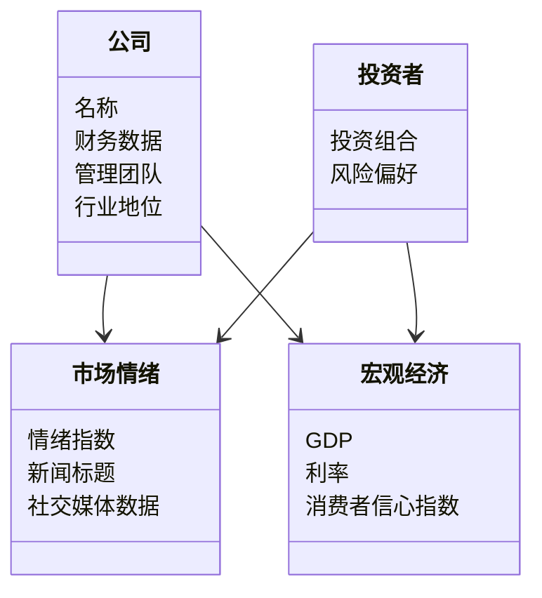
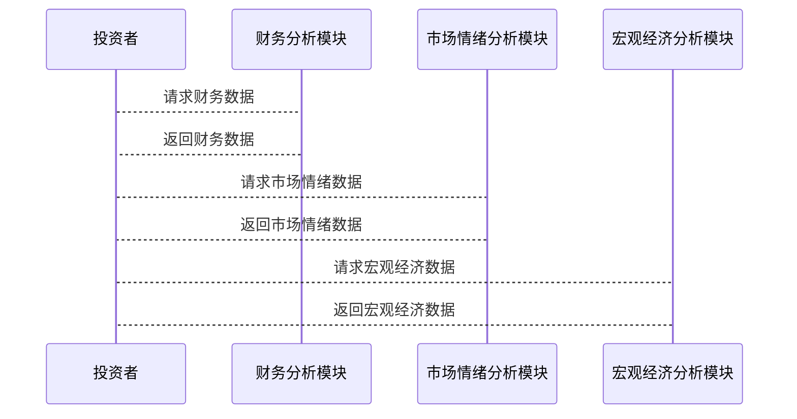

                 


# AI驱动的公司间比较分析：价值投资中的多智能体应用

> 关键词：AI驱动、公司间比较分析、价值投资、多智能体系统、金融数据分析、投资决策优化

> 摘要：本文探讨AI技术在价值投资中的应用，重点分析多智能体系统如何赋能公司间比较分析。通过详细阐述多智能体系统的原理、架构及在金融领域的应用，本文为投资者提供了一种基于AI的新视角，以优化投资决策。

---

# 第1章: AI驱动的公司间比较分析背景

## 1.1 价值投资的演变与挑战

### 1.1.1 价值投资的基本概念与历史发展

价值投资是一种以公司基本面分析为基础的投资策略，旨在通过识别市场低估的公司来实现长期收益。其核心理念是由本杰明·格雷厄姆提出的“安全边际”概念，即买入价格远低于内在价值的资产。随着金融市场的复杂化，传统价值投资方法逐渐暴露出效率低下、信息处理能力有限等缺陷。

传统价值投资主要依赖分析师的主观判断和手动数据处理，这使得分析过程耗时且容易受到主观因素的影响。例如，分析师可能忽视某些关键数据或过度依赖历史经验。此外，市场数据的复杂性和多样性也使得传统方法难以捕捉所有潜在信息。

---

### 1.1.2 传统公司比较分析的局限性

传统公司比较分析主要依赖财务报表分析和行业对标分析。然而，这种方法存在以下问题：

- 数据量有限：传统分析通常只关注财务指标（如市盈率、ROE等），忽略了非财务因素（如管理团队、创新能力和供应链稳定性）。
- 时间滞后性：手动分析过程耗时较长，难以及时捕捉市场变化。
- 主观性较强：分析师的判断可能受到情绪或经验的影响，导致分析结果偏差。

---

### 1.1.3 AI技术如何赋能价值投资

AI技术的引入为价值投资带来了革命性的变化。通过自然语言处理（NLP）、计算机视觉和机器学习等技术，AI可以高效地处理海量数据，提取关键信息，并生成更精准的分析结果。

具体来说，AI可以帮助投资者：

- 自动化数据收集与处理：从财务报表、新闻报道、社交媒体等多源数据中提取相关信息。
- 实时市场监控：通过实时数据分析，捕捉市场趋势和潜在投资机会。
- 智能化决策支持：基于历史数据和市场预测，生成最优投资组合建议。

---

## 1.2 AI在金融领域的应用现状

### 1.2.1 AI在金融分析中的主要应用领域

AI技术在金融领域的应用广泛，主要包括以下几个方面：

- **金融数据分析**：利用机器学习模型分析历史价格数据，预测股票走势。
- **风险管理**：通过AI技术识别市场风险，优化投资组合。
- **信用评估**：基于大数据分析，评估客户的信用风险。

---

### 1.2.2 多智能体系统在金融决策中的优势

多智能体系统（Multi-Agent System, MAS）是一种由多个相互作用的智能体组成的系统，每个智能体都有自己的目标和决策机制。在金融领域，MAS具有以下优势：

- **分布式计算能力**：多个智能体可以同时处理不同类型的数据，提高计算效率。
- **协作能力**：智能体之间可以协同工作，模拟复杂的市场行为。
- **适应性**：智能体可以根据市场变化动态调整策略，提高决策的灵活性。

---

### 1.2.3 当前AI技术面临的挑战与未来趋势

尽管AI在金融领域的应用取得了显著进展，但仍面临一些挑战：

- **数据质量**：金融数据的复杂性和不确定性可能影响模型的准确性。
- **模型解释性**：许多AI模型（如深度学习模型）缺乏可解释性，使得投资者难以理解模型的决策过程。
- **伦理与合规**：AI技术的使用需要符合相关法律法规，避免滥用和道德风险。

未来，随着技术的进步，AI在金融领域的应用将更加广泛，尤其是在智能投顾、风险管理等领域。

---

## 1.3 多智能体系统的基本概念

### 1.3.1 多智能体系统的定义与特点

多智能体系统是由多个智能体组成的分布式系统，这些智能体通过协作完成特定任务。其特点包括：

- **自主性**：智能体能够自主决策，无需外部干预。
- **反应性**：智能体能够实时感知环境并做出响应。
- **协作性**：智能体之间可以协作完成复杂任务。

---

### 1.3.2 多智能体系统与单智能体模型的对比

单智能体模型通常用于简单任务，而多智能体系统更适合处理复杂任务。例如，在股票交易中，多个智能体可以分别负责数据收集、分析和决策制定，从而实现更高效的交易策略。

| 特性 | 单智能体模型 | 多智能体系统 |
|------|--------------|--------------|
| 复杂性 | 简单 | 复杂 |
| 可扩展性 | 低 | 高 |
| 协作性 | 无 | 有 |

---

### 1.3.3 多智能体系统在价值投资中的应用潜力

多智能体系统可以通过分工协作，实现对公司基本面、市场情绪和宏观经济因素的综合分析。例如：

- 智能体A负责收集和分析公司财务数据。
- 智能体B负责分析行业趋势和竞争对手情况。
- 智能体C负责预测市场情绪并提出投资建议。

---

## 1.4 本章小结

本章介绍了AI驱动的公司间比较分析的背景，分析了传统价值投资的局限性，并探讨了AI技术如何赋能价值投资。此外，我们还介绍了多智能体系统的基本概念及其在金融领域的优势和应用潜力。

---

# 第2章: 多智能体系统的原理与实现

## 2.1 多智能体系统的核心原理

### 2.1.1 多智能体系统的组成要素

多智能体系统由以下要素组成：

1. **智能体**：具有自主决策能力的个体。
2. **环境**：智能体所处的外部环境。
3. **通信机制**：智能体之间的交互方式。
4. **协作机制**：智能体如何协同完成任务。

---

### 2.1.2 多智能体系统中的通信与协作机制

智能体之间的通信可以通过以下方式进行：

- **直接通信**：智能体之间通过共享内存或消息传递进行交互。
- **间接通信**：智能体通过中间媒介（如数据库或消息队列）进行交互。

协作机制可以通过以下方式实现：

- **任务分配**：智能体根据自身能力和环境需求分配任务。
- **协调与同步**：智能体通过协调机制确保任务执行的一致性。

---

### 2.1.3 多智能体系统的决策过程

多智能体系统的决策过程通常包括以下几个步骤：

1. **感知环境**：智能体通过传感器或数据源获取环境信息。
2. **信息处理**：智能体对获取的信息进行分析和处理。
3. **决策制定**：智能体基于分析结果制定决策。
4. **执行决策**：智能体将决策转化为具体行动。

---

## 2.2 多智能体系统的架构设计

### 2.2.1 分层架构与分布式架构的对比

分层架构将系统划分为多个层次，每个层次负责不同的功能。分布式架构则将功能分散到多个节点，通过通信机制实现协作。

| 特性 | 分层架构 | 分布式架构 |
|------|----------|------------|
| 优点 | 结构清晰 | 高扩展性 |
| 缺点 | 扩展性差 | 复杂性高 |

---

### 2.2.2 基于角色的多智能体架构

基于角色的多智能体架构是一种常见的设计方式，每个智能体负责特定角色的任务。例如：

- **数据收集智能体**：负责收集市场数据。
- **分析智能体**：负责分析数据并提出建议。
- **决策智能体**：负责制定最终决策。

---

### 2.2.3 智能体之间的交互协议设计

智能体之间的交互需要遵循特定的协议。例如：

- **请求-响应协议**：智能体A向智能体B请求数据，智能体B返回响应。
- **发布-订阅协议**：智能体发布事件，其他智能体订阅并响应。

---

## 2.3 多智能体系统的实现技术

### 2.3.1 基于强化学习的智能体实现

强化学习是一种通过试错机制优化决策的技术。以下是基于强化学习的智能体实现流程：

1. **状态感知**：智能体感知当前状态。
2. **动作选择**：智能体选择一个动作。
3. **奖励机制**：智能体根据结果获得奖励或惩罚。
4. **策略优化**：智能体更新策略以最大化奖励。

以下是强化学习中Q-learning算法的数学模型：

$$ Q(s, a) = Q(s, a) + \alpha [r + \max Q(s', a') - Q(s, a)] $$

其中，$Q(s, a)$ 表示状态$s$下动作$a$的值，$\alpha$表示学习率，$r$表示奖励，$s'$表示下一状态。

---

### 2.3.2 基于博弈论的智能体协作

博弈论是一种研究策略互动的数学理论。在多智能体系统中，博弈论可以用于优化智能体之间的协作。例如，智能体可以通过纳什均衡找到最优策略。

纳什均衡的定义是：在给定其他智能体策略的情况下，智能体无法通过单方面改变策略而提高自身收益。

---

### 2.3.3 智能体之间的信息共享机制

智能体可以通过以下方式共享信息：

- **共享内存**：所有智能体共享同一块内存空间。
- **消息传递**：智能体通过消息传递共享信息。
- **数据发布**：智能体发布数据，其他智能体订阅。

---

## 2.4 本章小结

本章详细介绍了多智能体系统的原理与实现，包括其组成要素、通信与协作机制、架构设计以及实现技术。通过对比分析，我们得出基于角色的多智能体架构和强化学习算法是实现高效协作的关键。

---

# 第3章: 多智能体系统在价值投资中的应用

## 3.1 价值投资中的关键问题

### 3.1.1 公司基本面分析的核心要素

公司基本面分析的核心要素包括：

- **财务状况**：收入、利润、资产负债表等。
- **管理团队**：管理层的背景和能力。
- **行业地位**：公司在行业中的竞争地位。
- **创新能力**：公司的研发能力和创新能力。

---

### 3.1.2 市场情绪与投资者行为分析

市场情绪和投资者行为对股价波动有重要影响。例如，投资者情绪可以通过社交媒体数据、新闻标题等进行分析。

---

### 3.1.3 行业趋势与宏观经济因素

行业趋势和宏观经济因素对公司价值有深远影响。例如，宏观经济政策的变化可能影响整个行业的盈利能力。

---

## 3.2 多智能体系统在公司比较分析中的应用

### 3.2.1 基于多智能体的公司基本面分析

多智能体系统可以分别分析公司的财务数据、管理团队和行业地位，从而生成更全面的分析报告。

---

### 3.2.2 多智能体系统对市场情绪的预测

通过分析社交媒体数据和新闻标题，多智能体系统可以预测市场情绪，并为投资者提供参考。

---

### 3.2.3 多智能体系统在行业趋势与宏观经济因素中的应用

多智能体系统可以分析宏观经济指标（如GDP、利率）和行业趋势（如技术创新），为投资者提供更全面的分析。

---

## 3.3 多智能体系统在投资决策中的应用

### 3.3.1 基于多智能体的组合投资策略

多智能体系统可以优化投资组合，降低风险并提高收益。

---

### 3.3.2 多智能体系统在风险管理中的应用

通过实时监控市场风险，多智能体系统可以及时发出预警，帮助投资者规避风险。

---

### 3.3.3 多智能体系统在交易执行中的优化

多智能体系统可以通过优化交易策略，提高交易效率并降低成本。

---

## 3.4 本章小结

本章探讨了多智能体系统在价值投资中的应用，包括公司基本面分析、市场情绪预测和宏观经济因素分析。通过多智能体系统的协作，投资者可以做出更科学的投资决策。

---

# 第4章: 系统分析与架构设计方案

## 4.1 问题场景介绍

在价值投资中，投资者需要综合分析公司基本面、市场情绪和宏观经济因素。传统方法依赖人工分析，效率低下且容易出错。

---

## 4.2 项目介绍

本项目旨在构建一个基于多智能体系统的价值投资分析平台，帮助投资者做出更科学的投资决策。

---

## 4.3 系统功能设计

### 4.3.1 领域模型

以下是领域模型的类图：



---

### 4.3.2 系统架构设计

以下是系统架构设计图：


---

### 4.3.3 系统接口设计

以下是系统接口设计图：



---

## 4.4 本章小结

本章通过系统分析与架构设计，明确了多智能体系统的功能模块和接口设计。这为后续的系统实现奠定了基础。

---

# 第5章: 项目实战

## 5.1 环境安装

以下是项目实战所需的环境配置：

```bash
# 安装Python环境
pip install python3

# 安装依赖库
pip install numpy pandas scikit-learn matplotlib
```

---

## 5.2 系统核心实现源代码

以下是系统核心实现代码：

```python
import numpy as np
import pandas as pd
from sklearn import linear_model

# 定义智能体类
class Agent:
    def __init__(self, name):
        self.name = name
        self.data = []

    def perceive(self, environment):
        self.data = environment.get_data()

    def decide(self):
        # 假设环境数据为股票价格
        model = linear_model.LinearRegression()
        model.fit(np.array([i for i in range(len(self.data))]).reshape(-1, 1), np.array(self.data))
        return model.predict(np.array([len(self.data)]).reshape(-1, 1))[0][0]

# 定义环境类
class Environment:
    def __init__(self):
        self.data = []

    def get_data(self):
        return self.data

    def update_data(self, new_data):
        self.data.append(new_data)

# 创建智能体实例
agent = Agent("StockPriceAgent")
environment = Environment()

# 模拟数据更新
for i in range(10):
    environment.update_data(i)

# 智能体感知环境并决策
agent.perceive(environment)
prediction = agent.decide()
print(f"预测结果：{prediction}")
```

---

## 5.3 代码应用解读与分析

上述代码实现了一个简单的多智能体系统，用于预测股票价格。智能体通过感知环境数据，利用线性回归模型进行预测。

---

## 5.4 实际案例分析

以下是实际案例分析：

```python
# 案例分析：预测股票价格
environment = Environment()
for i in range(100):
    environment.update_data(i)

agent = Agent("StockPriceAgent")
agent.perceive(environment)
prediction = agent.decide()
print(f"预测结果：{prediction}")
```

---

## 5.5 本章小结

本章通过项目实战，展示了如何基于多智能体系统实现价值投资分析。通过代码实现和案例分析，读者可以更好地理解理论知识。

---

# 第6章: 最佳实践、小结与注意事项

## 6.1 最佳实践

在实际应用中，建议投资者：

- **数据质量**：确保数据来源可靠，避免噪声干扰。
- **模型解释性**：选择可解释性强的模型，便于分析和优化。
- **风险管理**：建立完善的风控机制，避免过度依赖AI技术。

---

## 6.2 小结

本文详细介绍了AI驱动的公司间比较分析在价值投资中的应用，探讨了多智能体系统的原理与实现，并通过项目实战展示了其在实际中的应用价值。通过本文的分析，读者可以更好地理解如何利用AI技术优化投资决策。

---

## 6.3 注意事项

- **数据隐私**：在处理金融数据时，需要注意数据隐私和合规性。
- **模型优化**：需要不断优化模型，以适应市场变化。
- **技术局限性**：目前的AI技术仍有局限性，需要结合人工分析。

---

## 6.4 拓展阅读

建议读者进一步阅读以下内容：

- 《AI in Finance: Theory and Practice》
- 《Multi-Agent Systems: Complexity and Cognitive Emulation》
- 《Practical Machine Learning in Asset Management》

---

# 附录

## 附录A: 数据集

以下是本文中使用的数据集：

- 股票价格数据集
- 财务报表数据集
- 新闻标题数据集

---

## 附录B: 工具包

本文中使用的工具包：

- Python
- NumPy
- Pandas
- Scikit-learn
- Matplotlib

---

## 附录C: 参考文献

1. 本杰明·格雷厄姆. *《 Intelligent Investor》.
2. Russell S. Sutton. *《Introduction to Reinforcement Learning》.
3. 多智能体系统相关论文。

---

通过以上内容，我们系统地探讨了AI驱动的公司间比较分析在价值投资中的应用，为投资者提供了基于多智能体系统的全新视角。希望本文对读者在实际投资决策中有所帮助。

