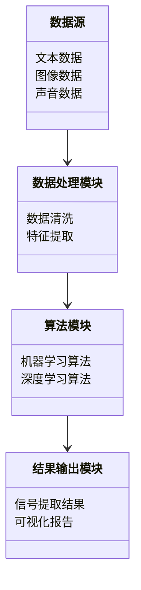
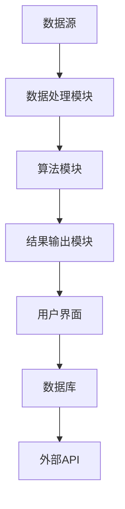
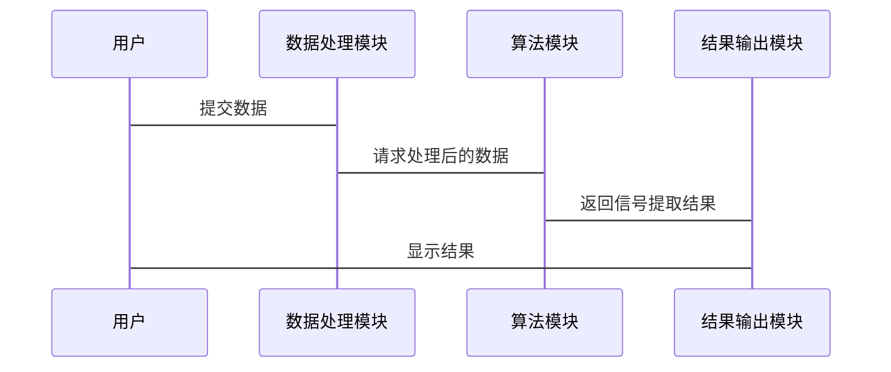

                 


# AI驱动的另类数据投资信号提取

## 关键词：另类数据、AI驱动、投资信号、机器学习、深度学习

## 摘要：本文探讨如何利用人工智能技术从非传统数据源中提取投资信号，分析了另类数据的重要性、AI在投资中的应用前景，并详细讲解了数据处理、算法选择、系统设计及项目实战等内容，为读者提供全面的技术指导。

---

# 第一部分: AI驱动的另类数据投资信号提取基础

## 第1章: 另类数据与投资信号提取概述

### 1.1 另类数据的定义与特点

#### 1.1.1 另类数据的定义
另类数据是指传统金融数据（如价格、成交量等）之外的其他数据源，包括社交媒体、卫星图像、物联网数据、新闻标题等。这些数据通过自然语言处理（NLP）、计算机视觉（CV）等技术进行分析，提取潜在的投资信号。

#### 1.1.2 另类数据的分类
| 类别         | 描述                                                                 |
|--------------|----------------------------------------------------------------------|
| 文本数据     | 包括新闻、社交媒体帖子、公司财报等，通过NLP技术提取情感和关键词。 |
| 图像数据     | 包括卫星图像、股价图表等，通过计算机视觉技术进行分析。         |
| 声音数据     | 包括播客、电话会议录音等，通过语音识别技术提取信息。           |
| 结构化数据   | 包括供应链数据、物流数据等，通过数据分析提取价值。             |

#### 1.1.3 另类数据在投资中的重要性
- **信息优势**：另类数据提供传统数据之外的额外信息，帮助投资者做出更明智的决策。
- **实时性**：社交媒体和新闻可以提供实时市场情绪，帮助投资者快速反应。
- **差异化**：利用另类数据可以构建独特的投资策略，获得竞争优势。

### 1.2 投资信号提取的背景与目标

#### 1.2.1 投资信号的定义
投资信号是指从数据中提取的能够影响资产价格变动的有用信息，例如市场情绪、供需变化等。

#### 1.2.2 传统投资信号提取的局限性
- 数据来源有限：传统方法主要依赖历史价格和成交量数据。
- 计算能力限制：难以处理海量非结构化数据。
- 信号提取复杂：需要结合多种数据源和复杂的算法。

#### 1.2.3 AI驱动的投资信号提取的优势
- **多源数据融合**：能够整合文本、图像、声音等多种数据源。
- **自动化处理**：AI技术可以自动提取和分析海量数据，提高效率。
- **实时性**：能够快速响应市场变化，提供实时信号。

### 1.3 AI在投资信号提取中的应用前景

#### 1.3.1 AI技术在金融领域的应用现状
- **量化交易**：利用算法进行高频交易，提高收益。
- **风险控制**：通过AI模型预测市场风险，优化投资组合。
- **客户画像**：基于用户数据进行个性化投资建议。

#### 1.3.2 另类数据驱动的投资信号提取的潜力
- **市场情绪分析**：通过社交媒体和新闻数据预测市场趋势。
- **供应链分析**：通过物流数据预测公司业绩。
- **实时监控**：通过实时数据流进行市场监控，捕捉短期机会。

#### 1.3.3 未来发展趋势与挑战
- **技术进步**：AI算法不断优化，处理能力提升。
- **数据多样性**：更多类型的另类数据被引入，丰富信号提取维度。
- **监管合规**：需要符合金融监管要求，确保数据使用合法性。

### 1.4 本章小结
本章介绍了另类数据的定义和分类，分析了投资信号提取的背景和目标，探讨了AI在投资中的应用前景和未来趋势。

---

## 第2章: AI驱动的另类数据处理基础

### 2.1 数据预处理与清洗

#### 2.1.1 数据清洗的必要性
- 数据清洗是数据预处理的第一步，包括去除噪声、填补缺失值、去除重复数据等。

#### 2.1.2 数据标准化与归一化
- **标准化**：将数据按比例缩放到均值为0，方差为1的范围，适用于距离计算。
- **归一化**：将数据缩放到0-1范围，适用于神经网络训练。

#### 2.1.3 数据特征提取方法
- **文本数据**：使用TF-IDF或Word2Vec提取关键词向量。
- **图像数据**：通过卷积神经网络（CNN）提取图像特征。
- **声音数据**：使用音频处理技术提取语音特征。

### 2.2 数据特征工程

#### 2.2.1 特征选择的重要性
- 特征选择是提高模型性能的关键，包括主成分分析（PCA）、递归特征消除（RFE）等方法。

#### 2.2.2 基于AI的特征提取技术
- **自动编码器**：用于无监督特征学习，提取数据的潜在特征。
- **主题模型**：如LDA，用于从文本数据中提取主题特征。

#### 2.2.3 特征工程的实践案例
- 示例：从社交媒体数据中提取情感特征，用于预测股票价格变化。

### 2.3 数据可视化与分析

#### 2.3.1 数据可视化的工具与方法
- 工具：Matplotlib、Seaborn、Tableau。
- 方法：散点图、折线图、热力图等。

#### 2.3.2 数据分布与关联性分析
- 使用相关系数矩阵和散点图矩阵分析变量之间的关联性。

#### 2.3.3 数据驱动的信号识别
- 通过可视化工具识别数据中的异常点和趋势，辅助投资决策。

### 2.4 本章小结
本章详细讲解了数据预处理、特征工程和数据可视化的方法，为后续的信号提取奠定了基础。

---

## 第3章: 机器学习与深度学习算法原理

### 3.1 机器学习基础

#### 3.1.1 机器学习的定义与分类
- **监督学习**：用于分类和回归问题。
- **无监督学习**：用于聚类和降维问题。
- **强化学习**：通过试错机制进行决策优化。

#### 3.1.2 监督学习、无监督学习与强化学习
- 示例：使用线性回归进行股价预测，使用聚类分析识别市场板块。

#### 3.1.3 常见机器学习算法及其特点
| 算法         | 特点                     | 应用场景                 |
|--------------|--------------------------|--------------------------|
| 支持向量机（SVM） | 高维数据表现好           | 分类问题                 |
| 随机森林     | 抗过拟合能力强             | 特征重要性分析           |
| K-近邻（KNN） | 适合小数据集               | 分类与回归               |

### 3.2 深度学习基础

#### 3.2.1 深度学习的定义与特点
- 深度学习通过多层神经网络提取数据的高层次特征，适用于复杂模式识别。

#### 3.2.2 常见深度学习模型
- **卷积神经网络（CNN）**：用于图像识别。
- **循环神经网络（RNN）**：用于时间序列分析。
- **长短期记忆网络（LSTM）**：适合处理时间序列数据。

#### 3.2.3 深度学习在金融中的应用
- 示例：使用LSTM预测股票价格，使用CNN分析卫星图像数据。

### 3.3 算法选择与优化

#### 3.3.1 算法选择的策略与方法
- 根据数据类型和任务选择合适的算法，例如文本分类选择SVM，图像识别选择CNN。

#### 3.3.2 超参数优化与调参技巧
- 使用网格搜索和随机搜索优化模型参数，提升性能。

#### 3.3.3 模型评估与验证
- 通过交叉验证评估模型性能，防止过拟合。

### 3.4 本章小结
本章介绍了机器学习和深度学习的基本原理，探讨了不同算法的特点和应用场景。

---

## 第4章: 投资信号提取的数学模型与公式

### 4.1 线性回归模型

#### 4.1.1 线性回归的定义与公式
- 线性回归用于预测连续型变量，公式为：$$ y = \beta_0 + \beta_1x_1 + \beta_2x_2 + \cdots + \beta_nx_n $$

#### 4.1.2 线性回归在投资中的应用
- 示例：使用线性回归预测股票价格，基于多个特征变量。

#### 4.1.3 线性回归的优缺点
- 优点：简单易懂，计算高效。
- 缺点：假设线性关系，可能无法捕捉复杂模式。

### 4.2 支持向量机（SVM）

#### 4.2.1 SVM的定义与原理
- SVM通过构建最大间隔超平面，将数据点分为不同类别。

#### 4.2.2 SVM的数学公式与推导
- 最优化目标：$$ \min_{\beta,b,\xi} \frac{1}{2}\|\beta\|^2 + C\sum_{i=1}^n \xi_i $$
- 约束条件：$$ y_i(\beta \cdot x_i + b) \geq 1 - \xi_i $$
- 对偶问题：使用拉格朗日乘子法转换为对偶问题，便于求解。

#### 4.2.3 SVM在投资中的应用
- 示例：使用SVM进行股票分类，预测股票涨跌。

### 4.3 本章小结
本章详细讲解了线性回归和SVM的数学模型，分析了它们在投资信号提取中的应用。

---

## 第5章: 系统设计与实现

### 5.1 问题场景介绍

#### 5.1.1 项目背景
- 本项目旨在利用AI技术从另类数据中提取投资信号，构建一个自动化投资信号提取系统。

#### 5.1.2 项目目标
- 提供一个高效、准确的投资信号提取解决方案，帮助投资者做出决策。

### 5.2 系统功能设计

#### 5.2.1 领域模型设计
- 使用Mermaid绘制领域模型类图，展示系统中的实体和关系。



#### 5.2.2 系统架构设计
- 使用Mermaid绘制系统架构图，展示系统各模块的交互和依赖关系。



#### 5.2.3 系统接口设计
- 系统提供API接口，供其他系统调用投资信号提取结果。

#### 5.2.4 系统交互设计
- 使用Mermaid绘制交互流程图，展示用户与系统之间的交互过程。



### 5.3 本章小结
本章详细设计了系统的功能模块、架构和交互流程，为实际开发提供了指导。

---

## 第6章: 项目实战

### 6.1 环境安装与配置

#### 6.1.1 安装Python环境
- 使用Anaconda安装Python 3.8及以上版本。

#### 6.1.2 安装依赖库
- 使用pip安装numpy、pandas、scikit-learn、tensorflow等库。

### 6.2 核心实现源代码

#### 6.2.1 数据预处理代码
```python
import pandas as pd
import numpy as np

# 读取数据
data = pd.read_csv('data.csv')

# 数据清洗
data.dropna()  # 去除缺失值
data = data[~data.duplicated()]  # 去除重复数据
```

#### 6.2.2 特征提取代码
```python
from sklearn.feature_extraction.text import TfidfVectorizer

vectorizer = TfidfVectorizer()
features = vectorizer.fit_transform(data['text'])
```

#### 6.2.3 模型训练代码
```python
from sklearn.svm import SVC

model = SVC()
model.fit(features, data['label'])
```

#### 6.2.4 模型预测代码
```python
predictions = model.predict(new_features)
```

### 6.3 代码应用解读与分析

#### 6.3.1 数据预处理解读
- 数据清洗是确保数据质量的关键步骤，去除缺失值和重复数据。

#### 6.3.2 特征提取解读
- 使用TF-IDF提取文本数据的特征，捕捉重要的关键词和主题。

#### 6.3.3 模型训练解读
- 使用SVM进行分类任务，训练投资信号分类模型。

#### 6.3.4 模型预测解读
- 使用训练好的模型对新数据进行预测，输出投资信号。

### 6.4 实际案例分析

#### 6.4.1 案例背景
- 以社交媒体数据为例，提取市场情绪信号，预测股票价格变化。

#### 6.4.2 数据来源与处理
- 数据来源：社交媒体帖子，清洗和提取情感特征。

#### 6.4.3 模型选择与训练
- 使用LSTM进行时间序列预测，捕捉市场情绪变化。

#### 6.4.4 结果分析与解读
- 预测结果与实际价格进行对比，评估模型性能。

### 6.5 本章小结
本章通过实际案例展示了AI驱动的另类数据投资信号提取的全过程，包括数据处理、模型训练和结果分析。

---

## 第7章: 总结与展望

### 7.1 最佳实践 tips

#### 7.1.1 数据处理
- 确保数据质量，合理选择特征提取方法。
- 处理异类数据，避免对模型造成干扰。

#### 7.1.2 模型选择
- 根据任务特点选择合适的算法，避免盲目跟风。
- 进行充分的调参和优化，提升模型性能。

#### 7.1.3 系统设计
- 设计清晰的系统架构，便于扩展和维护。
- 确保系统可扩展性，方便未来功能添加。

#### 7.1.4 实际应用
- 结合业务需求，选择合适的技术方案。
- 定期更新模型，适应市场变化。

### 7.2 小结
- 本文全面介绍了AI驱动的另类数据投资信号提取的背景、技术、系统设计和实际应用。

### 7.3 注意事项

#### 7.3.1 数据隐私与安全
- 确保数据来源合法，保护用户隐私。
- 遵守相关法律法规，避免数据滥用。

#### 7.3.2 模型风险
- 认识到AI模型的局限性，避免过度依赖。
- 结合专家经验，进行结果验证。

#### 7.3.3 系统维护
- 定期更新模型，适应市场变化。
- 监控系统性能，及时发现和解决问题。

### 7.4 拓展阅读
- 推荐阅读相关书籍和论文，深入了解AI在金融中的应用。
- 关注行业动态，了解最新的技术进展。

---

## 附录

### 附录A: 数据预处理代码
```python
import pandas as pd
import numpy as np

data = pd.read_csv('data.csv')
data.dropna(inplace=True)
data = data[~data.duplicated()]
```

### 附录B: 特征提取代码
```python
from sklearn.feature_extraction.text import TfidfVectorizer

vectorizer = TfidfVectorizer()
features = vectorizer.fit_transform(data['text'])
```

### 附录C: 模型训练代码
```python
from sklearn.svm import SVC

model = SVC()
model.fit(features, data['label'])
```

### 附录D: 模型预测代码
```python
new_features = vectorizer.transform(new_data)
predictions = model.predict(new_features)
```

---

# 结束语

通过本文的详细介绍，读者可以全面了解AI驱动的另类数据投资信号提取的技术和方法，为实际应用提供了有力的指导。未来，随着AI技术的不断发展，这一领域将有更广阔的发展空间，值得进一步深入研究和探索。

