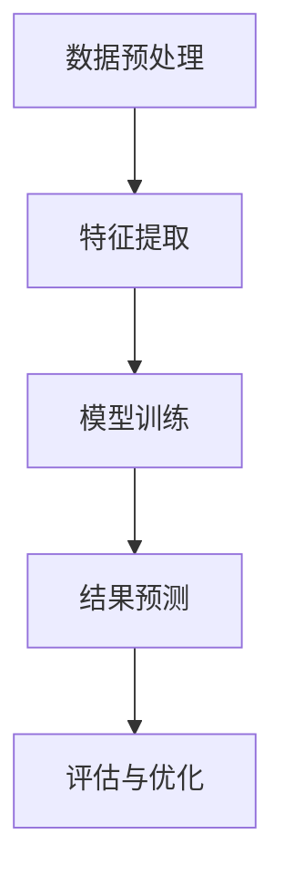
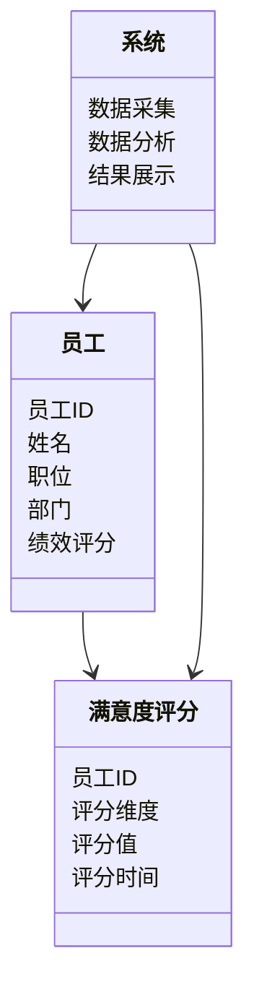

                 


# AI驱动的员工满意度分析：评估人力资本质量

> 关键词：员工满意度、AI、人力资本、数据驱动、机器学习

> 摘要：随着企业对员工满意度分析的需求日益增长，AI技术的应用为评估和优化人力资本质量提供了新的可能性。本文将系统地探讨AI在员工满意度分析中的应用，从理论基础到算法实现，再到实际案例，全面解析如何通过AI技术提升员工满意度分析的效率和准确性。

---

## 第一部分: 背景介绍与核心概念

### 第1章: 员工满意度分析的背景与问题描述

#### 1.1 问题背景
- **企业人力资本管理的重要性**：员工是企业的核心资产，员工满意度直接影响企业的绩效、创新能力和员工留存率。
- **员工满意度对企业绩效的影响**：高满意度的员工通常表现出更高的生产力和创造力，而低满意度可能导致员工流失和工作效率下降。
- **传统员工满意度评估的局限性**：传统方法依赖于问卷调查和人工分析，耗时且成本高，且难以实时捕捉员工情绪变化。

#### 1.2 问题描述
- **员工满意度分析的核心目标**：通过数据驱动的方法，识别影响员工满意度的关键因素，并制定相应的改进措施。
- **数据驱动员工满意度评估的必要性**：利用大数据和AI技术，可以更全面、更精准地分析员工满意度。
- **AI技术在员工满意度分析中的应用潜力**：通过自然语言处理（NLP）、机器学习等技术，可以从员工反馈、行为数据中提取深层洞察。

### 第2章: 核心概念与理论基础

#### 2.1 员工满意度分析的理论框架
- **员工满意度的定义与维度**：员工满意度是指员工对其工作环境、薪酬、职业发展等方面的感觉和态度。通常包括工作满意度、薪酬满意度、领导满意度等多个维度。
- **人力资本质量的内涵与外延**：人力资本是指员工的知识、技能、经验和创造力的总和。员工满意度是衡量人力资本质量的重要指标。
- **AI驱动的员工满意度分析的实现路径**：通过收集员工数据，运用AI技术进行分析和预测，为企业提供个性化和数据化的员工管理建议。

#### 2.2 核心概念的属性对比
- **员工满意度与工作绩效的关系**：研究表明，员工满意度与工作绩效呈正相关，高满意度的员工通常表现更优秀。
- **人力资本与企业竞争力的关联**：优秀的人力资本能够提升企业的创新能力和市场竞争力。
- **AI技术与员工满意度分析的结合点**：AI技术可以通过自动化数据处理、模式识别和预测分析，帮助企业在员工满意度分析中实现高效和精准的管理。

#### 2.3 ER实体关系图
- **实体定义与关系描述**：员工、职位、部门、绩效、满意度评分等实体之间的关系。
- **数据流与信息交互**：员工反馈数据流经系统，经过分析和处理后生成改进措施。
- **系统边界与外部实体**：系统与企业内部其他模块（如HR系统、绩效管理系统）的交互。

---

## 第三部分: 算法原理与数学模型

### 第4章: AI驱动员工满意度分析的算法原理

#### 4.1 算法原理概述
- **机器学习在员工满意度分析中的应用**：常用的算法包括线性回归、逻辑回归、随机森林和神经网络等。
- **常见算法选择与适用场景**：根据数据类型和业务需求选择合适的算法，例如使用逻辑回归进行分类预测。
- **算法实现的关键步骤**：数据预处理、特征提取、模型训练、结果预测和评估优化。

#### 4.2 算法流程图


### 第5章: 数学模型与公式推导

#### 5.1 基于线性回归的员工满意度预测模型
- **模型假设**：员工满意度与工作满意度、薪酬满意度等因素呈线性关系。
- **模型公式**：
$$ y = \beta_0 + \beta_1x_1 + \beta_2x_2 + \cdots + \beta_nx_n + \epsilon $$
  - 其中，$y$ 是员工满意度评分，$x_i$ 是各个影响因素，$\beta_i$ 是回归系数，$\epsilon$ 是误差项。
- **模型解释**：通过回归系数的大小，可以判断各个因素对员工满意度的影响程度。

#### 5.2 示例分析
- 假设我们有一个数据集，包含员工的工作满意度、薪酬满意度和领导满意度评分，以及员工的绩效评分。
- 使用线性回归模型预测员工的绩效评分与满意度评分的关系：
$$ \text{绩效评分} = \beta_0 + \beta_1 \times \text{工作满意度} + \beta_2 \times \text{薪酬满意度} + \beta_3 \times \text{领导满意度} + \epsilon $$

---

## 第四部分: 系统分析与架构设计

### 第6章: 系统架构设计

#### 6.1 问题场景介绍
- **员工满意度分析系统的功能需求**：包括数据采集、分析、预测和结果展示。
- **项目介绍**：一个基于AI的员工满意度分析系统，旨在帮助企业优化人力资本管理。

#### 6.2 系统功能设计（领域模型）


#### 6.3 系统架构设计
- **分层架构**：数据采集层、数据处理层、模型训练层和结果展示层。
- **系统架构图**：


---

## 第五部分: 项目实战

### 第7章: 项目实战

#### 7.1 环境安装
- **安装Python和必要的库**：
  - `pip install numpy pandas scikit-learn matplotlib`

#### 7.2 系统核心实现源代码
```python
import pandas as pd
from sklearn.model_selection import train_test_split
from sklearn.linear_model import LinearRegression
from sklearn.metrics import mean_squared_error

# 数据加载
data = pd.read_csv('employee_satisfaction.csv')

# 数据预处理
X = data[['工作满意度', '薪酬满意度', '领导满意度']]
y = data['绩效评分']

# 数据分割
X_train, X_test, y_train, y_test = train_test_split(X, y, test_size=0.2, random_state=42)

# 模型训练
model = LinearRegression()
model.fit(X_train, y_train)

# 模型预测
y_pred = model.predict(X_test)

# 模型评估
mse = mean_squared_error(y_test, y_pred)
print(f"均方误差: {mse}")
print(f"回归系数: {model.coef_}")
print(f"截距: {model.intercept_}")
```

#### 7.3 代码应用解读与分析
- **数据加载**：从CSV文件中加载员工满意度数据。
- **数据预处理**：选择相关特征变量（工作满意度、薪酬满意度、领导满意度）。
- **数据分割**：将数据分为训练集和测试集。
- **模型训练**：使用线性回归模型进行训练。
- **模型预测**：对测试数据进行预测。
- **模型评估**：计算均方误差，评估模型的性能。

#### 7.4 实际案例分析
- **案例背景**：某公司希望通过分析员工满意度数据，优化员工管理策略。
- **数据分析结果**：发现领导满意度是影响员工绩效评分的主要因素。
- **改进建议**：加强领导与员工的沟通，提升领导满意度。

---

## 第六部分: 总结与展望

### 第8章: 总结与展望

#### 8.1 最佳实践
- **数据质量管理**：确保数据的准确性和完整性。
- **模型优化**：根据实际需求调整模型参数，尝试不同的算法。
- **持续监测**：定期收集员工反馈，动态调整分析模型。

#### 8.2 小结
- 本文详细探讨了AI在员工满意度分析中的应用，从理论到实践，展示了如何通过AI技术优化人力资本管理。

#### 8.3 注意事项
- 数据隐私保护：在处理员工数据时，必须遵守相关法律法规，保护员工隐私。
- 模型解释性：复杂的模型可能难以解释，需权衡模型的准确性和可解释性。

#### 8.4 拓展阅读
- 推荐阅读《机器学习实战》和《数据驱动的决策管理》。

---

通过本文的系统分析和实践案例，我们展示了如何利用AI技术提升员工满意度分析的效率和准确性。未来，随着AI技术的不断发展，员工满意度分析将更加智能化和个性化，为企业优化人力资本管理提供更有力的支持。

