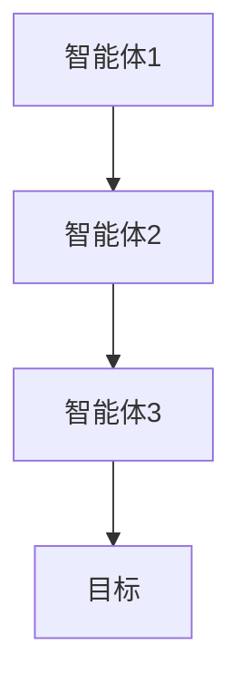
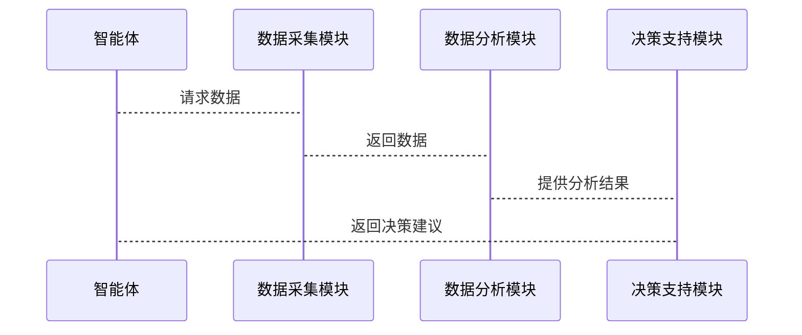

                 


```markdown
# AI驱动的商业生态系统分析：价值投资中的多智能体应用

## 关键词：AI驱动，商业生态系统，价值投资，多智能体，协作机制，投资决策，数据挖掘

## 摘要：  
本文深入分析AI技术在商业生态系统中的应用，特别是多智能体在价值投资中的协作机制。通过系统化的分析，文章探讨了多智能体协作算法、系统架构设计以及实际案例，为读者提供了全面的视角，以理解如何利用AI技术优化商业决策。

---

# 第一部分：AI驱动的商业生态系统概述

## 第1章：AI驱动的商业生态系统背景

### 1.1 问题背景与核心概念  
#### 1.1.1 商业生态系统的基本概念  
商业生态系统由企业、消费者、供应商、合作伙伴等多个利益相关者组成，是一个复杂的动态系统。  

#### 1.1.2 AI驱动的商业生态系统的定义  
AI技术通过数据分析、预测和决策支持，优化商业生态系统的运作效率。  

#### 1.1.3 价值投资与商业生态系统的关联  
价值投资关注企业的长期价值，AI技术能够帮助投资者识别高潜力企业，优化投资组合。  

### 1.2 问题描述与目标  
#### 1.2.1 商业生态系统分析的难点  
复杂性、动态性和不确定性是商业生态系统分析的主要挑战。  

#### 1.2.2 多智能体协作在价值投资中的作用  
多智能体能够协同工作，提高决策的准确性和效率。  

#### 1.2.3 本研究的目标与意义  
目标是通过AI技术优化商业生态系统分析，为价值投资提供科学依据。  

---

# 第二部分：价值投资中的多智能体应用

## 第2章：多智能体的基本概念

### 2.1 多智能体的基本概念  
#### 2.1.1 多智能体系统的定义  
多智能体系统由多个相互作用的智能体组成，能够共同完成复杂任务。  

#### 2.1.2 多智能体与单智能体的区别  
多智能体具有分布式计算、协作能力强的特点。  

#### 2.1.3 多智能体在商业生态系统中的优势  
提高决策效率、增强系统鲁棒性。  

## 第3章：价值投资中的多智能体协作

### 3.1 价值投资的基本原理  
价值投资关注企业的内在价值，通过分析财务数据和市场趋势做出决策。  

### 3.2 多智能体在价值投资中的应用场景  
#### 3.2.1 数据采集与分析  
智能体协同收集和分析企业数据，提供投资建议。  

#### 3.2.2 风险评估与决策支持  
多智能体协作评估投资风险，优化投资组合。  

#### 3.2.3 实时市场监控  
智能体实时监控市场变化，及时调整投资策略。  

---

# 第三部分：AI驱动的多智能体协作算法

## 第4章：AI驱动的多智能体协作算法

### 4.1 算法原理  
#### 4.1.1 基于强化学习的多智能体协作  
使用强化学习算法，智能体通过奖励机制优化协作行为。  

#### 4.1.2 多智能体通信机制  
通过消息传递实现智能体间的协作与协调。  

### 4.2 算法实现  
#### 4.2.1 算法流程图  


#### 4.2.2 Python代码实现  
```python
import numpy as np
import gym

class MultiAgentAlgorithm:
    def __init__(self, env):
        self.env = env
        self.num_agents = env.n_agents

    def step(self, action):
        observation, reward, done, info = self.env.step(action)
        return observation, reward, done, info

# 示例环境
env = gym.make('MultiAgentEnvironment-v0')
algorithm = MultiAgentAlgorithm(env)
observation, reward, done, info = algorithm.step([1, 0])
```

#### 4.2.3 数学模型与公式  
优化目标函数：  
$$ \max \sum_{i=1}^{n} r_i $$  
约束条件：  
$$ s.t. \quad \sum_{i=1}^{n} x_i \leq 1 $$  

---

# 第四部分：系统分析与架构设计

## 第5章：系统分析与架构设计

### 5.1 问题场景介绍  
商业生态系统分析的复杂性要求系统具备高扩展性和实时性。  

### 5.2 系统功能设计  
#### 5.2.1 数据采集模块  
采集企业财务数据、市场数据等。  

#### 5.2.2 数据分析模块  
使用机器学习模型进行数据分析和预测。  

#### 5.2.3 决策支持模块  
提供投资决策支持和风险评估。  

### 5.3 系统架构设计  


### 5.4 系统交互设计  


---

# 第五部分：项目实战

## 第6章：项目实战

### 6.1 环境安装与配置  
安装必要的Python库，如TensorFlow、PyTorch等。  

### 6.2 核心代码实现  
#### 6.2.1 数据采集与预处理  
```python
import pandas as pd

# 数据采集
data = pd.read_csv('financial_data.csv')
# 数据预处理
data = data.dropna()
```

#### 6.2.2 模型训练与测试  
```python
model = MultiAgentModel()
model.train(data)
model.evaluate(data)
```

### 6.3 案例分析  
通过具体案例展示多智能体协作在价值投资中的实际应用。  

### 6.4 项目总结  
总结项目成果，分析存在的问题及改进方向。  

---

# 第六部分：最佳实践与总结

## 第7章：最佳实践与总结

### 7.1 最佳实践  
建议在实际应用中采用分布式计算和实时监控技术。  

### 7.2 小结  
AI技术与多智能体协作的应用前景广阔，未来将有更多创新。  

### 7.3 注意事项  
确保数据安全和隐私保护，避免算法过拟合。  

### 7.4 拓展阅读  
推荐相关书籍和论文，供读者进一步学习。  

---

# 附录：图表与代码示例

## 附录A：算法流程图  


## 附录B：系统架构图  


## 附录C：Python代码示例  
```python
import gym

env = gym.make('MultiAgentEnvironment-v0')
algorithm = MultiAgentAlgorithm(env)
observation, reward, done, info = algorithm.step([1, 0])
```

---

# 结语

通过本文的详细分析，读者可以全面了解AI驱动的商业生态系统分析，特别是多智能体在价值投资中的应用。希望本文能为相关领域的研究和实践提供有价值的参考。
```

