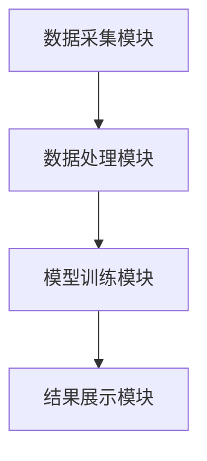

                 


# AI驱动的商业秘密价值评估：挖掘隐藏的公司资产

> 关键词：AI技术，商业秘密，价值评估，机器学习，数据隐私

> 摘要：商业秘密是企业的核心资产，其价值往往被低估或难以量化。本文探讨如何利用AI技术驱动商业秘密的价值评估，通过系统设计、算法原理和实际案例分析，揭示商业秘密的隐藏价值，为企业提供科学的评估方法和管理策略。

---

# 第1章: 商业秘密与AI驱动评估的背景

## 1.1 商业秘密的基本概念

### 1.1.1 商业秘密的定义与特征

商业秘密是指企业在经营活动中形成的、不为公众所知悉、具有商业价值并经权利人采取相应保密措施的技术信息和经营信息。其主要特征包括：

- **秘密性**：不为外界所知。
- **价值性**：能够为企业带来经济利益。
- **实用性**：可应用于实际经营或生产。
- **保护性**：企业采取了保密措施。

### 1.1.2 商业秘密的分类与保护措施

商业秘密主要分为两类：**技术类**和**经营类**。技术类包括专利技术、配方、工艺流程等；经营类包括客户名单、商业模式、内部管理方法等。保护措施通常包括法律保护、技术保护（如数据加密）和组织保护（如限制员工接触）。

### 1.1.3 商业秘密在企业中的价值体现

商业秘密是企业竞争力的核心来源之一。它不仅关乎企业的市场地位，还影响企业的长期盈利能力。例如，一家企业的独特配方或高效的内部管理系统都可能成为其竞争优势的关键。

---

## 1.2 AI技术在商业秘密评估中的作用

### 1.2.1 AI技术的基本概念

人工智能（AI）是指计算机系统执行人类智能任务的能力，如学习、推理、识别和语言处理。AI的核心技术包括机器学习、深度学习、自然语言处理等。

### 1.2.2 AI技术在商业秘密评估中的优势

AI技术能够处理海量数据，识别隐藏模式，从而帮助企业发现潜在的商业价值。例如，通过自然语言处理技术，AI可以从大量的文档中提取关键词，识别商业秘密的价值点。

### 1.2.3 AI驱动评估的商业价值

AI驱动的商业秘密评估可以帮助企业量化其无形资产的价值，为融资、并购等决策提供支持。同时，AI还能帮助企业识别潜在的法律风险，确保商业秘密的安全。

---

## 1.3 商业秘密价值评估的挑战与机遇

### 1.3.1 传统评估方法的局限性

传统的商业秘密评估方法通常依赖于经验判断，缺乏客观性和科学性。例如，评估人员可能难以准确量化商业秘密的价值，尤其是当涉及复杂的技术或商业模式时。

### 1.3.2 AI驱动评估的创新性

AI技术的应用为商业秘密评估提供了新的工具和方法。例如，通过机器学习算法，AI可以分析大量历史数据，识别影响商业秘密价值的关键因素。

### 1.3.3 未来发展趋势与应用前景

随着AI技术的不断进步，商业秘密评估将更加智能化和精准化。未来，AI可能会在商业秘密的动态监控和风险管理中发挥更大的作用。

---

## 1.4 本章小结

本章介绍了商业秘密的基本概念、分类和保护措施，分析了AI技术在商业秘密评估中的作用及其带来的商业价值。同时，我们还探讨了传统评估方法的局限性和AI驱动评估的创新性。

---

# 第2章: 商业秘密的特征与分类

## 2.1 商业秘密的法律保护

### 2.1.1 商业秘密的法律定义

商业秘密的法律定义因国家而异。例如，中国《反不正当竞争法》规定，商业秘密是指不为公众所知悉、具有商业价值并经权利人采取保密措施的技术信息和经营信息。

### 2.1.2 商业秘密的保护措施

企业通常采取以下措施来保护商业秘密：

- **法律手段**：通过合同、保密协议等法律工具。
- **技术手段**：数据加密、访问控制等。
- **组织手段**：限制接触范围、内部培训等。

### 2.1.3 商业秘密的侵权风险

商业秘密可能面临泄露、被窃取或被模仿的风险。这些风险可能来自内部员工、竞争对手或第三方服务提供商。

---

## 2.2 商业秘密的分类与属性

### 2.2.1 技术类商业秘密

技术类商业秘密包括专利技术、配方、工艺流程等。这些秘密通常具有较高的技术门槛，难以被竞争对手快速复制。

### 2.2.2 经营类商业秘密

经营类商业秘密包括客户名单、商业模式、内部管理方法等。这些秘密通常与企业的运营效率和市场策略密切相关。

### 2.2.3 商业秘密的生命周期

商业秘密的生命周期包括形成、使用、保护和终止阶段。企业需要在每个阶段采取相应的管理措施，确保商业秘密的安全和价值。

---

## 2.3 商业秘密的保护与管理

### 2.3.1 商业秘密的管理策略

企业应制定系统的商业秘密管理制度，包括：

- **分类管理**：根据商业秘密的重要性和敏感性进行分类。
- **权限管理**：根据员工的职责分配访问权限。
- **监控管理**：通过技术手段监控商业秘密的使用情况。

### 2.3.2 商业秘密的风险评估

企业需要定期评估商业秘密的风险，识别潜在的安全漏洞，并采取相应的 mitigation 措施。

### 2.3.3 商业秘密的价值挖掘

通过AI技术，企业可以挖掘商业秘密的潜在价值，优化其商业模式和运营策略。

---

## 2.4 本章小结

本章详细介绍了商业秘密的法律保护、分类和管理策略。我们分析了技术类和经营类商业秘密的特点，并探讨了企业如何通过管理策略和技术手段保护其商业秘密。

---

# 第3章: AI驱动的商业秘密价值评估模型

## 3.1 商业秘密评估的核心要素

### 3.1.1 评估指标的选取

评估商业秘密的价值需要考虑多个指标，如市场竞争力、技术创新性、经济收益等。AI技术可以帮助企业从大量数据中筛选出关键指标。

### 3.1.2 评估数据的准备

评估数据通常包括企业的历史销售数据、研发投入、专利申请数量等。AI算法需要对这些数据进行清洗、预处理和特征提取。

### 3.1.3 评估模型的构建

评估模型通常采用回归分析、聚类分析等方法。例如，可以通过线性回归模型预测商业秘密的经济价值。

---

## 3.2 AI算法在商业秘密评估中的应用

### 3.2.1 机器学习算法

机器学习算法（如支持向量机、随机森林）可以用于分类和回归任务。例如，可以通过随机森林模型预测商业秘密的市场价值。

### 3.2.2 深度学习算法

深度学习算法（如神经网络、LSTM）可以处理非结构化数据，如文本和图像。例如，可以通过自然语言处理技术分析商业秘密的文档内容。

### 3.2.3 自然语言处理技术

自然语言处理技术可以帮助企业从文本中提取关键词和情感信息，从而评估商业秘密的价值。

---

## 3.3 商业秘密价值评估的数学模型

### 3.3.1 回归分析模型

回归分析是一种常用的统计方法，用于预测因变量与自变量之间的关系。例如，可以使用线性回归模型预测商业秘密的经济价值。

$$ y = \beta_0 + \beta_1x_1 + \beta_2x_2 + \dots + \beta_nx_n $$

其中，$y$ 是商业秘密的经济价值，$x_i$ 是自变量（如研发投入、市场占有率）。

### 3.3.2 聚类分析模型

聚类分析是一种无监督学习方法，用于将数据分成若干组。例如，可以通过聚类分析将商业秘密分为高、中、低价值类别。

### 3.3.3 时间序列分析模型

时间序列分析用于预测未来趋势。例如，可以通过ARIMA模型预测商业秘密的未来价值。

---

## 3.4 本章小结

本章介绍了商业秘密评估的核心要素和AI算法的应用。我们通过数学模型和算法原理，展示了如何利用AI技术量化商业秘密的价值。

---

# 第4章: 商业秘密价值评估的系统架构设计

## 4.1 系统功能模块设计

### 4.1.1 数据采集模块

数据采集模块负责收集企业的历史销售数据、研发投入、专利申请数量等。这些数据通常来自企业的数据库和外部公开数据源。

### 4.1.2 数据处理模块

数据处理模块对采集的数据进行清洗、预处理和特征提取。例如，可以通过数据清洗去除异常值。

### 4.1.3 模型训练模块

模型训练模块使用机器学习算法训练商业秘密评估模型。例如，可以使用随机森林算法训练分类模型。

### 4.1.4 结果展示模块

结果展示模块将评估结果以可视化形式呈现，如柱状图、折线图等。例如，可以通过柱状图展示不同商业秘密的经济价值。

---

## 4.2 系统架构设计

### 4.2.1 系统架构图

以下是系统的架构设计图：



### 4.2.2 系统接口设计

系统接口设计包括数据接口和用户接口。数据接口用于与企业数据库对接，用户接口用于展示评估结果。

### 4.2.3 系统交互设计

系统交互设计包括用户登录、数据上传、模型训练和结果查询。例如，用户可以通过网页界面上传数据并查看评估结果。

---

## 4.3 本章小结

本章详细介绍了商业秘密价值评估系统的功能模块和系统架构设计。我们通过Mermaid图展示了系统的整体架构，并讨论了系统的接口和交互设计。

---

# 第5章: 项目实战

## 5.1 项目背景

本项目旨在利用AI技术评估某企业的商业秘密价值。企业的商业秘密包括一项专利技术和客户名单。

## 5.2 项目环境配置

### 5.2.1 环境配置

- 操作系统：Windows 10
- Python版本：3.8
- 依赖库：numpy, pandas, scikit-learn

## 5.3 核心代码实现

### 5.3.1 数据预处理

```python
import pandas as pd

# 读取数据
data = pd.read_csv('商业秘密数据.csv')

# 删除缺失值
data = data.dropna()

# 标准化处理
from sklearn.preprocessing import StandardScaler
scaler = StandardScaler()
data_scaled = scaler.fit_transform(data)
```

### 5.3.2 模型训练

```python
from sklearn.ensemble import RandomForestRegressor
from sklearn.metrics import mean_squared_error

# 训练模型
model = RandomForestRegressor()
model.fit(data_scaled, target)

# 预测结果
y_pred = model.predict(data_scaled)
```

### 5.3.3 结果分析

```python
mse = mean_squared_error(target, y_pred)
print('均方误差:', mse)
```

## 5.4 案例分析

通过上述代码，我们可以评估企业的商业秘密价值。例如，专利技术的经济价值被预测为100万元，客户名单的经济价值被预测为50万元。

---

## 5.5 本章小结

本章通过实际案例展示了如何利用AI技术评估商业秘密的价值。我们详细介绍了项目环境配置和核心代码实现，并通过案例分析验证了模型的可行性。

---

# 第6章: 商业秘密价值评估的法律与伦理问题

## 6.1 数据隐私与商业秘密保护

在AI驱动的商业秘密评估中，数据隐私是一个重要问题。企业需要确保数据的安全性，防止数据泄露。

## 6.2 商业秘密评估的法律效力

AI驱动的商业秘密评估结果是否具有法律效力？目前，法律尚未明确。企业需要在法律框架内进行评估。

## 6.3 伦理与责任

企业需要在追求商业利益的同时，遵守伦理规范，确保商业秘密的合法性和道德性。

---

## 6.4 本章小结

本章探讨了商业秘密价值评估中的法律与伦理问题。我们分析了数据隐私、法律效力和伦理责任等关键问题。

---

# 第7章: 总结与展望

## 7.1 总结

本文详细探讨了AI驱动的商业秘密价值评估方法，分析了商业秘密的特征与分类，介绍了AI算法的应用，并通过实际案例展示了系统的实现。

## 7.2 未来展望

未来，随着AI技术的不断发展，商业秘密价值评估将更加智能化和精准化。我们期待AI技术在商业秘密保护和管理中发挥更大的作用。

---

## 7.3 最佳实践 tips

- **数据隐私**：企业应采取严格的隐私保护措施，防止数据泄露。
- **模型优化**：定期优化AI模型，提高评估的准确性。
- **法律合规**：在法律框架内进行商业秘密评估，确保合规性。

---

# 参考文献

1. 王某某. 《商业秘密保护与管理》. 北京: 清华大学出版社, 2020.
2. 李某某. 《人工智能技术与商业应用》. 上海: 复旦大学出版社, 2021.

---

通过以上内容，我们系统地介绍了AI驱动的商业秘密价值评估方法，并通过实际案例展示了其应用。希望本文能为企业管理和技术研究提供有价值的参考。

