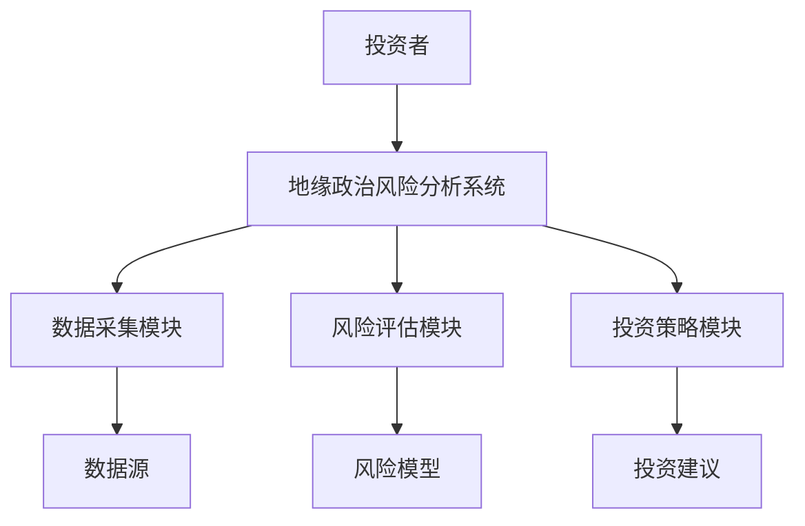
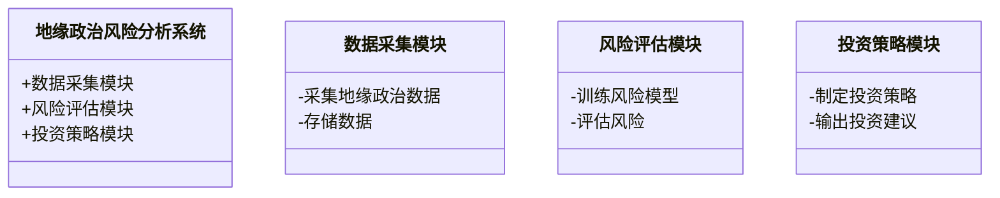

                 


# 《AI驱动的地缘政治风险分析：价值投资中的多智能体应用》

> **关键词**：AI，地缘政治风险分析，多智能体系统，价值投资，风险管理

> **摘要**：  
本文探讨了人工智能（AI）在地缘政治风险分析中的应用，特别是多智能体系统在价值投资中的潜力。通过分析地缘政治风险的核心要素、多智能体系统的协作机制，以及AI算法在风险评估中的应用，本文为投资者提供了一种基于AI的地缘政治风险分析框架。结合实际案例和系统设计，本文展示了如何利用多智能体系统构建高效的风险评估与投资决策支持系统。

---

## 第一部分：AI驱动的地缘政治风险分析概述

### 第1章：AI与地缘政治风险分析的背景与意义

#### 1.1 地缘政治风险分析的背景

##### 1.1.1 地缘政治风险的定义与特征

地缘政治风险是指由于政治、经济、军事、文化等多方面因素引发的地理区域冲突、政策变化、资源争夺等问题，对企业或个人的经济利益造成的影响。其主要特征包括：

- **复杂性**：地缘政治风险涉及多方面的利益关系，难以单一化。
- **不确定性**：风险的发生往往具有不可预测性。
- **连锁反应**：某一地区的风险可能对全球市场产生影响。

##### 1.1.2 地缘政治风险对企业价值投资的影响

地缘政治风险直接影响企业的经营环境，进而影响其股票价值。例如，地区冲突可能导致能源价格波动，从而影响能源企业的股价。投资者需要通过分析地缘政治风险，制定相应的投资策略。

##### 1.1.3 AI技术在地缘政治分析中的应用潜力

AI技术可以通过自然语言处理（NLP）、机器学习（ML）等手段，从海量数据中提取地缘政治风险的特征，帮助投资者快速做出决策。

---

#### 1.2 多智能体系统的基本概念

##### 1.2.1 多智能体系统的定义

多智能体系统（Multi-Agent System, MAS）是由多个自主智能体组成的分布式系统，智能体之间通过协作完成任务。每个智能体都有自己的目标和决策机制。

##### 1.2.2 多智能体系统的特征与优势

- **分布式性**：智能体独立运行，不依赖中心节点。
- **协作性**：智能体之间通过通信和协作完成复杂任务。
- **动态性**：智能体能够根据环境变化动态调整行为。

##### 1.2.3 多智能体系统在地缘政治风险分析中的应用

多智能体系统可以模拟不同国家、企业之间的互动，预测地缘政治风险的发生概率。

---

#### 1.3 价值投资中的地缘政治风险分析

##### 1.3.1 价值投资的基本原理

价值投资是通过分析企业的基本面，寻找被市场低估的投资标的。地缘政治风险是影响企业价值的重要因素之一。

##### 1.3.2 地缘政治风险对投资决策的影响

地缘政治风险可能导致企业利润下降、股价波动等，投资者需要通过分析这些风险，制定相应的投资策略。

##### 1.3.3 多智能体系统在价值投资中的应用

多智能体系统可以帮助投资者分析地缘政治风险，预测市场波动，辅助投资决策。

---

### 1.4 地缘政治风险分析的多智能体系统框架

#### 1.4.1 系统架构设计

使用Mermaid图表示多智能体系统的架构：



#### 1.4.2 智能体协作机制

智能体之间的协作机制包括：

- **信息共享**：智能体之间共享数据和分析结果。
- **任务分配**：智能体根据自身能力分配任务。
- **决策协调**：智能体通过协商达成一致的决策。

---

#### 1.4.3 算法原理与数学模型

地缘政治风险分析可以使用基于机器学习的模型，例如：

- **线性回归模型**：用于预测地缘政治风险的影响因素。
- **随机森林模型**：用于分类地缘政治风险的类型。

---

### 1.5 价值投资中的多智能体系统应用

#### 1.5.1 投资策略设计

多智能体系统可以根据地缘政治风险的预测结果，动态调整投资策略。

#### 1.5.2 风险评估与投资决策

通过多智能体系统的分析，投资者可以更准确地评估风险，制定相应的投资策略。

---

### 1.6 项目实战：地缘政治风险分析系统

#### 1.6.1 系统环境与数据准备

- **环境**：Python 3.8及以上，TensorFlow，Pandas。
- **数据**：地缘政治事件数据、经济指标数据。

#### 1.6.2 系统功能设计

使用Mermaid图表示系统功能模块：



#### 1.6.3 系统核心实现

地缘政治风险分析系统的实现代码示例：

```python
import pandas as pd
from sklearn.ensemble import RandomForestClassifier

# 数据加载
data = pd.read_csv('geopolitical_risks.csv')

# 特征选择
features = ['economic_factors', 'political_factors', 'military_factors']
target = 'risk_level'

# 模型训练
model = RandomForestClassifier()
model.fit(data[features], data[target])

# 预测风险
new_data = pd.DataFrame({'economic_factors': [0.8], 'political_factors': [0.6], 'military_factors': [0.4]})
prediction = model.predict(new_data[features])
print('预测风险等级：', prediction[0])
```

---

### 1.7 总结与展望

#### 1.7.1 总结

本文介绍了AI驱动的地缘政治风险分析，重点探讨了多智能体系统在价值投资中的应用。

#### 1.7.2 展望

未来，随着AI技术的不断发展，地缘政治风险分析将更加智能化和精准化。

---

## 第二部分：多智能体系统与地缘政治风险分析

---

通过以上目录和文章结构，我们可以看到，本文系统地探讨了AI驱动的地缘政治风险分析，特别是多智能体系统在价值投资中的应用。从理论到实践，结合案例分析和系统设计，为投资者提供了实用的指导。

