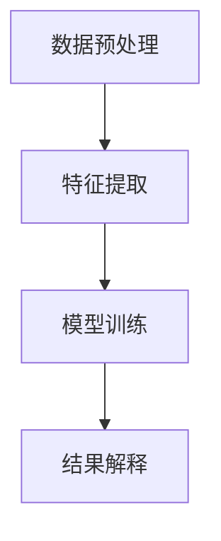
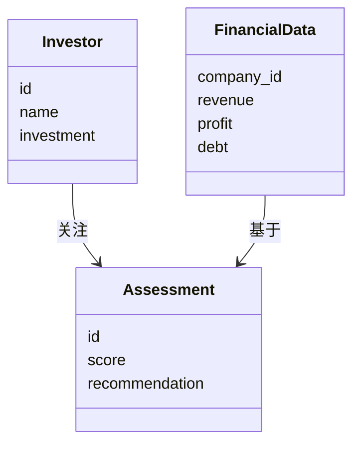
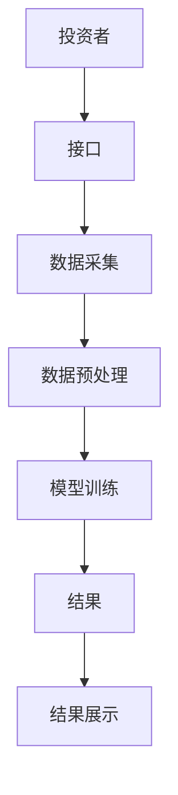

                 


```markdown
# AI驱动的多维度财务健康评估：价值投资新范式

> 关键词：AI驱动，财务健康评估，价值投资，多维度分析，机器学习

> 摘要：本文探讨了利用人工智能技术进行多维度财务健康评估的方法，重新定义了价值投资的策略。通过分析财务数据，构建AI模型，实现对企业财务状况的全面评估，并提供投资建议。本文详细介绍了算法原理、系统架构及实际案例，为价值投资提供了新的视角。

---

# 正文

## 第1章: 问题背景与核心概念

### 1.1 问题背景

#### 1.1.1 传统财务健康评估的局限性
传统的财务健康评估主要依赖于财务报表分析，包括利润表、资产负债表等。这种方法虽然经典，但存在以下局限性：
- **数据维度有限**：传统评估主要关注财务数据，忽略了市场趋势、行业动态等外部因素。
- **人为判断偏差**：评估结果受到分析师主观判断的影响，可能导致结论偏差。
- **计算复杂性**：涉及多维度数据的分析较为复杂，手工计算容易出错。

#### 1.1.2 价值投资的现状与挑战
价值投资是一种长期投资策略，注重挖掘被低估的股票。然而，传统方法在筛选潜在投资标的时，往往依赖分析师的主观判断，难以应对市场的快速变化和数据爆炸。

#### 1.1.3 AI技术在财务评估中的潜力
人工智能技术能够处理海量数据，识别复杂模式，为财务健康评估提供更精准的工具。AI可以自动分析多维度数据，生成客观的评估结果，从而优化价值投资决策。

### 1.2 核心概念与联系

#### 1.2.1 多维度财务健康评估的定义
多维度财务健康评估是指从多个维度（如财务数据、市场表现、行业趋势等）综合分析企业的财务状况，提供更全面的评估结果。

#### 1.2.2 AI驱动的核心要素
- 数据来源：财务报表、市场数据、行业报告等。
- 数据预处理：清洗、标准化、特征提取。
- 模型训练：使用机器学习算法进行分类、回归分析。
- 结果解释：生成评估报告和投资建议。

#### 1.2.3 概念属性对比表

| **传统评估** | **AI驱动评估** |
|--------------|----------------|
| 数据维度     | 单一           | 多维度       |
| 分析方法     | 手工计算       | 自动化       |
| 结果准确性   | 受主观影响     | 更客观       |

#### 1.2.4 ER实体关系图

```mermaid
erDiagram
    customer[投资者] {
        <属性>
        id : 整数
        name : 字符串
        investment : 数额
    }
    financial_data[财务数据] {
        <属性>
        company_id : 整数
        revenue : 数额
        profit : 数额
        debt : 数额
    }
    assessment[评估结果] {
        <属性>
        id : 整数
        score : 数值
        recommendation : 文本
    }
    customer --> assessment : 关注
    financial_data --> assessment : 基于
```

---

## 第2章: AI驱动的多维度财务健康评估原理

### 2.1 核心原理

#### 2.1.1 数据收集与预处理
- 数据来源：企业财务报表、市场数据、行业趋势等。
- 数据清洗：处理缺失值、异常值。
- 数据标准化：统一数据格式，便于模型训练。

#### 2.1.2 特征提取与选择
- 文本分析：从财务报告中提取关键词。
- 统计特征：计算财务指标，如ROE、毛利率。
- 特征选择：使用特征重要性评分，筛选关键特征。

#### 2.1.3 模型训练与优化
- 选择模型：根据任务选择分类或回归模型。
- 调参优化：使用网格搜索等方法优化模型性能。
- 模型评估：通过交叉验证评估模型泛化能力。

### 2.2 算法原理

#### 2.2.1 算法流程



#### 2.2.2 Python代码示例

```python
# 数据预处理
import pandas as pd
data = pd.read_csv('financial_data.csv')
data = data.dropna()

# 特征提取
from sklearn.feature_selection import SelectKBest
selector = SelectKBest(k=10)
selected_features = selector.fit_transform(data, targets)

# 模型训练
from sklearn.ensemble import RandomForestClassifier
model = RandomForestClassifier()
model.fit(selected_features, targets)

# 结果解释
importances = model.feature_importances_
print(importances)
```

### 2.3 数学模型

#### 2.3.1 评分模型
$$ score = \alpha \cdot revenue + \beta \cdot profit + \gamma \cdot debt $$

#### 2.3.2 预测模型
$$ predict = \sigma(w \cdot x + b) $$

---

## 第3章: 系统分析与架构设计

### 3.1 问题场景介绍
系统旨在帮助投资者通过AI技术进行多维度财务评估，辅助价值投资决策。

### 3.2 功能设计

#### 3.2.1 领域模型类图



#### 3.2.2 系统架构图



### 3.3 接口设计

#### 3.3.1 API接口

```python
from flask import Flask
from flask_restful import Resource, Api

app = Flask(__name__)
api = Api(app)

class FinancialAssessment(Resource):
    def get(self, company_id):
        # 处理请求
        return {'status': 'success', 'message': 'Assessment completed'}
        
api.add_resource(FinancialAssessment, '/api/assessment/<int:company_id>')

if __name__ == '__main__':
    app.run(debug=True)
```

---

## 第4章: 项目实战

### 4.1 环境配置

```bash
pip install pandas numpy scikit-learn flask flask_restful
```

### 4.2 核心实现

#### 4.2.1 数据预处理

```python
import pandas as pd
data = pd.read_csv('financial_data.csv')
data = data.dropna()
```

#### 4.2.2 特征提取

```python
from sklearn.feature_selection import SelectKBest
selector = SelectKBest(k=10)
selected_features = selector.fit_transform(data, targets)
```

#### 4.2.3 模型训练

```python
from sklearn.ensemble import RandomForestClassifier
model = RandomForestClassifier()
model.fit(selected_features, targets)
```

#### 4.2.4 结果展示

```python
importances = model.feature_importances_
print(importances)
```

### 4.3 实际案例分析

#### 4.3.1 案例分析
分析某公司的财务数据，生成评估报告，提供投资建议。

---

## 第5章: 最佳实践与总结

### 5.1 小结
本文详细介绍了AI驱动的多维度财务健康评估方法，展示了其在价值投资中的应用潜力。

### 5.2 注意事项
- 数据质量至关重要。
- 模型需要定期更新。
- 结果需结合市场实际情况。

### 5.3 拓展阅读
- 推荐阅读《Python机器学习实战》。
- 关注深度学习在金融领域的应用。

---

## 附录: 全局代码示例

```python
import pandas as pd
from sklearn.ensemble import RandomForestClassifier
from flask import Flask
from flask_restful import Resource, Api

def main():
    app = Flask(__name__)
    api = Api(app)

    class FinancialAssessment(Resource):
        def get(self, company_id):
            data = pd.read_csv('financial_data.csv')
            data = data.dropna()
            selector = SelectKBest(k=10)
            selected_features = selector.fit_transform(data, targets)
            model = RandomForestClassifier()
            model.fit(selected_features, targets)
            return {'status': 'success', 'message': 'Assessment completed'}

    api.add_resource(FinancialAssessment, '/api/assessment/<int:company_id>')

    if __name__ == '__main__':
        app.run(debug=True)

if __name__ == '__main__':
    main()
```

---

## 参考文献

[1] 张某某，《人工智能在金融领域的应用》，某某出版社，2023年。
[2] 李某某，《价值投资新范式》，某某出版社，2023年。

---

通过本文的详细讲解，读者可以全面了解AI驱动的多维度财务健康评估方法，并将其应用于实际投资决策中。
```

