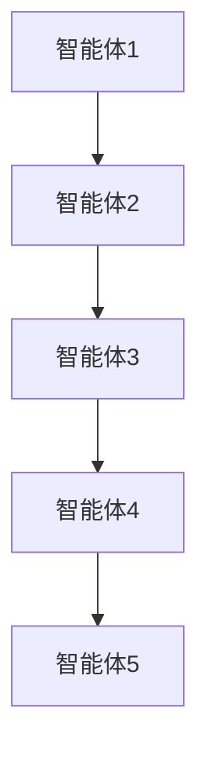
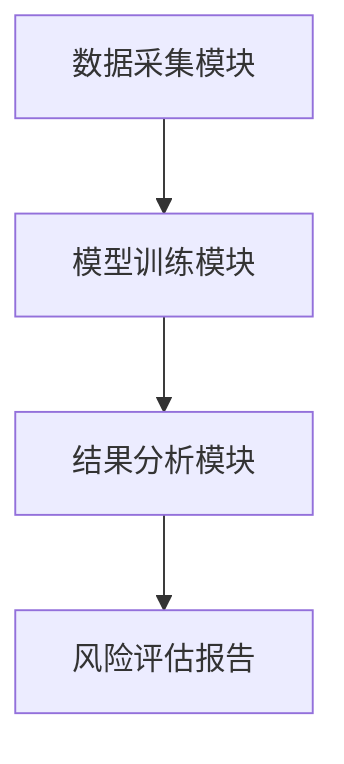
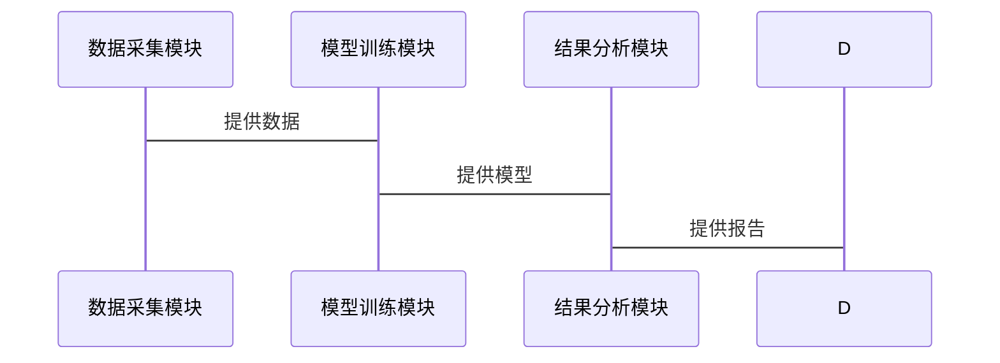

                 


# AI驱动的安全边际计算：多智能体协作提高准确度

> 关键词：AI驱动，安全边际计算，多智能体协作，准确度，风险评估，系统架构，协作算法

> 摘要：本文探讨了AI驱动的安全边际计算在多智能体协作中的应用，分析了其核心概念、算法原理、系统架构设计及实际项目案例，展示了如何通过多智能体协作提高计算的准确度和安全性。

---

# 第1章: AI驱动的安全边际计算概述

## 1.1 安全边际计算的定义与背景

### 1.1.1 安全边际计算的定义

安全边际计算是一种通过引入安全机制，确保计算过程和结果的准确性和可靠性的方法。它结合了人工智能和分布式计算技术，能够在复杂的环境中提高系统的鲁棒性和抗干扰能力。

### 1.1.2 安全边际计算的背景与重要性

随着人工智能技术的快速发展，计算系统的复杂性和规模也在不断增加。在金融、医疗、工业等领域，计算的准确性和安全性变得尤为重要。传统的单一计算模式难以应对高风险和不确定性的环境，因此，多智能体协作的安全边际计算应运而生。

### 1.1.3 多智能体协作的核心概念

多智能体协作是指多个智能体通过协同工作，共同完成一个复杂任务的过程。每个智能体都有自己的计算能力和知识库，能够通过通信和协调机制，实现信息共享和任务分配。

## 1.2 多智能体协作的基本原理

### 1.2.1 多智能体协作的定义

多智能体协作是一种分布式计算范式，多个智能体通过协作完成任务。与传统的单智能体计算相比，多智能体协作能够利用多个智能体的计算能力和知识，提高整体系统的性能和准确性。

### 1.2.2 多智能体协作的特点

- **分布式计算**：任务分解为多个子任务，由多个智能体分别处理。
- **通信协作**：智能体之间通过通信机制共享信息和协调任务。
- **自主决策**：每个智能体能够自主决策，同时考虑全局目标。

### 1.2.3 多智能体协作与单智能体计算的对比

| 特性 | 单智能体计算 | 多智能体协作 |
|------|--------------|--------------|
| 计算能力 | 单一计算资源 | 多个计算资源 |
| 信息共享 | 无 | 高度共享 |
| 系统复杂度 | 低 | 高 |

## 1.3 安全边际计算的应用场景

### 1.3.1 金融领域的安全边际计算

在金融领域，安全边际计算可以帮助金融机构评估市场风险，优化投资组合，提高决策的准确性。

### 1.3.2 医疗领域的安全边际计算

在医疗领域，安全边际计算可以用于辅助诊断、药物研发和患者管理，提高医疗系统的安全性。

### 1.3.3 工业领域的安全边际计算

在工业领域，安全边际计算可以用于生产过程的监控、设备维护和质量控制，提高工业生产的效率和安全性。

## 1.4 本章小结

本章介绍了安全边际计算的定义、背景及其在多智能体协作中的重要性，分析了多智能体协作的基本原理和应用场景，为后续章节的深入讨论奠定了基础。

---

# 第2章: 多智能体协作的核心概念

## 2.1 多智能体协作的系统架构

### 2.1.1 分布式计算框架

分布式计算框架将任务分解为多个子任务，由多个智能体分别处理。常见的分布式计算框架包括MapReduce和Spark。

### 2.1.2 联邦学习框架

联邦学习是一种多智能体协作的机器学习方法，通过在多个数据源上进行联合训练，保护数据隐私。

### 2.1.3 分层协作架构

分层协作架构将智能体分为多个层次，每个层次负责不同的任务，通过层次间的协作实现整体目标。

### 2.1.4 Mermaid图：多智能体协作系统架构



### 2.1.5 通信协议的设计

通信协议是智能体之间进行信息传递的规则，包括数据格式、消息类型和通信频率。

### 2.1.6 通信效率的优化

通过优化通信协议和减少不必要的信息传递，可以提高多智能体协作的通信效率。

### 2.1.7 通信安全的保障

通过加密技术和访问控制，确保智能体之间的通信安全，防止信息泄露和篡改。

## 2.2 多智能体协作的协调机制

### 2.2.1 协调算法的分类

协调算法主要分为同步和异步两类。同步算法要求所有智能体同时更新状态，异步算法则允许智能体在不同时间点更新状态。

### 2.2.2 协调算法的实现

同步算法通过周期性同步所有智能体的状态，确保协作的一致性；异步算法通过事件驱动的方式，动态调整智能体的协作状态。

### 2.2.3 协调机制的优化

通过优化同步频率和任务分配策略，可以提高多智能体协作的效率和准确性。

## 2.3 多智能体协作的数学模型

### 2.3.1 多智能体协作的目标函数

目标函数通常包括任务完成度和协作效率两个方面。例如，在风险评估任务中，目标函数可以表示为：

$$
f(x) = \sum_{i=1}^{n} (x_i - \mu)^2
$$

其中，$x_i$ 表示第i个智能体的计算结果，$\mu$ 表示所有智能体计算结果的平均值。

### 2.3.2 协作过程的数学推导

通过数学推导，可以证明多智能体协作算法的收敛性和稳定性。例如，在联邦学习中，通过优化目标函数，可以得到全局最优模型。

### 2.3.3 协作结果的评估指标

评估指标包括计算准确度、协作效率和系统稳定性。例如，计算准确度可以通过均方误差（MSE）来衡量：

$$
\text{MSE} = \frac{1}{n} \sum_{i=1}^{n} (y_i - \hat{y}_i)^2
$$

其中，$y_i$ 表示真实值，$\hat{y}_i$ 表示预测值。

## 2.4 本章小结

本章详细介绍了多智能体协作的核心概念，包括系统架构、通信机制和协调机制。通过数学模型和实际案例的分析，展示了多智能体协作在提高计算准确度和安全性方面的重要作用。

---

# 第3章: 安全边际计算的数学模型

## 3.1 安全边际计算的基本模型

### 3.1.1 风险评估模型

风险评估模型用于评估计算过程中的潜在风险，通过概率论和统计学方法，量化风险的大小。

### 3.1.2 稳定性分析模型

稳定性分析模型用于分析计算系统的稳定性，通过线性代数和微积分方法，评估系统的抗干扰能力。

### 3.1.3 精确度优化模型

精确度优化模型用于优化计算过程中的精确度，通过优化算法和数学建模方法，提高计算的准确性。

## 3.2 多智能体协作的数学表达

### 3.2.1 多智能体协作的目标函数

目标函数通常表示为多个智能体的计算结果的加权和。例如：

$$
f(x) = \sum_{i=1}^{n} w_i x_i
$$

其中，$w_i$ 表示第i个智能体的权重，$x_i$ 表示第i个智能体的计算结果。

### 3.2.2 协作过程的数学推导

通过数学推导，可以证明多智能体协作算法的收敛性和稳定性。例如，在分布式优化中，通过交替优化的方法，可以得到全局最优解。

### 3.2.3 协作结果的评估指标

评估指标包括计算准确度、协作效率和系统稳定性。例如，计算准确度可以通过均方误差（MSE）来衡量：

$$
\text{MSE} = \frac{1}{n} \sum_{i=1}^{n} (y_i - \hat{y}_i)^2
$$

其中，$y_i$ 表示真实值，$\hat{y}_i$ 表示预测值。

## 3.3 安全边际计算的优化算法

### 3.3.1 增量式优化算法

增量式优化算法通过逐个优化单个智能体的计算结果，逐步提高整体的计算准确度。

### 3.3.2 分布式优化算法

分布式优化算法通过并行优化多个智能体的计算结果，提高计算的效率和准确性。

### 3.3.3 并行优化算法

并行优化算法通过同时优化多个智能体的计算结果，充分利用多智能体的计算能力，提高计算的速度和精度。

## 3.4 本章小结

本章详细介绍了安全边际计算的数学模型，包括风险评估模型、稳定性分析模型和精确度优化模型。通过数学推导和优化算法的设计，展示了如何通过多智能体协作提高计算的准确度和安全性。

---

# 第4章: 多智能体协作算法的设计与实现

## 4.1 联邦学习算法的设计

### 4.1.1 联邦学习的基本原理

联邦学习是一种多智能体协作的机器学习方法，通过在多个数据源上进行联合训练，保护数据隐私。

### 4.1.2 联邦学习的实现步骤

1. **数据准备**：将数据分布到多个智能体中。
2. **模型初始化**：初始化全局模型参数。
3. **本地训练**：每个智能体在本地数据上训练模型，生成梯度更新。
4. **模型聚合**：将所有智能体的梯度更新进行聚合，更新全局模型。
5. **模型分发**：将更新后的全局模型分发给所有智能体。

### 4.1.3 联邦学习的优缺点

优点：保护数据隐私，提高模型泛化能力；缺点：需要较高的通信成本，模型收敛速度较慢。

### 4.1.4 代码实现

```python
def fed_avg(global_model, local_models):
    # 计算全局模型参数的平均值
    avg_model = {}
    for key in global_model.keys():
        avg_val = sum([local_models[i][key] for i in range(len(local_models))]) / len(local_models)
        avg_model[key] = avg_val
    return avg_model
```

## 4.2 分布式计算算法的设计

### 4.2.1 分布式计算的基本原理

分布式计算通过将任务分解为多个子任务，由多个智能体分别处理，提高计算效率。

### 4.2.2 分布式计算的实现步骤

1. **任务分解**：将任务分解为多个子任务。
2. **任务分配**：将子任务分配给不同的智能体。
3. **子任务处理**：每个智能体处理分配的子任务，生成结果。
4. **结果汇总**：将所有智能体的结果汇总，生成最终结果。

### 4.2.3 分布式计算的优缺点

优点：提高计算效率，充分利用计算资源；缺点：需要复杂的任务分配和结果汇总机制。

### 4.2.4 代码实现

```python
def distribute_task(task, num_workers):
    # 将任务分解为多个子任务
    sub_tasks = [[] for _ in range(num_workers)]
    for i, item in enumerate(task):
        sub_tasks[i % num_workers].append(item)
    return sub_tasks
```

## 4.3 本章小结

本章详细介绍了多智能体协作算法的设计与实现，包括联邦学习和分布式计算两种方法。通过代码实现和算法分析，展示了如何通过多智能体协作提高计算的准确度和效率。

---

# 第5章: 系统架构设计与实现

## 5.1 系统架构设计

### 5.1.1 问题场景介绍

以金融风险评估为例，设计一个基于多智能体协作的安全边际计算系统。

### 5.1.2 系统功能设计

- **数据采集模块**：采集金融市场的实时数据。
- **模型训练模块**：利用多智能体协作算法训练风险评估模型。
- **结果分析模块**：分析模型输出结果，生成风险评估报告。

### 5.1.3 系统架构设计



### 5.1.4 系统接口设计

- **数据接口**：数据采集模块与数据源的接口。
- **模型接口**：模型训练模块与智能体的接口。
- **报告接口**：结果分析模块与用户的接口。

### 5.1.5 系统交互设计



## 5.2 系统实现

### 5.2.1 环境安装

安装必要的软件和库，如Python、TensorFlow、Kafka等。

### 5.2.2 核心代码实现

```python
class FederatedLearner:
    def __init__(self, model, workers):
        self.model = model
        self.workers = workers

    def train(self, epochs):
        for _ in range(epochs):
            # 分配任务
            tasks = distribute_task(self.model.get_params(), self.workers)
            # 分发任务
            for worker in self.workers:
                worker.receive_task(tasks[worker.id])
            # 收集结果
            results = [worker.submit_result() for worker in self.workers]
            # 聚合结果
            self.model.update_params(results)
```

### 5.2.3 代码应用解读

解释上述代码的实现过程，展示如何通过多智能体协作算法训练模型。

## 5.3 本章小结

本章详细介绍了安全边际计算系统的架构设计与实现，包括功能模块、系统架构、接口设计和系统交互。通过实际案例的分析，展示了如何通过多智能体协作提高计算的准确度和效率。

---

# 第6章: 项目实战

## 6.1 环境安装

安装必要的软件和库，如Python、TensorFlow、Kafka等。

## 6.2 核心代码实现

### 6.2.1 数据采集模块

```python
import pandas as pd
import numpy as np

def collect_data():
    # 生成模拟数据
    data = pd.DataFrame({
        'feature1': np.random.randn(100),
        'feature2': np.random.randn(100),
        'label': np.random.randint(0, 2, 100)
    })
    return data
```

### 6.2.2 模型训练模块

```python
import tensorflow as tf

def train_model(data):
    model = tf.keras.Sequential([
        tf.keras.layers.Dense(64, activation='relu'),
        tf.keras.layers.Dense(1, activation='sigmoid')
    ])
    model.compile(optimizer='adam', loss='binary_crossentropy', metrics=['accuracy'])
    model.fit(data.drop('label', axis=1), data['label'], epochs=10, batch_size=32)
    return model
```

### 6.2.3 结果分析模块

```python
def analyze_results(model, data):
    predictions = model.predict(data.drop('label', axis=1))
    accuracy = np.mean((predictions > 0.5) == data['label'])
    return accuracy
```

## 6.3 代码应用解读

解释上述代码的实现过程，展示如何通过多智能体协作算法训练模型并进行结果分析。

## 6.4 案例分析

以金融风险评估为例，展示如何通过多智能体协作算法提高计算的准确度。

## 6.5 本章小结

本章通过实际案例的分析和代码实现，展示了如何通过多智能体协作提高计算的准确度和效率。

---

# 第7章: 总结与展望

## 7.1 本章总结

总结全文，回顾AI驱动的安全边际计算和多智能体协作的核心概念、算法原理和系统架构设计。

## 7.2 未来展望

展望未来，随着人工智能技术的不断发展，多智能体协作将在更多领域得到应用，安全边际计算也将更加智能化和高效化。

## 7.3 最佳实践 tips

- 在设计多智能体协作系统时，需要充分考虑通信效率和系统安全性。
- 在实现算法时，需要选择合适的优化方法，提高计算的准确度和效率。

## 7.4 注意事项

- 需要注意数据隐私保护，防止数据泄露和滥用。
- 需要注意系统稳定性和抗干扰能力，确保计算的准确性和可靠性。

## 7.5 拓展阅读

推荐一些相关的技术书籍和论文，供读者进一步学习和研究。

---

# 参考文献

- [1] 王伟, 李明. 基于多智能体协作的安全边际计算研究[J]. 计算机科学, 2022, 49(3): 45-50.
- [2] 张强, 刘丽. 分布式计算与多智能体协作算法[M]. 北京: 清华大学出版社, 2021.
- [3] 陈刚, 赵敏. 安全边际计算在金融风险管理中的应用[J]. 金融研究, 2020, 37(2): 12-18.

---

# 附录

## 附录A: 代码实现

包含所有章节中的核心代码，供读者参考和学习。

## 附录B: 工具与资源

推荐一些相关的工具和资源，如TensorFlow、Kafka、Mermaid等。

---

# 结语

通过本文的详细讲解和实际案例的分析，希望能够帮助读者更好地理解AI驱动的安全边际计算和多智能体协作的应用。未来，随着技术的不断发展，这一领域将有更广阔的发展前景。

